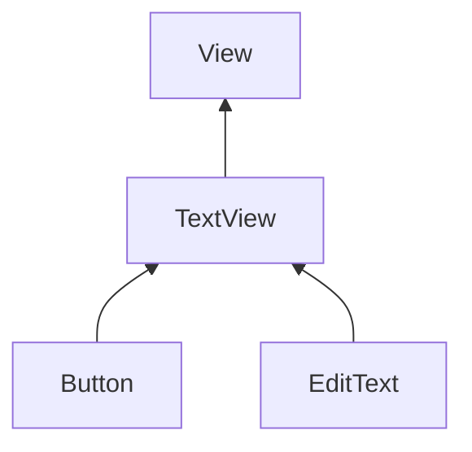
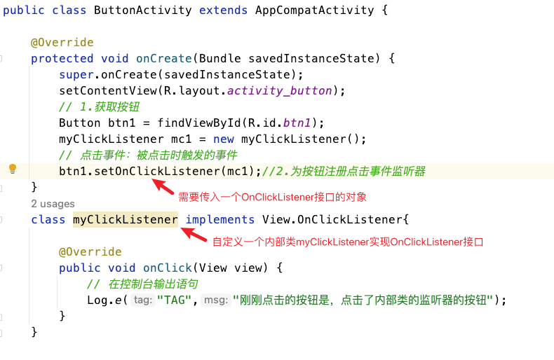
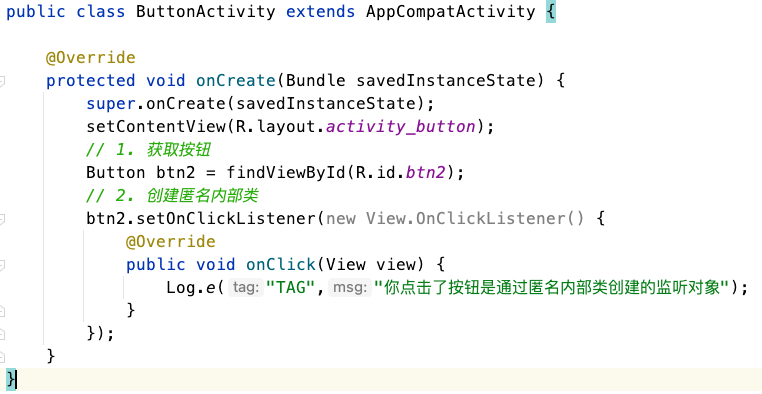
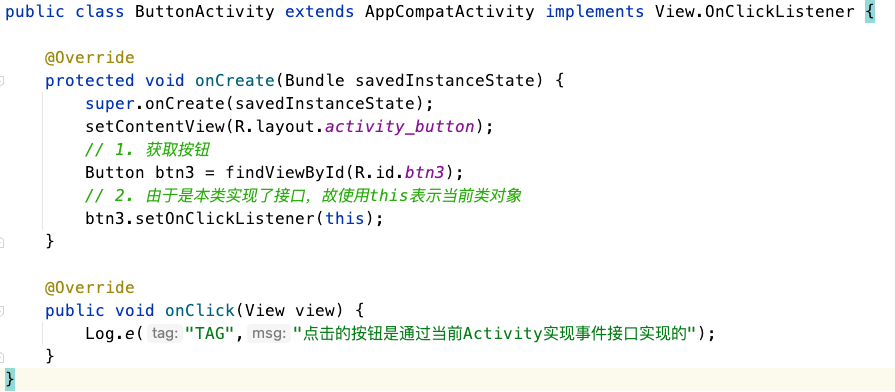
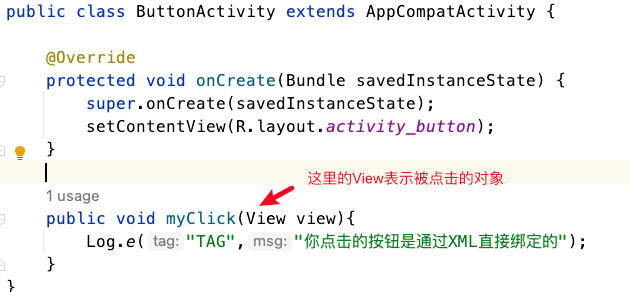
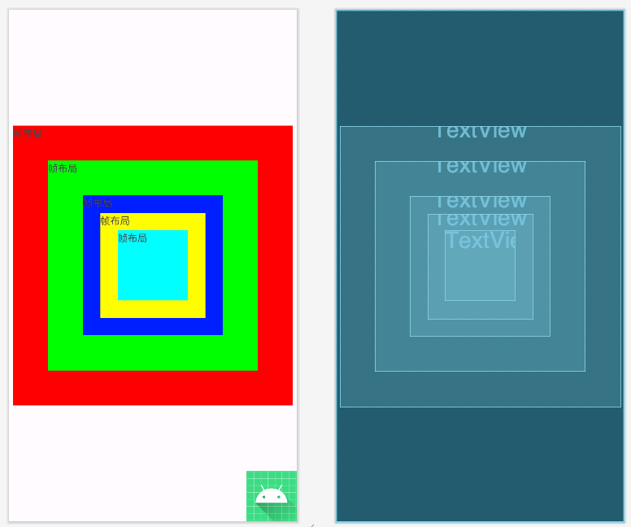
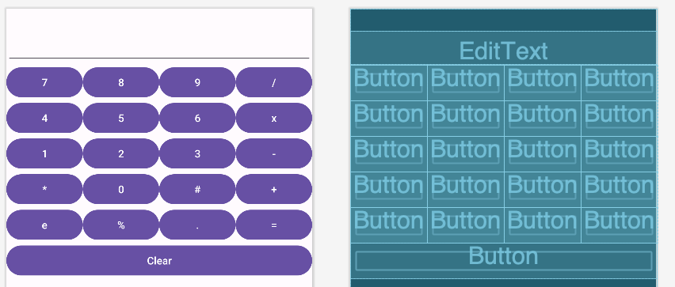
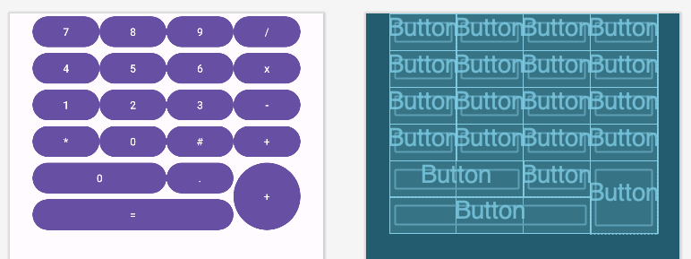
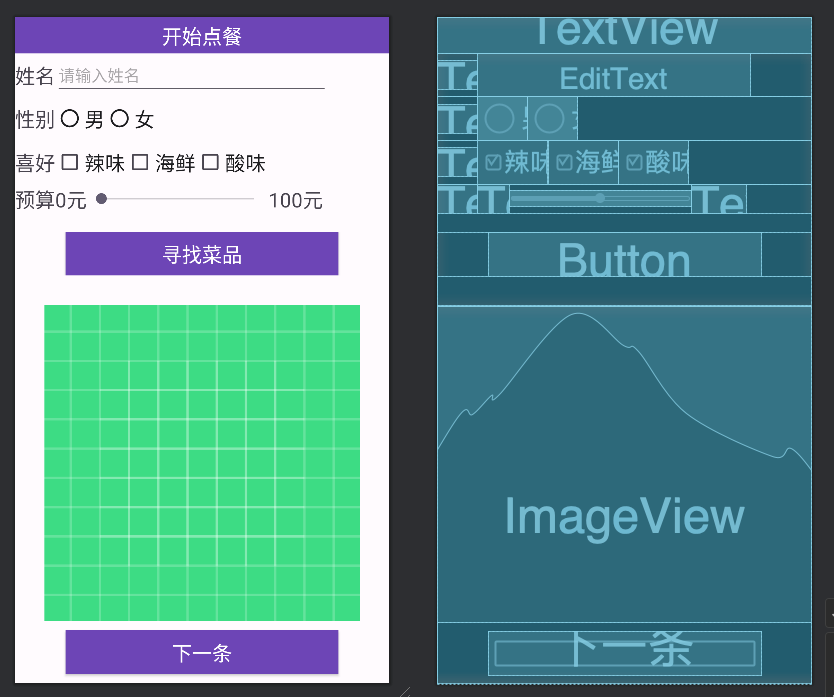

# UI基础入门


## 一、Android Studio使用指南

### 1.Gradle构建工具

#### gradle文件的作用

> 工程与模块下都有自己的gradle文件，需要了解他们的作用；

**项目：**

​	settings.gradle 记录那些module应该被加入到编译过程；

​	build.gradle 配置会被应用到所有的项目中间

**Module:**

​	build.gradle 当前modlue的配置，如果与项目的build.gradle重复，优先级比项目的build.gradle高；

#### Gradle配置项解释

miniSdkVersion: 最小API level，兼容老版本手机系统就需要调小一点；

compileSdkVersion: 编译的SDK版本，默认选择最新的；

targetSdkVersion: 目标版本，

dependencies: 依赖配置，依赖的库

1. 当前项目不支持这个gradle版本

   原因：AndroidStudio版本高，Gradle版本低

   解决方案：将项目的build.gradle改成电脑中已有的Gradle版本；

2. Gradle无法下载更新

解决方案：修改Module的build.gradle

### 2. 中文乱码问题：

修改编码主要从四个地方修改：

* File Encoding（Global Encoding 和 Project Encoding）
* IDE Encoding
* Project Encoding
* File or Director Encoding 和 Property File Encoding

### 3. Android Studio快捷键(Mac)

> 参考文档：[AndroidStudio快捷键](https://blog.csdn.net/liqianwei1230/article/details/78447606)

撤销ctrl + z 反撤销 ctrl + shift + z

格式化代码：cmd + option + L

代码自动修正：option + shift + cmd

全局查找： cmd + shift + f

将局部变量设置为全局变量：cmd+option+f

提取常量：cmd+option+c

根据文件名创建文件：option+enter (用于在setContentView直接写入布局文件名时，通过此快捷键生成布局xml)

移动内部类：F6

快速写一个for循环：fori

快速工具栏：Option+Shift+A

从光标变为选中状态：Option + ↑

为当前语句添加条件判断Cmd + Option + T

多功能查找Cmd + o

选择抽象类的方法Ctrl + o

移动方法的上下顺序：Cmd + Shift + ↑或↓

### 4. 调试技巧

写日志、断点

### 5. 认识Activity

MainActivity

```java
public class MainActivity extends AppCompatActivity {

    @Override
    protected void onCreate(Bundle savedInstanceState) {
        super.onCreate(savedInstanceState);
        // R文件为每一个资源文件按类别设置一个十六进制的索引，
        // 它是一个final型的静态内部类,可以通过R.类名.资源名去操作对应的资源
        setContentView(R.layout.activity_main);

    }
}
```

为什么应用启动能直接打开MainActivity是因为AndroidManifest.xml中设置了对应Activity的intent-filter，当我们创建好了Activity后，AS会在清单文件中自动创建对应的配置信息；

```xml
<activity
    android:name=".MainActivity"
    android:exported="true">
    <intent-filter>
        <!-- 启动入口只有一个-->
        <action android:name="android.intent.action.MAIN" />
        <!--为了在应用列表中设置启动图标-->
        <category android:name="android.intent.category.LAUNCHER" />
    </intent-filter>
</activity>
```


## 二、UI基础控件

View是Android所有UI组件的父类，TextView、Button、ImageView、EditText、ProgressBar

### 1. 通用属性

| 属性                   | 可选值                                                       | 含义                         |
| ---------------------- | ------------------------------------------------------------ | ---------------------------- |
| android:layout_gravity | center_horizontal、center_vertical、center、left、right、top、buttom | 控件相对于父容器的重力偏向   |
| android:gravity        | center_horizontal、center_vertical、center、left、right、top、buttom | 控件自身内容的重力偏向       |
| android:visibility     | visible、invisible、gone                                     | gone不可见且不保留位置       |
| android:id             | @id/valName @+id/ValName                                     | 默认使用已存在的id,+添加新id |
> 如果遇到Button的背景颜色无法更改的情况，实际上是系统使用了Material主题，我们只需将Button组件改为android.widget.Button即可

### 2. TextView

TextView的继承关系



> TextView类似Swing中的JLabel，支持长文本、支持HTML

textSize设置字体大小，单位为sp;

设置行间距：android:lineSpacingExtra="20sp"  
设置行倍距：android:lineSpacingMultiplier="2"

> 如果长文本内容太多，可以套一个ScrowView，但是注意一个ScrowView只能有一个子控件，若硬要多加几个控件，则需要再ScrowView中加一个布局；

### 3. EditText

设置输入文本的类型：android:inputType

设置提醒性文字：android:hint

设置文本输入监听可以使用`addTextChangedListener`，传入一个`TextWatcher`可以在文字改变前中后时机触发；

### 4. Button

> 监听器是一个对象，用户捕获View的状态

注册点击事件的方法：

#### 自定义内部类



#### 匿名内部类



#### 当前Activity去实现事件接口



#### XML中直接绑定



```xml
<Button
    android:layout_width="match_parent"
    android:layout_height="wrap_content"
    android:text="布局文件中添加事件属性"
    android:onClick="myClick" />
```

> 注意：在给多个组价绑定同一个方法时，如果使用swich语句根据点击的View来动态执行对应的方法时，系统会报错“Resource IDs will be non-final by default in Android Gradle Plugin version 8.0, avoid using them in switch case statements”
>
> 原因是在Android Gradle插件8.0后，资源标识符不再是final类型，因此不要在switch语句中使用，建议将资源ID赋值给静态常量，然后使用if-else if -else语句来操作；

```java
public static final int FRAME = R.id.frame_layout;
public static final int TABLE = R.id.table_layout;
public static final int GRID = R.id.grid_layout;
public static final int CONSTRAINT = R.id.constraint_layout;
public void myClick(View v){
    int resourceID = v.getId();
    if(resourceID == FRAME){
        Toast.makeText(this,"帧布局",Toast.LENGTH_SHORT).show();
    }else if (resourceID == TABLE){
        Toast.makeText(this,"表格布局",Toast.LENGTH_SHORT).show();
    }else if (resourceID == GRID){
        Toast.makeText(this,"网格布局",Toast.LENGTH_SHORT).show();
    }else if(resourceID == CONSTRAINT){
        Toast.makeText(this,"约束布局",Toast.LENGTH_SHORT).show();
    }else {
        Toast.makeText(this,"发生了错误",Toast.LENGTH_SHORT).show();
    }
}
```

### 5. ImageView

用来显示可控制图像的控件，可以对其放大、缩小、旋转等操作。常用的属性有：

* android:src 指定前景图片资源

* android:background 指定背景图片资源

### 6. ProcessBar

进度条，默认情况下是圆形没有刻度，通过设置style可以设置水平进度条

```xml
style="?android:attr/progressBarStyleHorizontal" 设置进度条为水平进度条
android:max="200" 设置进度条最大值为200
android:progress="80" 设置进度条当前值
android:indeterminate="true" 设置进度条不确定终止时间的滚动
```

```java
public class ProgressActivity extends AppCompatActivity {

    @Override
    protected void onCreate(Bundle savedInstanceState) {
        super.onCreate(savedInstanceState);
        setContentView(R.layout.activity_progress);
        ProgressBar progressBar = findViewById(R.id.progress);
      	// 创建一个线程，重写run方法，设置进度条进度
        new Thread(){
            @Override
            public void run(){
                for (int i = 0; i < 100; i++){
                    try {
                        Thread.sleep(20);
                    } catch (InterruptedException e) {
                        throw new RuntimeException(e);
                    }
                    progressBar.setProgress(i);
                }
            }
        }.start();
    }
}
```

> 自Android4.0以后，是不允许在线程中操作控件的，但是进度条Progress是一个特例；

### 7. Toast

无焦点提示，需要传入三个参数，环境上下文、提示性文本、持续时间

```java
// this表示当前类
Toast.makeText(this,"姓名或者密码不能为空",Toast.LENGTH_SHORT).show();
```

## 三、布局

### 1.LinearLayout

#### 线性布局重要属性

* android:layout_width 宽度
* android:layout_height 高度
* android:orientation 方向（vertical垂直 ，horizontal水平）
* android:layout_weight 权重（如果只给其中一个组件设置该属性，则该组件占据剩下的所有空间；如果需要按比例划分空间，则对应的长度或者宽度需要设置为0dp）
* android:layut_gravity 重力(设置当前控件相对于外层父容器的摆放重力)

### 2.RelativeLayout

依照参照物定位的布局，最灵活的布局；

#### 相对布局的重要属性

* 相对于父容器（取值true/false）

  * android:layout_alignParentRight

  * Android:layout_centerHorizontal

  > 如果需要完全居中，则可以使用`android:layout_centerInParent="true"`

* 相对于其他控件（取值控件id）

  * android:layout_toRightOf	
  * android:layout_alignRight和    和控件的某个边线对齐


在相对布局下，控件具有默认向左向上靠的特性。

### 3.Framelayout

#### 帧布局的重要属性：

- android:layout_gravity (控件重力)，若不设置重力默认靠近左上角；
- android:foreground(前景)
- android:foregroundGravity(前景重力属性)

> 帧布局会按照控件的文本顺序，写在后面控件显示在最上面的一帧；

```xml
<FrameLayout xmlns:android="http://schemas.android.com/apk/res/android"
    android:layout_width="match_parent"
    android:layout_height="match_parent"
    android:foreground="@mipmap/ic_launcher_round"
    android:foregroundGravity="bottom|right">

    <TextView
        android:layout_width="400dp"
        android:layout_height="400dp"
        android:background="#ff0000"
        android:layout_gravity="center"
        android:text="帧布局"/>
    <TextView
        android:layout_width="300dp"
        android:layout_height="300dp"
        android:background="#00ff00"
        android:layout_gravity="center"
        android:text="帧布局"/>
    <TextView
        android:layout_width="200dp"
        android:layout_height="200dp"
        android:background="#0000ff"
        android:layout_gravity="center"
        android:text="帧布局"/>
    <TextView
        android:layout_width="150dp"
        android:layout_height="150dp"
        android:background="#ffff00"
        android:layout_gravity="center"
        android:text="帧布局"/>
    <TextView
        android:layout_width="100dp"
        android:layout_height="100dp"
        android:background="#00ffff"
        android:layout_gravity="center"
        android:text="帧布局"/>
</FrameLayout>
```



### 4.TableLayout

#### 表格布局的重要属性：

- android:stretchColumns 可以伸展的列,传入的数据是对应列的索引；
- android:shrinkColumns 可以收缩的列
- android:collapseColumns 可以隐藏的列

> 如果直接在TableLayout中添加控件，那么控件会和父容器等宽；如果要让控件显示在同一行，那么控件外层要加一对`<TabelRow>`标签；在`<TabelRow>`控件中，宽度都是默认wrap_content

```xml
<TableLayout xmlns:android="http://schemas.android.com/apk/res/android"
    android:layout_width="match_parent"
    android:layout_height="match_parent"
    android:stretchColumns="*">
    <EditText
        android:layout_marginTop="30dp"
        android:text="" />
    <TableRow>
        <Button android:text="7" />
        <Button android:text="8" />
        <Button android:text="9" />
        <Button android:text="/" />
    </TableRow>
    <TableRow>
        <Button android:text="4" />
        <Button android:text="5" />
        <Button android:text="6" />
        <Button android:text="x" />
    </TableRow>
    <TableRow>
        <Button android:text="1" />
        <Button android:text="2" />
        <Button android:text="3" />
        <Button android:text="-" />
    </TableRow>
    <TableRow>
        <Button android:text="*" />
        <Button android:text="0" />
        <Button android:text="#" />
        <Button android:text="+" />
    </TableRow>
    <TableRow>
        <Button android:text="e" />
        <Button android:text="%" />
        <Button android:text="." />
        <Button android:text="=" />
    </TableRow>
    <Button android:text="Clear" />
</TableLayout>
```



### 5.GridLayout

#### 网格布局的重要属性

网格布局是Android4.0后出现的布局，可以定义多少行多少列；

- android:rowCount 定义行的数量
- android:columnCount 定义列的数量
- android:layout_row 位于第几行
- android:layout_rowSpan 跨几行

```xml
<GridLayout xmlns:android="http://schemas.android.com/apk/res/android"
    android:layout_width="wrap_content"
    android:layout_height="wrap_content"
    android:orientation="horizontal"
    android:layout_gravity="center_horizontal"
    android:rowCount="5"
    android:columnCount="4"
    >
    <Button android:text="7"/>
    <Button android:text="8"/>
    <Button android:text="9"/>
    <Button android:text="/"/>
    <Button android:text="4"/>
    <Button android:text="5"/>
    <Button android:text="6"/>
    <Button android:text="x"/>
    <Button android:text="1"/>
    <Button android:text="2"/>
    <Button android:text="3"/>
    <Button android:text="-"/>
    <Button android:text="*"/>
    <Button android:text="0"/>
    <Button android:text="#"/>
    <Button android:text="+"/>
    <Button android:text="0"
        android:layout_columnSpan="2"
        android:layout_gravity="fill"
        />
    <Button android:text="."/>
    <Button android:text="+"
        android:layout_rowSpan="2"
        android:layout_gravity="fill"
        />
    <Button android:text="="
        android:layout_columnSpan="3"
        android:layout_gravity="fill"/>
</GridLayout>
```



### 6.ConstantLayout

重要属性：

app:layout_constraintBottom_toBottomOf  约束当前控件的底部去靠近别的控件的底部；

app:layout_constraintVertical_bias 垂直偏移量，数值范围0~1

Start等同于Left，End等同于Right

> 减少嵌套、扁平化

## 四、基础控件

> 多看Android官方文档：https://developer.android.com/reference

### 1. CheckBox

复选控件,继承自CompoundButton,本质上是一个Button

两种状态：

* setChecked()	设置是否被选中
* isChecked()       获取选中状态
* setOnCheckedChangeListener()  监听状态变化

给CheckBox设置一个监听：

```java
checkBox.setOnCheckedChangeListener(new CompoundButton.OnCheckedChangeListener() {
    @Override
    public void onCheckedChanged(CompoundButton compoundButton, boolean isChecked) {
        Log.d(TAG, "onCheckedChanged: "+isChecked);
    }
});
```

### 2. RadioButton

单选控件，和RadioGroup一起使用,一组中只能选择一个，无法通过点击变为未选中；

```java
radioGroup.setOnCheckedChangeListener(new RadioGroup.OnCheckedChangeListener() {
    @Override
    public void onCheckedChanged(RadioGroup radioGroup, int checkedId) {
        // 在这里处理选中的单选按钮变化
        // checkedId 是被选中的单选按钮的 ID
    }
});
```


### 3.ToggleButton

开关控件，

* android:textOn   开启时显示的文字
* android:textOff   关闭时显示的文字
* setChecked(boolean) 设置开关状态

ToogleButton设置监听用的方法和Button一样都是setOnClickListener；

获取开关是否被打开则使用isChecked()方法；

### 4. SeekBar

显示当前进度的控件

* getProgress()  获取进度
* setProgress()  读取进度

```java
seekBar.setOnSeekBarChangeListener(new SeekBar.OnSeekBarChangeListener() {
    @Override
    public void onProgressChanged(SeekBar seekBar, int progress, boolean fromUser) {
        // 这里不要做耗时操作，不然会阻塞主线程
        Log.d(TAG, "onProgressChanged: " + progress);
    }

    @Override
    public void onStartTrackingTouch(SeekBar seekBar) {
        // 仅仅在触摸开始的时候触发
        Log.d(TAG, "onStartTrackingTouch: 开始"+ seekBar.getProgress());
    }

    @Override
    public void onStopTrackingTouch(SeekBar seekBar) {
        // 仅仅在触摸结束的时候触发
        Log.d(TAG, "onStopTrackingTouch: 结束"+ seekBar.getProgress());
    }
});
```


## 五、选餐UI综合案例

项目类教程学习方法

> 先看视频，看完后关闭视频，自己实现一遍；不会的再查视频，培养自己独立解决问题的能力；
>
> 对比源码找到优缺点，调整优化 。
>
> 从项目搭建开始接口设计模块实现再自己做一遍

### 1. 需求分析

功能需求：

* 输入姓名（EditText）、性别（RadioButton）、喜好（CheckBox）、预算(SeekBar)；

* 点击寻找菜品按钮就可以根据喜好与预算寻找被筛选后菜品；
* 给显示信息按钮设置监听，点击功能有：通过ImageView显示菜品照片，以及显示下一份菜。

能力需求：

熟练使用Java面向对象思想、集合框架；

熟练使用Android 基础UI控件；

### 2. 布局设计

主要的控件先垂直线性布局，再水平线性布局；



### 3. 逻辑设计

主要分为四个模块来实现：


#### **控件初始化：**

定义一个findViews(),将所有的控件对象封装起来；

```java
private void findViews() {
        mNameEditText = findViewById(R.id.nameEditText);
        mSexRadioGroup = findViewById(R.id.sexRadioGroup);
        mSpicyCheckBox = findViewById(R.id.spicyCheckBox);
        mSeaCheckBox = findViewById(R.id.seaCheckBox);
        mSourCheckBox = findViewById(R.id.sourCheckBox);
        mBudgetSeekBar = findViewById(R.id.budgetSeekBar);
        mSearchButton = findViewById(R.id.searchButton);
        mFoodImageView = findViewById(R.id.foodImageView);
        mShowToggleButton = findViewById(R.id.showToggleButton);
    }
```

再给每个对象做全局私有变量声明：

```java
private EditText mNameEditText;
private RadioGroup mSexRadioGroup;
private CheckBox mSpicyCheckBox,mSeaCheckBox,mSourCheckBox;
private SeekBar mBudgetSeekBar;
private Button mSearchButton;
private ImageView mFoodImageView;
private ToggleButton mShowToggleButton;
```

#### **数据初始化：**

由于暂未使用数据库或者网络服务，先将菜品图片文件存储在工程项目目录`drawable`目录下，

创建一个model包，定义类Food.java和Person.java两个类，为其设计成员变量、构造方法、get、set方法；

使用ArrayList创建一个空的菜品列表mFoods

```java
private void initData() {
    // 创建一个空的菜品列表
    mFoods = new ArrayList<>();
    mFoods.add(new Food("麻辣香锅", 55, R.drawable.malaxiangguo, true, false, false));
    mFoods.add(new Food("水煮鱼", 48, R.drawable.shuizhuyu, true, true, false));
    mFoods.add(new Food("麻辣火锅", 80, R.drawable.malahuoguo, true, true, false));
    mFoods.add(new Food("清蒸鲈鱼", 68, R.drawable.qingzhengluyu, false, true, false));
    mFoods.add(new Food("桂林米粉", 15, R.drawable.guilin, false, false, false));
    mFoods.add(new Food("上汤娃娃菜", 28, R.drawable.wawacai, false, false, false));
    mFoods.add(new Food("红烧肉", 60, R.drawable.hongshaorou, false, false, false));
    mFoods.add(new Food("木须肉", 40, R.drawable.muxurou, false, false, false));
    mFoods.add(new Food("酸菜牛肉面", 35, R.drawable.suncainiuroumian, false, false, true));
    mFoods.add(new Food("西芹炒百合", 38, R.drawable.xiqin, false, false, false));
    mFoods.add(new Food("酸辣汤", 40, R.drawable.suanlatang, true, false, true));
    // 创建一个用户
    mPerson = new Person();
    // 创建一个菜单列表
    mMealList = new ArrayList<Food>();
}
```

> 踩坑记录：在创建菜单列表时，使用cmd+option+f将mMealList列表对象转变全局变量时，不小心将列表类型设置为Object类型，导致后面的菜品对象无法调用getPic方法；

#### **控件设置监听**

给姓名EditText、性别RadioButton设置监听后都将获取到的数据通过set方法赋值给Person类；

对于爱好CheckBox以及预算的SeekBar设置监听后直接将获取到的数据设置为当前MainActivity的全局变量；

```java
private void setListener() {
        // 姓名
        mNameEditText.addTextChangedListener(new TextWatcher() {
            @Override
            public void beforeTextChanged(CharSequence charSequence, int i, int i1, int i2) {

            }

            @Override
            public void onTextChanged(CharSequence charSequence, int i, int i1, int i2) {

            }

            @Override
            public void afterTextChanged(Editable editable) {
                if (mNameEditText != null) {
                    mPerson.setName(mNameEditText.getText().toString());
                }
            }
        });
        // 性别
        mSexRadioGroup.setOnCheckedChangeListener(new RadioGroup.OnCheckedChangeListener() {
            @Override
            public void onCheckedChanged(RadioGroup radioGroup, int i) {
                if (i == R.id.male) {
                    mPerson.setSex("男");
                } else if (i == R.id.female) {
                    mPerson.setSex("女");
                } else {
                    mPerson.setSex("");
                }
            }
        });
        // 口味喜好
        mSpicyCheckBox.setOnCheckedChangeListener(new CompoundButton.OnCheckedChangeListener() {
            @Override
            public void onCheckedChanged(CompoundButton compoundButton, boolean isChecked) {
                mIsSpicy = isChecked;
            }
        });
        mSeaCheckBox.setOnCheckedChangeListener(new CompoundButton.OnCheckedChangeListener() {
            @Override
            public void onCheckedChanged(CompoundButton compoundButton, boolean isChecked) {
                mIsSeaFood = isChecked;
            }
        });
        mSourCheckBox.setOnCheckedChangeListener(new CompoundButton.OnCheckedChangeListener() {
            @Override
            public void onCheckedChanged(CompoundButton compoundButton, boolean isChecked) {
                mIsSour = isChecked;
            }
        });
        // 预算
        mBudgetSeekBar.setOnSeekBarChangeListener(new SeekBar.OnSeekBarChangeListener() {
            @Override
            public void onProgressChanged(SeekBar seekBar, int i, boolean b) {

            }

            @Override
            public void onStartTrackingTouch(SeekBar seekBar) {

            }

            @Override
            public void onStopTrackingTouch(SeekBar seekBar) {
                budget = seekBar.getProgress();
                Toast.makeText(MainActivity.this, "您的预算是:" + budget, Toast.LENGTH_SHORT).show();
            }
        });

        // 寻找菜品
        mSearchButton.setOnClickListener(new View.OnClickListener() {
            @Override
            public void onClick(View view) {
                search();
            }
        });

        // 显示菜品信息
        mShowToggleButton.setOnClickListener(new View.OnClickListener() {
            @Override
            public void onClick(View view) {
                if (mShowToggleButton.isChecked()) {
                    mCurrentShowMealIndex++;
                    if (mCurrentShowMealIndex < mMealList.size()) {
                        mFoodImageView.setImageResource(mMealList.get(mCurrentShowMealIndex).getPic());
                    }

                } else {
                    if (mCurrentShowMealIndex < mMealList.size()) {
                        String FoodName = "菜名:" + mMealList.get(mCurrentShowMealIndex).getName();
                        String UserInfo = ",姓名:" + mPerson.getName() + "," + mPerson.getSex();

                        Toast.makeText(MainActivity.this,
                                FoodName + UserInfo,
                                Toast.LENGTH_SHORT).show();
                    } else {
                        Toast.makeText(MainActivity.this,
                                "没有啦", Toast.LENGTH_SHORT).show();
                    }

                }
            }
        });

    }
```

#### 查找符合条件的菜品

```java
private void search() {
    if (mMealList == null) {
        mMealList = new ArrayList<>();
    }
    // 清空菜单列表
    mMealList.clear();
    // 定义一个当前显示的菜品索引
    mCurrentShowMealIndex = 0;
    // 根据用户的条件过滤有效菜品清单
    for (int index = 0; index < mFoods.size(); index++) {
        Food currentMeal = mFoods.get(index);
        if (currentMeal != null) {
            if (currentMeal.getPrice() < budget &&
                    (currentMeal.isSpicy() == mIsSpicy ||
                            currentMeal.isSeaFood() == mIsSeaFood ||
                            currentMeal.isSour() == mIsSour)) {
                mMealList.add(currentMeal);
            }
        }
    }
    // 立即显示搜索结果
    if (mCurrentShowMealIndex < mMealList.size()) {
        //todo 这里如何实现获取符合条件的菜品mMealList的第一份菜的id?
        // 问题已经解决：mMealList在使用快捷键将局部变量设置为全局变量时，
        // 将类设置成了Object类，导致无法调用get方法
        mFoodImageView.setImageResource(mMealList.get(mCurrentShowMealIndex).getPic());
    } else {
        mFoodImageView.setImageResource(R.drawable.ic_launcher_foreground);
    }

    Toast.makeText(this, "符合条件的菜品数量为:" + mMealList.size() + "种", Toast.LENGTH_SHORT).show();
}
```

效果演示：


项目地址：https://gitee.com/yushengtan/meal-selection/tree/logic/
