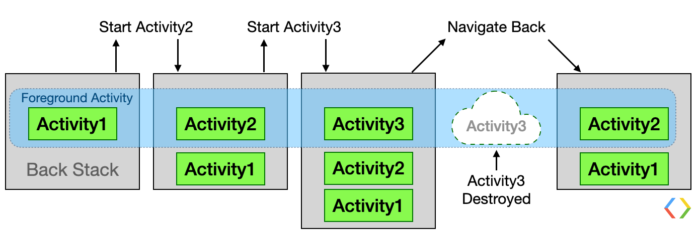
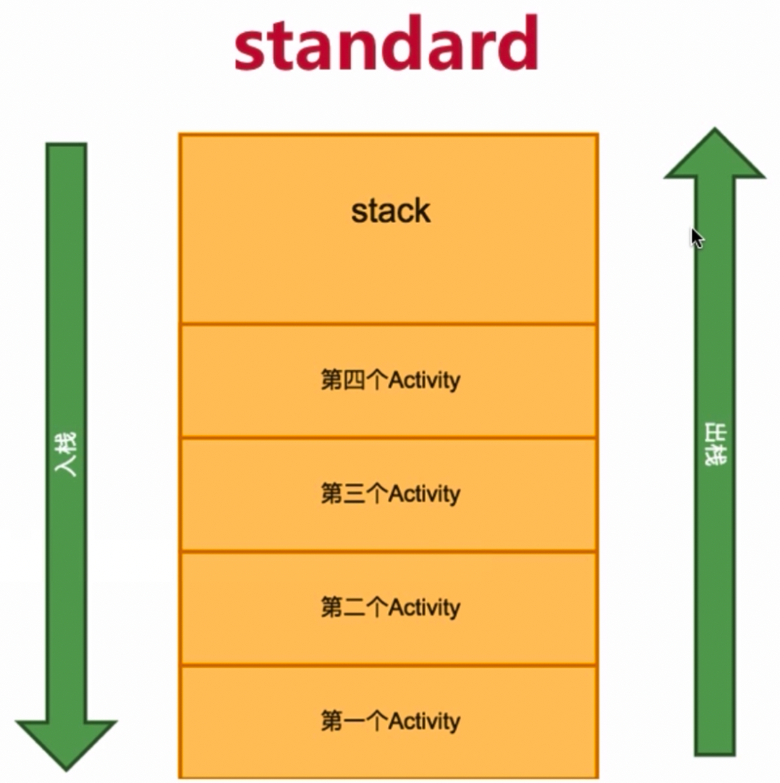
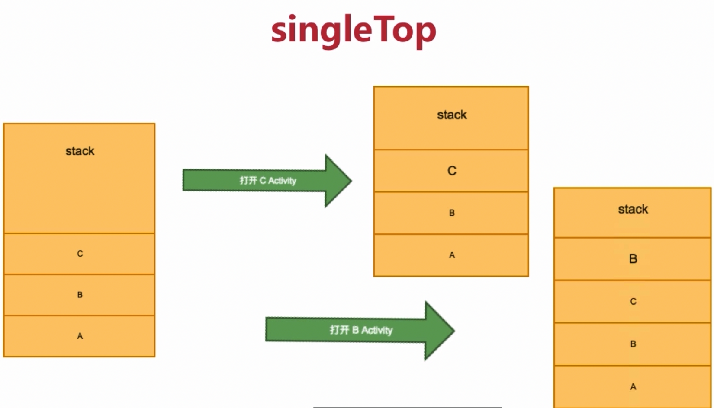
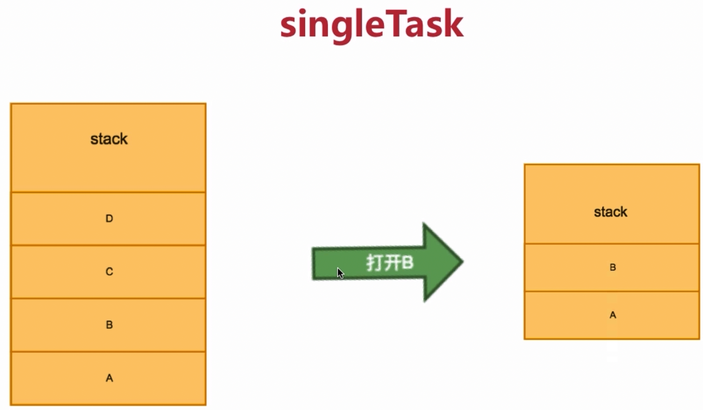
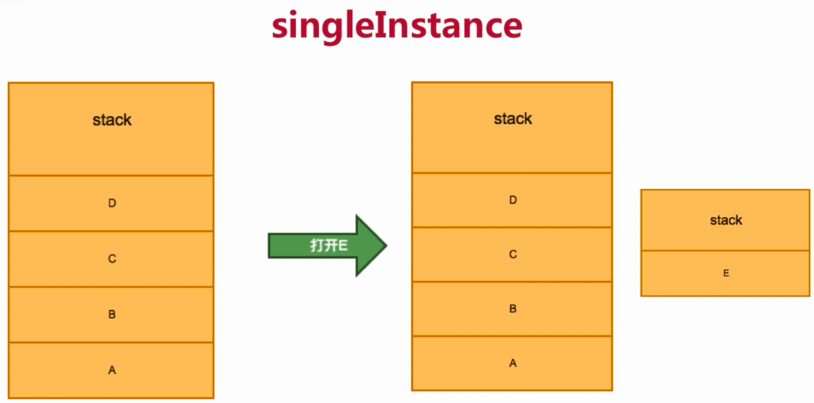
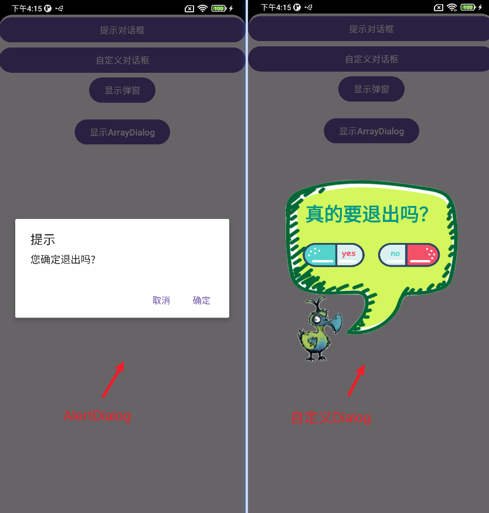
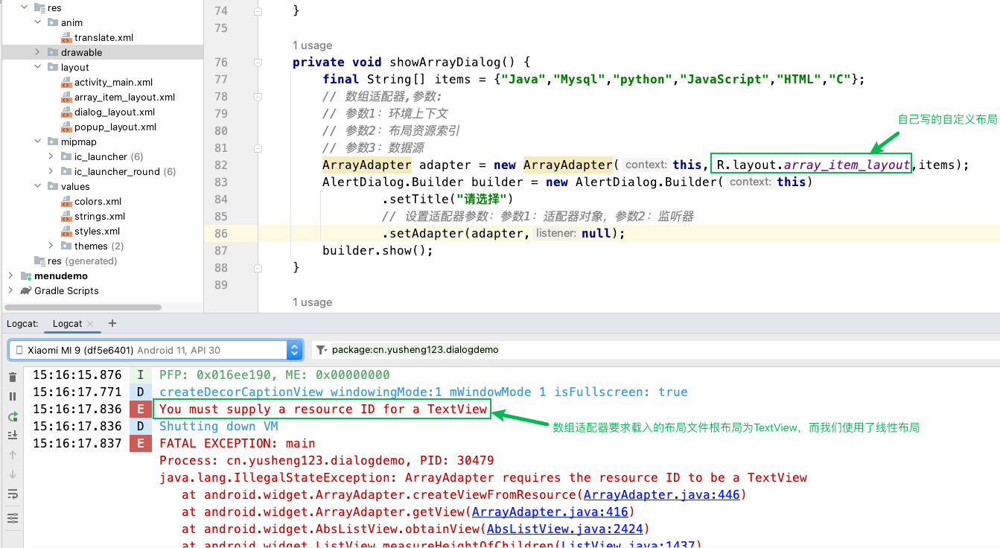
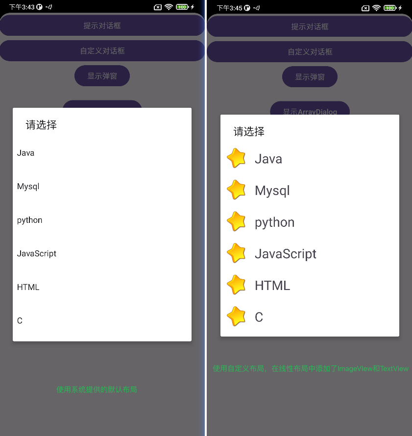
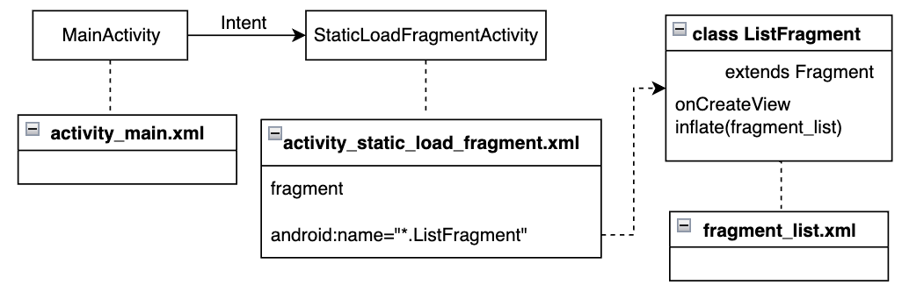

# 常用组件

## 一、Activity

### 1. Activity的创建

创建一个Activity的步骤：

a. 创建一个类继承自`AppCompatActivity`,定义`onCreate`方法，添加`setContentView`方法，传入布局文件；

b. 在`AndroidManifest.xml`中注册；

c. 如果是个主入口则需要声明一个`<intent-filter>`

### 2. Activity之间的跳转

需要创建一个Intent对象，传入当前Activity对象，和目标Activity.class；然后通过startActivity()传入Intent对象进行Activity之间的跳转；

```java
Intent intent = new Intent(TestActivity.this, NewActivity.class);
startActivity(intent);
```

> 新的Activity如果没有在AndroidManifest中注册，直接跳转过去会闪退的；
>
> 可以手动申明新Activity或者点击NewActivity这个类使用快捷键option + enter可以快速声明Activity；

### 3. Activity的启动模式

> 字节跳动客户端二面问的第一个问题就是Activity有几种启动模式？

首先看一下Activity是怎么被创建和销毁的？



Activity的启动模式有4种：

#### Standrad

系统默认的标准模式



#### singleTop

顶部复用模式

 

#### singleTask

如果栈里需要打开B，则会把B以上的Activity都会销毁；



#### singleInstance

类似于单例模式，会创建一个新栈只有一个Activity；

案例：来电界面



在逻辑控制代码中，可以使用Intent对象的`addFlags`方法，修改Activity的启动模式；

```java
intent.addFlags(Intent.FLAG_ACTIVITY_NEW_TASK);
```

## 二、Menu

### 1. Menu的分类与使用

> Android 3.0之前Menu在底部，3.0之后Menu添加到顶部；
>
> 如果当前应用的主题是`Theme.Material3.DayNight.NoActionBar`那么会隐藏Label，我们可以将主题改为`Theme.AppCompat.Light`,这样ActionBar就会显示出来；

#### 选项菜单Option Menu

菜单和布局文件很像，是由一个单独的文件夹📂管理的，我们在res文件夹下创建一个新的资源时，选择Resource type为menu，这样就会在res目录下menu文件夹中创建对应的菜单文件。

```xml
<?xml version="1.0" encoding="utf-8"?>
<menu xmlns:android="http://schemas.android.com/apk/res/android">
    <item android:title="保存"/>
    <item android:title="设置"/>
    <item
        android:title="更多操作" >
        <menu>
            <item
                android:title="子菜单1" />
            <item
                android:title="子菜单2" />
        </menu>
    </item>
</menu>
```

> 考虑到用户体验，OptionMenu子菜单不能超过两层；

每一个item都代表一个选项，如果想嵌套菜单，则需要先嵌套一个menu，再嵌套子菜单；

菜单xml文件创建好后，在Activity中通过`onCreateOptionMenu`方法启用选项菜单

```java
@Override
public boolean onCreateOptionsMenu(Menu menu) {
  	// 获取一个MenuInflater对象，调用inflate方法传入两个参数(资源id,菜单对象)
    getMenuInflater().inflate(R.menu.option,menu);
    return true;
}
```

在菜单选项中添加属性：

`app:showAsAction="always"`可以将菜单溢出显示；

设置`withText`可以同时显示图标与菜单文字；

设置`never`表示不会溢出显示，只会通过列表显示；

设置为`ifRoom`表示有空间就显示；

可以搭配icon属性可以显示菜单对应的icon;

菜单项中可以添加id属性，用于标识item，有了id就可以在Activity中使用`onOptionsItemSelected`方法进行选项菜单的操作：

```java
public static final int SAVE = R.id.save;
public static final int SETTING = R.id.setting;
public static final int EXIT = R.id.exit;

@Override
public boolean onOptionsItemSelected(@NonNull MenuItem item) {
    int itemId = item.getItemId();
    if(itemId == SAVE){
        Toast.makeText(this,"保存",Toast.LENGTH_SHORT).show();
    } else if (itemId == SETTING) {
        Toast.makeText(this,"设置",Toast.LENGTH_SHORT).show();
    } else if(itemId == EXIT){
        finish();
    }
    return super.onOptionsItemSelected(item);
}
```

> 这里不能使用Switch语句来进行选择，R.id.save等资源id在Gradle8之后已经不再是静态常量了；

#### 上下文菜单Context Menu

长按住某个View不放，就会在屏幕中间弹出Context Menu；一个Activity中只能有一个Option Menu，但是Context  Menu可以有多个，这取决于被注册了Context Menu的View的数量；

上下文菜单也支持二级菜单；

创建上下文菜单需要重写`onCreateContextMenu`方法，

```java
@Override
public void onCreateContextMenu(ContextMenu menu, View v, ContextMenu.ContextMenuInfo menuInfo) {
    getMenuInflater().inflate(R.menu.context,menu);
}
```

由于上下文菜单是跟View绑定的，所有需要将在Activity的OnCreate时就进行指定View与Context Menu的绑定操作；

```java
@Override
protected void onCreate(Bundle savedInstanceState) {
    super.onCreate(savedInstanceState);
    setContentView(R.layout.activity_main);
    // 注册Context Menu
    registerForContextMenu(findViewById(R.id.ctx_btn));
    // 创建 覆盖onCreateContextMenu
}
```

注册好了上下文菜单，如何进行菜单选项功能的绑定呢？这里跟Option Menu类似，也是`onContextItemSelected`方法，判断传入的View的ID，再进行相关操作,(Context Menu的XML文件和Option Menu类似，这里就不贴出来了)

```java
public static final int DELETE = R.id.delete;
public static final int OPERA1 = R.id.opera1;
public static final int OPERA2 = R.id.opera2;
@Override
public boolean onContextItemSelected(@NonNull MenuItem item) {
    int itemId = item.getItemId();
    if (itemId == DELETE) {
        Toast.makeText(this, "删除", Toast.LENGTH_SHORT).show();
    } else if (itemId == OPERA1) {
        Toast.makeText(this, "操作1", Toast.LENGTH_SHORT).show();
    } else if (itemId == OPERA2) {
        Toast.makeText(this, "操作2", Toast.LENGTH_SHORT).show();
    }
    return super.onContextItemSelected(item);
}
```

#### 上下文操作ActionMode：

会将屏幕正中间显示的上下文菜单，置于顶部的Action Bar中显示；

① 实现一个ActionMode类的CallBack接口，在对应的回调函数中实现菜单项操作的回应；

```java
ActionMode.Callback cb = new ActionMode.Callback() {
    // 创建，启动上下文操作模式时启动startActionMode(CallBack)
    @Override
    public boolean onCreateActionMode(ActionMode actionMode, Menu menu) {
        Log.e("TAG","创建");
        getMenuInflater().inflate(R.menu.context,menu);
        return true;
    }

    // 创建方法之后进行调用
    @Override
    public boolean onPrepareActionMode(ActionMode actionMode, Menu menu) {
        Log.e("TAG","准备");
        return false;
    }

    @Override
    public boolean onActionItemClicked(ActionMode actionMode, MenuItem menuItem) {
        Log.e("TAG", "点击");
        int itemId = menuItem.getItemId();
        if (itemId == DELETE) {
            Toast.makeText(MainActivity.this, "删除", Toast.LENGTH_SHORT).show();
        } else if (itemId == OPERA1) {
            Toast.makeText(MainActivity.this, "操作1", Toast.LENGTH_SHORT).show();
        } else if (itemId == OPERA2) {
            Toast.makeText(MainActivity.this, "操作2", Toast.LENGTH_SHORT).show();
        }
        return true;
    }
    // 上下文操作模式结束时调用
    @Override
    public void onDestroyActionMode(ActionMode actionMode) {
        Log.e("TAG", "结束");
    }
};
```

② 启动上文操作模式，需要在一个View的长按点击事件中绑定，

```java
@Override
protected void onCreate(Bundle savedInstanceState) {
    super.onCreate(savedInstanceState);
    setContentView(R.layout.activity_main);
  	// 启动上下文操作模式
    findViewById(R.id.ctx_btn).setOnLongClickListener(new View.OnLongClickListener() {
        @Override
        public boolean onLongClick(View view) {
            startActionMode(cb);
            return false;
        }
    });
}
```

#### 弹出菜单PopupMenu

> api11之后的版本才可以使用

弹出风格的菜单，一般出现在被绑定View的下方；

①实例化Popup Menu对象

② 加载菜单资源：利用MenuInflater将菜单资源加载到通过PopupMenu.getMenu()创建的Menu对象中；

③ 为Popup Menu设置点击监听器

④ 千万不要忘记这一步：PopupMenu对象需要调用show()方法才能正确显示；

```java
// 弹出式菜单(此段在onCreate方法里面)
// 1.实例化popupmenu对象
final Button popupBtn = findViewById(R.id.pop_btn);
popupBtn.setOnClickListener(new View.OnClickListener() {
    @Override
    public void onClick(View view) {
        PopupMenu menu = new PopupMenu(MainActivity.this, popupBtn);
        // 2. 加载菜单资源
        menu.getMenuInflater().inflate(R.menu.popup,menu.getMenu());
        // 3. 为popupMenu设置点击监听器
        menu.setOnMenuItemClickListener(new PopupMenu.OnMenuItemClickListener() {
            @Override
            public boolean onMenuItemClick(MenuItem menuItem) {
                int item = menuItem.getItemId();
                if(item == COPY){
                    Toast.makeText(MainActivity.this,"复制",Toast.LENGTH_SHORT).show();
                }else if(item == PASTE){
                    Toast.makeText(MainActivity.this,"黏贴",Toast.LENGTH_SHORT).show();
                }
                return false;
            }
        });
        menu.show();
    }
});
```

### 2. Menu的相关经验

选项菜单和上下文菜单是通过覆盖父类的方法来实现的，弹出式菜单是通过给VIew对象设置监听器后，将菜单资源与menu的父类对象绑定实现的；

#### Menu创建的方式：

① 通过XML定义：前面已经演示过；

② 通过Java定义：通过menu对象的add方法，传入四个参数，分别是：`组id、菜单项id、序号、菜单名称`；

组ID表示菜单的级别，一般一个级一组；

菜单项ID类似于XML中的id,用于后续对View的标识；

序号用于显示在当前级别菜单中的顺序；

```java
@Override
public boolean onCreateOptionsMenu(Menu menu) {
    // 通过加载XML资源来设计menu
    // getMenuInflater().inflate(R.menu.option, menu);
    // 通过Java代码设计menu
    menu.add(1,1,1,"设置");
    SubMenu sub = menu.addSubMenu(1, 2, 2, "更多");
    sub.add(2,3,1,"添加");
    sub.add(2,3,2,"删除");
    return true;
}
```

#### Menu相关方法的默认返回值

onCreateOptionsMenu()方法必须返回true，否则Menu无法显示 ；

onOptionsItemSelected()方法返回true，表示操作处理结束了；

## 三、Dialog

消息提示机制，用于向用户传递信息、提示或者警告用户；

### 1. AlertDialog

核心步骤：

①实例化Builder

②利用Builder设置对话框样式

③调用builder.show()方法现实对话框；

```java
// 通过构造器描述对话框
// 1. 实例化一个,builder,因为AlertDialog的构造方法是protected修饰的
AlertDialog.Builder builder = new AlertDialog.Builder(this);
// 2. 设置对话框样式
builder.setTitle("提示");
builder.setMessage("您确定退出吗?");
builder.setPositiveButton("确定", new DialogInterface.OnClickListener() {
    @Override
    public void onClick(DialogInterface dialogInterface, int i) {
        finish();
    }
});
builder.setNegativeButton("取消",null);
// 展示对话框
builder.show();
```

> builder.show( )实际上包含了create( )和show( )的工作
> AlertDialog alertDialog = builder.create( );
> alertDialog.show( );

还有一种设置对话框的方式，相当于把创建dialog的过程提前了；

```java
public void showNormalDialog(){
    AlertDialog dialog = new AlertDialog.Builder(this).create();
    dialog.setTitle("提示");
    dialog.setMessage("您确定退出程序吗");
    dialog.setButton(DialogInterface.BUTTON_POSITIVE, "确定", new DialogInterface.OnClickListener() {
        @Override
        public void onClick(DialogInterface dialogInterface, int i) {
            //逻辑函数
        }
    });
  dialog.show();
}
```



### 2. 自定义Dialog

主要有4个步骤：

① 设置布局，设计自定义对话框的Layout布局；

② 设置style，去除蓝色标题栏分割线、去除白色背景；

```xml
<style name="Theme.myDialog" parent="android:style/Theme.Dialog">
    <item name="android:windowNoTitle">true</item>
    <item name="android:windowBackground">@android:color/transparent</item>
</style>
```

③ 自定义Dialog，创建一个自定义类MyDialog继承自Dialog，将第一步的布局应用到当前对话框中来；

```java
public class MyDialog extends Dialog {
    public MyDialog(@NonNull Context context, int themeResId) {
        super(context, themeResId);
        // 为对话框设置布局
        setContentView(R.layout.dialog_layout);
        // 为相关按钮添加监听器
        findViewById(R.id.yes_btn).setOnClickListener(new View.OnClickListener() {
            @Override
            public void onClick(View view) {
                // 这是一个新的布局，退出不能直接用finnish
                System.exit(0);
            }
        });
        findViewById(R.id.no_btn).setOnClickListener(new View.OnClickListener() {
            @Override
            public void onClick(View view) {
                // 无操作的话也不能直接空着
                dismiss();
            }
        });
    }
}
```

④ 实例化对话框并展示，（参数1：环境上下文 参数2：创建的Style），并通过show()展示；

```java
MyDialog myDialog = new MyDialog(this, R.style.Theme_myDialog);
myDialog.show();
```

### 3. PopupWindow

#### 创建小气泡弹窗

实现步骤：

① 创建PopupWindow对象实例

② 设置背景、注册事件监听器和添加动画

③ 显示PopupWindow

```java
private void showPopupWindow(View view) {
    // 弹窗需要的视图对象,利用布局逆向生成视图
    View v = LayoutInflater.from(this).inflate(R.layout.popup_layout, null);
    // 1. 实例化对象
    // 参数1：用在弹窗中的View;
    // 参数2、3:弹窗的宽高
    // 参数4：focusable 能否获取焦点
    PopupWindow window = new PopupWindow(v, 510, 90, true);
    // 2. 设置(背景,动画)
    // 设备背景
    window.setBackgroundDrawable(new ColorDrawable(Color.TRANSPARENT));
    // 设置能响应外部的点击事件
    window.setOutsideTouchable(true);
    // 设置弹窗能响应点击事件
    window.setTouchable(true);
    // 3. 显示
    // 参数1：anchor锚点
    // 参数2、3：相对于锚在x,y上的偏移量
    window.showAsDropDown(view, 50, 50);
    // 4.为弹窗的文本添加点击事件
    // 注意如果直接使用findViewById会在当前Activity的setContentView的布局文件中找，
    // 而实际要用的是popup_layout的布局文件，则需要再当前函数对象的v中区寻找
    v.findViewById(R.id.choose).setOnClickListener(new View.OnClickListener() {
        @Override
        public void onClick(View view) {
            Toast.makeText(MainActivity.this, "您点击了选择", Toast.LENGTH_SHORT).show();
            // 让弹窗消失
            window.dismiss();
        }
    });
    v.findViewById(R.id.choose_all).setOnClickListener(new View.OnClickListener() {
        @Override
        public void onClick(View view) {
            Toast.makeText(MainActivity.this, "您点击了全选", Toast.LENGTH_SHORT).show();
            window.dismiss();
        }
    });
    v.findViewById(R.id.copy).setOnClickListener(new View.OnClickListener() {
        @Override
        public void onClick(View view) {
            Toast.makeText(MainActivity.this, "您点击了复制", Toast.LENGTH_SHORT).show();
            window.dismiss();
        }
    });
}
```

#### 创建过渡动画

① 创建动画资源 

定义了水平方向移动距离、竖直方向移动距离，以及动画持续的时间单位毫秒，该文件创建于res目录下anim文件夹下：

```xml
<?xml version="1.0" encoding="utf-8"?>
<set xmlns:android="http://schemas.android.com/apk/res/android">
    <translate
        android:fromXDelta="0"
        android:toXDelta="0"
        android:fromYDelta="800"
        android:toYDelta="0"
        android:duration="2000">
    </translate>
</set>
```

② 创建一个Style应用动画资源

在values目录下创建一个style.xml风格文件，定义一个translate_anim风格，添加动画translate资源

```xml
<?xml version="1.0" encoding="utf-8"?>
<resources>
    <style name="translate_anim">
        <item name="android:windowEnterAnimation">@anim/translate</item>
    </style>
</resources>
```

③ 对当前弹窗的动画风格设置为第二步的资源索引

```java
window.setAnimationStyle(R.style.translate_anim);
```

### 4. ArrayAdapter Dialog

数组适配器，用于显示单一的文本列表，布局资源可以选择Android本身提供的布局文件`android.R.layout.simple_dropdown_item_1line`

```java
private void showArrayDialog() {
    final String[] items = {"Java","Mysql","python","JavaScript","HTML","C"};
    // 数组适配器,参数:
    // 参数1：环境上下文
    // 参数2：布局资源索引
    // 参数3：数据源
    ArrayAdapter adapter = new ArrayAdapter(this, android.R.layout.simple_dropdown_item_1line,items);
    AlertDialog.Builder builder = new AlertDialog.Builder(this)
            .setTitle("请选择")
            // 设置适配器参数：参数1：适配器对象，参数2：监听器
            .setAdapter(adapter, new DialogInterface.OnClickListener() {
                @Override
                public void onClick(DialogInterface dialogInterface, int i) {
                    Toast.makeText(MainActivity.this,items[i],Toast.LENGTH_SHORT).show();
                    dialogInterface.dismiss();
                }
            });
    builder.show();
}
```

使用自定义布局文件：

创建一个array_item_layout.xml

```xml
<?xml version="1.0" encoding="utf-8"?>
<LinearLayout xmlns:android="http://schemas.android.com/apk/res/android"
    android:orientation="horizontal"
    android:layout_width="match_parent"
    android:layout_height="wrap_content"
    android:padding="10dp"
    android:gravity="center_vertical">

    <ImageView
        android:layout_width="40dp"
        android:layout_height="40dp"
        android:src="@drawable/star"/>
    <TextView
        android:id="@+id/item_txt"
        android:layout_width="wrap_content"
        android:layout_height="wrap_content"
        android:layout_marginLeft="15dp"
        android:textSize="25sp"
        android:text="测试"/>

</LinearLayout>
```

**常见错误**：❎

当我们在适配器中将自定义的布局文件引入后，系统运行会闪退，打开logcat会发现显示以下错误：



**解决方案**：✅

换一种类型的ArrayAdapter的构造方法，写出文本需要放在布局文件中对应文本控件的id

```java
ArrayAdapter adapter = new ArrayAdapter(this,R.layout.array_item_layout,R.id.item_txt,items);
```

两种方案的效果对比：



## 四、Activity的生命周期

### 1. 不同模式下的流程


#### 单个Activity生命周期：

1. 正常启动：onCreate --> onStart --> onResume；

正常退出：onPause --> onStop --> onDestory；

再次启动：onCreate --> onStart --> onResume；

2. 已经处于前台的Activity，点击主页按钮离开Activity：onPause --> onStop；

回到Activity：onRestart --> onStart --> onResume； 

3. Activity不可操作（息屏），而应用被强行杀死，再次回到Activity会走：onCreate --> onStart --> onResume；

#### 多个Activity切换时：

1. 当启动另一个Activity时，当前Activity：onPause --> onStop；

2. 当点击返回按钮，另一个Activity退出，返回当前Activity时：

onRestart --> onStart --> onResume；

#### 对话框存在时

1. 普通对话框不会引起Activity生命周期的变化，

2. 只有界面对话框（在Manifest中将Activity的主题设置为"@style/Theme.AppCompat.Dialog"）才会导致切换Activity时生命周期发生变化；onResume --> onPause，返回时onPause --> onResume

### 2. Activity的启动方式

#### 显式启动

给Intent传入`*Activity.class`,在编译时，编译器就已经知道启动的是哪一个界面了；

#### 隐式启动

编译时，编译器还不确定要启动哪一个界面,只有在运行时才知道要打开哪一个系统Activity，例如浏览器、拨号、地图;

第一个参数为Action对象，第二个参数为Uri对象，如果uri对象为空系统会让用户自行选择要打开的Activity；

浏览器：`https://www.bing.com` 

拨号：`tel:13912341234`

```java
Intent it3 = new Intent(Intent.ACTION_VIEW,Uri.parse("https://www.yusheng123.cn"));
startActivity(it3);
```

如果要隐式启动普通Activity，则需要再Intent构造方法中传入一个Action对象，名称在AndroidManifest.xml对应的Activity下的Intent-filter中定义；

```xml
<!-- 这里的名称用于给Intent传入Action参数-->
<action android:name="abc"/>
<!-- 无特殊用途的Activity一般放在默认分类下-->
<category android:name="android.intent.category.DEFAULT"/>
```

### 3. Activity之间的信息传递

#### 传递普通数据

普通数据可以直接在Intent对象中使用putExtra方法通过键值对的方式添加：

```java
Intent intent = new Intent(MainActivity.this,SecondActivity.class);
intent.putExtra("msg1","这是数据1");
intent.putExtra("msg2",100);
startActivity(intent);
```

在目标Activity中可以通过`getIntent()`方法获取到上一个Activity传过来的Intent对象：

```java
//获取上一个Activity传来的数据，则需要通过getIntent方法返回一个Intent对象
Intent it = getIntent();
String msg1 = it.getStringExtra("msg1");
// 如果是int类型的数据需要设置默认值
int msg2 = it.getIntExtra("mgs2", 0);
// 将获取到Intent传递过来的数据通过TextView来显示
TextView mTextView = findViewById(R.id.text);
mTextView.setText(msg1+""+msg2);
```

#### 传递对象数据

Activity之间传递对象数据，同样是使用`putExtra()`方法，不过传递的对象需要实现序列化接口：

```java
public class Student implements Serializable{
  ...
}
```
> 序列化有什么用？
Serializable接口是一个标记接口，它表明该类的对象可以被序列化，即可以被转换成字节流以便在网络上传输或者保存到文件中。
对象的状态可以被保存：当一个对象实现了Serializable接口后，它的状态（也就是它的字段的值）可以被保存下来，以便在之后重新创建对象时恢复其状态。

```java
Intent intent = new Intent(MainActivity.this,SecondActivity.class);
Student student = new Student("tom",12);
// 这里的student对象已经被序列号，所以可以通过putExtra进行添加
intent.putExtra("stu1",student);
startActivity(intent);
```
目标Activity接受Intent对象携带的Student对象数据
```java
Intent intent = getIntent();
//获取序列化对象
Student student = (Student)intent.getSerializableExtra("stu1");
TextView mTextView = findViewById(R.id.text);
mTextView.setText(student.getName()+" "+student.getAge());
```

## 五、Fragment

### Fragment概念

Android3.0之后提出的，模块化、可重复使用的组件，Fragment设计的目的是为了解决不同分辨率的终端适配问题；

### Fragment生命周期

一个Activity里可以运行多个Fragment,

Fragement不能脱离Activity存在；


### Fragment静态加载

案例：



MainActivity.java在onCreate中，对TextView添加一个点击事件，通过Intent跳转到StaticLoadFragmentActivity

```java
@Override
protected void onCreate(Bundle savedInstanceState) {
    super.onCreate(savedInstanceState);
    setContentView(R.layout.activity_main);
    findViewById(R.id.textView).setOnClickListener(new View.OnClickListener() {
        @Override
        public void onClick(View view) {
            // static load fragment
            startActivity(new Intent(MainActivity.this, StaticLoadFragmentActivity.class));
        }
    });
}
```

activity_main.xml定义了一个简单的TextView用于被MainActivity设置监听对象

```xml
<LinearLayout xmlns:android="http://schemas.android.com/apk/res/android"
    android:orientation="vertical"
    android:layout_width="match_parent"
    android:layout_height="match_parent"
    >

    <TextView
        android:id="@+id/textView"
        android:layout_width="match_parent"
        android:layout_height="100dp"
        android:gravity="center"
        android:text="Static load fragment!"
         />

</LinearLayout>
```

StaticLoadFragmentActivity.java直接加载布局文件activity_static_load_fragment.xml

```java
@Override
protected void onCreate(@Nullable Bundle savedInstanceState) {
    super.onCreate(savedInstanceState);
    setContentView(R.layout.activity_static_load_fragment);
}
```

activity_static_load_fragment.xml包含了自定义的listFragment标签，

```xml
<LinearLayout xmlns:android="http://schemas.android.com/apk/res/android"
    android:orientation="vertical"
    android:layout_width="match_parent"
    android:layout_height="match_parent"
    >

    <fragment
        android:id="@+id/listFragment"
        android:name="cn.yusheng123.fragmentdemo.ListFragment"
        android:layout_width="match_parent"
        android:layout_height="match_parent"/>

</LinearLayout>
```

ListFragment.java，通过inflate将fragment_list布局文件以view的方式返回

```java
public class ListFragment extends Fragment {
    // 创建视图
    @Nullable
    @Override
    public View onCreateView(@NonNull LayoutInflater inflater, @Nullable ViewGroup container, @Nullable Bundle savedInstanceState) {
        // new View
        View view = inflater.inflate(R.layout.fragment_list, container, false);
        return view;
    }
}
```

fragment_list.xml该布局文件定义后，可以作为Fragment被Activity复用；

```xml
<RelativeLayout xmlns:android="http://schemas.android.com/apk/res/android"
    android:background="#E91E63"
    android:layout_width="match_parent"
    android:layout_height="match_parent">
    <TextView
        android:id="@+id/textView2"
        android:layout_width="wrap_content"
        android:layout_height="wrap_content"
        android:layout_centerInParent="true"
        android:textColor="#ffffff"
        android:textSize="20sp"
        android:text="TextView" />
</RelativeLayout>
```

### Fragment动态加载

对布局进行动态加载Fragment，可以使用getSupportFragmentManager()返回一个FragmentManger对象，启动事务进行添加操作再提交；

布局文件activity_main.xml主要创建两个线性布局作为容器，以供Fragment动态加载；

```xml
<LinearLayout xmlns:android="http://schemas.android.com/apk/res/android"
    android:orientation="vertical"
    android:layout_width="match_parent"
    android:layout_height="match_parent"
    >
  
    <LinearLayout
        android:orientation="horizontal"
        android:padding="2dp"
        android:layout_width="match_parent"
        android:layout_height="match_parent">
        <LinearLayout
            android:id="@+id/listContainer"
            android:layout_width="0dp"
            android:layout_height="match_parent"
            android:layout_weight="1"
            android:orientation="vertical">
        </LinearLayout>
        <LinearLayout
            android:id="@+id/detailContainer"
            android:orientation="vertical"
            android:layout_width="0dp"
            android:layout_height="match_parent"
            android:layout_weight="3">
        </LinearLayout>
    </LinearLayout>

</LinearLayout>
```

```java
// 动态加载Fragment
ListFragment listFragment = new ListFragment();

getSupportFragmentManager()
        .beginTransaction()     // 启动事务
        .add(R.id.listContainer,listFragment)//添加操作（容器，Fragment对象）
        .commit();  // 提交

getSupportFragmentManager()
        .beginTransaction()
        .add(R.id.detailContainer,new ListFragment())
        .commit();
```

除了add以外，还有相关的remove、replace方法；

### Fragment传值

#### Activity向Fragment传值

一般的解决方法是在自定义Fragment类中定义一个静态方法`newInstance`,构造衣蛾listFragment对象，并接收参数通过`bundle`的方式，利用`setArguments`方法将数据传入Fragment;

数据传入Fragment后如何使用呢？在Fragment生命周期的onCreate方法中提取出bundle对象并获取值；

```java
public class ListFragment extends Fragment {

    public static final String BUNDLE_TITLE = "bundle_title";
    private String mTitle = "YUSHENG";

    public static ListFragment newInstance(String title){
        ListFragment listFragment = new ListFragment();
        Bundle bundle = new Bundle();
        //将bundle中的key设置为全局变量
        bundle.putString(BUNDLE_TITLE,title);
        listFragment.setArguments(bundle);
        return listFragment;
    }
    @Override
    public void onAttach(@NonNull Context context) {
        super.onAttach(context);
    }

    @Override
    public void onCreate(@Nullable Bundle savedInstanceState) {
        super.onCreate(savedInstanceState);
        if(getArguments() != null){
            // 提取参数，并将其设置为全局变量
            mTitle= getArguments().getString(BUNDLE_TITLE);
        }
    }

    // 创建视图
    @Nullable
    @Override
    public View onCreateView(@NonNull LayoutInflater inflater, @Nullable ViewGroup container, @Nullable Bundle savedInstanceState) {
        // new View
        View view = inflater.inflate(R.layout.fragment_list, container, false);

        TextView text = view.findViewById(R.id.textView2);
        text.setText(mTitle);
        return view;
    }
}
```

#### Fragment向Activity传值

利用接口回调的方法将数据从Fragment传入Activity

> 该部分有点难以理解，等待后续补充；

