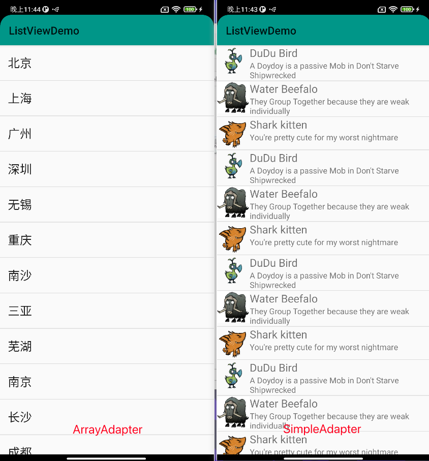
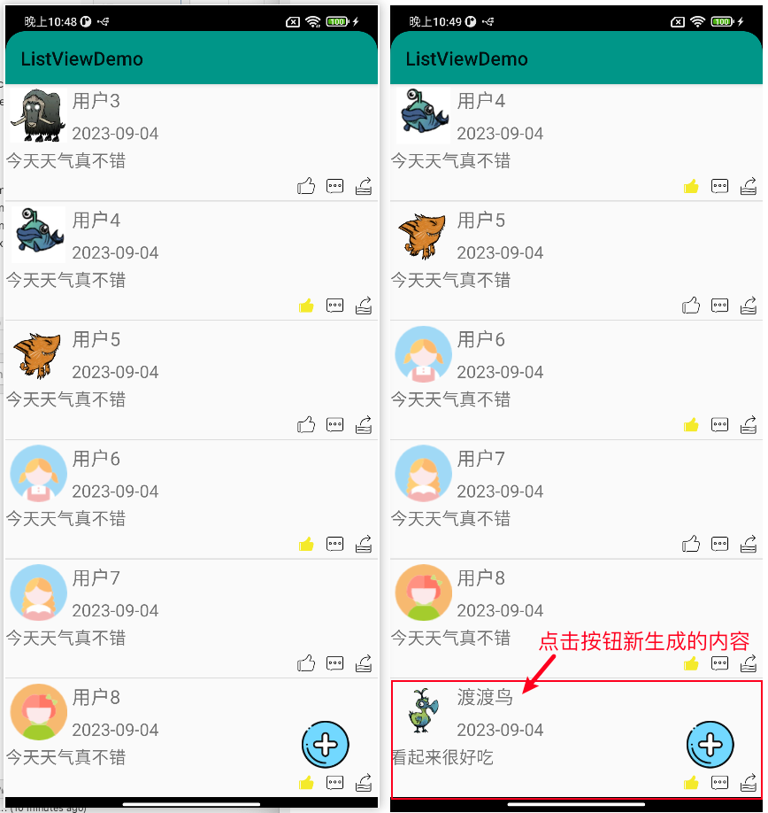

## ListView

### 概述

使用场景：当有大量的数据需要以垂直列表的形式展示时，我们就需要使用ListView来展示；

### 适配器

#### ArrayAdapter数组适配器

处理单一的文本信息，使用的方法是：

① 准备布局，每一项的显示效果；

```xml
<TextView xmlns:android="http://schemas.android.com/apk/res/android"
    android:text="城市"
    android:textSize="22sp"
    android:textColor="#4CAF50"
    android:gravity="center"
    android:layout_width="match_parent"
    android:layout_height="50dp">

</TextView>
```

② 准备数据源

```java
String[] data = {"北京","上海","广州","深圳","无锡","重庆","南沙","三亚","芜湖","南京","长沙","成都","西安","南昌","合肥","武汉","西宁"};
```

③ 实例化适配器(布局+数据源)

```java
ArrayAdapter adapter = new ArrayAdapter(this,R.layout.item,data);
```

④ 为ListView设置适配器

```java
ListView mListView = findViewById(R.id.listViewContainer);
mListView.setAdapter(adapter);
```

效果展示：

以下分别是ArrayAdapter和SimpleAdapter实现的ListView布局效果：



#### SimpleAdapter简单适配器

① 获取ListView对象

在activity_simple.xml文件中将界面主体部分设置为ListView控件，

```xml
<ListView
    android:id="@+id/list_view2"
    android:layout_width="wrap_content"
    android:layout_height="wrap_content"/>
```

在SimpleActivity.java的onCreate方法中，获取ListView对象。

```java
ListView listView2 = findViewById(R.id.list_view2);
```

② 实例化适配器对象

实例化适配器对象，需要传入5个参数：

> ```
> 参数1：上下文
> 参数2：数据源
> 参数3：每一项的布局
> 参数4：数据来源的key数组
> 参数5：数据去向的id数组，参数4的key代表的数据放到参数5的id所代表的控件中去
> ```

```java
SimpleAdapter adapter = new SimpleAdapter(this, data, R.layout.item3, from, to);
```

第一个参数传上下文this,第二个参数传一个嵌套了map的list,这么写：

```java
private List<Map<String, Object>> data = new ArrayList<>();
```

准备了data容器后还需要进行数据的初始化操作，这里定义一个initData方法手动向集合中添加数值：

```java
private void initData() {
    Map<String,Object> map1 = new HashMap<>();
    map1.put("img",R.drawable.dudu);
    map1.put("name","DuDu Bird");
    map1.put("description","A Doydoy is a passive Mob in Don't Starve Shipwrecked");
    Map<String,Object> map2 = new HashMap<>();
    map2.put("img",R.drawable.ox);
    map2.put("name","Water Beefalo");
    map2.put("description","They Group Together because they are weak individually");
    Map<String,Object> map3 = new HashMap<>();
    map3.put("img",R.drawable.catshark);
    map3.put("name","Shark kitten");
    map3.put("description","You're pretty cute for my worst nightmare");
    for(int i = 0; i < 10; i++){
        data.add(map1);
        data.add(map2);
        data.add(map3);
    }
}
```

第三个参数传入用于ListView的单个布局文件

```xml
<RelativeLayout xmlns:android="http://schemas.android.com/apk/res/android"
    android:layout_width="match_parent"
    android:layout_height="wrap_content">
    <ImageView
        android:id="@+id/dudu_image_view"
        android:src="@drawable/dudu"
        android:layout_width="60dp"
        android:layout_height="60dp"/>
    <TextView
        android:id="@+id/dudu_name"
        android:layout_width="wrap_content"
        android:layout_height="wrap_content"
        android:text="name"
        android:textSize="20sp"
        android:layout_toRightOf="@+id/dudu_image_view"/>
    <TextView
        android:id="@+id/dudu_description"
        android:layout_width="wrap_content"
        android:layout_height="wrap_content"
        android:text="Description"
        android:textSize="15sp"
        android:layout_below="@+id/dudu_name"
        android:layout_toRightOf="@+id/dudu_image_view"/>

</RelativeLayout>
```

第四个参数：传入用于数据来源的key数组

```java
String[] from = {"img","name","description"};
```

第五个参数：传入用于表示数据去向的控件id数组

```java
int[] to = {R.id.dudu_image_view,R.id.dudu_name,R.id.dudu_description};
```

③ 为ListView设置适配器

以上五个参数都准备完毕后，为ListView设置适配器就可以写成

```java
listView2.setAdapter(adapter);
```

继续完善可以给每一个item添加点击事件：

```java
listView2.setOnItemClickListener(new AdapterView.OnItemClickListener() {
    @Override
    public void onItemClick(AdapterView<?> adapterView, View view, int i, long l) {
        Map<String, Object> map = data.get(i);
        String name = map.get("name").toString();
        String description = map.get("description").toString();
        Toast.makeText(SimpleActivity.this, name + ":" + description, Toast.LENGTH_SHORT).show();
    }
});
```

以上，就完成了通过SimpleAdapter实现了对ListView的绘制操作；

#### BaseAdapter自定义适配器

绘制更高级的列表页面，对每个列表选项中包含的控件都能执行独立的操作；

使用BaseAdapter适配器的主体方案分为两个部分：创建适配器和设置适配器；

具体实施方案如下：

① 前期准备：

在BaseActivity.java中，onCreate设置显示的布局文件activity_base.xml，布局文件中通过帧布局的方式底层设置ListView,上层靠右下角设置一个ImageVIew，点击可以一条添加新的列表内容；

```xml
<FrameLayout xmlns:android="http://schemas.android.com/apk/res/android"
    android:layout_width="match_parent"
    android:layout_height="match_parent">
    <ListView
        android:id="@+id/list_view3"
        android:layout_width="match_parent"
        android:layout_height="match_parent">
    </ListView>
    <ImageView
        android:id="@+id/write"
        android:src="@drawable/write"
        android:layout_gravity="right|bottom"
        android:layout_margin="30dp"
        android:layout_width="50dp"
        android:layout_height="50dp">
    </ImageView>
</FrameLayout>
```

> BaseAdapter与SimpleAdapter不同之处在于适配器传入的数据列表，SimpleAdapter仅支持Map数据类型，而BaseAdapter支持自定义对象数据类型；

所以创建一个数据列表：

```java
List<Msg> data = new ArrayList<Msg>();
```

这里的Msg是我们自定义的类，用于表示每一条数据项所需要存储的内容：

```java
public class Msg {
    private int profile;
    private String nickname;
    private String content;
    private boolean isLike;

    public Msg(int profile, String nickname, String content, boolean isLike) {
        this.profile = profile;
        this.nickname = nickname;
        this.content = content;
        this.isLike = isLike;
    }

    public int getProfile() {
        return profile;
    }

    public void setProfile(int profile) {
        this.profile = profile;
    }

    public String getNickname() {
        return nickname;
    }

    public void setNickname(String nickname) {
        this.nickname = nickname;
    }

    public String getContent() {
        return content;
    }

    public void setContent(String content) {
        this.content = content;
    }

    public boolean isLike() {
        return isLike;
    }

    public void setLike(boolean like) {
        isLike = like;
    }
}
```

所以创建适配器通过自定义适配器MyAdapter继承BaseAdapter的方式来构建，需要重写四个方法，重点需要

关注的是getCount()方法用于获取列表的总体数量，getView()方法将ListView中的每一项列表传入并进行相应处理最终以VIew的形式返回出去；

```java
public class MyAdapter extends BaseAdapter {
    private List<Msg> list;
    private Context ctx;
    public MyAdapter(List<Msg> list,Context ctx) {
        this.list = list;
        this.ctx = ctx;
    }
    // 获取列表项的数量
    @Override
    public int getCount() {
        return list.size();
    }

    // 获取视图，设置ListView每一项的显示效果
    @Override
    public View getView(int i, View view, ViewGroup viewGroup) {
        view = LayoutInflater.from(ctx).inflate(R.layout.item4, null);
        Msg m = list.get(i);
        // 头像
        ImageView profile = view.findViewById(R.id.profile);
        profile.setImageResource(m.getProfile());
        // 昵称
        TextView nickname = view.findViewById(R.id.nickname);
        nickname.setText(m.getNickname());
        // 内容
        TextView content = view.findViewById(R.id.content);
        content.setText(m.getContent());
        // 是否点赞
        ImageView like = view.findViewById(R.id.like);
        boolean isLike = m.isLike();
        if(isLike){
            like.setImageResource(R.mipmap.liked);
        }else {
            like.setImageResource(R.mipmap.like);
        }
        return view;
    }

    @Override
    public Object getItem(int i) {
        return null;
    }

    @Override
    public long getItemId(int i) {
        return 0;
    }
}
```

我们通过布局加载器LayoutInflater的静态方法from()传入上下文参数ctx,这里的ctx来自于BaseActivity，因此可以在BaseActivity中创建MyAdapter适配器时传入两个参数，一个是data，一个是this;

布局加载器需要将用于显示列表每一项的布局文件layout.item4加载进去，这里的布局文件设计方案如下：

```xml
<RelativeLayout xmlns:android="http://schemas.android.com/apk/res/android"
    android:layout_width="match_parent"
    android:layout_height="match_parent">
    <!-- 头像 昵称 发表时间 发表内容 点赞 评论 转发   -->
    <ImageView
        android:id="@+id/profile"
        android:layout_width="60dp"
        android:layout_height="60dp"
        android:src="@mipmap/profile1"
        android:layout_margin="5dp"/>

    <TextView
        android:id="@+id/nickname"
        android:layout_width="match_parent"
        android:layout_marginTop="5dp"
        android:layout_height="30dp"
        android:text="User01"
        android:textSize="20sp"
        android:layout_toRightOf="@+id/profile"/>
    <TextView
        android:layout_width="match_parent"
        android:layout_height="30dp"
        android:text="2023-09-04"
        android:gravity="bottom"
        android:textSize="18sp"
        android:layout_below="@+id/nickname"
        android:layout_toRightOf="@+id/profile"/>
    <TextView
        android:id="@+id/content"
        android:layout_width="match_parent"
        android:layout_height="wrap_content"
        android:text="发表说说内容，文字占一行"
        android:textSize="18sp"
        android:layout_below="@+id/profile"
        />
    <ImageView
        android:id="@+id/repost"
        android:layout_width="20dp"
        android:layout_height="20dp"
        android:src="@mipmap/repost"
        android:layout_margin="5dp"
        android:layout_alignParentRight="true"
        android:layout_below="@id/content"/>
    <ImageView
        android:id="@+id/comment"
        android:layout_width="20dp"
        android:layout_height="20dp"
        android:src="@mipmap/comment"
        android:layout_margin="5dp"
        android:layout_toLeftOf="@+id/repost"
        android:layout_below="@id/content"/>
    <ImageView
        android:id="@+id/like"
        android:layout_width="20dp"
        android:layout_height="20dp"
        android:src="@mipmap/like"
        android:layout_margin="5dp"
        android:layout_toLeftOf="@+id/comment"
        android:layout_below="@id/content"/>

</RelativeLayout>
```

布局加载器设置完毕后，BaseActivity就可以使用我们自定义的适配器了，最终BaseActivity.java的写法如下：

```java
public class BaseActivity extends AppCompatActivity {
    private ListView listView3;
    private ImageView write;
    List<Msg> data = new ArrayList<Msg>();
    private int[] profiles = {R.drawable.dudu,R.drawable.qie,R.drawable.ox,
            R.drawable.fish,R.drawable.catshark,R.mipmap.profile6,
            R.mipmap.profile7,R.mipmap.profile8};
    private MyAdapter adapter;

    @Override
    protected void onCreate(Bundle savedInstanceState) {
        super.onCreate(savedInstanceState);
        setContentView(R.layout.activity_base);

        listView3 = findViewById(R.id.list_view3);
        write = findViewById(R.id.write);
        
        // 数据初始化
        initData();

        // 创建适配器
        adapter = new MyAdapter(data,this);
        // 设置适配器
        listView3.setAdapter(adapter);

        // 添加发说说的功能
        write.setOnClickListener(new View.OnClickListener() {
            @Override
            public void onClick(View view) {
                Msg temp = new Msg(R.drawable.dudu,"渡渡鸟","看起来很好吃",true);
                data.add(temp);
                // 通知适配器更新数据
                adapter.notifyDataSetChanged();
                // 设置ListView自动显示到最新数据
                listView3.setTranscriptMode(AbsListView.TRANSCRIPT_MODE_ALWAYS_SCROLL);
            }
        });

    }

    private void initData() {
        for(int i = 1; i <= profiles.length; i++){
            Msg m = new Msg(profiles[i-1],"用户"+i,"今天天气真不错",i%2==0?true:false);
            data.add(m);
        }
    }
}
```

BaseAdapter显示效果：



### ListView性能优化

#### ViewHolder

ListView滚动时避免重复加载View，从而提升性能

BaseAdapter中的getView方法每个视图出现时都会执行一次，

**优化1**：利用进入RecycleBin中的View,减少对View的赋值，实现view的复用；

```java
@Override
public View getView(int i, View view, ViewGroup viewGroup) {
    Log.e("TAG", "======" + i);
    view = LayoutInflater.from(ctx).inflate(R.layout.item4, null);
   //......
    return view;
}
// ----------------优化后的写法--------------------------
@Override
public View getView(int i, View view, ViewGroup viewGroup) {
    if(view == null) {
        Log.e("TAG", "======" + i);
        view = LayoutInflater.from(ctx).inflate(R.layout.item4, null);
    }
   //......
    return view;
}
```

**优化2：**

默认情况下不论view是否为空，获取控件时总是通过findViewById，重复查询操作严重影响性能；

所以可以自定义一个ViewHolder类，将需要保存的视图声明为公开的属性，一次保存可供多次操作；

**什么时候保存？**

当View为null时，完成对ViewHolder的实例化工作，并为各个控件属性赋值；

**什么时候用？**

任何时候都要使用，性能的提升在滚动ListView时View不为null时体现；

**怎么用？**

当View为null时，完成了对ViewHolder以及内部控件属性的初始化工作后，调用一句代码`view.setTag(holder)`;当View不为null时，holder = (ViewHolder)view.getTag();

```java
@Override
public View getView(int i, View view, ViewGroup viewGroup) {
    view = LayoutInflater.from(ctx).inflate(R.layout.item4, null);
    Msg m = list.get(i);
    // 头像
    ImageView profile = view.findViewById(R.id.profile);
    profile.setImageResource(m.getProfile());
    // 昵称
    TextView nickname = view.findViewById(R.id.nickname);
    nickname.setText(m.getNickname());
    // 内容
    TextView content = view.findViewById(R.id.content);
    content.setText(m.getContent());
    // 是否点赞
    ImageView like = view.findViewById(R.id.like);
    boolean isLike = m.isLike();
    if(isLike){
        like.setImageResource(R.mipmap.liked);
    }else {
        like.setImageResource(R.mipmap.like);
    }
    return view;
}
// ------------------优化后的写法---------------------------
@Override
public View getView(int i, View view, ViewGroup viewGroup) {
    ViewHolder holder;
    if(view == null) {
        Log.e("TAG", "======" + i);
        view = LayoutInflater.from(ctx).inflate(R.layout.item4, null);
        holder = new ViewHolder();
        holder.profile = view.findViewById(R.id.profile);
        holder.nickname = view.findViewById(R.id.nickname);
        holder.content = view.findViewById(R.id.content);
        holder.like = view.findViewById(R.id.like);
        holder.comment = view.findViewById(R.id.comment);
        holder.repost = view.findViewById(R.id.repost);
        // 通过setTag将holder与View进行绑定
        view.setTag(holder);
    }else {
        // 通过getTag取出ViewHolder对象，然后能够直接通过holder.控件的方式直接在外面操作控件，从而避免了
        // 大幅度使用findViewByID操作
        holder = (ViewHolder) view.getTag();
    }
    Msg m = list.get(i);
    // 头像
    holder.profile.setImageResource(m.getProfile());
    // 昵称
    holder.nickname.setText(m.getNickname());
    // 内容
    holder.content.setText(m.getContent());
    // 是否点赞
    boolean isLike = m.isLike();
    if(isLike){
        holder.like.setImageResource(R.mipmap.liked);
    }else {
        holder.like.setImageResource(R.mipmap.like);
    }
    return view;
}
// 定义一个ViewHolder的内部类
static class ViewHolder{
    public ImageView profile,like,comment,repost;
    public TextView nickname,content;
}
```

## ViewPager

本质上与ListView相似，使用方法主要分为：创建适配器和使用适配器；

创建适配器时重点需要重写4个方法：

```java
PagerAdapter mPagerAdapter = new PagerAdapter() {
    // 获取视图的数量
  	@Override
    public int getCount() {
        return mLayoutId.length;
    }
		
    @Override
    public boolean isViewFromObject(@NonNull View view, @NonNull Object object) {
        return view == object;
    }
		// 设置每一个视图的内容
    @NonNull
    @Override
    public Object instantiateItem(@NonNull ViewGroup container, int position) {
        View child = mViews.get(position);
        container.addView(child);
        return child;
    }
		// 资源回收
    @Override
    public void destroyItem(@NonNull ViewGroup container, int position, @NonNull Object object) {
        container.removeView(mViews.get(position));
    }
};
```

初始化数据与使用适配器的写法如下

```java
public class ImageViewPagerAdapter extends AppCompatActivity {
    private ViewPager viewPager;
    private List<View> mViews;
    private int[] mLayoutId = {R.layout.first_layout,R.layout.second_layout,R.layout.third_layout};

    @Override
    protected void onCreate(Bundle savedInstanceState) {
        super.onCreate(savedInstanceState);
        setContentView(R.layout.activity_image_view_adapter);
        viewPager = findViewById(R.id.view_pager);

        // 初始化数据
        mViews = new ArrayList<>();
        for (int index = 0; index < mLayoutId.length; index++) {
            View view = getLayoutInflater().inflate(mLayoutId[index], null);
            mViews.add(view);
        }
      	// 设置适配器
        viewPager.setAdapter(mPagerAdapter);
    }
```

