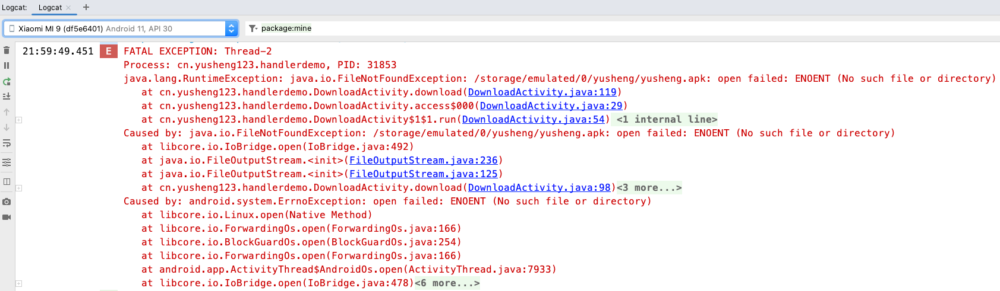

## Handler异步通信机制

### 前言：

对UI的操作只能在UI线程中进行，在子线程中进行耗时操作后怎么把结果传递给UI线程呢？Android提供了一种线程间通讯的机制Handler机制；

Android中Handler的主要作用是：用于定时任务和实现不同线程之间的通信；

### 基本概念

Handler

Looper

Message

MessageQueue


### Handler基本用法


子线程创建一个message对象，设置相关属性后通过主线程的handler对象调用sendMessage方法发送出去；

```java
// 创建message对象
Message message = new Message();
// what属性相对于暗号
message.what = 0;
// obj属性相当于内容，主线程拿到message可以将obj强转
message.obj = str;
// 使用主线程的handler对象调用sendMessage()方法，将message作为参数发出去
mHandler.sendMessage(message);
```

主线的创建一个handler对象，重写handlerMessage方法，以进行消息的接收，下面是一个handler消息传递的Demo

```java
public class MainActivity extends AppCompatActivity {

    public static final String TAG = "MainActivity";
    public static final int SUB_BTN = R.id.sub_btn;
    public static final int TEXT_VIEW = R.id.text_view;
    private Button mButton;
    private TextView mTextView;
    private Handler mHandler;
  
    @Override
    protected void onCreate(Bundle savedInstanceState) {
        super.onCreate(savedInstanceState);
        setContentView(R.layout.activity_main);
        mButton = findViewById(SUB_BTN);
        mTextView = findViewById(TEXT_VIEW);
        // 定义handler对象
        mHandler = new Handler(Looper.myLooper()) {
            @Override
            public void handleMessage(@NonNull Message msg) {
                super.handleMessage(msg);
                if (msg.what == 0) {
                    String str = (String) msg.obj;
                    mTextView.setText(str);
                }
            }
        };
    }

    public void myClick(View view) {
        int viewId = view.getId();
        if (viewId == SUB_BTN) {
            new Thread() {
                @Override
                public void run() {
                    super.run();
                    String str = network_get();
                    // 创建一个Message
                    Message message = new Message();
                    message.what = 0;
                    message.obj = str;
                    mHandler.sendMessage(message);
                }
            }.start();
        }
    }

    private String network_get() {
        //......通过get进行网络连接的方法，这里省略
    }
}
```

#### Message常见发送信息方法

Message对象有一个obtain静态方法，并且有一个上锁的缓存池，缓存池中有内容则直接获取，如果缓存池为空obtain方法才会new一个Message对象；

```java
// Handler里Message源码
public static Message obtain() {
    synchronized (sPoolSync) {
        if (sPool != null) {
            Message m = sPool;
            sPool = m.next;
            m.next = null;
            m.flags = 0; // clear in-use flag
            sPoolSize--;
            return m;
        }
    }
    return new Message();
}
```

因此我们在创建Message对象时，可以直接通过`obtain()`方法创建

```java
Message message = Message.obtain();
```

在指定时间发送消息：

```java
// 在指定时间发送消息，SystemClock.uptimeMillis()表示系统当前时间，+3000表示延迟3s
mHandler.sendMessageAtTime(message, SystemClock.uptimeMillis()+3000);
// 直接设置为延迟3s发送消息
mHandler.sendMessageDelayed(message,3000);
```

 写一个案例，URL下载链接文件，通过ProgressBar显示进度：

```java
public class DownloadActivity extends AppCompatActivity {

    public static final String APP_URl = "http://download.sj.qq.com/upload/connAssitantDownload/upload/MobileAssistant_1.apk";
    public static final int DOWNLOAD_MESSAGE_CODE = 10001;
    public static final int DOWNLOAD_FAIL_CODE = 10002;
    private Button mButton;
    private Handler mHandler;
    private ProgressBar mProgressBar;

    @Override
    protected void onCreate(Bundle savedInstanceState) {
        super.onCreate(savedInstanceState);
        setContentView(R.layout.activity_download);
        mProgressBar = findViewById(R.id.progressBar);
        mButton = findViewById(R.id.btn_download);
        mButton.setOnClickListener(new View.OnClickListener() {
            @Override
            public void onClick(View v) {
                new Thread(new Runnable() {
                    @Override
                    public void run() {
                        download(APP_URl);
                    }
                }).start();
            }
        });
        mHandler = new Handler(Looper.myLooper()){
            @Override
            public void handleMessage(@NonNull Message msg) {
                super.handleMessage(msg);
                if(msg.what == DOWNLOAD_MESSAGE_CODE){
                    Toast.makeText(DownloadActivity.this,"下载完成",Toast.LENGTH_SHORT).show();
                    mProgressBar.setProgress((Integer)msg.obj);
                }
            }
        };
    }

    @SuppressWarnings("ResultOfMethodCallIgnored")
    private void download(String appURl) {
        try {
            URL url = new URL(appURl);
            URLConnection urlConnection = url.openConnection();
            InputStream inputStream = urlConnection.getInputStream();
            // 获取文件总长度
            int contentLength = urlConnection.getContentLength();
            // 创建本地下载目录
            String fileFolder = Environment.getExternalStorageDirectory() + File.separator + "yusheng" + File.separator;
            File file = new File(fileFolder);
            if(file.exists() || file.mkdir()){
                // 创建下载文件
                String FileName = fileFolder+"应用宝.apk";
                File apkFile = new File(FileName);
                if(!apkFile.exists() || apkFile.delete()){
                    int downloadSize = 0;
                    byte[] bytes = new byte[1024];
                    int length;
                    OutputStream outputStream = new FileOutputStream(FileName);
                    while ((length = inputStream.read(bytes)) != -1){
                        outputStream.write(bytes,0,length);
                        downloadSize += length;
                        // 更新url
                        Message message = Message.obtain();
                        message.what = DOWNLOAD_MESSAGE_CODE;
                        message.obj = downloadSize*100/contentLength;
                        mHandler.sendMessage(message);
                    }
                    inputStream.close();
                    outputStream.close();
                }
            }
        } catch (MalformedURLException e) {
            notifyDownloadFailed();
            throw new RuntimeException(e);
        } catch (IOException e) {
            notifyDownloadFailed();
            throw new RuntimeException(e);
        }
    }
    private void notifyDownloadFailed() {
        Message message = Message.obtain();
        message.what = DOWNLOAD_FAIL_CODE;
        mHandler.sendMessage(message);
    }
}
```

> download方法在向系统写入下载的文件时报错，不知道是什么原因：
>
> 可能是Android11后文件读写引入了范围存储机制，传统文件读写方式已过时；但是花了很长时间依然没有解决
>
> 

#### 优化Handler的内存泄露

使用弱引用WeakReference，自定义静态Handler类：

> 此部分有点难以理解，后续补充学习

## AsyncTask

> AysncTask负责在Android中执行异步任务，允许一非现场阻塞的方式执行操作，但是在Android API 30中AsyncTask被Android官方弃用。

AsyncTask是一个抽象类

目的：方便后台线程操作后更新UI

实现：Thread和Handler封装

实质：Handler异步通信机制

泛型参数：`<Params,Progress,Result>`

UI 操作：onPreExecute onPostExcute

后台线程操作：doInBackground

输入输出：Params，Result

进度显示：onProgressUpdate

使用方法：

- `onPreExecute()`操作前的准备工作
- `doInBackgroud()`耗时操作
- `onProgressUpadate()`更新进度
- `onPostExcute()`执行完后台任务后更新U显示

```java
public class DownloadAsyncTask extends AsyncTask<String,Integer,Boolean>{

    // 在异步任务之前执行，可用于操作UI
    @Override
    protected void onPreExecute() {
        super.onPreExecute();
    }

    // 在另外一个线程中处理事件
    @Override
    protected Boolean doInBackground(String... params) {
        for (int i = 0; i < 100; i++) {
            try {
                Thread.sleep(1000);
            } catch (InterruptedException e) {
                throw new RuntimeException(e);
            }
            Log.i(TAG, "doInBackground: "+params[0]+":"+i);
            // 抛出进度
            publishProgress(i);
        }

        return true;
    }

    // 也是在主线程中，执行处理结果
    @Override
    protected void onPostExecute(Boolean aBoolean) {
        super.onPostExecute(aBoolean);
    }

    //收到进度，然后处理，也是在UI线程中
    @Override
    protected void onProgressUpdate(Integer... values) {
        super.onProgressUpdate(values);
    }

    @Override
    protected void onCancelled() {
        super.onCancelled();
    }
}
```

调用异步任务时，通过`execute()`方法传入参数

```java
new DownloadAsyncTask().execute("hello world");
```
