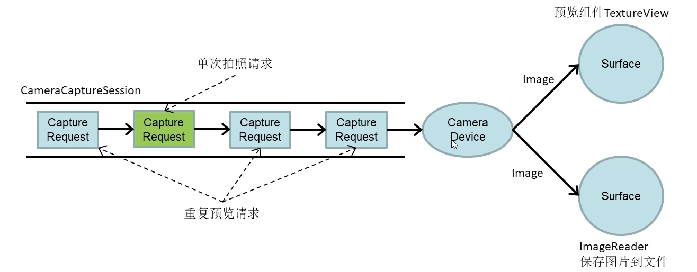

# Camera2开发Demo实战

Camera2预览原理



以Activity生命周期作为切入点，介绍Camera2在开发相机Demo的用法：

## 1、onCreate

在onCreate()时，主要做自定义相机工具类CameraUtils的初始化，相机初始化、视图初始化的工作；

```java
@Override
protected void onCreate(Bundle savedInstanceState) {
    super.onCreate(savedInstanceState);
    // 检查权限
    CameraUtils.init(this);
    initCamera();
    initViews();
}
```

### 1.1、相机工具类的初始化

自定义相机工具类CameraUtils的初始化主要是为了创建一个CameraManager对象mCameraManager；

```java
public static void init(Context context){
    if(appContext == null){
        // 由于该方法是静态的，将上下文生命周期与应用程序绑定，防止内存泄露
        appContext = context.getApplicationContext();
        mCameraManager = (CameraManager) appContext.getSystemService(Context.CAMERA_SERVICE);
    }
}
```

### 1.2、相机初始化

相机初始化的目的主要是为了获取CameraId，以及根据CameraID，得到对应相机支持的所有画幅的尺寸outputSizes

```java
private void initCamera(){
    mCmameraManager = CameraUtils.getInstance().getCameraManager();
    cameraId = CameraUtils.getInstance().getBackCameraId();
    outputSizes = CameraUtils.getInstance().getCameraOutputSizes(cameraId, SurfaceTexture.class);
    photoSize = outputSizes.get(0);
}
```

#### 1.2.1、获取CameraId

```java
public String getBackCameraId(){
    return getCameraId(false);
}
```

拿到后置摄像头的CameraID；

LENS_FACING_FRONT，指的是前置摄像头，CameraID一般为0；

LENS_FACING_BACK，指的是后置摄像头，CameraID一般为1；

```java
public String getCameraId(boolean useFront){
    try {
        for (String cameraId: mCameraManager.getCameraIdList()) {
            CameraCharacteristics characteristics = mCameraManager.getCameraCharacteristics(cameraId);
            //获取当前CameraId对应相机的朝向
            int cameraFacing = characteristics.get(CameraCharacteristics.LENS_FACING);
            if(useFront){
                if(cameraFacing == CameraCharacteristics.LENS_FACING_FRONT){
                    return cameraId;
                }
            }else {
                if(cameraFacing == CameraCharacteristics.LENS_FACING_BACK){
                    return cameraId;
                }
            }
        }
    } catch (CameraAccessException e) {
        Log.e(TAG, "getCameraId: 获取相机信息异常",e);
    }
    return null;
}
```

#### 1.2.2、拿到对应Camera所支持的所有的outputSizes

首先通过CameraManager对象调用getCameraCharacteristics()方法，拿到对应CameraID的characteristics信息，然后使用characteristics调用get方法传入SCALER_STREAM_CONFIGURATION_MAP常量，拿到config信息；再通过config对象调用getOutputSizes(clz)方法得到该相机所支持的所有的画幅尺寸列表。

```Java
public List<Size> getCameraOutputSizes(String cameraId, Class clz){
    try {
        CameraCharacteristics characteristics = mCameraManager.getCameraCharacteristics(cameraId);
        StreamConfigurationMap configs = characteristics.get(CameraCharacteristics.SCALER_STREAM_CONFIGURATION_MAP);
        List<Size> sizes = Arrays.asList(configs.getOutputSizes(clz));
        Collections.sort(sizes, new Comparator<Size>() {
            @Override
            public int compare(Size o1, Size o2) {
                return o2.getWidth() * o2.getHeight() - o1.getWidth() * o1.getHeight();
            }
        });
        return sizes;

    } catch (CameraAccessException e) {
        Log.e(TAG, "getCameraOutputSizes: 获取相机信息异常", e);
    }
    return null;
}
```

### 1.3、Activity视图初始化

加载Activity的布局文件，再对快门按键添加监听器，实现快门功能；

```java
private void initViews() {
    setContentView(R.layout.activity_main);
    btnPhoto = findViewById(R.id.btn_photo);
    btnPhoto.setOnClickListener(new View.OnClickListener() {
        @Override
        public void onClick(View v) {
            takePhoto();
        }
    });
    previewView = findViewById(R.id.preview_view);
}
```

## 2、onResume

在onResume中，首先检查是否授予了相机权限，如果没有权限则走申请权限的步骤；如果有权限，则判断预览视图是否可用，如果可用则打开相机，如果不可用，添加预览视图监听器；传入预览视图监听器对象。

```java
@Override
protected void onResume() {
    super.onResume();
    if(checkPermission()){
        if(previewView.isAvailable()){
            openCamera();
        }else {
            previewView.setSurfaceTextureListener(surfaceTextureListener);
        }
    }else {

        requestPermission();
    }
}
```

### 2.1、权限管理

#### 2.1.1、检查权限

```java
private boolean checkPermission(){
    return ContextCompat.checkSelfPermission(this, Manifest.permission.CAMERA) == PackageManager.PERMISSION_GRANTED;
}
```

#### 2.1.2、申请权限

```java
private void requestPermission(){
    ActivityCompat.requestPermissions(this,new String[]{Manifest.permission.CAMERA},PERMISSION_REQUEST_CODE);
}
```

申请权限要定义权限申请结果回调方法：

```java
@Override
public void onRequestPermissionsResult(int requestCode, @NonNull String[] permissions, @NonNull int[] grantResults) {
    super.onRequestPermissionsResult(requestCode, permissions, grantResults);
    switch (requestCode) {
        case PERMISSION_REQUEST_CODE:
            if (grantResults.length > 0 && grantResults[0] == PackageManager.PERMISSION_GRANTED) {
                Toast.makeText(getApplicationContext(), "相机权限已授权", Toast.LENGTH_SHORT).show();
            } else {
                Toast.makeText(getApplicationContext(), "已拒绝相机权限", Toast.LENGTH_SHORT).show();
                if (ContextCompat.checkSelfPermission(this, Manifest.permission.CAMERA)
                        != PackageManager.PERMISSION_GRANTED) {
                    showMessageOkCancel("你应该授权相机权限，否则无法使用相机",
                            new DialogInterface.OnClickListener() {
                                @Override
                                public void onClick(DialogInterface dialog, int which) {
                                    requestPermission();
                                }
                            });
                }
            }
    }
}
```

如果用户没有及时授权，需要弹出对话框提示用户授权：

```java
private void showMessageOkCancel(String message, DialogInterface.OnClickListener okListener){
    new AlertDialog.Builder(Camera.this)
            .setMessage(message)
            .setPositiveButton("ok",okListener)
            .setNegativeButton("Cancel",null)
            .create()
            .show();
}
```

### 2.2、检查预览是否可用

如果可用：

#### 2.2.1、打开相机

```java
@SuppressLint("MissingPermission")
private void openCamera(){
    try {
        displayOrientation = this.getWindowManager().getDefaultDisplay().getOrientation();
        if(displayOrientation == Surface.ROTATION_0 || displayOrientation == Surface.ROTATION_180){
            previewView.setAspectRation(photoSize.getHeight(),photoSize.getWidth());
        }else {
            previewView.setAspectRation(photoSize.getWidth(),photoSize.getHeight());
        }
        configureTransform(previewView.getWidth(),previewView.getHeight());
        mCmameraManager.openCamera(cameraId,cameraStateCallback,null);
    } catch (CameraAccessException e) {
        Log.e(TAG, "openCamera: 相机访问异常",e);
    }
}
```

配置预览尺寸：

```java
private void configureTransform(int viewWidth,int viewHeight){
    if(null == previewView || null == photoSize){
        return;
    }
    int rotation = this.getWindowManager().getDefaultDisplay().getRotation();
    Matrix matrix = new Matrix();
    RectF viewRect = new RectF(0, 0, viewWidth, viewHeight);
    RectF bufferRect = new RectF(0, 0, photoSize.getHeight(), photoSize.getWidth());
    float centerX = viewRect.centerX();
    float centerY = viewRect.centerY();
    if(Surface.ROTATION_90 == rotation || Surface.ROTATION_270 == rotation){
        bufferRect.offset(centerX - bufferRect.centerX(), centerY - bufferRect.centerY());
        matrix.setRectToRect(viewRect, bufferRect, Matrix.ScaleToFit.FILL);
        float scale = Math.max(
                (float) viewHeight / photoSize.getHeight(),
                (float) viewWidth / photoSize.getWidth());
        matrix.postScale(scale, scale, centerX, centerY);
        matrix.postRotate(90 * (rotation - 2), centerX, centerY);
    } else if (Surface.ROTATION_180 == rotation) {
        matrix.postRotate(180,centerX,centerY);
    }
    previewView.setTag(matrix);
}
```

定义相机回调：

```java
CameraDevice.StateCallback cameraStateCallback = new CameraDevice.StateCallback() {
    @Override
    public void onOpened(@NonNull CameraDevice camera) {
        Log.d(TAG, "onOpened: 相机已经启动");
        // 初始化ImageReader和Surface
        initReaderAndSurface();
        cameraDevice = camera;
        try {
            SurfaceTexture surfaceTexture = previewView.getSurfaceTexture();
            if(surfaceTexture == null){
                return;
            }
            surfaceTexture.setDefaultBufferSize(photoSize.getWidth(),photoSize.getHeight());
            previewSurface = new Surface(surfaceTexture);
            previewRequestBuilder = cameraDevice.createCaptureRequest(CameraDevice.TEMPLATE_PREVIEW);
            previewRequestBuilder.addTarget(previewSurface);
            previewRequest = previewRequestBuilder.build();
            cameraDevice.createCaptureSession(Arrays.asList(previewSurface,photoSurface),sessionsStateCallback,null);
        } catch (CameraAccessException e) {
            Log.e(TAG, "onOpened: 相机访问异常",e);
        }
    }

    @Override
    public void onDisconnected(@NonNull CameraDevice camera) {
        Log.d(TAG, "onDisconnected: 相机已断开连接");
    }

    @Override
    public void onError(@NonNull CameraDevice camera, int error) {
        Log.d(TAG, "onError: 相机打开出错");
    }
};
```

创建捕获请求时，需要定义会话状态回调：

```java
CameraCaptureSession.StateCallback sessionsStateCallback = new CameraCaptureSession.StateCallback() {
    @Override
    public void onConfigured(@NonNull CameraCaptureSession session) {
        if(null == cameraDevice){
            return;
        }
        captureSession = session;
        try {
            captureSession.setRepeatingRequest(previewRequest,null,null);
        } catch (CameraAccessException e) {
            Log.e(TAG, "onConfigured: 相机访问异常",e);
        }
    }

    @Override
    public void onConfigureFailed(@NonNull CameraCaptureSession session) {

    }
};
```

如果不可用：

#### 2.2.2、设置预览监听器

```java
previewView.setSurfaceTextureListener(surfaceTextureListener);
```

定义预览监听回调

```java
TextureView.SurfaceTextureListener surfaceTextureListener = new TextureView.SurfaceTextureListener() {
    @Override
    public void onSurfaceTextureAvailable(@NonNull SurfaceTexture surface, int width, int height) {
        openCamera();
    }

    @Override
    public void onSurfaceTextureSizeChanged(@NonNull SurfaceTexture surface, int width, int height) {
        configureTransform(width,height);
    }

    @Override
    public boolean onSurfaceTextureDestroyed(@NonNull SurfaceTexture surface) {
        return false;
    }

    @Override
    public void onSurfaceTextureUpdated(@NonNull SurfaceTexture surface) {

    }
};
```