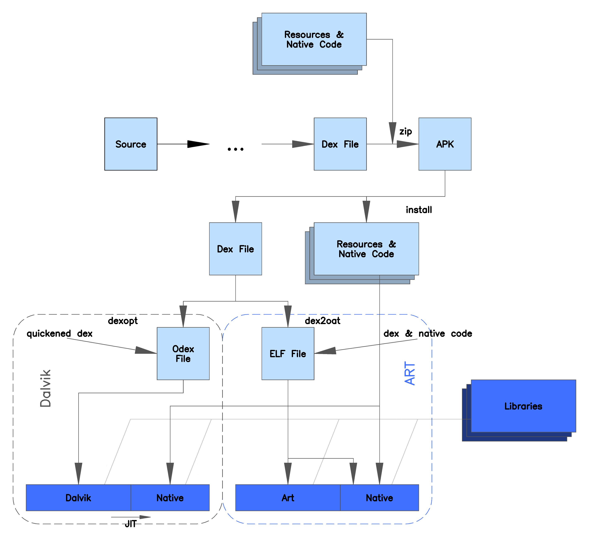

# Android Framework架构介绍

## 一、 Andoird系统架构

Android系统是一种基于Linux的开源软件栈，通俗的说就是在Linux系统的基础上增加了Java虚拟机和Framework框架，应用层的Android程序都是基于framework进行开发的。Android系统架构分为四个层，从底层到上层分别是Linux内核层、硬件抽象层、系统运行库层、Framework层、应用程序层。

接下来我们对于Android系统架构各层自顶向下进行进行概要介绍：

### 1.1、应用层

该层为我们最熟悉的应用程序层，在Android系统中主要体现在系统应用，如相机、电话、短信、浏览器、桌面等系统应用，第三方软件公司开发的常见APP也属于这一层。应用层主要工作范畴是合理高效地布局UI、使用Activity、Service、Content provider、Broadcast，处理好多线程问题。拿到Framework层的API进行上层应用的开发；

在岗位分工方面，**应用工程师**的工作范畴主要集中在这一层。

### 1.2、Framework层

Framework层也叫框架层，framework层为应用层开发人员提供了可以开发应用程雪所需要的API，我们平常开发的应用程序都调用这一层提供的API，比如创建一个Activity，为什么Activity有4种启动模式，为什么有生命周期，这些都是Framework层用Java代码编写的。应用框架层是Android系统的核心部分，对上面给应用层提供API调用，对下面与C/C++程序库（Native层）进行兼容与衔接。

Framework层主要包括AM、LM、PM、RM、TM、WM、CP、VS和XMPP服务；

| 类型                 | 含义       | 功能描述                                                     |
| -------------------- | ---------- | ------------------------------------------------------------ |
| Activity Manager     | 活动管理器 | 管理应用程序生命周期以及系统的应用的回退功能                 |
| Location Manger      | 位置管理器 | 提供地理位置以及定位功能服务                                 |
| Package Manager      | 包管理器   | 管理所有安装在Android系统中的应用程序                        |
| Notification Manager | 通知管理器 | 使得应用程序可以在状态显示自定义的提示信息                   |
| Resource Manager     | 资源管理器 | 提供应用程序使用的各种非代码资源，本地化字符串、图片、布局、颜色文件 |
| Telephony Manager    | 通讯管理器 | 管理移动设备的电话通讯功能                                   |
| window Manager       | 窗口管理器 | 管理系统窗口的自动选择                                       |
| Content Providers    | 内容提供器 | 使得不同应用程序之间可以共享数据                             |
| View System          | 视图系统   | 构建应用程序界面的基本组件                                   |

### 1.3、系统运行库

#### 1.3.1、C/C++程序库

Android包含一些C/C++库，这些库能被Android系统中不同的组件使用，他们通过Android Framework为开发者提供服务，以下是一些核心库：

| 库名称          | 功能                                                   |
| --------------- | ------------------------------------------------------ |
| OpenGL ES       | 3D绘图函数库                                           |
| Libc            | 标准C系统函数库，专门为嵌入式Linux设备定制             |
| Media Framework | 多媒体库，支持多种常用的音视频格式录制和回放           |
| SQLite          | 轻型关系型数据库引擎                                   |
| SGL             | 底层2D图形渲染引擎                                     |
| FreeType        | 可移植的字体引擎，提供统一的接口来访问多种字体格式文件 |

#### 1.3.2、Android Runtime运行时库

Android运行时库又分为核心库和虚拟机（虚拟机指Dalvik或ART，不过自Android5.0之后，ART全面替代Dalvik）。核心库提供了Java语言的大多数功能，这样开发者可以使用Java语言来编写Android应用相对于JVM，Dalvik虚拟机是专门为移动设备定制的，允许在有限的内存中同时使用多个虚拟机实例，并且每一个Dalvik作为一个独立的Linux进程执行。独立的进程可以防止某一个进程崩溃的时候所有程序都被关闭。

自Google发布Android5.0之后，ART之所以全面取代Dalvik。是因为ART虚拟机有着绝对的优势：同样都是将DEX（Dalvik Executable）格式的字节码文件转化为本机机器码，Dalvik虚拟机使用的是JIT（Just-in-timea）编译方式，每次运行的时候都要对odex进行编译，而ART采用的是预先AOT（Ahread of time）编译方式，属于静态编译，应用在安装的时候会启动dex2oat直接把dex预编译成ELF文件，每次运行的时候不用重新编译，是真正意义上的本地应用。另外，相对于Dalvik,ART 对GC过程也进行了改进：

* 只有一次GC暂停，Dallvik需要两次；

* 在GC保持暂停状态期间并行处理

* 在清理最近分配的短时对象这种特殊情况中，回收期的总GC时间更短；

* 优化了垃圾回购的功效，能够更加及时地进行并行垃圾回收；

但是自Android7.0之后，JIT编译器又回归了，形成了AOT/JIT 混合编译模式，这种混合编译模式的特点是：

应用在安装的时候dex不会被编译；

手机进入IDLE或者充电状态是，系统会扫描App目录下的profile文件并进行AOT过程并进行编译，混合编译综合了AOT与JIT的各种优点，使得应用在安装速度加快的同时，运行速度、存储空间和耗电量等指标都得到了优化。

> https://juejin.cn/post/6844903748058218509

#### 1.3.3、Linux Kernel内核层

Android的系统服务基于Linux内核，在此基础上添加了部分Android专用的驱动。系统的安全性、内存管理、进程管理、网络协议栈都以内与内核。Linux内核也是作为底层硬件与软件栈的抽象层。

#### 1.3..4、各层之间的联系

从下而上排序，Linux为第一层、系统运行层位第二层、Java Framework为第三层、System Apps为第四层。

底层用C、C++实现，上层用Java实现；

在第一层与第二层之间，从Linux操作系统的角度看，是内核空间与用户空间的分界线；

在第二层与第三层之间，是本地代码层与Java代码层的接口；

在第三层与第四层之间，是Android系统的API的接口；

