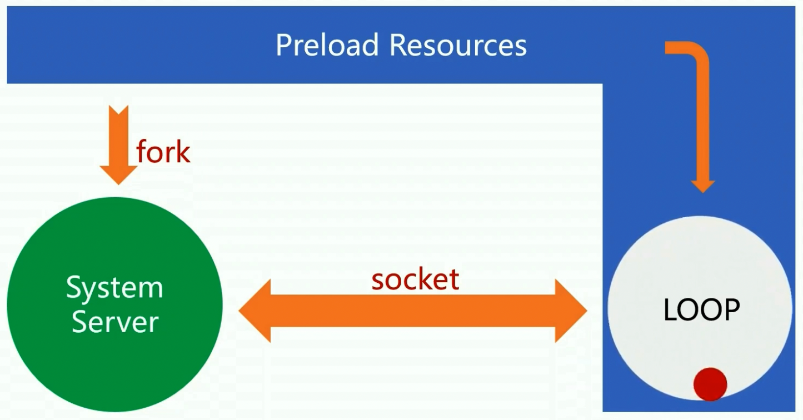
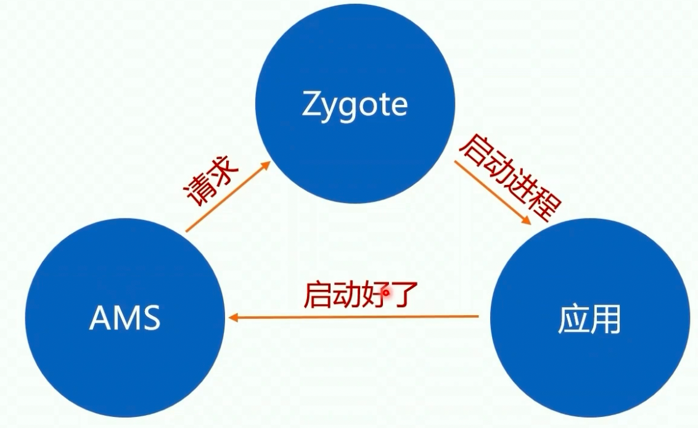
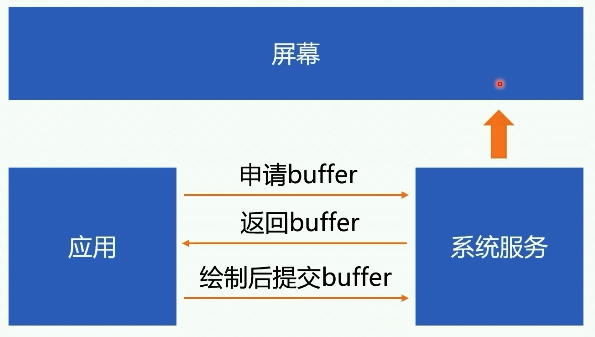
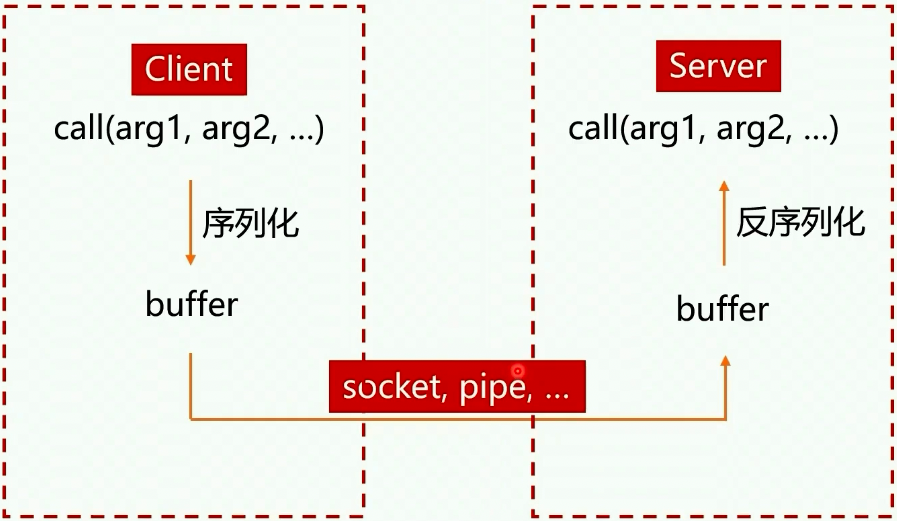
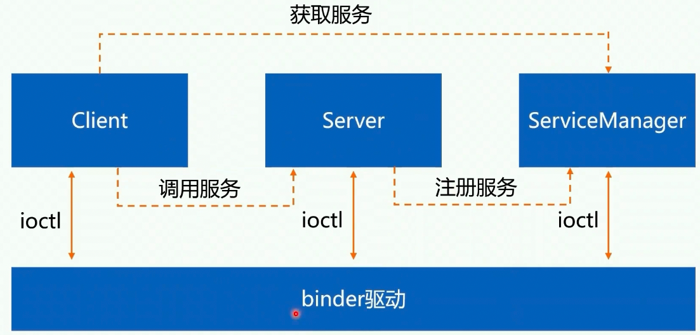
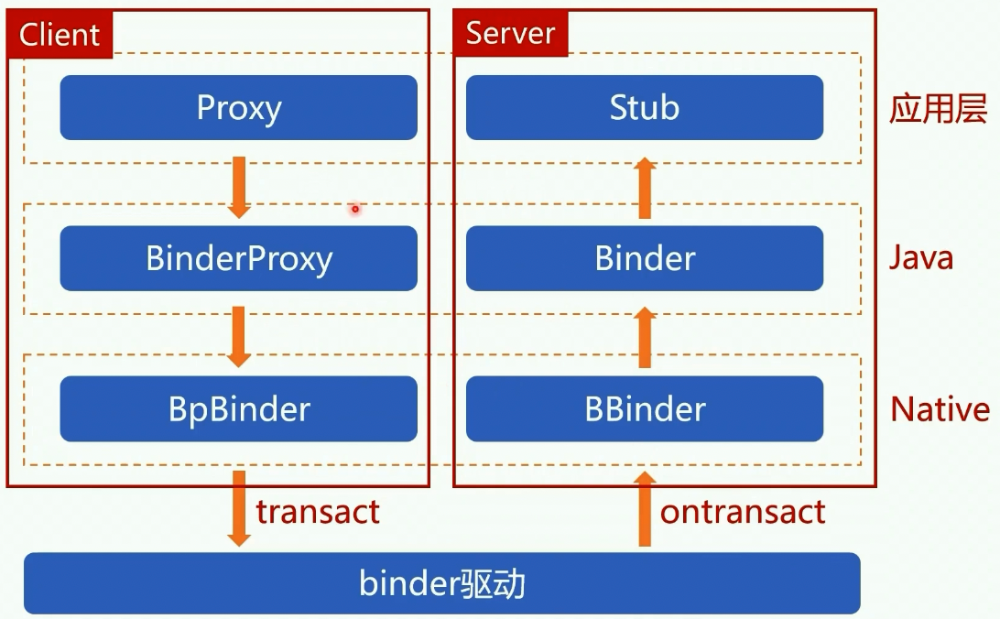
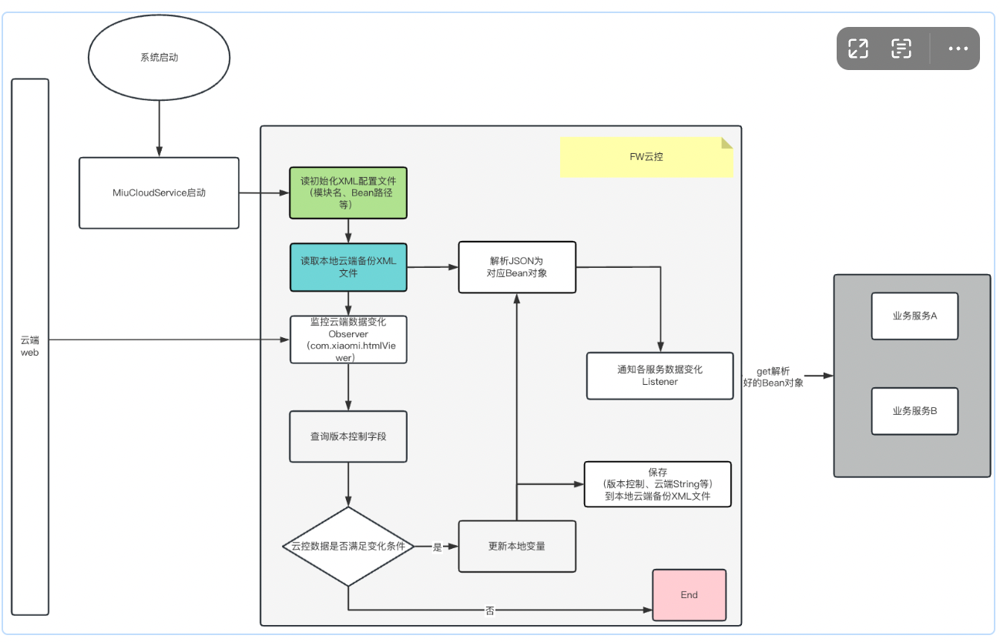

## 一、系统服务

### 1.Zygote的作用是什么？

启动SystemServer、孵化应用进程

自身进入loop,等待Socket信息；

### 2. zygote的启动流程：

Init进程解析了init.rc后启动的Zygote进程，

Zygote 启动Android虚拟机->注册Android的JNI函数->进入Java世界

> Zygote fork要单线程
>
> Zygote的IPC没有使用binder，用的是Socket

问题：

**孵化应用这种事为什么不交给SystemServer，而专门设计一个Zygote?**

将应用孵化的任务交给专门的Zygote进程，可以更好地隔离应用创建过程中的异常情况，从而提高系统的稳定性。

**Zygote的IPC机制为什么不采用binder，采用binder会有什么问题？**

性能考量，Unix域套接字性能更好，zygote主要任务是创建新的应用进程，不需要执行与启动进程之间负载的跨进程通信。

### 3.说一说Android系统的启动

> https://juejin.cn/post/6969141197596000263

Android有哪些主需要的系统进程：

启动配置文件init.rc中定义了要启动的系统进程，zygote、servicemanager、SurfaceFlinger

SystemServer怎么启动：

zygoteInit进程fork了system_server,通过反射创建com.android.server.SystemServer类对象并执行main函数，启动SystemServer，System创建主线程Looper,创建系统上下文，创建SystemServiceManager,用于后续启动AMS、PMS

怎么解决系统服务启动的相互依赖：

分批启动、分阶段启动

进程启动之后做了哪些事：

systemReady会调用startHomeActivityLocked，在PMS中查询用户已经安装的应用列表显示在launcher中；

## 二、应用进程

### 进程启动方式

### 应用怎么启动Binder机制的

打开binder驱动 -> 映射内存，分配缓冲区 -> 注册binder线程 ->进入binder loop

应用进程的启动流程：

## 三、Activity原理

## 四、应用组件

## 五、UI体系（刷新机制、Vsync原理、WMS）

### 说一说Android的UI刷新机制

图形系统显示原理

丢帧的一般是什么原因引起的

## 六、Binder原理

## 七、线程通信

### AndroidFramework中用到了哪些常见的跨进程通信方式

管道、Socket、共享内存、信号，

**管道通信：**

半双工、单向，（一个管道要么只能读，要么只能写，数据的读/写是单向的，要想实现既能读又能写，就需要使用两个管道来完成）一般是在父子进程之间使用 （无名管道一般是在父进程fork子进程的过程中使用，有名管道可以在任意进程之间使用，但前提是两个进程都需要知道管道的名称）；

Native层Loop类用了管道，进程内通信也可以用；数据量不大的跨进程可以用；

**Socket通信**

全双工，既可以读又可以写；两个进程之间无需存在亲缘关系；

Zygote里面通过Socket来接受AMS的请求，用于启动应用进程；

**共享内存**

很快，不需要多次拷贝；

进程之间不需要存在亲缘关系，只需要拿到文件描述符即可，将其映射到两个进程的内存空间中；文件描述符可以跨进程传递；

在Android中涉及到图片的跨进程传递，是抵用共享内存实现的，比如MemoryFile这个类；

**信号**

单向的，只能带一个信号，不能带别的参数、知道进程pid就能发信号了，也可以一次给一群进程发信号；

杀进程使用的killProcess函数，`sendSignal(pid,SIGNAL_KILL)`就使用了信号机制；（除非是root权限，或者进程的UID相同才可以给进程发信号）

### 谈谈你对Binder的理解

binder是干嘛的？binder存在的意义是什么？binder的架构原理？

**binder是干嘛的？**

Client与Server可以在同一个进程也可以不在同一个进程；

**binder存在的意义是什么？**

性能：Socket和管道跨进程通信时需要内核做中转，存在两次数据拷贝，从应用层拷贝到内核，内核拷贝到应用层；而binder同时映射到内存和目标进程的用户空间（相当于一次拷贝）

方便易用：比普通的共享内存方案跟方便易用；

安全：Socket的IP地址都是开放的，命名管道也不安全；拿不到调用方可靠的身份信息；

**进程如何启用binder机制**

* 打开binder驱动，ServiceManager启动binder机制后进入loop循环，等待Client和Server请求；
* 内存映射，分配缓冲区
* 启动binder线程

### 一次完整的IPC通信机制

了解binder的整体架构原理

从角色维度: 分为Client、Server、Binder驱动

从分层维度：应用层、Framework（java、Native）、驱动层

了解应用和binder驱动的交互方式

了解IPC过程的通信协议

## 八、综合问题

