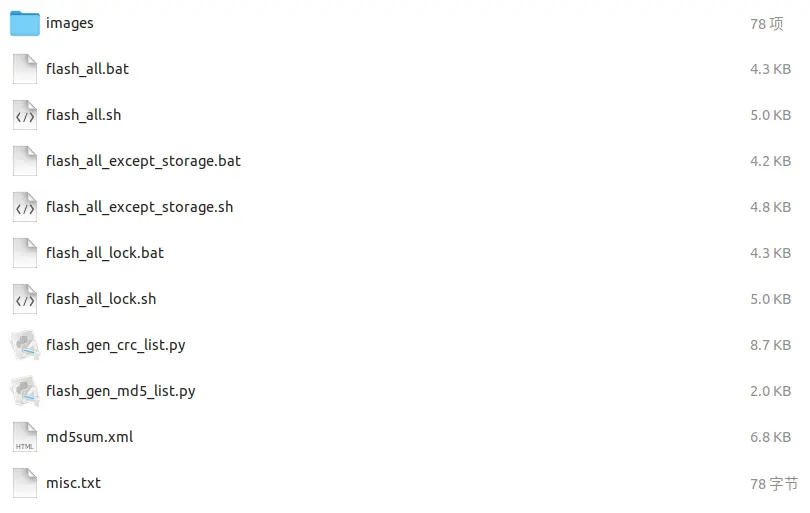

### 手机操作总结

### Windows平台如何安装adb

1. 从android官网下载adb工具包 [adb工具包Windows版本](https://developer.android.com/studio/releases/platform-tools?hl=zh-cn#downloads)

2. 解压到本地，并复制文件文件，添加到系统环境变量中；
3. USB连接手机设备，终端输入`adb devices`如果看到手机的device ID则说明adb安装成功。
```
PS C:\Users\swift> adb devices
List of devices attached
bd04384d        device
```
### android手机烧录系统的方法
1.在平台下载对应rom
2.解压文件

```
tar -xzvf 文件名.tgz
```


> 对应脚本文件解释：
> sh文件为Linux下脚本，bat文件为Windows中执行的脚本；
> flash_all表示刷机并清除全部数据；flash_all_except_storage表示保留用户数据（app、相册）、flash_all_lock表示刷机并上锁手机

3. 通过重启bootloader打开fastboot
```
adb reboot bootloader
```

4. 执行烧录脚本
```
./flash_all_except_storage.sh
```

### adb常用命令

查看当前界面的Activity

```shell
adb shell dumpsys activity top | grep ACTIVITY
# 或者
adb shell dumpsys window windows | grep mObscuringWindow
```

启动对应的Activity

```shell
adb shell am start -n Activity全称
```

### 常用工具推荐

抓取Android屏幕的工具：[scrcpyls](https://github.com/Genymobile/scrcpyls)
