### 前言
以机智云自动生成的Android项目为例，我们如何正确导入到Android Studio中，编译通过并在真机上运行。
### 下载项目
在机智云官网，我们定义好数据点后，在服务->应用开发子菜单中，下载工程文件。
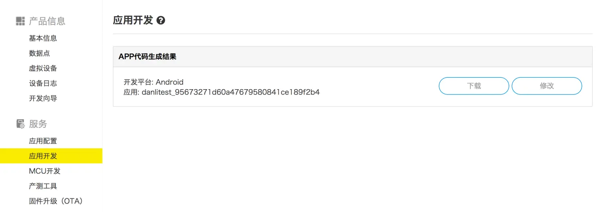

### 方法

>由于本地环境与开源工程文件中不同，理论上我们把开源工程文件中的环境修改成和我们本地相同的就可以顺利导入了。

为了正确修改开源工程配置文件，我们可以新建一个本地工程文件夹，对照参考。
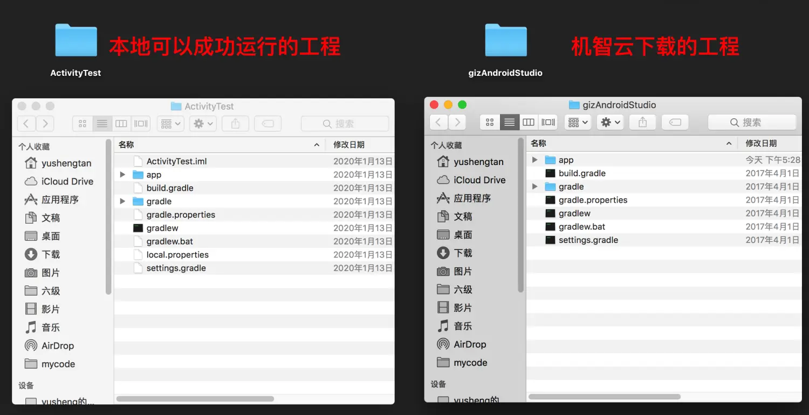

第一步：修改根目录下的build.gradle文件
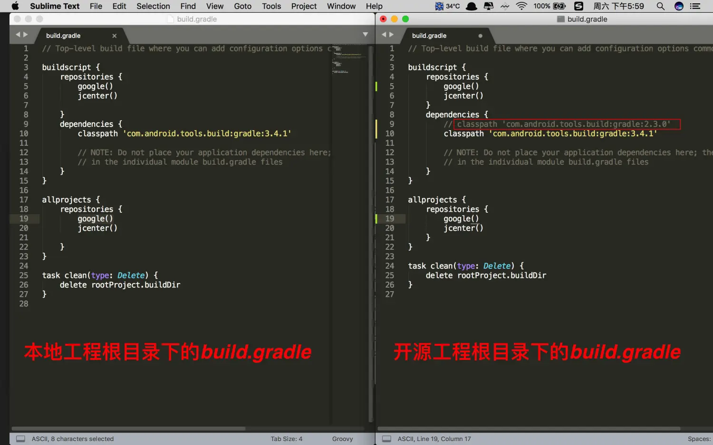
将开源工程项目中的build.gradle与本地工程保持一致。
第二步：修改gradle/wrapper文件夹里gradle-wrapper.properties配置文件
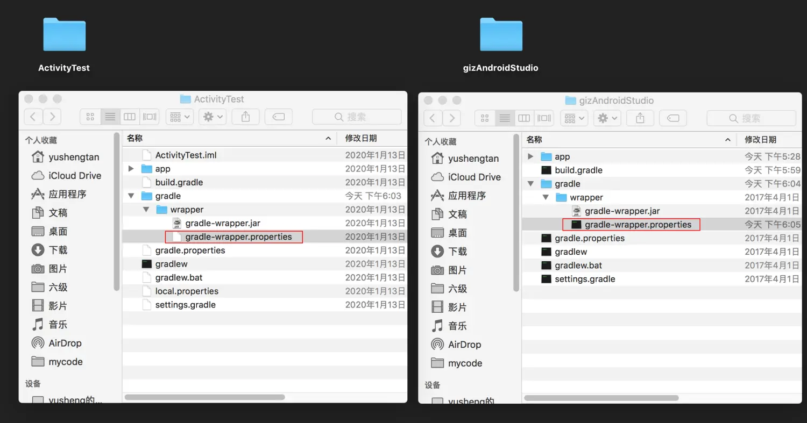
将distributionUrl中的gradle版本保持与本地项目一致；

第三步：我们再修改app目录下的build.gradle文件，这时候开源项目与我们的本地项目区别就有点大了，我们只需择其重点进行修改
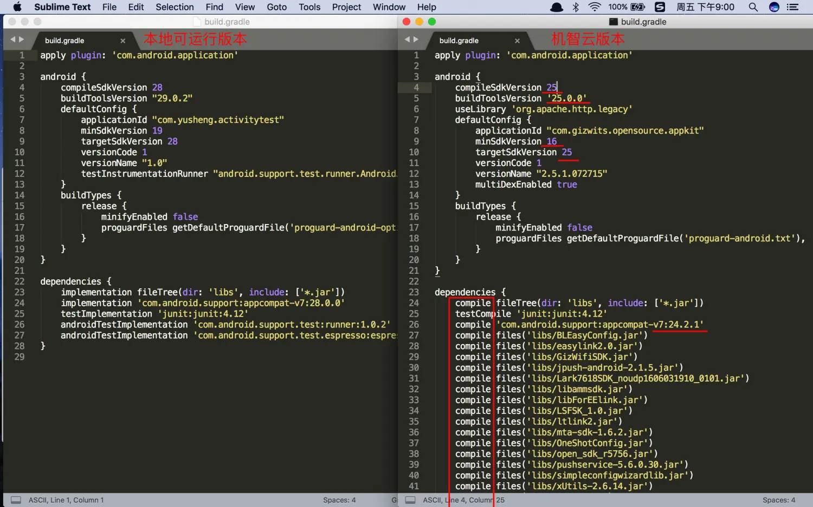
将机智云版本的`compileSdkVersion`,`buildToolsVersion`,`minSdkVersion`,`targetSdkVersion`与本地保持一致；
因为从2018年底开始Android已经抛弃了`compile`，所以这里我们需要将`compile`换成`implementation`，同时将`com.android.support:design`，`com.android.support:appcompat`换成与本地版本相一致的28.0.0版本
修改之后的版本：

第四步：打开AndroidStudio修改
基本的配置参数已经修改的差不多了，这时我们导入项目试一试，打开Android Studio欢迎界面，点击Open an existing Android Studio project；
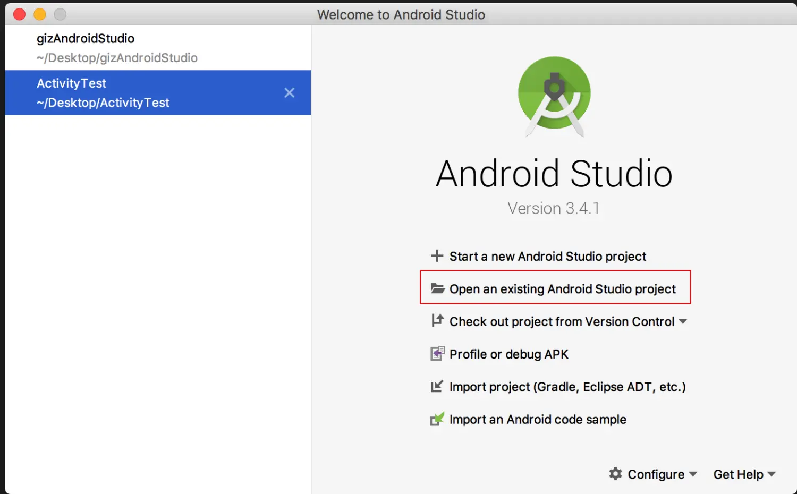
在工程界面工具栏，点击编译按钮，这时候还会报一些小错误，比如：
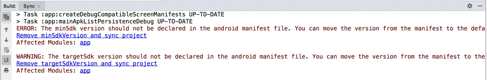
这里表示最小开发版本不需要在清单文件中解释，我们只需点击蓝色下划线，跳转到如下界面。
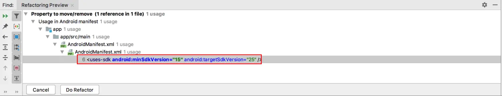
点击方框内容，打开清单文件
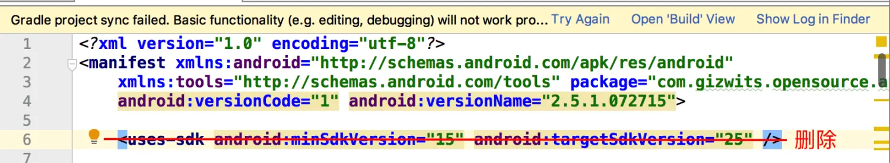
删除改行，再Try Again重新同步一下gradle工程，
再点击小锤子重新编译一下工程，此时会报如下错误：
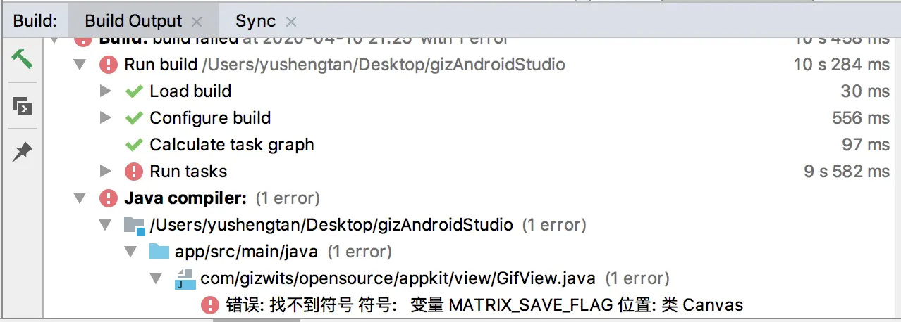
这里报错（找不到符号变量`MAXRIX_SAVE_FLAG`)
这是因为我们的sdk版本较高，新的sdk已经对之前老版本里的方法进行了修改，调用`canvas.save(Canvas.CLIP_SAVE_FLAG)`;方法编译器报错，我们只需要`save()`方法里的参数删除即可，直接调用`canvas.save()`方法就编译通过了。
此时，我们的APP已经可以运行了！
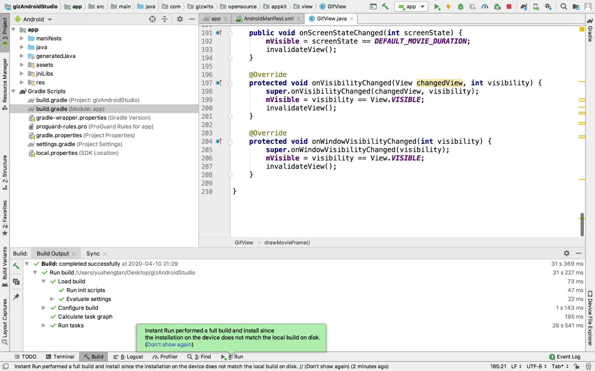