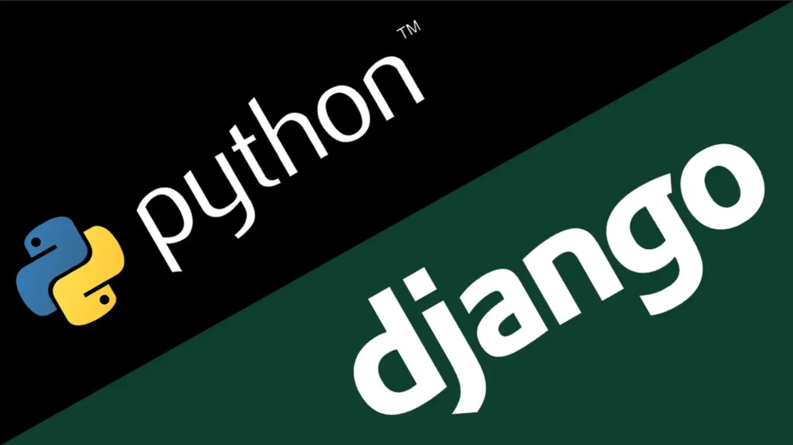
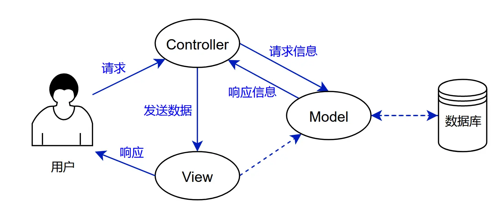
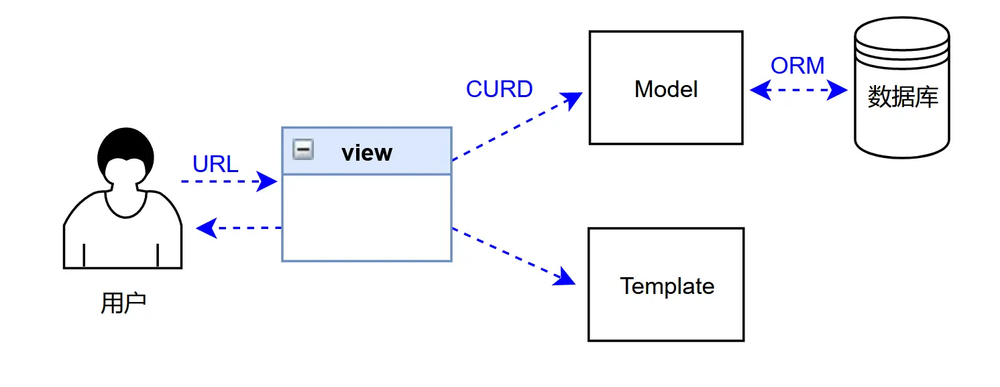
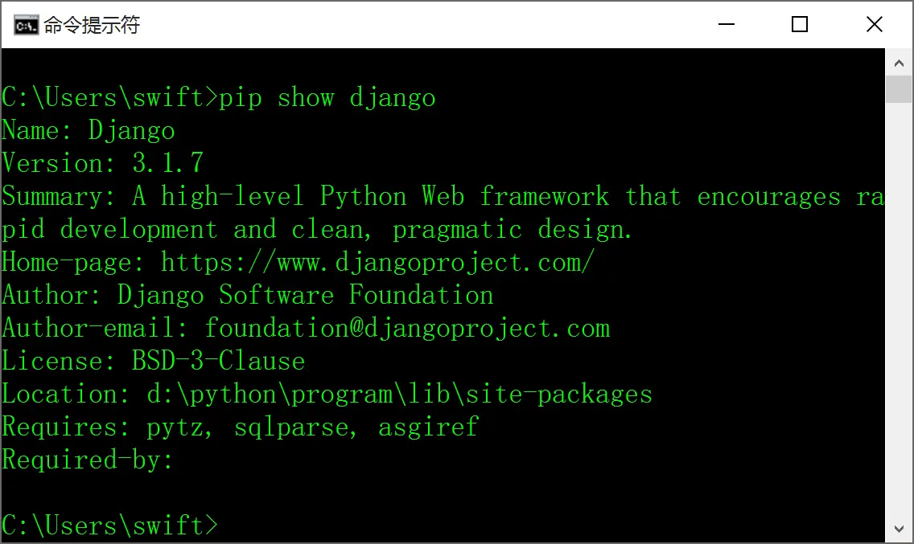
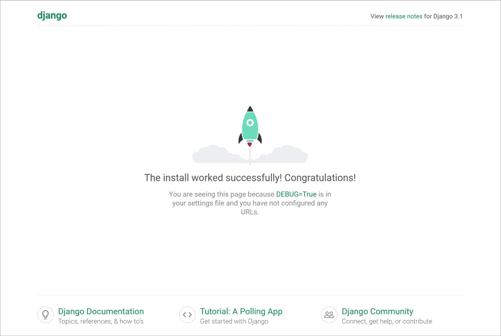
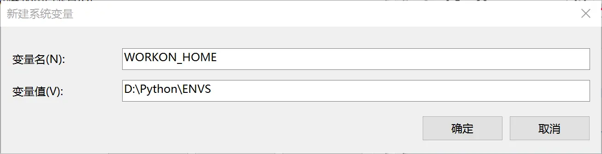
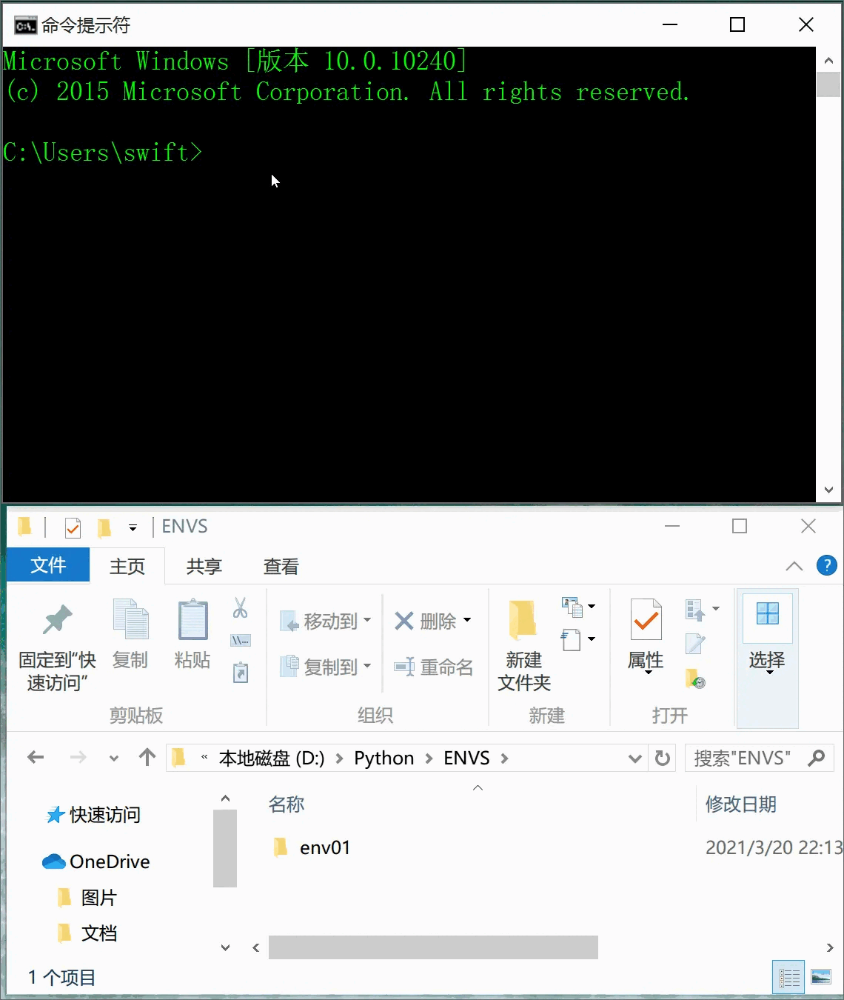
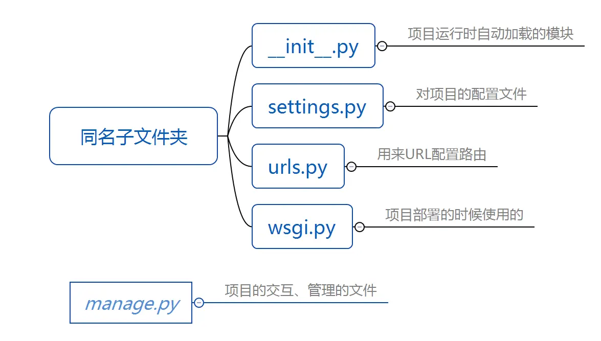

### 前言
Django是一个开放源代码的Web应用框架，由Python写成。采用了MTV的框架模式，从这一节开始，我们逐步讲解django的基础知识。
### 一、关于Django
##### 1. web应用程序
现在在互联网上，我们随便打开一个网站，基本上它都是一个web应用程序。如果我们要知道想要开发一个Web应用程序需要做哪些事情呢？

* 接收request请求
* url处理
* 业务逻辑处理
* 数据库访问
* 前端HTML页面加载
* 填充页面的数据
* 页面的response

这么多复杂的功能，如果从零开始做的话，工作量太可怕了。不过不用担心，我们可以用web框架，现行的web框架有很多，它们把我们需要的基础设施都建设好了，我们只需要在此基础上进行添砖加瓦就可以了。
###### 2. 什么是web框架
对于Web开发这种复杂的工作，把这些工作模块化，实现相应工作运行独立性和层次性。这个就是web框架在做的事情。

### 二、MVC和MVT
##### 1. MVC
目前大部分的Web框架都遵循MVC标准，全名是Model View Controller,是Web开发的通用标准，它实现了业务逻辑、数据、界面的分离。
MVC:(Model-View-Controller)传统的Web开发的标准设计模型；

* **model**：主要封装对数据库层的访问，对数据库中的数据进行增删改查操作。
* **view**: 用于封装结果，生产页面展示的html内容
* **controller**: 用于接收请求，处理业务逻辑，与Model和View交互，返回结果。



##### 2.MVT
django采用的就是MVT模式；
MVT:(Model-View-Template)基于传统MVC的djangoMVT框架。


* **Model**：与MVC中M的功能相同，负责和数据库交互，进行数据处理。
* **View**：与MVC 中的C功能相同，接收请求，进行业务处理，返回应答
* **Template**：与MVC中V的功能相同，负责封装构造要返回的html

response返回三种场景：纯文本、静态页面、动态页面。

### 三、Django环境部署
这里我们讲解如何在python环境中安装django模块。
首先你要清楚，在默认情况下，安装完python后并没有安装Django包，如果想要使用django则需要手工安装。
##### 1. 查看django是否安装
首先查看一下当前的计算机有没有安装django，在windows下打开cmd,输入命令：
```
pip show django
```
如果没有安装，会没有显示结果。如果安装了则返回当前django的安装版本、协议等一系列信息。


##### 2. pip工具
为了更好的管理python中的包，我们不得不介绍一下强大的python包管理工具pip。它提供对python查找、下载、安装、卸载的功能。

* 查找 `pip search Django`
* 安装 `pip install Django`
* 查看 `pip show Django`
* 卸载 `pip uninstall Django`
* 查看列表 `pip list`

> 我的mac的python版本是3.8，使用pip安装不了django3.2,只能安装3.1版本的Django

安装指定版本的Django，可以使用命令：
```
pip install django==3.1
```

##### 3. 运行django
使用pycharm创建一个django项目后，在Terminal输入命令
```
python manage.py runserver
```
即可启动服务器，打开本地`http://127.0.0.1:8000/`即可看到起飞的小火箭



说明你的django已经安装完成并成功启动了！

注意事项：
如果运行不了，看到系统报错：
```
NameError: name 'os' is not defined
```
我们只需要在`setting.py`开头加上`import os`即可。
### 四、Django虚拟环境部署
##### 1. Django版本与Python版本的对应关系
首先我们要注意django版本与python版本的对应关系，因为有时候你的django跑不起来，可能是因为与你的python版本不适配。

| Django版本 |       Python版本        |
| :--------: | :---------------------: |
|    1.8     | 2.7, 3.2, 3.3, 3.4, 3.5 |
|  1.9,1.10  |      2.7, 3.4, 3.5      |
|    1.11    |   2.7, 3.4, 3.5, 3.6    |
|    2.0     |        3.5, 3.6         |
|    2.1     |      3.5, 3.6, 3.7      |
|    2.2     |     3.5,  3.6, 3.7      |
|    3.0     |      3.6, 3.7, 3.8      |

由于在一台计算机上只能安装一个django的版本，但是如果现在开发两个项目，一个要用django2.1，一个要使用django1.11那该怎么办呢？

##### 解决办法：
在一台计算机上可以通过部署虚拟环境实现运行多个版本Django框架。
##### 2. 安装虚拟环境
在windows下使用命令
```
pip install virtualenvwrapper-win
```
即可自动安装上`virtualenv`和`virtualenvwrapper-win`两个模块。
如果是在Linux环境下则可以使用命令
```
pip install virtualenv
```
##### 3. 创建虚拟环境
使用命令
```
mkvirtualenv env01
```
即可创建一个叫`env01`的虚拟环境。此时会在当前目录下创建一个`Envs\env01`的文件夹，准备了一套完整的python运行环境。
如果要退出当前虚拟环境，只需要使用命令`deactivate`即可。
##### 4. 在指定位置创建虚拟环境
由于我们创建的虚拟环境的位置在用户目录下，其实我们最好还是把虚拟环境文件夹放在python的安装目录下比较好。比如这里我们设置为`D:\Python\ENVS`，那么就要新建系统环境变量，变量名称为`WORKON_HOME`变量值为`D:\Python\ENVS`

保存后，重新打开cmd控制台，使用`mkvirtualenv`创建虚拟环境就会自动创建在我们指定的位置下了。


##### 5. 指定某个虚拟环境的django版本

如果我们要指定虚拟环境env02的django版本是2.1，我们只需要使用命令
```
pip install django==2.1
```
顺便说一下，如果想进入指定的虚拟环境，则使用`workon 虚拟环境名称`

### 五、创建第一个Django项目
##### 1. 创建项目

在pycharm中创建完django项目后，会生成项目名称同名文件夹，里面存储了了项目所有的文件。
与此同时在项目文件夹下还有一个相同名称的子文件夹，包含如下四个文件：

我们也可以通过命令行的方式创建django项目，进入指定目录下使用命令：

```
django-admin.py startproject 项目名称
```
创建一个django项目，但是我们要知道创建项目仅仅是完成了项目的容器，并没有MVT的架构，而真正的web应用应该放在一个app文件夹中。
##### 2.创建项目中的App文件夹
如何创建一个django的app文件夹，在项目文件夹下使用命令：
```
python manage.py startapp app名称
```
该项目中便会自动创建出一个app文件夹，
当然在命令行中也可以使用：
```
django-admin.py startapp app名称
```
这两种创建app文件夹的方式都可以。

### 最后
这一节，我们介绍了django最基础的入门知识，下一节，我们逐步走进django的MVT结构。