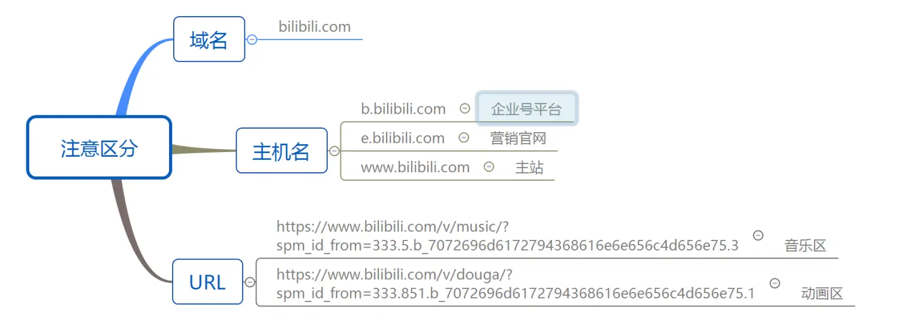
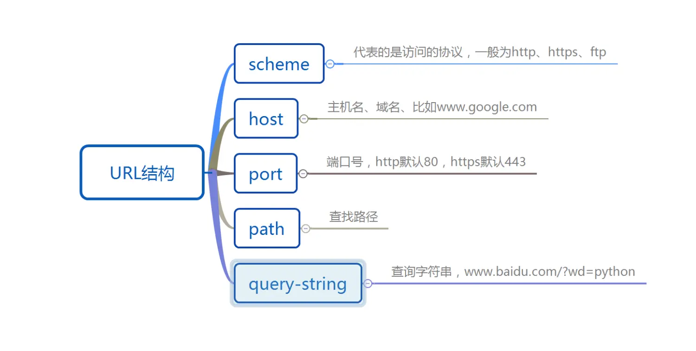
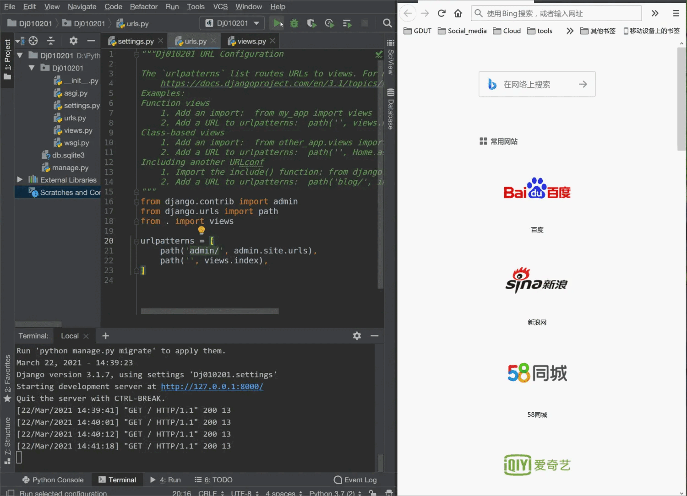
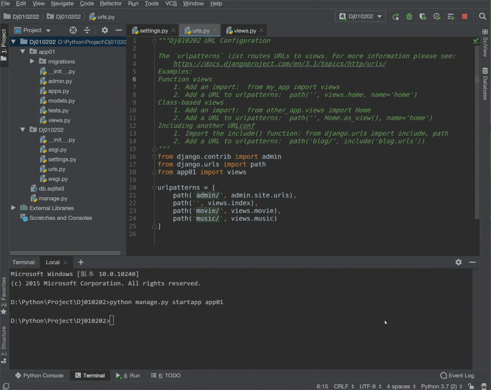
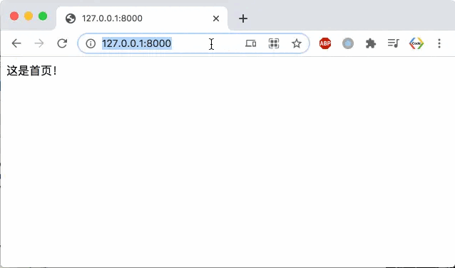
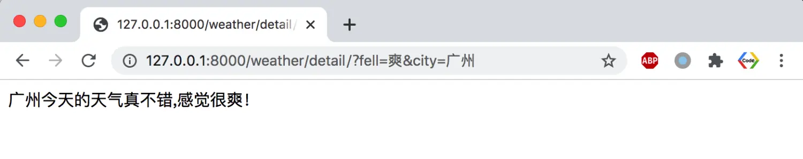
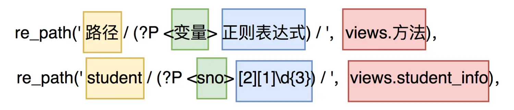
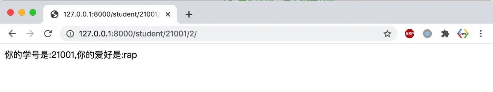

### 前言
大家好，我是小雨。
这一节我们继续介绍Django的知识，我们知道
URL是web访问的第一步，当用户对服务器有一个http请求的时候，Django开始响应URL路由，校验这个URL是否存在，如果存在，定位到Views里的某一个方法或者函数；如果不存在，返回404页面。这一节，我们就重点介绍Django中URL的知识。
### 一、了解URL
##### 1. 注意区分域名、主机名、URL
URL全称（uniform resource locator）同意资源定位系统，是获取Internet资源的标准路径。我们经常容易搞混的三个概念域名、主机名、URL，就以短视频平台bilibili为例，大家可以看一下域名、主机、URL的区别：

主机名包含了域名，可能不同的主机名分别对应了不同的IP地址，URL包含了协议、主机名或ip地址等其它内容，而我们的域名、主机名只是其中的一部分。

##### 2. URL的结构
标准的URL结构为：
```
scheme://host:port/path/?query-string=xxx
```


##### 3.网站多主机与多路径的使用
当一个网站比较大的时候，每一个模块就是一个独立的网站，每一个子模块都对应着独立的服务器。像优酷就是这种类型，电影模块、电视剧模块、动漫模块都分别部署在独立的主机上。
但是，当一个网站不是很大的时候，如果同样想要具备多个模块，每个模块只能是网站根目录下的子文件夹，让所有的模块都共享一个服务器，我们这里的URL路由就是主要针对这种情况来使用的。

### 二、URL路由的基本使用
##### 1. Web请求的过程
（1）客户端对服务器有一个HttpRequest请求；
（2）服务器把数据使用http封装并返回HttpResponse。

##### 2. URL路由的工作流程：
web服务器根据用户访问的URL在URL列表中进行匹配，如果匹配上了，则区执行相应的Views中方法，如果匹配不上则返回404错误。
当我们创建了一个Django项目的时候，首先需要了解的是项目同名子文件夹下的`urls.py`,
```
urlpatterns = [
    path('admin/', admin.site.urls),
]
```
列表中的每一个path由两部分组成：`路径`和`相应views里的函数`。


### 三、URL路由基本案例
##### 1.同目录下创建views
如果我们在当前目录下新建一个views.py的文件，定义一个index方法，用来返回字符串。
```
from django.http import HttpResponse
def index(request):
    return HttpResponse("这是首页!")
```
在urls.py中将views里的index方法添加的URL中，我们只需要添加一个这样的路径：
```
from . import views  # 表示在当前文件夹下导入views模块
path('',views.index)  # 路径写空表示直接用主机名就可以访问
```
效果演示：


> 如果使用Pycharm开发Django，项目只要启动一次后，再修改代码，修改后Web内容会同步变化，不需要手动重启Django

##### 2. URL路由结合app的基本使用
标准的做法views应该要放在app文件夹中，创建app文件夹可以使用终端命令：
```
python manage.py startapp app01
```
这样就会在根目录下创建一个叫app01的文件夹，里面自动包含了`models`、`views`等文件。
与上面在同一个文件夹中创建`views`相比，我们唯一的不同就是导入`views`时，声明app01这个文件夹就可以了:
```
from app01 import views
```
##### 3. 修改Django默认端口
http服务默认使用80端口，Django为了防止与当前主机上可能存在的80端口发生冲突使用了8000端口，如果当前主机上没有80端口占用的话，怎么修改当前项目为8000端口呢？
实际上，我们点击`Edit Configurations...`按钮就可以修改默认端口。

当我们修改成80端口后，点击运行按钮之后。在浏览器地址栏中直接输入主机ip地址就能访问了，就不需要再添加端口号了。但是如果使用命令`python manage.py runserver`开启服务器，默认打开的还是8000端口，这里需要我们手动声明ip和端口号，命令要写成`python manage.py runserver 127.0.0.1:80`，这样就成功了。

##### 4. 访问局域网或者虚拟机里的Django服务器
如果局域网或者虚拟机中某台主机运行了Django服务，我们想通过ip地址访问它。需要做哪些配置呢？
（1）在settings.py里，`ALLOWED_HOSTS = ['*']`,放行所有主机名。
（2）在命令行启动Django服务的时候使用`sudo python manage.py runserver 0.0.0.0:80`
（3）访问虚拟机的服务注意使用NAT模式便于宿主机访问虚拟机ip


### 四、使用URL传值
##### 1. 使用场景
我们发现很多网站的某个页面的URL末尾都有一段字符串，不同的页面URL后的字符串值都不一样。同时我们可以根据这个指定的URL值访问到对应的网页内容。我们是否可以这样认为，我们是通过URL传值给服务器，让服务器做出相应的反馈。那么Django是如何实现这样的一个过程的呢？
##### 2. 需求
我们想要实现这样的功能，在浏览器地址栏输入`主机名:movie`，回车后服务器返回`电影主页`；当在地址栏输入`主机名:movie/1234`，服务器返回`马上播放电影的编号为:1234`。当然，这里的`1234`，我可以替换为任意字符串。
##### 3. 实现
我们可以在views.py中定义movie方法:
```
from django.http import HttpResponse
def movie(request):
    return HttpResponse("电影主页！")
```
接着在urls.py中添加utls.py中把movie页面加进来：
```
path('movie/', views.movie),
```
这样就实现了电影主页的显示。如果想让字符串也传进来的话，我们定义一个movie_detail方法：
```
def movie_detail(request,movie_id):
    return HttpResponse("马上播放的电影编号为:%s" % movie_id)
```
urls.py中添加
```
path('movie/<movie_id>/', views.movie_detail),
```
这里的一对尖括号表明了我们可以传入一个任意字符串，如果要把传入的值限定为整型数字，可以写成`<int:movie_id>`，这样就限定了传入的类型。
##### 4. 效果演示


### 五、使用查询字符串传值
##### 1. 使用场景
我们在使用百度检索关键词python时，观察一下URL前面部分的内容为
```
https://www.baidu.com/s?wd=python
```
这里的要检索内容`python`通过网页中的输入框传给URL中的`wd`关键字。Django框架也能实现类似的功能，该怎么实现呢？
##### 2.使用方法
这里我们以查询某个城市的天气状况为例，`city`用来接收城市名，`fell`用来接收感觉状况信息。
在views.py中，定义一个search_forecast方法，通过`request.GET`获取URL中的关键字。
```
def search_forecast(request):
    weather_city = request.GET.get("city")
    fell_city = request.GET.get("fell")
    return HttpResponse(" %s今天的天气真不错,感觉很%s！" % (weather_city,fell_city))
```
然后把路径加入到urls.py中，
```
path('weather/detail/', views.search_forecast),
```
这样我们在URL中传入关键字的值，Django框架就会获取关键字的值并反馈到页面中来。
> 注意：多个关键字在URL中通过`&`进行分隔
##### 3. 效果演示


### 六、使用正则表达式判断URL路径
我们知道path是URL中主机名后面的路径，在地址栏输入后系统会对其进行校验，如果匹配，则执行views里对应的函数，
re_path是一个使用正则表达式来校验URL路径的模块。
##### 1. 使用场景
我们希望输入的路径中含有学号sno和爱好hobby，学号使用正则表达式限定格式为21开头的5位数字；爱好为数字0-3的编号之一。
##### 2. 实现过程
如果要使用正则表达式校验路径，需要导入`re_path`模块
```
from django.urls import re_path
```
我们先在views中定义显示反馈网页内容的方法`student_info`:
```
def student_info(request,sno,hobby):
    hobby_kind = ['唱','跳','rap','篮球']
    return HttpResponse("你的学号是:%s,你的爱好是:%s" % (sno,hobby_kind[int(hobby)]))
```
然后在urls.py中添加校验路径的元素：
```
re_path('student/(?P<sno>[2][1]\d{3})/(?P<hobby>[0-3])/',app01_views.student_num),
```
注意校验的的格式是


##### 3.效果演示


### 最后
本节我们介绍了Django框架里URL的知识，介绍了URL的构成、URL传值、URL查询字符串传值、URL正则表达式判断合法性后传值。大家最好自己动手实际操作一遍以便更好的理解。下一讲，我们继续介绍Django Templates的知识。感谢大家的阅读！