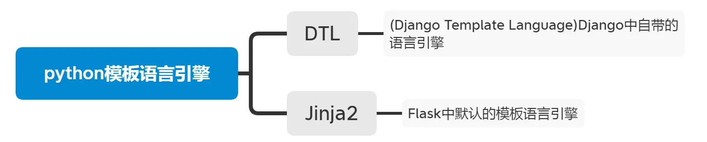
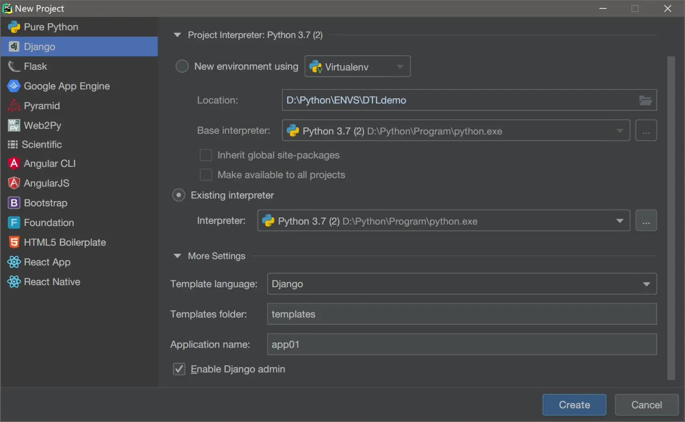
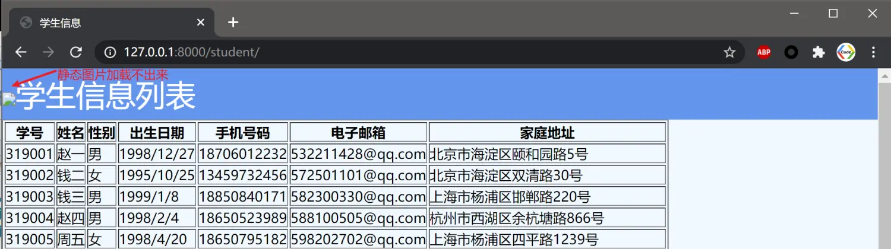
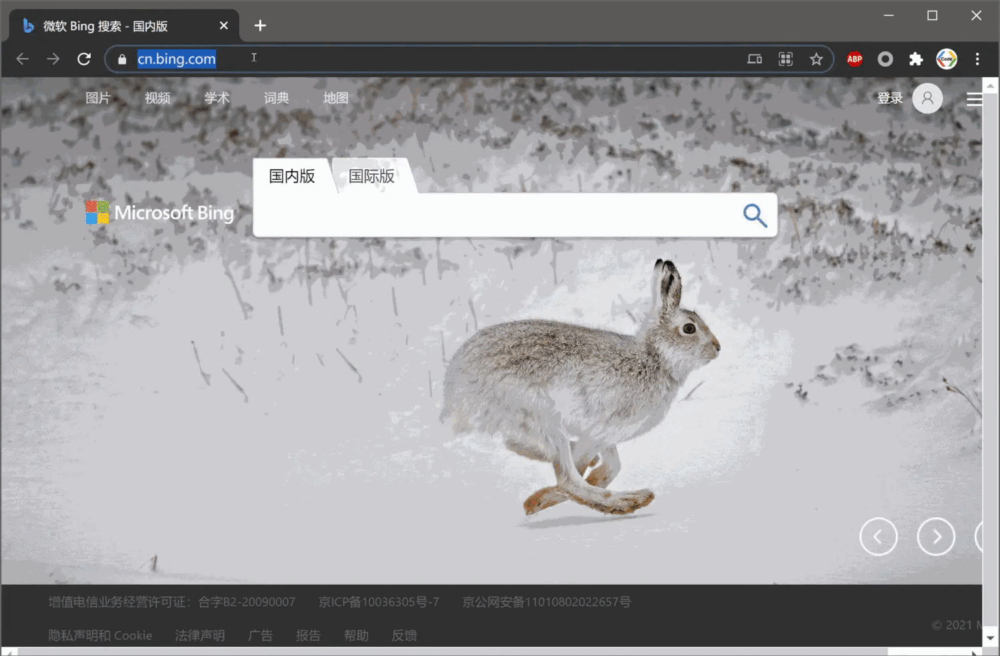
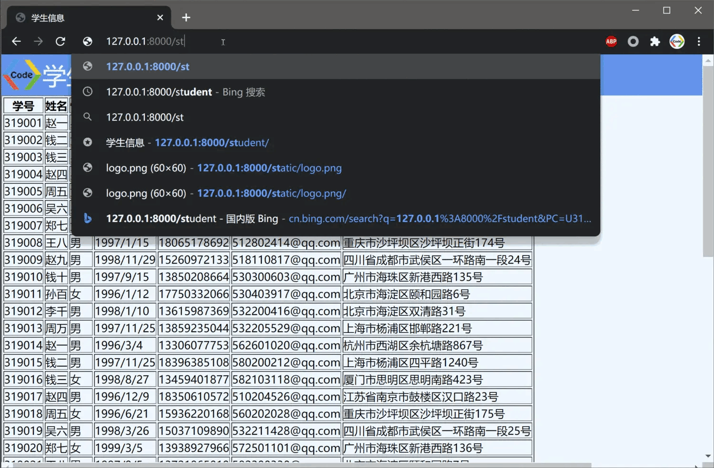
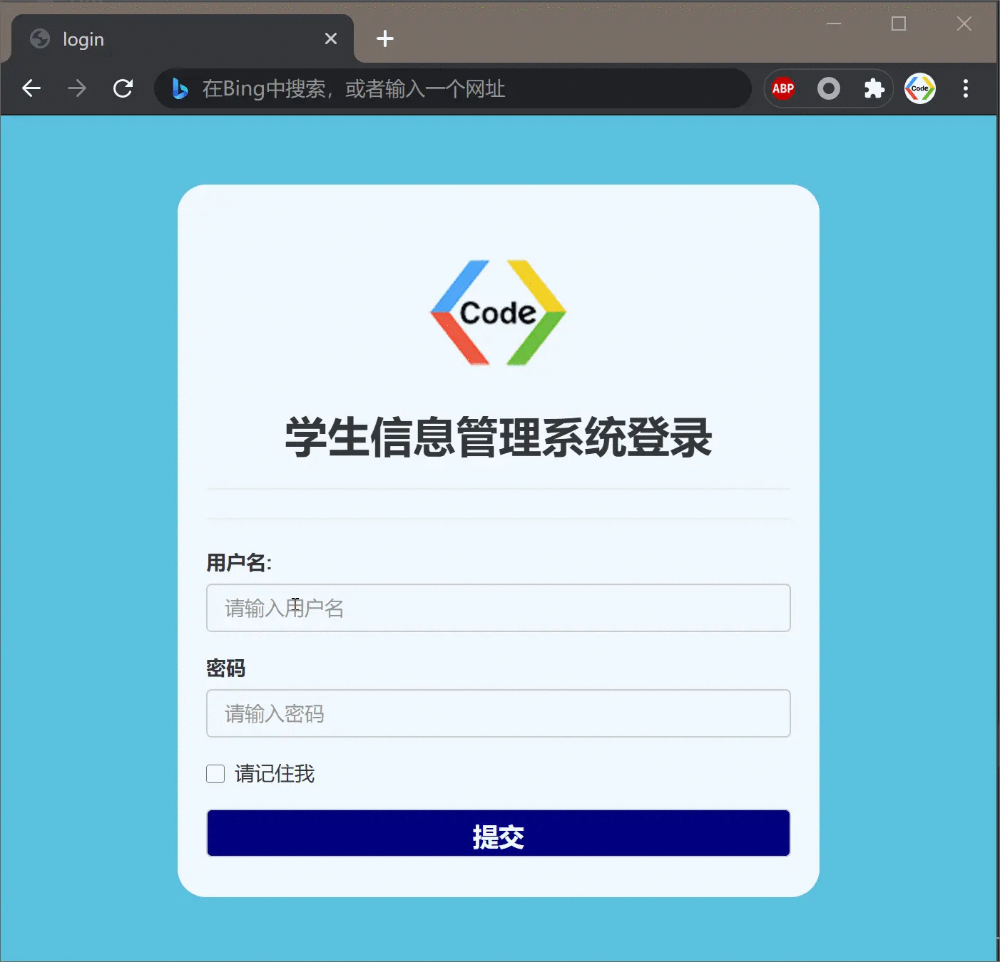

### 前言
大家好，我是小雨！
这一节，要介绍的知识点是Django中的Templates,它也是MVT结构中的T，Templates可以叫它模板。Templates究竟用来做什么，通过这一节的介绍，希望大家有一个基本的了解。
### 一、Templates模板
在上一节当中，我们在浏览器中看到的是HTTPResponse返回的字符串，而这一节我们讲的templates最直接的功能是把前端的html页面显示出来，这样用户就能看到清晰美观的界面。那么Django是如何加载html网页的呢？下面介绍两种方式：
##### 1.使用render_to_string加载html

我们提前准备好一个html页面`index.html`，然后为了方便views中能成功访问到这个`index.html`，需要在`settings.py`中将`templates`文件夹的路径声明清楚。在TEMPLATES列表字典的`DIRS`属性下添加一下内容：
```
os.path.join(BASE_DIR, 'templates')  # 如果缺少os模块记得导入
```
render_to_string的使用方法：
先使用`from django.templates.loader import render_to_string`导入模块，然后给render_to_string传入html文件后，最后将其以HttpResponse的方式返回出去即可。
```python
from django.http import HttpResponse
from django.templates.loader import render_to_string

def index(request):
    html = render_to_string("index.html")
    return HttpResponse(html)
```
##### 2. 使用render加载html
这里我们需要从`django.shortcut`导入render模块，一般情况下Django会默认导入这个模块,views中如果没有的话就手动导入一下：
```python
from django.shortcut import render
```
接着render中传入html文件，记得添加request参数，然后使用return返回render即可：
```python
def index(request):
    return render(request,'index.html')
```
最后记得在urls.py中将路径对应的views.index添加进来就可以了。
### 二、模板语言的基本使用
我们要知道templates作为MVT架构中的T，不仅仅是加载前端中的页面，它还包含一种模板语言，能够在htmlL语言中实现逻辑控制（条件选择、循环），相对于JavaScript会更加的灵活。

接下来，我们就以一个简单的例子来介绍Django模板语言的使用。
##### 1.功能需求分析
我们有一个存储学生信息的`Students.csv`文件，包含了学号、姓名、性别、手机号码、出生日期、电子邮箱等信息。
```
319001,赵一,男,1998/12/27,18706012232,532211428@qq.com,北京市海淀区颐和园路5号,342622199801144314,2019/9/1,计算机,赵一,13655512212
319002,钱二,女,1995/10/25,13459732456,572501101@qq.com,北京市海淀区双清路30号,342622199709066819,2019/9/1,物联网,王二,13856909992
```
> 这里数据其实有很多条，为例减少篇幅我们就罗列出两条。

现在需要将这些数据加载到前端的html页面中，通过tabel标签显示出来。
##### 2. 实现过程
（1）准备
首先用pycharm新建一个Django项目，为了方便使用直接把application和templates文件夹都建好。

在templates中新建一个index.html文件，写好用于显示学生信息的标题以及表格框架。

```html
<div id="title">学生信息列表</div>
<div id="table_main">
    <table border="1">
        <thead>
            <tr>
                <th>学号</th>
                <th>姓名</th>
                <th>性别</th>
                <th>出生日期</th>
                <th>手机号码</th>
                <th>电子邮箱</th>
                <th>家庭地址</th>
            </tr>
        </thead>
        <tbody>
        </tbody>
    </table>
</div>
```
（2）views设置
为了读取csv文件，写一个`read_form_file`方法，将文件中的信息存储在Students列表中。
```python
def read_from_file(path:str):
    students = []
    try:
        with open(path, mode="r", encoding="UTF-8") as fd:
            # 读取当前行
            current_line = fd.readline()
            # 判断当前行是否为空
            while current_line:
                temp_line = current_line.split(",")
                students.append(temp_line)
                current_line = fd.readline()
        return students
    except Exception as e:
        raise e
```
接下来，我们定义一个student方法，用来显示html内容给前端，这里面我们还是使用render将获取的数据传递给前端页面`index.html`。
> 注意使用context参数，它的值我们设置为一个字典，键设置为DTL模板语言中要引用的变量，值设置为本地获取的数据
```python
def student(request):
    students = read_from_file(r"D:\Python\Project\Demo\Student.csv")
    return render(request, "index.html", context={"all_student":students})
```
（3）DTL模板语言
在`index.html`中，表格内容的填充，我们通过DTL模板语言来完成。在HTML代码中要插入DTL模板语言，需要使用``，for语句还要使用``来结尾，在语句内部调用变量列表中的元素也是直接使用`变量名.数字`并且需要包裹两层大括号。这里我们以循环输出student列表中的各个元素为例，其DTL模板语言的写法如下：
```html
 
    <tr>
    <td>{{ student.0 }}</td>
    <td>{{ student.1 }}</td>
    <td>{{ student.2 }}</td>
    <td>{{ student.3 }}</td>
    <td>{{ student.4 }}</td>
    <td>{{ student.5 }}</td>
    <td>{{ student.6 }}</td>
    </tr>
 
```
（4）urls配置
接下来配置路由，添加student路径
```
path('student/',app01_views.student),
```
（5）运行效果
一切准备就绪后，执行`python manage.py runserver`，在浏览器中打开`127.0.0.1:8000/student`效果如下：


### 三、加载静态文件
##### 1. 什么是静态文件
不能与服务器做动态交互的文件叫静态文件；
对于HTML中的图片、视频、css、js这些都属于静态文件。Django对于这些文件有一套明确的管理机制。
如果我们只遵循HTML的规范去加载静态文件，在Django中是显示不出来的。


##### 2. 如何加载静态文件
为了解决这个问题，我们首先要确保配置文件settings.py中INSTALLED_APP下静态文件模块有被加载到：
```
'django.contrib.staticfiles',  # 必须确保安装静态模块
```
然后使用`STATICFILES_DIRS`这个全局变量来存储静态文件的路径。
```
STATICFILES_DIRS = [
    os.path.join(BASE.DIR, 'static'),
]
```
然后在html中开始加上模板语言，如果让html引用静态文件，那就需要先导入静态模块。在html语句第一行写上
```

```
对于要引用静态图片的标签路径使用``，如：
```

```
这样Django就能显示静态文件图片了。
##### 3. 显示效果


##### 4. 注意事项
一般情况下，static文件夹我们会放在`app`目录下。这时候访问静态文件，则需要在`STATICFILES_DIRS`的os.path.join参数中再多添加一个子文件夹名，可以写成：
```
STATICFILES_DIRS = [
    os.path.join(BASE.DIR, 'app01','static'),
]
```
##### 5. 直接访问静态文件
在Django配置的文件settings.py中有一个全局变量`STATIC_URL`，它定义了一个给外界用户直接访问静态文件的路径。
上面我们添加在标题中的logo.png，我们可以在浏览器中直接通过`127.0.0.1:8000/student/static/logo.png`来访问。


### 四、加载静态文件综合案例
为了更好地巩固Django加载静态文件的知识，我们做一个小案例。学生信息管理系统的登录页面。有显示图片logo，有用户名和密码的输入框，并且有提交按钮。当点击按钮时，会弹出提示表示登录成功。

这里简单说明一下：界面采用了Bootstrap框架，登录按钮的功能函数用了jQuery脚本。关于前端的知识我们这里就不做过多介绍了。
```html

<!DOCTYPE html>
<html lang="en">
<head>
    <meta charset="UTF-8">
    <title>login</title>
    <!--加载外部的CSS文件-->
    <link type="text/css" rel="stylesheet" href="">
    <link type="text/css" rel="stylesheet" href="">
    <!--加载外部的js文件-->
    <script src=""></script>
    <script src=""></script>
</head>
<body>
    <div class="container">
        <div id = "login">
            <form class="form">
                <h2></h2>
                <h2>学生信息管理系统登录</h2>
                <hr>
                <hr>
                <div class="form-group">
                    <label for="user">用户名:</label>
                    <input type="text" class="form-control" placeholder="请输入用户名" id="user">
                </div>
                <div class="form-group">
                    <label for="password">密码</label>
                    <input type="password" class="form-control" placeholder="请输入密码" id="password">
                </div>
                <div class="form-group">
                    <div class="checkbox">
                        <label>
                            <input type="checkbox">请记住我
                        </label>
                    </div>
                </div>
                <button id="submit01" class="form-control">提交</button>
            </form>
        </div>
    </div>
</body>
</html>
```
将以上html文件保存在templates中,在views中配置好方法，urls中配置好路由，最后在settings中配置好静态文件路径，最后启动Django服务器，页面显示效果如下：
##### 效果演示：


### 最后
本节，我们介绍了Django中templates的知识，Django加载HTML方法、模板的语言的使用，以及加载静态文件的方法。希望大家多多练习，才能巩固所学的知识。下一节我们将继续介绍Django中URL跳转的知识！