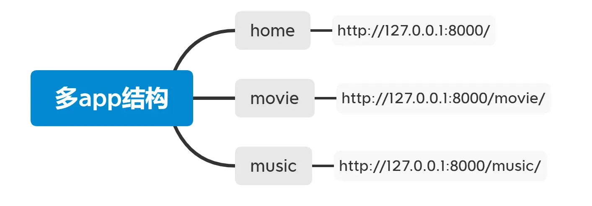
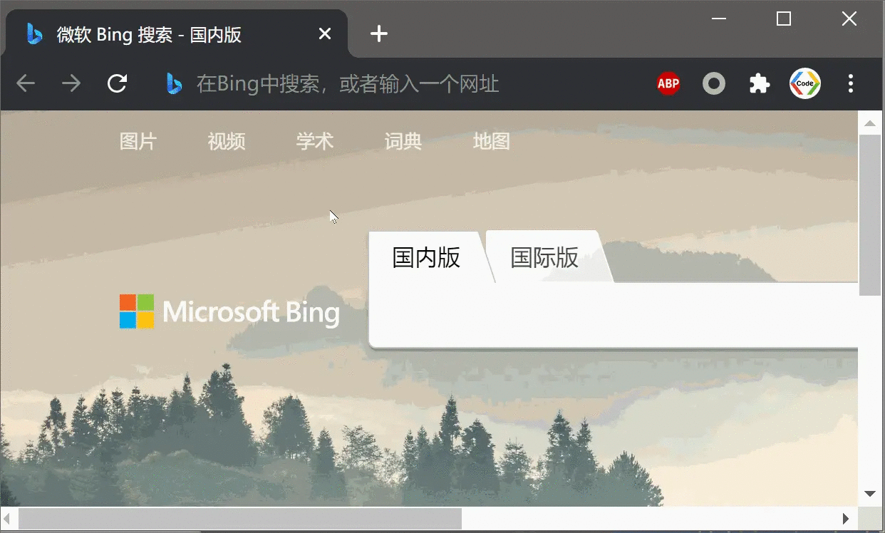
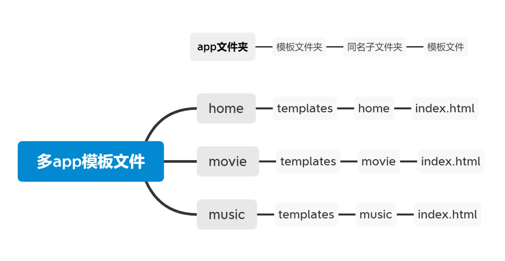
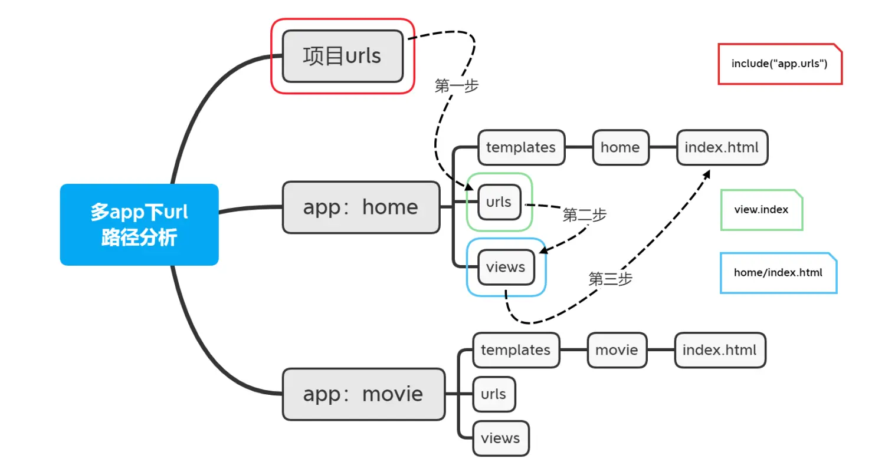
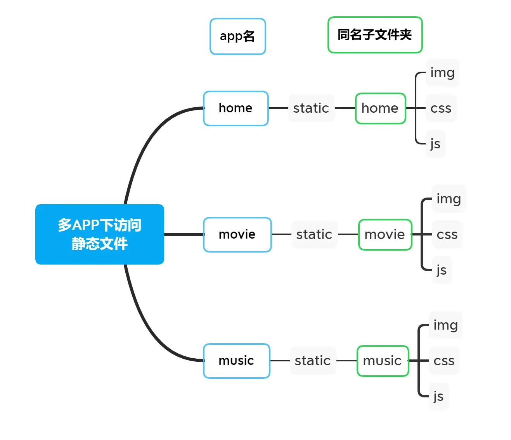

大家好，我是小雨。
上一节，我们了解了Django中如何加载html页面、介绍了模板语言DTL、以及静态文件的加载。现在页面已经能正常显示了，我们希望网页中的链接点击后能跳转到指定页面或者自动重定向该怎么做呢?于是我们今天将要介绍url跳转的知识。与此同时，实际的网站项目为了便于团队开发各个模块有各自独立的app，我们该怎么做让各个独立的app正常工作的同时也互不干扰呢？所以今天会向大家介绍一下Django中的多app环境的管理。
### 一、URL跳转
URL的跳转是什么呢？URL的跳转可以称为URL重定向，表示从一个HTML页面跳到另外一个页面。
URL跳转有两种途径：
##### 1. html的<a>标签跳转
把文本或者图放到a标签里，点击a标签跳转。在Django中需要注意的是：html里给`href`的值为指定路径名而不是整个包含后缀的html文件。
```
<li><a href="game/">游戏</a></li>
<li><a href="movie/">电影</a></li>
<li><a href="music/">音乐</a></li>
```
我们在首页定义三个超链接，分别指向三个页面

##### 效果演示：


##### 2. 通django跳转
满足一定条件自动跳转，常使用`redirect`关键字。某些网站如果你没有登录的话它会自动跳转到登录页面。
使用`redirect`方法进行重定向,首先需要导包：
```
from django.shortcuts import redirect
```
在views中定义登陆方法时，我们试着从url中获取用户名，如果用户名存在则访问首页，如果不存在则重定向至登陆页面，这个逻辑代码就可以这样写：
```
def index(request):
    username = request.GET.get("username")
    if username:
        return render(request, "index.html")
    else:
        return redirect("/login/")
```
这样就能实现的功能是：用户想访问首页，在没有登录的情况下会自动重定向至登录页面。但如果系统在url中获取到用户名，则打开首页。
##### 效果演示:


### 二、多app项目
在实际的开发过程中，为了减少相互之间的干扰，以及便于团队之间的同步开发，网站的每一个模块都部署在不同的app中。这里我们以B站为例，首页、电影、音乐分别分布在三个app中，分别是home、movie、music，其结构如下：



##### 1. 多app环境部署
首先使用startapp分别创建home、music、movie,三个app；接着在`settings.py`的`INSTALLED_APPS`列表中将三个app的名称添加进来。
```
INSTALLED_APPS = [
... # 这里省略系统默认添加的app名称
    'home',
    'movie',
    'music',
]
```

表明这些app现在已经在我们的项目中登记注册了，否则后期跨app调用的时候会出现问题。
##### 2. url独立
在每一个app文件夹中都独立设置urls.py文件，系统urls.py通过include关键字对各个app下的urls做统一中转管理。
我们首先在home下的views中定义一个index方法，使用httpresponse返回字符串“B站首页”。
```
from django.http import HttpResponse
def index(request):
    return HttpResponse("B站首页")
```
接下来在home下新建一个urls.py，将同级目录下的views导入进来，定义urlpatterns,将首页路径添加进来。
```
from django.urls import path
from . import views
# ====== home下的url ========
urlpatterns = [
    path("", views.index),
]
```
最后在项目urls.py中做一个中转，
```
from django.urls import path, include
path('', include("home.urls")),
```
这样就能成功访问home下的服务了，我们在此基础上再完成movie和music的配置。它们的views都可以定义自己的index方法，urls访问对应的index,只要最后在系统项目urls下对各个模块做好中转管理即可。
```
urlpatterns = [
    path('admin/', admin.site.urls),
    path('', include("home.urls")),
    path('movie/', include("movie.urls")),
    path('music/', include("music.urls")),
]
```
这样就能访问各个模块下的各个服务了，效果演示如下：

##### 3. 多app模板文件管理
在各自的app文件夹下新建一个文件夹`templates`,记得使用右键菜单Mark Directory as Template Folder将文件夹设置为模板文件夹。
##### 出现问题
我们在home、movie、music各个app下的模板文件夹里新建html页面。但是注意如果多个app中有模板文件有重名的话，系统就会只访问第一个模板文件，我们要杜绝这种情况的发生。
##### 解决方法：
在各app下的模板文件夹下再建一个与app同名的文件夹，模板文件就放在这个文件夹里。这样就可以产生路径的差异，访问同名模板文件就不会冲突。

我们在views里的render方法把文件夹名加上即可。

```
def index(request):
    return render(request, 'home/index.html')
```
多app路径分析过程为：
* 第一步：当用户输入一个url路径，系统首先到项目urls里找，项目urls里的path方法通过`include("app名.urls")`,进入对应app文件夹下的urls；
* 第二步：接着app下的urls会访问同级文件夹中的views,views里定义了index方法，也就是说会访问到views里的index方法；
* 第三步：views里的index方法包含了模板文件的位置，通常为`app同名子文件夹/模板文件.html`

以上三步就是多app下url找到模板文件的方法。


##### 4. 多app静态文件管理
多app下访问静态文件也是同样的道理，如果直接访问同名静态文件会冲突。我们也是采取同样的方法在静态文件夹下再建一个与app同名的子文件夹，来做到路径的区分。

##### 注意事项：
* 项目settings里记得添加静态文件路径
```
STATICFILES_DIRS = [
    os.path.join(BASE_DIR, 'home', 'static'),
    os.path.join(BASE_DIR, 'movie', 'static'),
    os.path.join(BASE_DIR, 'music', 'static'),
]
```
让系统找到每个app下的static文件夹即可。
* 模板文件html中访问静态文件记得加上app同名子文件夹名
```

```
##### 效果演示：

### 最后
以上，关于url重定向与多app下模板文件与静态文件的管理我们就介绍这么多。下一节，我们继续更新Django相关知识。希望小伙伴们点赞支持一下，最后感谢大家的阅读！