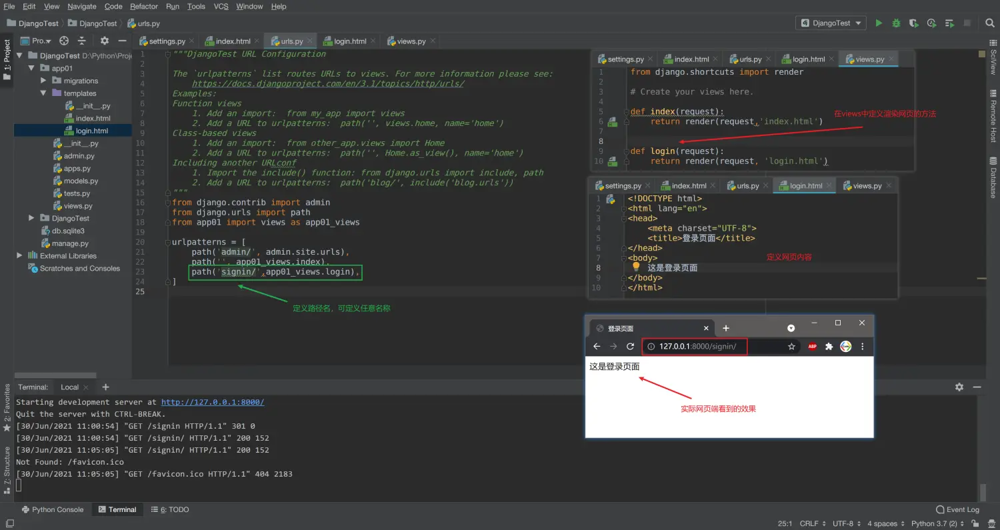
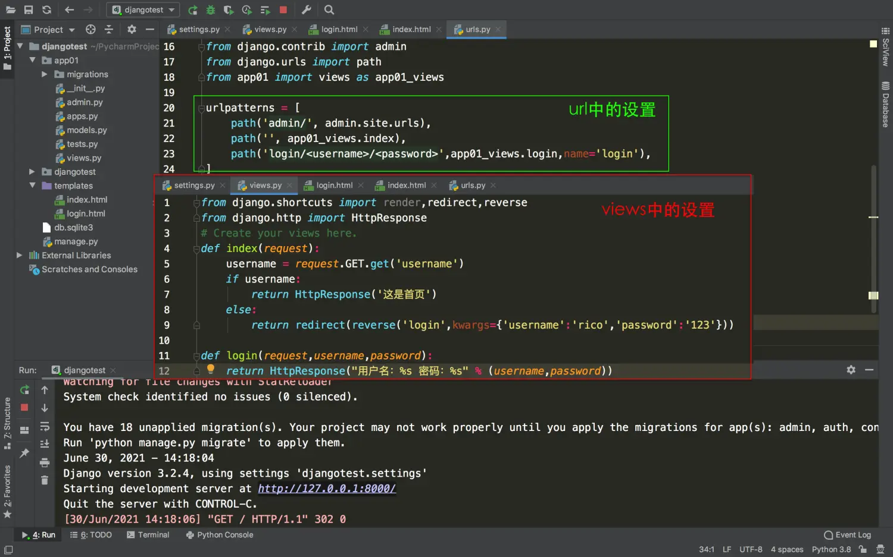
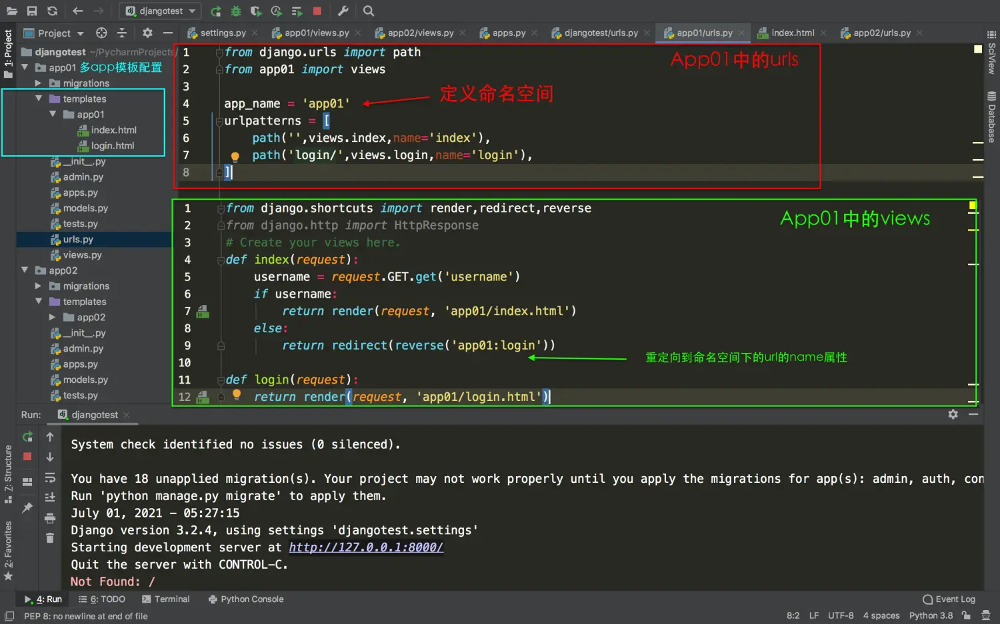

> 知道Django某一个功能的用途，比单纯地知道怎么做更有用。

今天我们要学习的内容是Django的页面跳转，重点讲的是使用url里的name参数
### 一、给url设置name属性
##### 1. 我想修改路径名
根据前面做好的web项目，登录页面的url为：
`http://127.0.0.1:8000/login/`；如果我们想把路径名`login`换成`signin`，该怎么做呢？
这时候我们就想到了在urls的urlpatterns里直接修改path路径名,


##### 2. 遇到麻烦了
如果views里对应的方法有重定向跳转就麻烦了，因为重定向跳转的redirect方法里已经写了我们改名之前的路径名。如果我们在url里将`login`改成`signin`，做了一次改名操作了，那么在views里我们还要再改一次。如果有很多个页面都做了重定向到login页面，我们就需要对每一个函数进行修改操作，太麻烦了！有没有什么办法能让我们做路径修改的时候，只需要改一处就能搞定的呢？
##### 3. 解决方法:利用name属性
实际上Django给我们提供了URL的name属性用来标记url，我们可以在path中给指定路径设置一个name属性，
```
urlpatterns = [
    path('signin/', app01_views.login, name="login"),
]
```
在views中做重定向时不直接写死路径名，而是通过`reverse('属性名')`反向查出前面的url，这样修改路径名就很方便了，直接修改path就可以了。
```
return redirect(reverse('login'))
```
通常情况下，我们是根据path里的路径名，找到views里的方法，然后渲染页面。而这里的重定向反转操作是根据路径名的name属性，反向找到路径的名称。
这样我们需要修改路径名的时候，views里都不要动的，反正它找的是指定的名称。name属性规定好了之后，url路径名想怎么改就怎么改。
> 注意：使用反转路径名的方法，需要导包`from django.shortcuts import reverse`。

##### 4. 如何使用URL的name属性
当前阶段我们主要用在两处：
在View中使用`redirect(reverse("login"))`；
```
def index(request):
    username = request.GET.get('username')
    if username:
        return render(request,'index.html')
    else:
        return redirect(reverse('login'))
```
在html中使用模板语言``；
```
<a href="">登录</a>
```
##### 5. 调用url的name时传递参数
我们先复习一下url传值的两种常见方法：
（1）直接使用url传值
以传递电影编号movie_id为例，如果想通过url传值。在定义path的时候，使用`path("movile_detail/<movie_id>",...)`，然后在views里定义方法来接收movie_id这个值，就定义成`def movie_id(request,movie_id)`，浏览器中访问的时候可以通过`127.0.0.1:8000/movie_detail/8001`就能把movie_id作为参数通过url传过去。
（2）使用查询字符串传值
我们还是以传递电影编号为例，如果想通过url传值。在定义path时，使用`path("movie_detail/",...)`，在views里定义方法来接收就写成
```
def movie_id(request):
        movie_id = request.GET.get(movie_id)
```
在浏览器中访问是，url需要输入`127.0.0.1:8000/?movie_id=8001`。这样也能完成url的传值。
（3）传递参数
在views中，我们使用redirect重定向到一个新的url如果要传递参数该怎么办呢？
有两种方式：
* 方式一： 使用tuple传参数,`args=(''rico',  '123')`
* 方式二： 使用dict传参数,`kwargs={'username': 'rico', 'password': '123'}`

url设置如下：
```
urlpatterns = [
    # 登录url
    path('login/<username>/<password>',app01_views.login, name='login'),
]
```
在views里定义login方法准备接收两个参数：
```
def login(request, username, password):
    return HttpResponse("用户名:%s \t 密码：%s" % (username, password))
```
传递参数时：
```
def index(request):
    username = request.GET.get('username')
    if username:
        return HttpResponse('=== 这是首页 ===')
    else:
        return redirect(reverse('login', kwargs={'username': 'rico', 'password': '123'}))
```


> 注意：是在reverse方法里添加参数，传的如果是元组则注意前后顺序，如果是字典就不用考虑前后顺序。

如果要在templates中通过模板语言调用url的名称，
模板语言里使用url传递参数可以写成这样：
```

```
### 二、多app环境下URL的命名
在多app项目中，如果各自的name属性相同，在重定向访问的时候会出现无法访问指定app下的url的问题。这时候我们就在各自app的urls中添加命名空间
```
app_name = 'app01'
```
然后在重定向访问指定url名称的时候，添加命名空间属性即可。
```
def index(request):
    username = request.GET.get('username')
    if username:
        return render(request, 'app01/index.html')
    else:
        return redirect(reverse('app01:login'))
```



> 注意：项目总体url配置使用include关键字，将多个app配置到总路由中。
```
urlpatterns = [
    path('admin/', admin.site.urls),
    path('app01/', include('app01.urls')),
    path('app02/',include('app02.urls')),
]
```
### 最后
这一节，我们主要介绍了Django中url路由跳转的进阶知识，下一节，我们将介绍Django下html页面中的模板语言DTL，感谢大家的阅读~