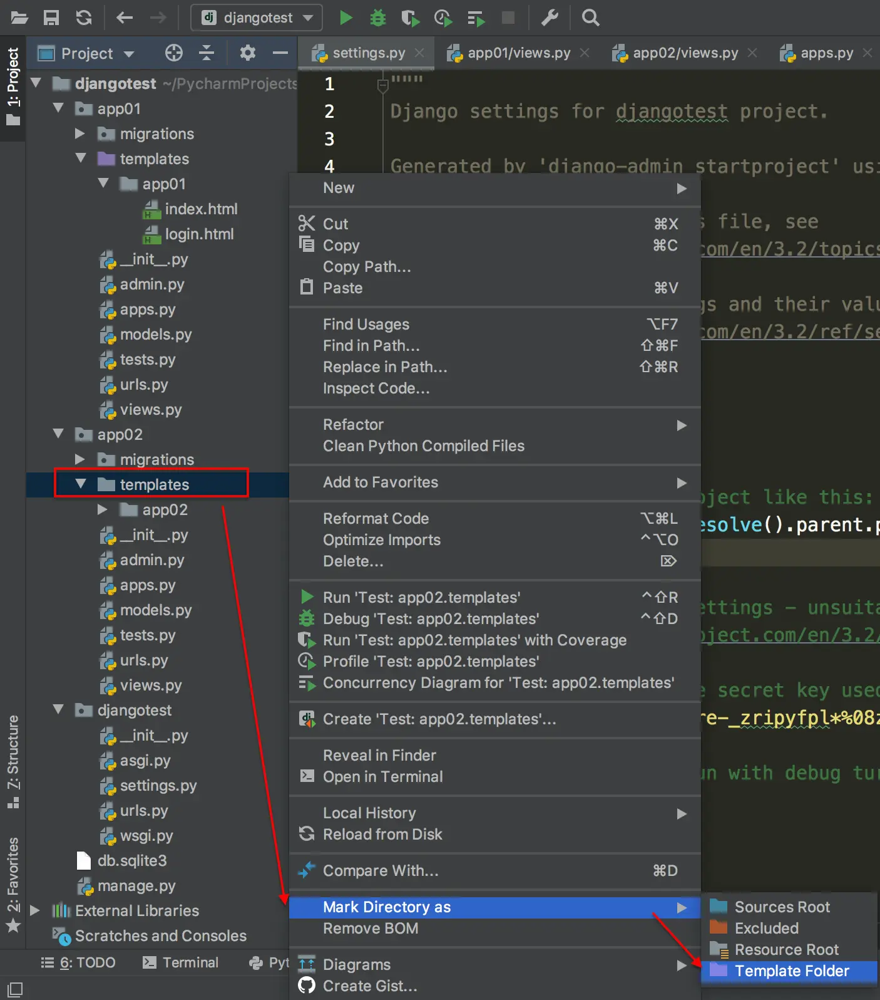

### 一、如何在app里建立模板文件夹
如果想把模板文件夹建立在app里的话，需要完成以下操作：
(1) templates文件夹需要Mark Directory as Templates Floder
(2) settings.py里的TEMPLATES中的APP_DIRS属性需要设置成`True`


> 注意：如果模板放在app中，必须保证当前app已被安装；在settings的INSTALLED_APPS中添加app名称。
### 二、 如何把views中的值传到templates中
在views的方法里，如果想把值传到templates中必须使用字典类型，然后在render方法中将字典名传给context参数。在html中使用模板语言`{{ 键名 }}`进行访问。

 案例：在views中将用户名Swift传递给html页面中的div显示出来
```
def index(request):
    username = "Swift"
    # 如果想把值传到Templates中，必须传递字典类型
    content ={'user': username}
    # user:在模板中通过这个名称访问，username：具体传过去的值
    return render(request, 'index.html', context=content)
```
在html中通过div标签展示出来：
```
<div id="div01">{{ user }}</div>
```
> 注意：无论是传递单个元素还是多个元素，都需要通过字典的方式进行传递。如果需要传递列表，也应该把列表封装成字典的一个键值对。在模板语言中访问列表或者元组中的元素时可以使用`变量名.数字`来访问列表中的元素，访问字典中的元素可以使用`变量名.键名`来访问。
### 三、在模板语言中使用if标签
if标签代表着条件选择，模板语言中的if标签可以写成这样:
```

    <p> 名单中有小雨 </p>

    <p> 名单中没有小雨 </p>

```
常见的比较运算符有:
```
==、!=、<、<=、>、>=、in 、not in 、is、 is not
```
##### 案例：
某网站在数据库中存储了账号信息，
Type的值为1：普通会员；
Type的值为2：高级会员；
Type的值为3：管理员；
在登陆的时候，按照Type的值显示出类别信息，如果匿名访问提供登录的链接。
##### 实现过程
我们在views里读取url中的username和type,打包成字典类型通过context属性传递给模板文件。
```
def index(request):
    username = request.GET.get('username')
    type = request.GET.get('type')
    content = {'username':username,'type':type}
    return render(request,'index.html',context=content)
```
然后，在html文件中，通过模板语言中的if...else判断type类型，从而显示出不同的文字。
```

    【普通会员】{{ username }}欢迎您！

    【超级会员】{{ username }}欢迎您！

    【管理员】{{ username }}欢迎您！

     <a href=""> 登录 </a>

```
> 注意：模板语言中，一般调用模板语句使用``，如果直接调用变量则使用`{{ }}`

### 四、模板语言中的for标签
当传递的数据是一个集合的时候，需要通过循环读取每一行记录。我们在views中传递一个集合给模板文件，html页面中使用模板语言的for标签依次将数据显示出来。
##### 1.案例
我们从文件夹中读取学生信息，打包成由字典组成的列表，通过context参数传递给html页面并显示出来。
我们首先定义一个方法load_from_file用于读取文本文件并打包成列表。
```
def load_from_file(path:str):
    all_students = []
    infos = ['sno', 'name', 'gender', 'birthday', 'mobile', 'email', 'address']
    # 读取文件，将学生信息组装成[{]{}{}]
    try:
        with open(path, mode='r', encoding='utf-8') as fd:
            # 读取当前行
            current_line = fd.readline()
            # 判断当前行是否为空
            while current_line:
                # 去除换行符并获取单个学生信息列表
                student = current_line.replace("\n", "").split(",")
                # 组装学生信息字典
                temp_student = {}
                for index in range(len(infos)):
                    temp_student[infos[index]] = student[index]
                # 添加到总列表中
                all_students.append(temp_student)
                # 读取下一行
                current_line = fd.readline()
        # 返回总遵守信息
        return all_students
    except Exception as e:
        raise e
```
然后传递给html页面
```
def index(request):
    path = r"D:\Python\Project\DjangoDemo\app01\static\file\Student.txt"
    students = load_from_file(path)
    # 加载html页面
    return render(request,'index.html',context={'students': students})
```
在html页面中，我们表格使用bootstrap框架美化，
```
<link type="text/css" rel="stylesheet" href="">
```
使用模板语言for标签获取学生信息:
```
<tbody>
    
        <tr>
            <td>{{ forloop.counter }}</td>
            <td>{{ student.sno }}</td>
            <td>{{ student.name }}</td>
            <td>{{ student.gender}}</td>
            <td>{{ student.birthday }}</td>
            <td>{{ student.mobile }}</td>
            <td>{{ student.email }}</td>
            <td>{{ student.address }}</td>
        </tr>
    
</tbody>
```
##### 效果演示

##### 2.使用DataTable展示数据
DataTables是基于jQuery的一个插件，用于显示数据表格。
在基本使用时，需要引用jquery.dataTables.css，脚本文件先引用jquery.js再引用jquery.dataTables.js，注意先后顺序。
```
<!-- 引用css -->
<link type="text/css" rel="stylesheet" href="">
<link type="text/css" rel="stylesheet" href="">
<!-- js脚本 -->
<script src=""></script>
<script src=""></script>
```
在html的table标签使用id属性后，在head标签结束前的script标签内添加脚本
```
 $(document).ready(function(){
        $('#表格id').DataTable();
    });
```
> 注意:在脚本中表格名前不用忘记加`#`，引入脚本的顺序不要写错。设置多语言可使用国际化功能详情可见datatable官网技术手册

##### 效果演示：


### 五、模板语言常用过滤器
##### 1. 格式
过滤器可以理解成为了实现某功能系统内置的函数。过滤器的书写格式为：
```
{{变量名|过滤器名称}}
```
如果使用参数则写成：
```
{{变量名|过滤器名称:"参数"}}
```

##### 2.常见的过滤器
下面列举一些常见的过滤器：
```
{{value|capfirst}}  # 首字母大写
{{value|title}}  # 句子单词首字母大写
{{value|center:"15"}}  # 文字居中剩余填充
{{value|ljust:"10"}}  # 文字左对齐，剩余填充
{{value|rjust}}  # 文字右对齐，剩余填充
{{value|cut:" "}}  # 移除空白
{{value|date:"D d M Y"}}  # 日期格式化
{{value|default:"nothing"}}  # 默认空值
{{value|time:"H:i"}}  # 时间格式化
{{value|default_if_none:"nothing"}}  # None值默认
{{value|dictsort:"name"}}  # 字典排序
{{value|filesizeformat}}  # 文件大小格式化
{{value|first}}  # 序列的第一个值
{{value|last}}  # 序列的最后一个值
{{value|floatformat:3}}  #浮点精度
{{value|join:"~"}}  # 序列拼接
{{value|make_list}}  # 字符串转列表
{{value|length}}  # 序列长度
{{value|length_is:"4"}}  # 长度判断
{{value|lower}}  # 字符串转小写
{{value|upper}}  # 字符串转大写
{{value|randoom}}  # 序列中随机取值
{{some_list|slice:":2"}}  # 切片
{{value|striptags}}  # 去除标签
{{value|truncatechars:9}}  # 控制输出单词长度，超出省略号
{{value|wordcount}}  # 统计字数
```

> 注意：变量与过滤器名之间的竖线不要有空格，使用冒号引出参数即可。
### 最后
关于Django模板语言的部分，我们就介绍到这里，感谢大家的阅读~