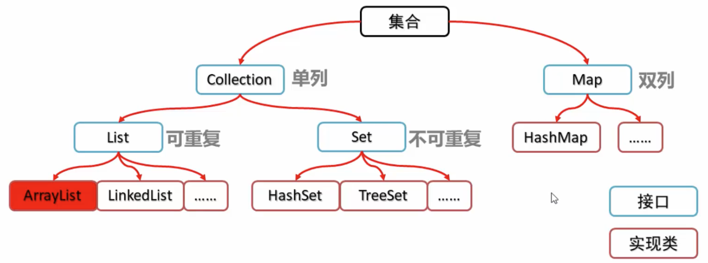
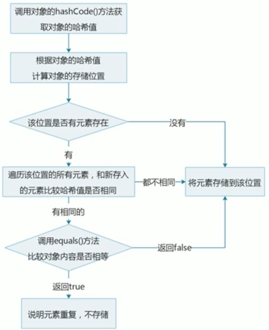
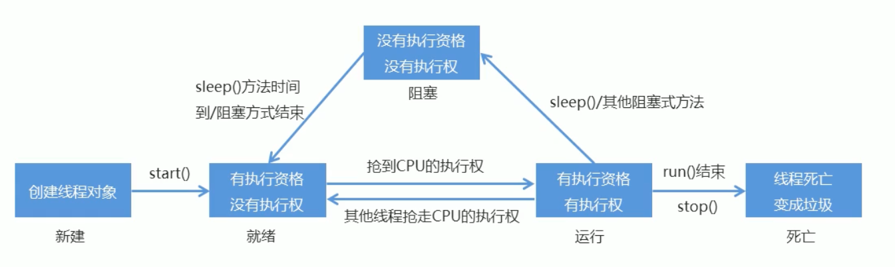

## Java面向对象

#### 什么是this

在方法内部，有一个对象表示本类，它就是this；

> [深入理解Java关键字this](https://cloud.tencent.com/developer/article/1414755)

#### 什么是多态？

多态的实现依赖与继承和重写(override)，不同的对象可以通过相同的接口实现特定的行为；子类重新定义了父类的方法时，子类实例可以被当做父类实例来使用；

## 集合

集合体系结构



### List

#### LinkedList

特有的功能主要是：

```java
 void addFirst(E e)
 void addLast(E e)
 E getFirst()
 E getLast()
 E removeFirst()
 E removeLast()
```

#### ArrayList

ArrayList构造方法里可以传入一个Set类型的变量，可以构造一个List类型的集合；

```java
List<Integer> keyList = new ArrayList<>(keySet);
```

#### Iterator迭代器

集合的专用遍历方式，`Iterator<E> iterator()`返回集合中元素的迭代器；

迭代器是通过集合的`iterator()`方法得到的；

迭代器的常用方法：

* E next()返回迭代中的下一个元素

* boolean hasNext()如果迭代具有更多元素，则返回true

```java
Collection<String> c = new ArrayList<String>();
c.add("hello");
c.add("world");
c.add("java");
Iterator<String> iterator = c.iterator();
while(iterator.hasNext()){
    System.out.println(iterator.next());
}
```

##### 并发修改异常

下面的代码中会报错ConcurrentModificationException

```java
List<String> list = new ArrayList<String>();
list.add("hello");
list.add("world");
list.add("java");
// 遍历集合
// 使用迭代器会报并发修改异常ConcurrentModificationException
Iterator<String> itr = list.iterator();
while (itr.hasNext()){
    String s = itr.next();
    if(s.equals("world")){
        list.add("javaee");
    }
}
```

产生的原因：迭代器遍历集合的过程中，通过集合对象修改了集合进行了结构性修改（增加或者删除），造成了迭代器获取元素时判断预期修改值与实际修改值不一致；
解决方案：

- 使用普通的 `for` 循环来遍历集合，for不使用迭代器，就不会发生预期修改次数与实际修改次数不一致的情况。
- 使用迭代器的 `remove` 方法来删除元素，而不是直接通过集合对象删除。这样迭代器会更新预期修改次数，避免异常。
- 在多线程环境中，使用同步机制（例如锁）来确保只有一个线程能够同时修改集合。

##### 列表迭代器ListIterator

列表迭代器支持正向遍历和逆向遍历，可以直接使用列表迭代器对象对集合对象继续结构性操作，不会产生并发修改异常；

```java
List<String> list = new ArrayList<String>();
list.add("hello");
list.add("world");
list.add("java");
ListIterator<String> lit = list.listIterator();
while (lit.hasNext()) {
    String s = lit.next();
    if (s.equals("world")) {
        lit.add("javaee");
    }
}
System.out.println(list);
```


### Set

Set是一个接口继承自Collection接口，是一个不包含重复元素的集合，没有带索引的方法，不能使用普通for循环遍历；

哈希值：是jdk根据对象的地址或者字符串或者数字计算出来的int类型的值，Object类中的`public int hashCode`方法可以计算哈希值； 

>  同一个对象多次调用hashCode方法返回的哈希值是相同的；
>
> 默认情况下，不同对象的哈希值是不相同的；通过方法重写，可以实现不同对象的相同哈希值；

#### HashSet

底层数据结构是哈希表，没有带索引的方法，不能使用普通for循环遍历，由于是Set集合，所以是不包含重复元素的集合；

HashSet集合保证元素唯一性的原理：




#### LinkedHashSet

LinkedHashSet是一个基于LinkedHashMap实现的有序去重集合列表。

- LinkedHashSet中的元素没有重复
- LinkedHashSet中的元素有顺序，维护了添加顺序
- LInkedHashSet可以存储null值
- LinkedHashSet是一个线程不安全的容器

#### TreeSet

元素有序，具体的排序方式取决于构造方法：

* `TreeSet()`根据元素的自然排序进行排序
* `TreeSet(Comparator comparator)`根据指定的比较器进行排序

##### Comparable

如果一个自定义对象需要实现排序，那么该对象就要实现`Comparable`接口，并重写`CompareTo`方法；

```java
public class Student implements Comparable<Student> {
    int age;
    String name;
		...省略构造方法、get\set方法
   
    @Override
    public int compareTo(Student s ) {
        // 按照年龄的顺序从小到大排序
        int num1 = this.age - s.age;
        // 如果年龄相同就按照姓名首字母排序
        int num2;
        num2 = num1 == 0 ? this.name.compareTo(s.name):num1;
        return num2;
    }
}
```

##### Comparator

在对象里实现comparable接口外，还可以直接在集合构造方法中通过内部类的方式添加一个比较器Comparator接口；

```java
public class TreeSetDemo {
    public static void main(String[] args) {
        // 构建TreeSet
        TreeSet<Student> ts = new TreeSet<>(new Comparator<Student>() {
            @Override
            public int compare(Student s1, Student s2) {
                int num1 = s1.getAge() - s2.getAge();
                return num1 == 0 ? s1.getName().compareTo(s2.getName()):num1;
            }
        });
        // 创建学生对象，并将其添加到集合中
        Student tom = new Student(18, "tom");
        Student jerry = new Student(19, "jerry");
        Student bob = new Student(19, "bob");
        ts.add(tom);
        ts.add(jerry);
        ts.add(bob);
        // 遍历集合
        for(Student s: ts){
            System.out.println(s.getName()+","+s.getAge());
        }
    }
}
```

### Map

#### 概述

Interface Map<K,V>将键映射到值的对象，不能包含重复的键。put过程中，如果键第二次出现，则会修改原始的值；

```java
Map<String,String> map = new HashMap<>();
map.put("1001","tom");
map.put("1002","jerry");
map.put("1002","bob");
System.out.println(map);
//{1002=bob, 1001=tom}
```

| **方法名**                          | **说明**                 |
| :---------------------------------- | :----------------------- |
| V put(K key,V value)                | 添加元素                 |
| V remove(Object key)                | 根据键删除元素           |
| void clear()                        | 移除所有键值对           |
| boolean containsKey(Object key)     | 判断是否包含指定的键     |
| boolean containsValue(Object value) | 判断是否包含指定的值     |
| V get(Object key)                   | 根据键获取值             |
| Set<K> keySet()                     | 获取所有值的集合         |
| Collection<V> values()              | 获取所有值的集合         |
| Set<Map.Entry<K<V>> entrySet()      | 获取所有键值对对象的集合 |

```java
Map<String,String> map = new HashMap<>();
map.put("tom","jerry");
map.put("romeo","juliet");
System.out.println("-----根据键获取值----");
System.out.println(map.get("romeo"));

System.out.println("-----获取集合----");
Set<String> keys = map.keySet();
for(String k:keys){
    System.out.println(k);
}

System.out.println("-----获取值的集合----");
Collection<String> values = map.values();
for(String c : values){
    System.out.println(c);
}

System.out.println("-----获取键值对的集合----");
Set<Map.Entry<String, String>> entries = map.entrySet();
for (Map.Entry<String,String> e: entries){
    System.out.println(e);
}
```

#### HashMap

JDK8之前底层采用数组+链表实现，JDK8之后当链表长度大于等于7且数组长度大于64时，链表会转化为红黑树；

[HashMap面试宝典](https://www.jianshu.com/p/d04edc8aaf0f)

#### 遍历

* 获取所有的key,通过增强for循环依次找到对应的value

```java
Set<String> keys = map.keySet();
for(String k : keys){
    System.out.println(k+"="+map.get(k));
}
```

* 直接获取所有的键值对对象的集合，对每个键值对对象通过`getKey()`获取键，通过`getValue()`获取值

```java
Set<Map.Entry<String, String>> entries = map.entrySet();
for(Map.Entry<String,String> entry : entries){
    System.out.println(entry.getKey()+"="+entry.getValue());
}
```


### 泛型

#### 概述

泛型就是将原来的具体类型参数化，在使用或者调用时传入具体的类型；可以用在类、方法、

接口中，分别称为泛型类、泛型方法、泛型接口；

#### 格式

* <类型>：指定一种类型的格式，这里的类型可以看成是形参；
* <类型1，类型2...>：指定多种类型的格式，多种类型之间用逗号隔开，这里的类型可以看成是形参；

##### 泛型类

```java
// 修饰符 class 类名<类型>{}
// 此处的T可以随便写为任意标识T、E、K、V均可
public class Generic<T> {
    T age;
    public T getAge() {
        return age;
    }
    public void setAge(T age) {
        this.age = age;
    }
}
// 泛型类的使用
public class GenericDemo {
    public static void main(String[] args) {
        GenericClass<Integer> i = new GenericClass<>();
        i.setAge(12);
        System.out.println(i.getAge());
        GenericClass<String> g = new GenericClass<>();
        g.setAge("12");
        System.out.println(g.getAge());
    }
}
```

##### 泛型方法

```java
// 修饰符 <类型> 返回值类型 方法名(类型 变量名){}
public <T> void show(T t){
   System.out.println(t);
}
// 泛型方法的使用
public class GenericDemo {
    public static void main(String[] args) {
        Generic g = new Generic();
        g.show("hello");
        g.show(123);
    }
}
```

##### 泛型接口

```java
// 修饰符 interface 接口名<类型>{}
public interface Generic<T> {
    void show(T t);
}
//接口的实现类
public class GenericImpl<T> implements Generic<T>{
    @Override
    public void show(T t) {
        System.out.println(t);
    }
}
// 泛型接口的使用
public class GenericDemo {
    public static void main(String[] args) {
        GenericImpl<String> g1 = new GenericImpl<>();
        g1.show("tom");
        GenericImpl<Integer> g2 = new GenericImpl<>();
        g2.show(12);
    }
}
```

#### 类型通配符

* 默认类型通配符`<?>`

List<?>表示元素类型未知的List，它的元素可以匹配任何的类型；

* 类型通配符上限`<? extends 类型>`

List<? extends Number>其表示的类型是Number或者及其子类型；

* 类型通配符下限`<? super 类型>`

List<? super Number>其表示的类型是Number或者其父类型；

```java
// 默认类型通配符
List<?> list2 = new ArrayList<Number>();
List<?> list3 = new ArrayList<Integer>();
// 有上限的类型通配符
List<? extends Number> list4 = new ArrayList<Integer>();
// 有下限的类型通配符
List<? super Number> list5 = new ArrayList<Object>();
```

#### 可变参数

格式：修饰符 返回值类型 方法名(数据类型...变量名)

```java
public static int sum(int... a) {
    // 这里的变量 a其实是一个数组
    int s = 0;
    for (int i : a) {
        s += i;
    }
    return s;
}
```

#### Collections

> Collections是一个实用类，与Collection是一个接口，注意他们是完全不同的概念：

Collections类常用的方法：

```java
public static <T extends Comparable<? super T>>
void sort(List<T> list)
void reverse(List<T> list)
void shuffle(List<T> list)
```

> 必须通过Collections这个类来调用，可排序的集合对象作为该方法的参数；

案例： 

```java
List<Integer> list = new ArrayList<>();
list.add(10);
list.add(30);
list.add(80);
list.add(40);
// Collections常用方法方法
Collections.sort(list);
System.out.println(list); // 10 30 40 80
Collections.reverse(list);
System.out.println(list); // 80 40 30 10
Collections.shuffle(list);
System.out.println(list); // 30 10 80 40

```

## 文件与IO流


---


## 进程与线程


#### 进程与线程的区别：

**定义：**

进程：进程是一个独立的执行单位，有自己的地址空间和系统资源，进程之间相互隔离，彼此独立；

线程：线程是进程内的一个执行流程，共享同一进程的地址空间和系统资源，一个进程可以包含多个线程；

**资源共享：**

不同进程之间的资源是独立的，需要特定的机制来进行通信；

线程切换的开销相对较小，因为共享进程的资源；

**并发性与并行性：**

进程之间可以并行执行，多个进程同时执行；

线程可以在同一进程内并发执行，利用多核处理器实现并行计算；

**容错性：**

进程的崩溃不会影响其他进程的稳定性，因为相互隔离；

线程的错误可能影响同一进程内的线程，因为共享资源；

### Thread

#### 多线程实现的方法：

方式1：定义一个类MyThread继承`Thread`类并重写`run`方法，在其他类使用时需要创建MyThread对象并调用`start`方法启动线程；

> run方法用于封装被线程执行的代码，直接调用相当于普通方法的调用；


示例：

```java
public class MyThread extends Thread{
    @Override
    public void run() {
        for (int i = 0; i < 20; i++){
            System.out.println(i);
        }
    }
}
```

```java
public class MyThreadDemo {
    public static void main(String[] args) {
        MyThread mt1 = new MyThread();
        MyThread mt2 = new MyThread();
        //启动多线程
        mt1.start();
        mt2.start();
    }
}
```

方式2：定义一个类MyRunnable实现Runnable接口，重写run方法，创建MyRunnable类的对象作为参数传入Thread构造方法中，最后通过thread对象调用start方法启动线程；

```java
public class MyRunnable implements Runnable{
    @Override
    public void run() {
        for(int i = 0; i < 20; i++){
            System.out.println(Thread.currentThread().getName()+":"+i);
        }
    }
}
```

```java
public class MyRunnableDemo {
    public static void main(String[] args) {
        // 这个MyRunnable对象可以看成是一个共享的资源
        MyRunnable mr = new MyRunnable();
        //创建Thread对象传入runnable对象作为构造方法的参数
        Thread thread1 = new Thread(mr,"plane");
        Thread thread2 = new Thread(mr,"car");
        thread1.start();
        thread2.start();
    }
}
```


#### 设置和获取线程名称：

```java
void setName(String name) // 设置线程的名称
String getName()	// 获取线程的名称 
```

Thread类也提供了直接从构造方法中设置线程名称的方式，但是子类如果需要通过这种方式设置线程名称则需要重写含参的构造方法并使用`super()`将参数传递给父类

> 如何获取main方法的线程名称？
>
> 答：通过Thread类下的静态方法currentThread()可以返回当前正在执行的线程对象的引用。
>
> System.out.println(Thread.currentThread().getName());

#### 设置和获取线程优先级：

> Java使用的是`抢占式调度模型`(优先让优先级高的线程使用CPU)；

```java
public final int getPriority() //返回此线程的优先级
public final void setPriority() // 更改此线程的优先级
```

>  线程的默认优先级是5,最大值是10，最小值是1；

#### 线程控制

##### 线程休眠：

```java
static void sleep (long millis) // 使得当前正在执行的线程停留指定毫秒数,需要在catch语句中使用该方法；
```
示例：

```java
public class ThreadSleep extends Thread{
    @Override
    public void run() {
        for (int i = 0; i <= 20; i++){
            try {
                Thread.sleep(1000);//1000毫秒
            } catch (InterruptedException e) {
                throw new RuntimeException();
            }
            System.out.println(getName()+":"+i);
        }
    }
}
```

```java
public class ThreadSleepDemo {
    public static void main(String[] args) {
        ThreadSleep ts1 = new ThreadSleep();
        ThreadSleep ts2 = new ThreadSleep();
        // set thread name
        ts1.setName("tom");
        ts2.setName("jerry");
        // start thread
        ts1.start();
        ts2.start();
    }
}
```

运行结果：tom:1 jerry:1 tom:2 jerry"2 ...tom:9 jerry9

##### 线程排队

```java
void join() // 等待这个线程结束
```
示例：

```java
public class ThreadJoin extends Thread{
    @Override
    public void run() {
        for (int i = 0; i < 10; i++){
            System.out.println(getName()+":"+i);
        }
    }
}
```

```java
public class ThreadJoinDemo {
    public static void main(String[] args) {
        ThreadJoin king = new ThreadJoin();
        ThreadJoin prince = new ThreadJoin();
        // 设置名称
        king.setName("king");
        prince.setName("prince");
        // 启动线程
        king.start();
        try {
            king.join();
        } catch (InterruptedException e) {
            throw new RuntimeException(e);
        }
        prince.start();
    }
}
```

运行结果：king:1 king:2.....king:9 prince:1prince:2...prince:9

##### 守护线程

```java
void setDaemon(boolean on) //将此线程标记为守护线程，当运行的线程都是守护线程时，Java虚拟机将退出
```
示例：

```java
public class ThreadDaemonDemo {
    public static void main(String[] args) {
        ThreadDaemon td1 = new ThreadDaemon();
        ThreadDaemon td2 = new ThreadDaemon();
        td1.setName("关羽");
        td2.setName("张飞");
        // 设置当前线程名称为刘备
        Thread.currentThread().setName("刘备");
        // 设置关羽张飞为守护线程
        td1.setDaemon(true);
        td2.setDaemon(true);
        // 启动守护线程
        td1.start();
        td2.start();
        // 主线程
        for(int i = 0; i < 10; i++){
            System.out.println(Thread.currentThread().getName()+":"+i);
        }
    }
}
```

运行结果：当主线程刘备运行结束后，守护线程关羽张飞即使没有运行完成，也会强制结束（可能存在一定延迟）;

#### 线程生命周期



#### 线程同步

判断多线程程序是否会有数据安全问题的标准：

* 是否是多线程环境；

- 是否有共享数据；

- 是否有多条语句操作共享数据

解决线程安全问题的关键就是解决**多条语句操作共享数据的问题**

> 方法是：把多条语句操作共享数据的代码锁起来，在任意时刻只能有一个线程执行；

##### 同步代码块

```java
synchronized(任意对象){
		多条语句操作共享数据的代码
}
```

示例：模拟三个窗口实现售票问题

```java
public class TicketRunnable implements Runnable {
    private int tickets = 100;
    private final Object obj = new Object();
    @Override
    public void run() {
        while (true) {
            synchronized (obj) {
                // 相同的票出现多次，
                if (tickets > 0) {
                    // 通过sleep模拟出票时间
                    try {
                        Thread.sleep(100);
                    } catch (InterruptedException e) {
                        throw new RuntimeException(e);
                    }
                    System.out.println(Thread.currentThread().getName() + "正在交易.." + "还剩" + tickets + "张");
                    tickets--;
                }
            }
        }
    }
}
```

```java
public class TicketSaleDemo {
    public static void main(String[] args) {
        TicketRunnable tr = new TicketRunnable();
        // 定义三个线程分别代表三个窗口
        Thread window1 = new Thread(tr,"窗口1");
        Thread window2 = new Thread(tr,"窗口2");
        Thread window3 = new Thread(tr,"窗口3");
        //启动三个线程
        window1.start();
        window2.start();
        window3.start();
    }
}
```

锁的好处是解决了数据安全问题，弊端是耗费资源，降低程序的运行效率；

##### 同步方法 

同步普通方法(给方法加锁)，可以直接把synchronized关键字加到方法上；

锁的对象是该普通方法的this对象；

同步静态方法(给静态方法加锁)，也可以直接把synchronized关键字加到静态方法上；

锁的对象是该类的字节码对象，可以通过`类名.class`得到；

##### 线程安全的类

StringBuffer，如果不考虑线程安全可以用StringBuilder代替；

Vector，如果不考虑线程安全可以用ArrayList代替，但实际用的是工具类Collections下面的synchronizedList方法，可以将ArrayList包装成线程安全的类；

HashTable，如果不考虑线程安全可以用HashMap代替。

##### Lock锁

锁对象Lock可以看到哪里加了锁，哪里释放了锁；

Lock是一个接口不能直接实例化，通过他的实现类ReentrantLock来实例化；

#### 生产者消费者模式

为了体现生产和消费过程中的等待和唤醒，Object类中提供了对应的方法：

```java
void wait() 			//导致当前线程等待，知道另一个线程调用该对象的notify或者notifyAll方法
void notify()			//唤醒正在等待对象监视器的单个线程
void notifyAll()	//唤醒正在等待对象监视器的所有线程
```

#### 匿名内部类创建线程的两种方式：

参考文档:https://blog.csdn.net/qian_ch/article/details/57419720

方式一：继承Thread类

```java
public class ThreadDemo04 {
	public static void main(String[] args) {
		/*
		 * 第一种方式：
		 * 1.继承Thread类
		 * 2.重写run方法
		 * 3.将要执行的代码写在run方法中
		 */
		new Thread() {
			public void run() {
				for (int i = 0; i < 10; i++) {
					System.out.println("aaaaaaaaa");
				}
			}
		}.start();//开启线程
	}
}
```

方式二：实现Runnable接口

```java
	/*
	 * 第二种方式：
	 * 1.将Runnable的子类对象传递给Thread的构造方法
	 * 2.重写run方法
	 * 3.将执行的代码写在run方法中，最后我们开启线程
	 */
	new Thread(new Runnable() {
		public void run() {
			for (int i = 0; i < 10; i++) {
				System.out.println("bbbbbbbbb");
			}
		}
	}).start();//开启线程
```


---


## 网络编程


---


## Lambda表达式


---

## 反射

### 类加载

当一个程序要使用某个类，类还未被加载到内存中，JVM会通过类的加载、类的连接、类的初始化连续完成这三个步骤；

类加载：将class文件读入内存，并为之创建一个java.lang.Class对象；

类的连接：验证(检验被加载的类是否有正确的内部结构)、准备(为类变量分配内存，设置默认初始化值)、解析(将二进制数据中的符号引用替换为直接引用)

类的初始化：加入类未被初始化和连接，则先加载并连接；若该类的父类未被初始化则先初始化其父类；

JVM的类加载机制：全盘负责、父类委托、缓存机制

### 反射机制

#### 概述

是指在运行时获取一个类的变量和方法信息，然后通过获取到的信息来创建对象，调用方法；

#### 获取Class类对象

要想通过反射去使用一个类，首先要获取到该类的字节码文件对象(该类的class类型对象)，主要有三种方法：

* 使用类的class属性，Student.class
* 调用对象的getClass方法，（Object类中的方法，所有对象都可以调用）
* 使用Class类中的静态方法forName(String className)，字符串参数是某个类的全路径(含包名)；

```java
public class ReflectDemo {
    public static void main(String[] args) throws ClassNotFoundException {
        Class<Student> c1 = Student.class;
        Class<Student> c2 = Student.class;
        System.out.println(c1 == c2);
      
        Student s = new Student();
        Class<? extends Student> c3 = s.getClass();
        System.out.println(c1 == c3);
        
        Class<?> c4 = Class.forName("improve.reflect.getclass.Student");
        System.out.println(c1 == c4);
      	// 结果返回的都是true
    }
}
```

#### 获取构造方法

getConstructors()方法可以获取一个类的公共构造方法，返回的是一个包含Construct对象的数组；

getDeclaredConstructors()方法可以获得一个类的所有构造方法数组；

getConstructor(class<?> ...parameterTypes)返回单个公共构造方法；

getDeclaredConstructor(class<?>...parameterTypes)返回单个所有构造方法对象；

Constructor类中创建对象的方法：T newInstance(Object...initargs)根据指定的构造方法创建对象；

示例：通过反射获取构造方法并使用

```java
public class Student {
    private String name;
    int age;
    public String address;
    public Student(){}
    // 定义一个含有三个参数的构造方法
    public Student(String name, int age, String address) {
        this.name = name;
        this.age = age;
        this.address = address;
      	...
      	// 重写了toString方法，这里省略
    }
}
```

```java
public class ReflectDemo02 {
    public static void main(String[] args) throws ClassNotFoundException, NoSuchMethodException, InvocationTargetException, InstantiationException, IllegalAccessException {
        // 获取Class对象
        Class<?> c = Class.forName("<包名>.Student");
        // 基本数据类型也是可以通过.class得到对应的Class类型
        Constructor<?> con = c.getConstructor(String.class, int.class, String.class);
        Object o = con.newInstance("tom", 19, "shenzhen");
        System.out.println(o);
    }
}
```

对于私有的构造方法，可以通过暴力反射取消访问检测，从而创建对象；

```java
public void setAccessible(boolean flag) //值为true，取消访问检测
```

示例：通过反射获取私有构造方法并使用

```java
public class ReflectDemo03 {
    public static void main(String[] args) throws ClassNotFoundException, NoSuchMethodException, InvocationTargetException, InstantiationException, IllegalAccessException {
        Class<?> c = Class.forName("improve.reflect.getclass.Student");
        Constructor<?> con = c.getDeclaredConstructor(String.class);
        //暴力反射,取消访问检测
        con.setAccessible(true);
        Object tom = con.newInstance("tom");
        System.out.println(tom);
    }
}
```

#### 获取成员变量并使用

[403](https://www.bilibili.com/video/BV1gb411F76B?p=403&spm_id_from=pageDriver&vd_source=488c20fff310575bb8253b2f01dc5363)
