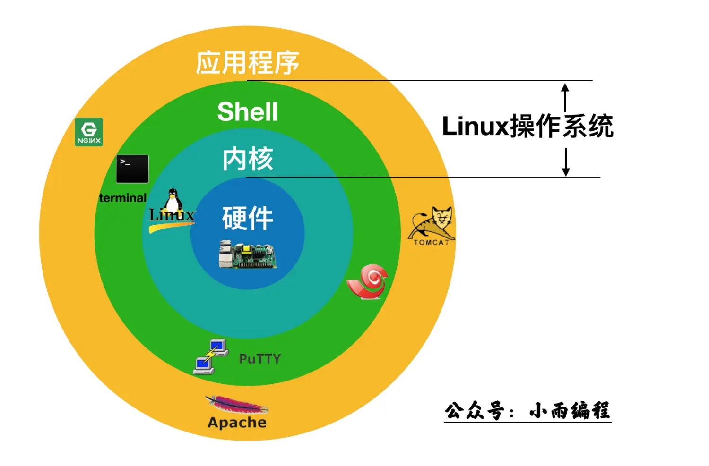
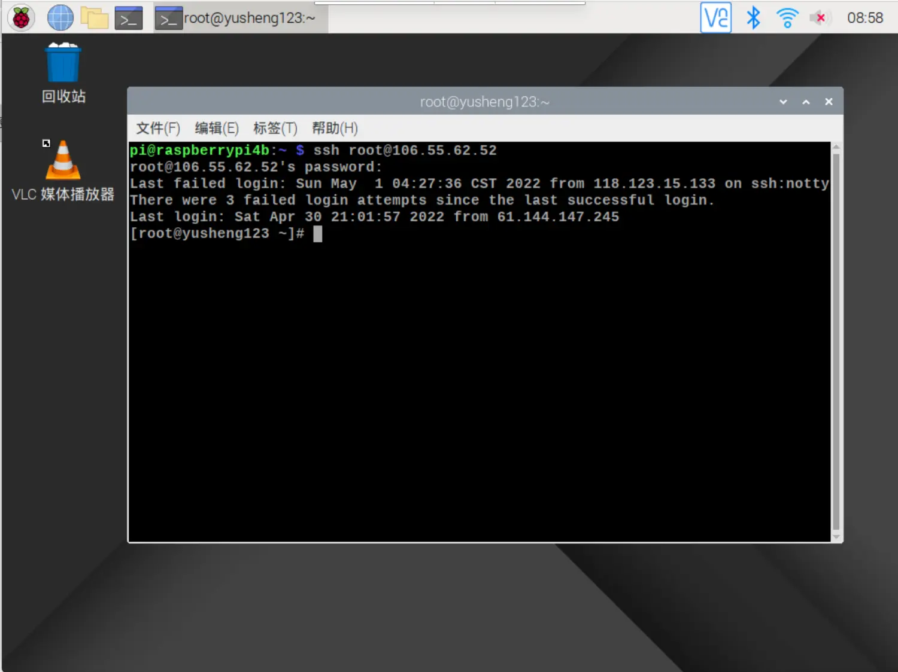
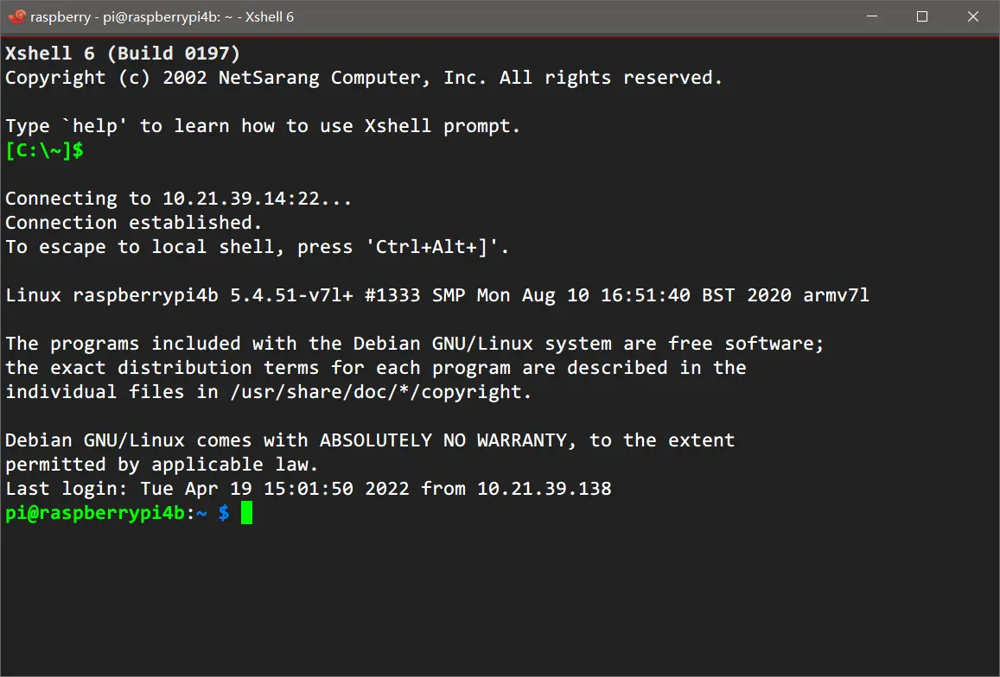
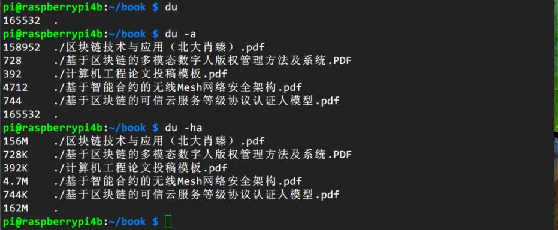
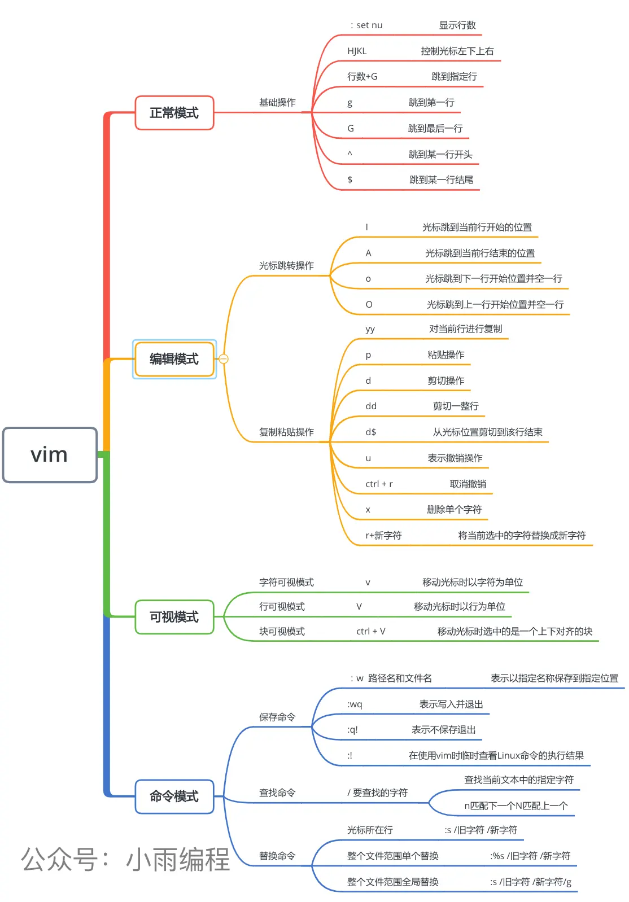
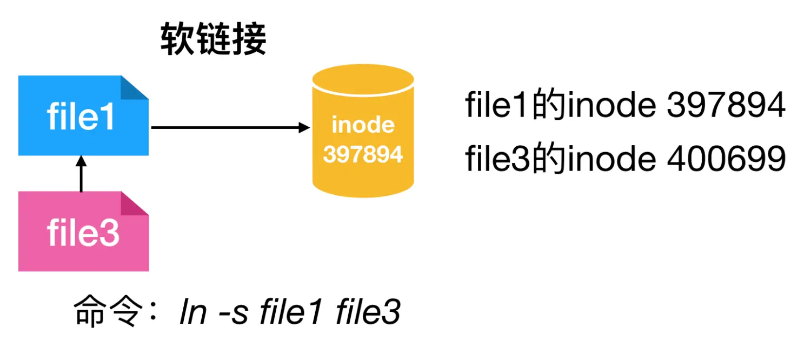
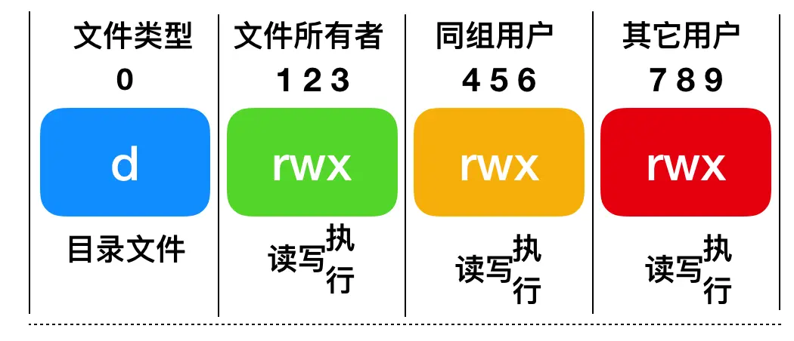
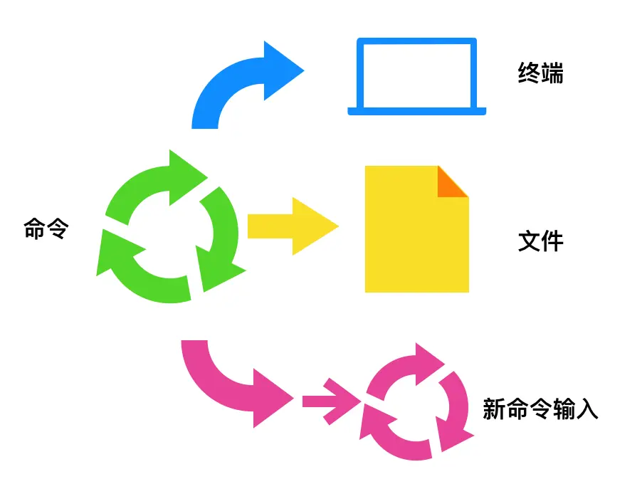
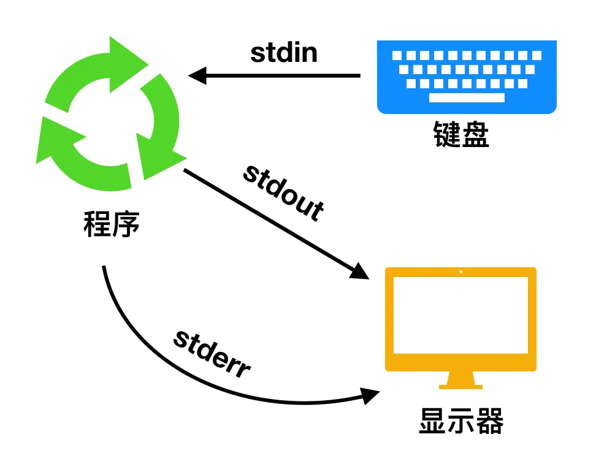
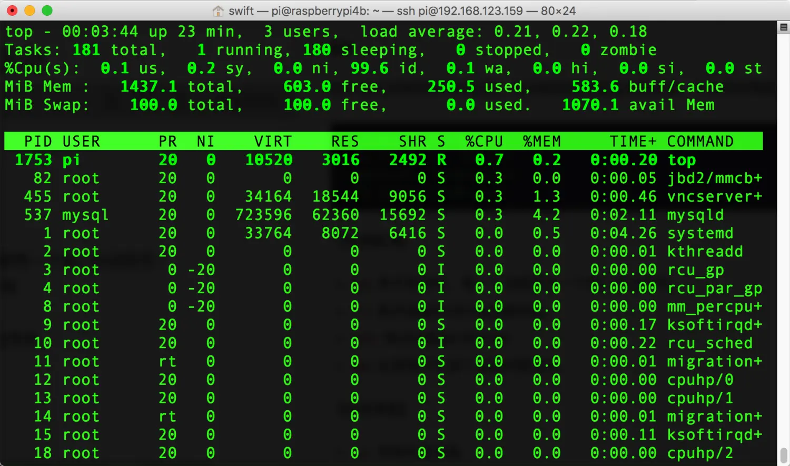

# 前言

Linux系统的基本操作，对于大多数计算机类相关学生或者相关从业人员都很重要，本文以树莓派的Linux系统为实例，从基础出发，详细介绍Linux系统中最基础的操作。

# 什么是Linux
这里就不搬概念了，Linux本质上和Window一样都是运行在计算机上的操作系统，但是有一个核心区别就是Linux是开源的。

运行在桌面端的Linux像Windows一样有图形化界面，我们可以用鼠标操作，但是大多数Linux系统运行在服务器上没有图形化界面，那我们怎么执行呢？使用Shell工具，它就像一个外部用户与Linux内核沟通的桥梁，例如复制粘贴重命名文件，这些都是通过Linux命令来执行的，我们所要学习的就是要理解这些命令并使用这些命令。

## 如何使用Shell工具
知道了Linux基本概念后，我们该如何使用Shell工具来登录远程Linux系统呢？
1. 在Windows系统上
如果你的电脑上的操作系统是Windows，可以使用putty工具或者Xshell（具体按照方法可自行搜索）登录Linux系统，在指定界面按照提示输入Linux系统的IP地址、用户名、登录密码即可登录；


2. 在其他系统上

如果你的电脑上的系统是macOS或者Linux类系统(Ubuntu、CentOS、Kylin、Raspberry Pi OS)那么直接打开终端工具输入命令：
```
ssh 用户名@IP地址
```
再按提示输入登录密码就可以登录了。


如果是单纯的学习Linux基础知识也可以直接打开终端就可以了！

## 使用Xshell连接Linux服务器

这里以Windows上的终端工具Xshell登录树莓派的Linux系统为例，登录成功后，系统会显示上一次登录的时间。



* `pi`表示用户名（树莓派的用户名默认为pi）
* `raspberrypi4b`表示这台Linux系统的主机名，可以自定义；
* `$` 表示当前用户所具有的权限（root用户为`#`,普通用户为`$`）
* `~` 表示当前所在目录为家目录
## 使用命令行工具通用的快捷键
在学习Linux命令之前，有一些快捷键是必须要掌握的，它能大大提高你的Linux命令使用效率。
* `↑↓`：通过`↑↓`键来选择过往执行过的Linux命令；
* `Tab`：命令或者参数仅需输入前面几位就可以使用`Tab`键来补全；
* `Ctrl + R`: 历史命令检索，使用`Ctrl + R`用于查找使用过的命令。
* 显示所有执行过的命令，使用`history`可以显示所有命令执行历史，使用`history 数字`可以查看最近n次使用过的命令；使用`！+编号`可以直接执行历史命令中对应编号的命令。
* `Ctrl + L`：清除屏幕并将当前行移动值页面顶部；
* `Ctrl + C`：终止当前终端中正在执行的命令
* `Ctrl + U`：从光标位置剪切至行首
* `Ctrl + K`：从光标位置剪切至行尾
* `Ctrl + W`：剪切光标左侧的一个单词
* `Ctrl + Y`：粘贴
* `Ctrl + A`：光标调到命令行的开头
* `Ctrl + E`：光标跳到命令行结尾
* `Ctrl + D`：关闭当前Shell会话

# 文件和目录
## Linux的文件目录系统
Linux不像Windows分了C盘和D盘，它只有一个根目录，根目录有若干文件夹，每一个文件夹都有它特定的用途：
```Bash
└── /				// 根目录
	├── bin 		// binary的缩写，存放系统命令，bin目录里面包含了会被所有用户使用的可执行程序
	├── boot		// 系统启动目录，保存与系统启动相关的文件，包含内核文件、启动引导程序
	├── dev			// device的缩写，设备文件保存位置
	├── etc			// 系统配置文件保存位置，系统中采用默认安装方式的服务配置文件都会保存在这
	├── home		// 用户的家目录，Linux中每一个用户在home目录下都有一个自己用户名的家目录
	├── lib  		// 系统调用的函数库保存位置
	├── media		// 媒体，挂载目录，建议挂载一些媒体设备
	├── mnt			// mount表示挂载目录，一般表示临时挂载一些装置（U盘、SD卡、移动硬盘）
	├── opt			// 第三方安装软件保存的位置，手工安装源码可以安装在这里，/usr/local/也可以作为安装目录
	├── proc		// 虚拟文件系统，该目录保存在内存中，保存系统的内核、进程、外部设备的网络状态等
	├── root		// 超级用户root的家目录
	├── sbin 		// system binary表示系统二进制文件，系统环境设置相关的目录，包含系统级重要的可执行程序
	├── srv			// service 表示服务，包含一些网络启动后所需要取用的数据
	├── sys			// 虚拟文件系统，该目录的数据都保存在内存中，保存与内核相关的信息
	├── tmp			// 临时目录，系统存放临时文件的目录
	├── usr			// Unix Software resource 表示Unix系统软件资源，系统默认软件都安装在这
	├── var			// variable表示动态的，包含程序的数据比如log文件
	└── lost+found	// 当系统以外崩溃或者关机时，产生的文件碎片就存在这里，是根分区的备份恢复目录
```
## 浏览和切换目录
Windows有图形界面，浏览和切换目录可以直接在我的电脑里点击鼠标，而Linux如何在命令行交互界面中浏览文件目录呢？
### ls
列出文件和目录(Linux中最常用的命令之一)。
【常用参数】
* `-a` 显示所有隐藏的文件和目录
* `-l` 显示详细的文件信息  
* `-t` 按文件最近一次修改的时间排序
* `-i` 显示文件的inode标识
### cd
表示切换目录
【常用写法】
* `cd /` 表示跳转到根目录下
* `cd ~` 表示跳转到家目录下
* `cd ..` 表示跳转到上级目录下
* `cd pi` 表示跳转到当前目录下的相对路径(当前目录下必须要有这个文件夹)，通常搭配`ls`命令一起使用；
* `cd /home/pi` 后面加上绝对路径(包含根目录到当前目录的路径)，表示可以跳转到该绝对路径下
* `cd` 不添加任何参数也表示跳转到当前用户的家目录下
### pwd
显示当前目录的路径（显示从根目录开始到当前目录的绝对路径）
### which
查看Linux中某个可执行程序的位置
```
pi@raspberrypi4b:/home $ which python3
/usr/bin/python3
```
### du
列举出当前目录的文件大小信息
* `-h` 表示以方便阅读的形式展现输出结果，如果是文件大小就会显示具体的K、M、G
* `-a` 表示同时列出目录下所有文件的大小信息



### cat
一次性查看文件的所有内容并将其输出到终端中来，适合查看内容不多的文本文件
```
pi@raspberrypi4b:~/swift $ cat hello.txt 
hello raspiberry 4b !
```
### less
分页显示文本内容，适合查看内容较多的文本文件
【快捷指令】
* `空格键` 下一页
* `b键` 上一页
* `回车键` 下一行
* `y键` 上一行
* `d键` 前进半页
* `u键` 后退半页
* `q键` 停止读取
* `=键` 显示当前内容在文本文件中第几页第几号位置以及内容所占百分比
* `/键` 进入搜索模式，按n键跳转到下一个搜索到，按N键跳转到上一个搜索点
### head和tail
显示文件的开头或者末尾几行
默认显示10行，可以添加参数n指定显示n行文本内容，tail还有一个重要的用处就是查看log日志文件，可以实时查看日志文件结尾的更新情况。使用参数`-f`可以每隔一秒查看文件是否有更新，也可以使用参数`-s`指定间隔时间查看文本内容是否更新
```
tail -f -s 3 access.log
```
### touch
创建一个文件
```
touch hello.txt
```
如果指定的文件在当前文件夹中不存在，则直接创建一个空白的新文件；
如果想要一次性创建多个文件，可以使用命令：
```
touch file1.txt file2.txt file3.txt
```
### mkdir
创建一个目录，类似于Windows中新建一个指定名称的文件夹；
【常用参数】

* `-p` 递归创建目录结构
```
mkdir -p one/two/three
```
## 文本编辑
在Linux系统的命令行中如果需要对文本进行编辑，主要有两个应用nano和vim，其中vim是vi的增强版本。这里主要介绍一下vim的基本使用。
### vim
【常用写法】
```
vim hello.txt # 当前目录下有hello.txt就直接编辑，若没有则新建一个该名称的空白文件
```
vim打开文本时，默认启动正常模式(只能跳转光标，不可编辑文本)，需要输入键盘`i`键才会启动编辑模式。编辑好文件后，如果想保存输入`:`进入命令模式，此时输入的命令显示在控制台最后一行。`wq`表示保存退出，按回车执行操作。如果不想保存文本，`q!`表示不保存退出。
【注意事项】
vim文本编辑器对于新手来说，使用不太习惯，但是如果熟练使用vim编辑器后，该工具能非常有效的提高工作效率。



## 解压缩
在Linux系统中，将多个文件压缩成一个压缩包的过程，主要分成两部分：
第一步：将多个文件打包成一个tar包
第二步：将tar包压缩成压缩文件。
### tar
tar的主要用途是将文件夹或者多个文件创建成一个tar包（归档）
【常用写法】
```
tar -czvf xiaoyu.tar.gz xiaoyu/ # 将xiaoyu文件夹归档并压缩
tar -xzvf xiaoyu.tar.gz # 将压缩包xiaoyu.tar.gz解压
```
【参数解读】
* `-c` 代表创建打包
* `-x` 代表解包
* `-z` 代表处理的是`gzip`压缩包
* `-v` 代表解压压缩过程可见
* `-f` 代表结果输出文件

### zip/unzip
如果需要在Linux中处理`zip`压缩包，可以使用`unzip`解压，`zip`进行压缩。
【常用写法】
```
unzip xiaoyu.zip # 解压zip压缩包
unzip -l xiaoyu.zip # 只查看内容，不解压
zip xiaoyu.zip xiaoyu/ # 将xiaoyu文件夹压缩为xiaoyu.zip
```
## 文件基本操作
### cp
拷贝文件和目录
【常用写法】
* `cp file1 file1_copy` 在当前文件夹下创建一份file1的副本；
* `cp file2 dir1` 将文件file2复制一份到dir1目录下；
* `cp file3 dir2/file3_copy` 将文件file3复制一份到dir2目录下，并命名为file3_copy；
* `cp *.java dir3` 将当前文件夹下的所有Java文件复制到dir3目录下。
### rm
删除文件或目录
【常用参数】
* `-r` 递归删除
* `-i` 删除前给出提示信息
* `-f` 强制删除

【常用写法】
* `rm file1` 删除当前文件夹下的file1文件
* `rm -r dir1` 删除当前文件夹下dir1文件夹(文件夹必须使用递归方式删除)
* `rm *.txt` 删除当前文件夹下的所有txt文件
### sort
sort可以快速对文本文件的行进行排序
【常用写法】
*  `sort city.txt` 可以对city.txt中的每一行按首字母顺序输出到屏幕

【案例讲解】
我们创建一个文本文件`city.txt`,写入以下内容：
```
Guangzhou
Shengzhen
Anhui
Wuhu
Beijing
Zhengzhou
Xiamenn
```
执行`sort city.txt`命令后系统会输出：

【常用参数】

* `-o`将排序后的结果写入新文件`sort -o city_sorted.txt city.txt`
* `-r` 倒序排序
* `-R` 随机排序
* `-n` 以每一行开头的数字大小为顺序进行排序
### uniq
uniq命令用于删除文本文件中的重复内容

【常用写法】
* `uniq city.txt` 用于去除city.txt文本文件中的重复行数，并输出到屏幕
* `uniq city.txt city_uniq.txt` 去重后将结果输出到city_uniq.txt中；

【常用参数】
* `-c` 统计重复的行数
* `-d` 只显示重复的行数

【注意事项】
uniq只能去除文本文件中连续重复的行数
### scp
scp是`secure copy`的缩写，可以通过网络安全地把文件从一台电脑拷贝到另一台电脑。
【基本用法】
`scp 源文件 目标文件`
其中原文件和目标文件的格式为`user@ip:file_name`
```
scp ./hello.txt root@192.168.123.160:~/ # 将本系统目录下的hello.txt文件拷贝到服务器的家目录下
scp root@106.55.62.52:~/hello.txt ./hello.txt # 将服务器家目录下的hello.txt文件拷贝到本系统当前目录下
```
### ln
ln是Link的缩写表示创建链接，在Linux系统中文件名与文件内容是分开存储的，每一个文件名通过`inode`标识绑定到对应的文件内容。为了保护某些重要文件的安全已经方便系统操作，Linux系统设计了两种链接：硬链接和软链接。
（1）硬链接

如果我们使用命令`ln file1 file2`让file2与file1进行硬链接，此时假若删除file1,会发现file2不会受到影响，对于硬链接来说删除链接任意一方的文件，共同指向的文件内容并不会从硬盘中删除。只有同时删除了file1与file2,它们所共同指向的文件内容才会消失。
（2)软链接

软连接类似于Windows里的快捷方式，执行创建软链接命令`ln -s file1 file3`后，系统会创建file3指向file1的软链接。此时file3只是file1的快捷方式，它指向file1显示file1的内容。但是file3与file1的inode并不同，我们删除file3，file1不会受到影响。但是如果删除file1的话，file3就会变成死链接。
【案例思考】
删除原文件file1后，硬链接文件file2不受影响，软连接文件file3开始无法访问

# 用户与权限
## 用户的管理
在Linux系统中允许多个用户存在，这些用户被划分到不同的组中。但是Linux系统中的`root`用户（超级管理员用户）最特殊，它被划分到`root`组中，具有系统中的最高权限。为了保护各个用户在系统中的文件安全，Linux系统定义了各种文件权限级别：可读、可写、可执行。
### sudo
以`root`身份执行命令
```
sudo vim nginx.conf
```
假如nginx.conf这个文件对于普通用户执行vim工具只有可读权限，如果要编辑该文件则需要以root用户身份来执行。这时候只需要使用sudo命令即可。

### useradd
添加新用户

【常用参数】
* `-d `指定用户的登入目录
* `-g` 指定用户的所属的群组
* `-u` 指定用户的id

useradd建立账户后，使用passwd来设定账户的密码，使用userdel来删除账户。注意执行这些命令都需要`root`用户权限。
```
useradd -g root -d /home/xy xiaoyu  # 新建一个用户名为xiaoyu的用户,属于root组家目录在/home/xy文件夹下
passwd xiaoyu # 修改xiaoyu用户的密码
userdel xiaoyu  # 删除xiaoyu用户名，其家目录下的文件夹依然保留
userdel xiaoyu -r  # 删除xiaoyu用户名的同时删除家目录下的文件夹
```
### su
全称switch user表示切换用户
```
su xiaoyu  # 切换为普通用户xiaoyu
su  # 切换回root用户
```
如果以root用户登录系统后再su切换成普通用户，可以使用`exit`切换回root用户身份。
## 群组的管理
Linux中每一个用户都属于一个特定的群组，如果创建用户时没有指定特定的群组，系统会为用户分配一个与用户名相同的群组，并把用户规划给该群组。
### groupadd
创建群组，用法和useradd相同
```
groupadd com # 创建com组
groupdel com # 删除com组
```
### groups
查看用户对应的组名称
```
groups xiaoyu  # 查看用户xiaoyu所在的组
```
### chgrp
用户修改文件的群组
```
chgrp com file1.txt  # 将file1.txt的文件群组修改为com
```
### chown
修改文件的所有者
```
chown xiaoyu file1.txt  # 将file1.txt这个文件的所有者设置为xiaoyu
chown xiaoyu:com file1.txt  # 将file1.txt这个文件的所有者设置为xiaoyu，所属的群组设置为com
```


## 文件权限管理
### chmod
修改文件的访问权限
```
chmod 777 hello.java  # 将hello.java这个文件设置为所有用户可读可写可执行
```


在Linux系统中，不同的用户处于不同的地位拥有不同的权限。为了保护系统的安全，Linux系统对不同的用户访问同一文件(包括目录)的权限做了不同的规定。

可以使用`ll`或者`ls -l`命令，查看当前目录下文件的属性以及文件所属的用户和组。
```
pi@raspberrypi4b:~/swift $ ls -l
total 0
drwxr-xr-x 2 root root 4096 Apr 27 17:02 bin
-rw-r--r-- 2 root root 0 Apr 27 14:43 file1
-rw-r--r-- 2 root root 0 Apr 27 14:43 file2
lrwxrwxrwx 1 root root 5 Apr 27 14:44 file3 -> file1
```
其中`drwxr-xr-x`表示文件或目录的权限，我们来解读一下这些字母分别代表什么含义：
* `d`：表示目录，普通文件用`-`表示，链接文件用`l`表示；
* `r`：表示文件可读
* `w`：表示文件可写
* `x`：表示文件可执行
* `-`：表示没有相应的权限
文件或者目录的权限字符串是根据以下规则来进行划分的：


每个文件的熟悉由10个字符来确定，第0位确定文件类型，第1-3位确定文件属主(文件的所有者)拥有该文件的权限，第4-6位确定文件的属组(所有者同组用户)拥有该文件的权限，第7-9位确定其它用户拥有该文件的权限。

【案例分析】
我们试着用上面的知识解读一下`-rwxrw-r--`的权限信息；
* 第0位是`-`，表明它是一个普通文件；
* 第1-3位是`rwx`，表明文件所有者具有可读可写可执行权限；
* 第4-6位是`rw-`，表明文件所有者的同组用户具有可读可写权限；
* 第7-9位是`r--`，表明其它用户具有可读权限。
## 数字分配权限
回到前面的图，我们发现有的时候可以通过数字来赋予文件权限，比如`chmod 777 file.txt`，这是什么意思呢？原来Linux系统中将读权限设置为数字4、写权限设置为数字2、执行权限设置为数字1，如果需要表示权限只需要做一些简单加法就行。
【案例分析】
我们试着理解`chmod 540 hello.py`这个语句给hello.py这个文件赋予的权限。

* 5 = 4 + 1 + 0 表示文件所有者具有可读可执行权限
* 4 = 4 + 0 + 0 表示文件所有者同组用户具有可读权限
* 0 = 0 + 0 + 0 表示其它用户没有任何权限
对应的字符表示的权限应写成`-r-xr-----`
## 字母分配权限
除了使用字符数字，Linux系统中还可以通过字母来分配权限；
* `u`：`user`的缩写，表示文件所有者
* `g`：`group`的缩写 ，表示文件所有者同组用户
* `o`：`other`的缩写 ，表示其他用户
* `a`：`all`的缩写 ，表示所有用户
* `+`：表示添加权限
* `-`：表示去除权限
* `=`：表示赋予权限
【案例分析】
* `chmod u+rx hello.c` 表示文件hello.c的所有者增加读和执行权限；
* `chmod g+w hello.c` 表示文件hello.c的所有者同组用户增加可写权限；
* `chmod o-x hello.c` 表示文件hello.c的其它用户去除可执行权限；
* `chmod go-r hello.c` 表示文件hello.c的同组用户和其它用户去除读权限；
* `chmod a+x hello.c` 表示文件hello.c的所有用户增加可执行权限；
* `chmod u=rwx,g=rw,o=r hello.c` 表示文件hello.c的文件所有者具备可读可写可执行，同组用户具备可读可写，其它用户苦逼可读权限；

# 查找
在Linux系统中，我们通常需要检索某一个文件，这时候就需要相关的查找工具。
### locate
搜索包含关键字的所有文件和目录，支持正则表达式。
```
locate file1.txt
```
【注意事项】
1. `locate`命令在执行的过程中会检索当前系统文件数据库，而不是全磁盘检索。由于新创建的文件并不会立刻更新到文件数据库中，所以无法被`locate`检索到。如果想要立刻检索可以使用`sudo updatedb`命令更新一下文件数据库。
2. 如果系统无法使用locate命令(系统显示command not found)，可以手动安装一下`mlocate`软件包。
### find
find是一款Linux内置工具，主要的功能是找文件，甚至可以在找到文件后再进行后续操作，功能非常强大。
【常用写法】
1. 根据文件名查找：
```
find . -name "XXXXX"  # 表示在当前目录中查找名为XXXXX的文件
find . -iname "XXXXX" # 当前目录查找XXXXX文件名不区分大小写
```
2. 根据文件类型查找：
```
find . -type d -name "XXXXX" # 在当前目录查找XXXXX的目录
```
type 的值可选为：
| 文件类型 |   含义   | 文件类型 |   含义   |
| :------: | :------: | :------: | :------: |
|    f     | 普通文件 |    p     |   管道   |
|    d     |   目录   |    c     | 字符设备 |
|    l     |  软链接  |    b     |  块设备  |
|    s     |  套接字  |          |          |
3. 根据文件大小查找
```
find /root -size +10G  # 查找root目录下超过10M的文件
find . -size 12k # 查找当前目录下等于12k的文件
find /tmp -size -1M # 查找tmp目录下小于1M的文件
```
4. 根据文件最近访问时间查找
```
find -name "*.java" -atime +7  # 7天之前访问过的java文件
find . -mtime -1 # 近1天修改过的文件
```
5. 查找结果并执行操作
```
find . -name "*.java" -printf "%p - %u" # 查找当前目录下所有的java文件并以文件名-文件所有者格式打印
find . -name "*.py" -delete # 删除当前目录下所有的py文件
find -name "*.py" -exec chmod 777 {} \; # 将当前目录下的所有py文件权限设为所有人可读可写可执行
find -name "*.py" -ok chmod 777 {} \; # 功能一样，不过执行之前有询问操作
```
### grep
grep主要用于查找文件里符合条件的字符串
【常用参数】
* `-n`显示结果在文本中的行号
* `-r` 递归查找
* `-i` 忽略大小写
* `-E` 以正则表达式进行匹配
* `-v` 显示不包含指定文本的所有行
```
grep -nr xiaoyu *.py # 递归查找当前文件夹下所有的py文件中含有关键字xiaoyu的位置并显示行数
grep -v xiaoyu *.py # 查找当前文件夹下所有的py文件中不包含xiaoyu关键字的所有行
grep -E ^xiao /root/*.py # 查找root文件夹下所有的py文件中以xiao开头的位置
```
# 软件安装
在日常使用的Linux系统中，安装软件的方式主要有两种。`Red Hat`家族的`.rpm`包，一般使用`yum`进行安装；另一个`Debian`家族的`.deb`包，一般使用`apt`进行安装。
以树莓派的`Raspberry Pi OS`系统为例，它属于`Debian`家族安装,其软件包后缀为`.deb`，可以使用apt-get为系统安装软件，系统大部分操作基本上和`Ubuntu`类似。

## 仓库安装软件
### apt-get
apt-get适用于deb包从互联网软件仓库中搜索、安装、卸载软件或者操作系统，其中apt的全称是Advanced Package Tool。
【常用操作】
```
apt-get install packagename  #安装一个新的软件包
apt-get remove packagename #卸载一个已安装的软件包（保留配置文档）
apt-get remove --purge packagename #卸载一个已安装的软件包（删除配置文档）
apt-get autoremove packagename #删除包及其依赖的软件包
apt-get autoremove --purge packagname #删除包及其依赖的软件包+配置文件，比上面的要删除的彻底一点
dpkg --force-all --purge packagename #有些软件很难卸载，而且还阻止了别的软件的应用，就能够用这个(有风险)
```

【注意事项】

* 在部分操作系统中执行apt-get需要root权限，所有一般在执行以上命令时会加上`sudo`
```
sudo apt-get update # 刷新软件源
sudo apt-get upgrade # 将系统中所有软件包一次性升级到最新版本
```
* 以上apt-get针对Debian家族的系统，如果是Redhat家族的系统请自行切换成`yum`安装，方法基本相似。
## 编译安装软件
我们刚学会了使用`apt-get`安装软件，但是如果遇到apt仓库中没有的软件，我们就需要学会更高级的软件安装方法:`编译源码安装`；
【基本步骤】
1. 下载源码
```
wget https://downloads.apache.org/httpd/httpd-2.4.53.tar.gz
```
2. 解压
```
tar -xzvf httpd-2.4.53.tar.gz # 解压压缩包
cd httpd-2.4.53 # 进入解压后的文件夹
```
3. 配置
检查当前设备是否具备编译所需的工具，执行命令`./configure`，写成`/configure prefix=/usr/`可以指定软件安装的路径；
4. 编译
执行`make`命令，添加参数`-j4`表明调用几个CPU来执行编译工作。
5. 安装
执行`make install`命令
# 重定向与管道
## 理解命令的去向
在Linux系统中一个命令的去向可以有三个方向：终端显示、文件、另外一个命令的入参。


命令一般是通过键盘输入，然后输出到终端、文件，它的标准用语分别是标准输入`stdin`、标准输出`stdout`、标准错误输出`stderr`


## 重定向
重定向是指本来要显示在终端的结果，重新输送到别的地方（文件中或者作为其它命令的输入）
### 输出重定向
1. 使用`>`输出重定向，如果文件不存在则系统新建一个，如果输出的文件已经存在，则覆盖原始文件。
```
echo "hello" > hello.txt
```
2. 使用`>>`输出重定向，表示新内容追加到文件末尾；
```
echo "hello" >> hello.txt
```
3. 使用`2>`输出重定向，表示标准错误输出
```
cat hello.txt > res.txt 2> errors.log
```
4. 使用`2>&1`输出重定向，表示标准输出和错误输出都重定向到一个地方
```
cat hello.txt > res.txt 2>&1 # 覆盖
cat hello.txt >> res.txt 2>&1 # 追加
```
### 输入重定向
1. 使用`<`输入重定向
```
cat < hello.txt # 指定cat命令的输入内容为hello.txt的内容
```
输出结果与`cat hello.txt`相同，但是系统的工作流程是不同的。
2. 使用`<<`输入重定向
```
wc -m << END # 输入这个命令后，终端就进入键盘输入模式，其中END为结束命令
```
### 管道
管道，顾名思义就是可以像管道一样把两个命令的输入输出连起来，英文是`pipeline`在Linux中可以用符号`|`表示。


例如我们对city.txt这个文本文件进行查看、排序、降重，可以写成：
```
cat hello.txt | sort | uniq
```
这样我们就能找出进过排序与降重的城市列表了。
【注意事项】
cat、sort、uniq、grep等命令均支持管道符，是因为这些命令均可以从标准输入中读取要处理的文本（即从标准输入中读取参数）；而对于部分命令，例如rm、kill等命令则不支持从标准输入中读取参数，因为其只支持从命令行中读取参数。

# 进程
## 进程查看
在Windows系统中，如果某个应用卡住了，我们可以在任务管理器里找到对应进程，然后强制结束。那么在Linux系统中如何查看进程呢？
### w
可以查看当前系统中有哪些用户处于登录状态及其他信息
```
pi@raspberrypi4b:~ $ w
 23:44:34 up 4 min,  3 users,  load average: 0.33, 0.44, 0.21
USER     TTY      FROM             LOGIN@   IDLE   JCPU   PCPU WHAT
pi       tty7     :0               19:48    3:56m  0.88s  0.16s /usr/bin/lxsess
pi       tty1     -                19:48    3:56m  0.15s  0.12s -bash
pi       pts/0    192.168.123.122  23:41    2.00s  0.13s  0.03s w
```

【数据解读】
第一行显示的是任务队列信息
23:44:34表示当前时间，up 4 min表示系统正常运行了4分钟，3 users表示当前有三个用户在登录，load average代表负载均衡信息，三个值分别代表最近1分钟、5分钟、15分钟的平均负载。
* `USER`表示当前登录的用户
* `TTY`表示登录的终端名称
* `FROM`表示连接到服务器的IP地址
* `LOGIN@`表示登录时间
* `IDLE`用户多久没有活跃了
* `JCPU`该终端所有相关进程使用的CPU的时间
* `PCPU`表示CPU执行当前程序所消耗的时间
* `WHAT`表示当前用户正在运行的程序

### ps
用于显示当前系统中的进程，是当前时刻系统的进程快照，不会实时更新。
```
pi@raspberrypi4b:~ $ ps
  PID TTY          TIME CMD
 1580 pts/0    00:00:00 bash
 1701 pts/0    00:00:00 ps
```
【数据解读】
* `PID` 表示进程号，每一个进程都有一个唯一的进程号；
* `TTY` 表示进程所运行的终端名称
* `TIME` 表示进程运行的时间
* `CMD` 比碍事产生这个进程的程序名

【常用参数】
* `-ef` 列举所有进程
* `-u` 列举出当前用户运行的进程
* `-aux` 通过CPU和内存使用来过滤进程(通常和`grep`搭配使用)
* `-axjf` 通过树形结构来显示进程 

### top
获取进程的动态列表

【数据解读】
第一行：同`w`命令第一行相同，显示的是任务队列信息；
第二行：总进程数目、处于运行态、休眠态、停止态、僵尸态的进程数目；
第三行：显示的是CPU状态信息，

* `us`【user space】— 用户空间占用CPU的百分比。
* `sy`【sysctl】— 内核空间占用CPU的百分比。
* `ni`【nice】— 改变过优先级的进程占用CPU的百分比
* `id`【idolt】— 空闲CPU百分比
* `wa`【wait】— IO等待占用CPU的百分比
* `hi`【Hardware IRQ】— 硬中断占用CPU的百分比
* `si`【Software Interrupts】— 软中断占用CPU的百分比

第四行：内存的状态
第五行：交换分区的信息
表格抬头含义：
* `PR`:进程优先级
* `NI`:nice值，负值表示高优先级，正值表示低优先级
* `VIRT`:进程使用的虚拟内存总量
* `RES`:进程使用的物理内存大学
* `SHR`:共享内存大小
* `S`:进程状态

【常用参数】
* `-c` COMMAND下显示完整的命令行包含参数
* `-i` 只显示活跃进程

### kill
用于结束某个进程，可通过ps 或者 top找到相关进程的pid然后使用kill结束该进程
```
kill 455 # 结束进程ID为455的进程
kill 537 455 # 结束进程ID为537和455的进程
kill -9 1753 # 强制结束进程
```
## 管理进程
默认情况下，用户创建的进程都是前台进程，一般的前台进程从键盘读取数据，把结果输出到显示器。后台进程则不必等待程序运行结束，就可以输入其它命令。需要在执行的命令后添加`&`符号，表示启动一个后台进程。
### &
启动后台进程，该后台进程与终端相关联，一旦关闭终端，进程就结束了。
```
sudo apt-get upgrade &
```
### nohup
启动进程使其不受挂断操作（关闭终端操作）的影响，一般情况下`nohup`与`&`结合使用表明启动后台进程且不受挂断操作影响。
```
nohup ./frps -c frps.ini > /dev/null 2>&1 & # 后台读取配置信息启动frps，无论是否启动成功都将结果重定向到/dev/null
```
这时如果需要结束该进程需要在`top`中找到其`PID`然后使用`kill`结束该进程。

### bg
在Linux系统中，处于前台运行状态的进程，使用快捷键`Ctrl + Z`可以将进程转为后台暂停状态。同样，处于后台暂停状态的进程可以使用`bg`命令转为前台运行状态。
【常用写法】
```
bg % 1  # 不添加参数时默认作用于最近的一个后台进程，如果添加参数则会作用于指定标号的进程。
```
### fg
对于后台运行的进程或者后台暂停的进程，使用命令`fg`都可以将其转为前台运行的进程。
对于进程前后台的切换，其控制方法可以看下面的运行状态图：


## 守护进程
一个运行起来的程序被称为进程，在Linux中有些进程不与任何进程关联，不论用户的身份如何，都在后台运行。这些进程的父进程是`PID`为1的进程，`PID`为1的进程只有在系统关闭时才会被销毁。它会在后台一直运行等待分配工作，我们将这类进程称之为守护进程。
守护进程的名字通常会在最后有一个`d`，表示`daemon`守护的意思，例如`systemd`、`httpd`

# 最后
希望能通过本文的学习，能够让小伙伴对Linux系统的基本操作有一个全面的认识，希望大家一边看着文中的内容一边动手操作，这样才能真正掌握知识。