### 前言

Vim是Linux中功能十分强大的文本编辑器，今天和大家一起学习Vim的使用方法：

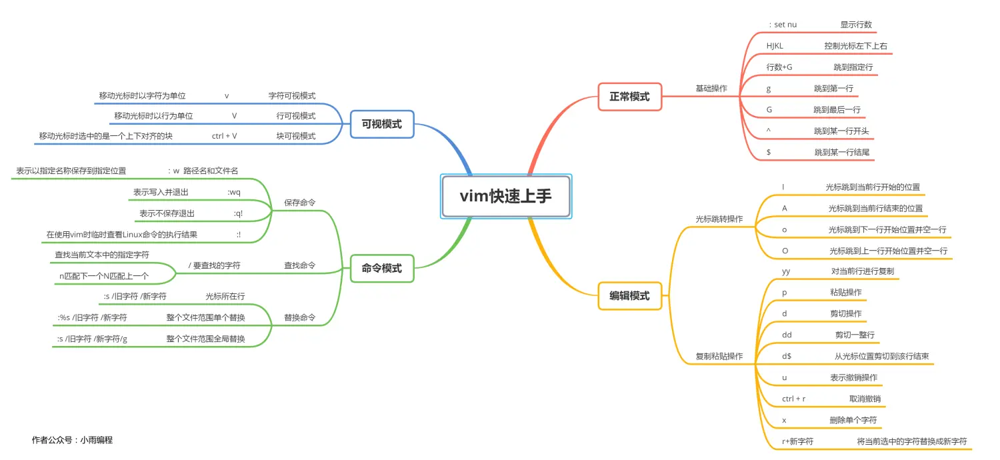

---
### 一、文本编辑器vim的使用
##### 1. 打开Vim
打开终端直接输入`vim`，即可打开Vim编辑器主界面
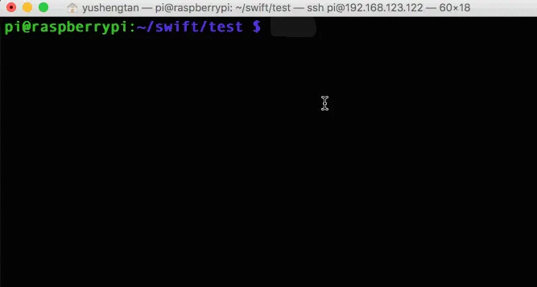

它是vi编辑器的一个拓展，通过键盘就可以完成大部分的文本操作。

##### 2. 退出vim
使用命令`:q`退出vim编辑器再按一个回车即可

##### 3. 进入编辑模式
输入`i`键，左下角会有一个`插入`字眼，进入insert模式（编辑模式），这时候我们按的所有的按键才会变成文本编辑，比如这里我们进入编辑模式，输入`hello world`。
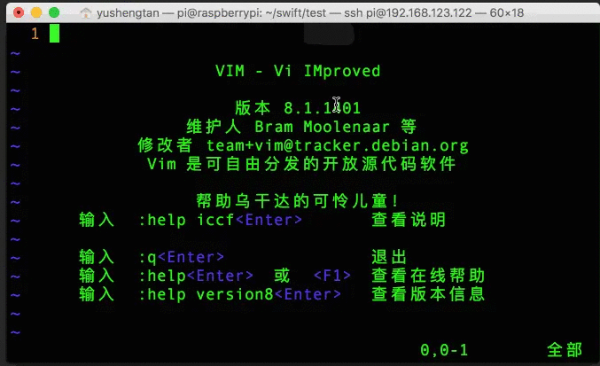

##### 4. vim的四种模式
* 正常模式（Normal-mode）
* 编辑模式（Insert-mode）
* 命令模式（Command-mode） 
* 可视模式（Visual-mode）

##### 5.设置搜索结果高亮
 vim打开搜索结果高亮可以使用命令`:set hlsearch`；
关闭搜索结果高亮`:set nohlsearch`
##### 6. 显示行数
输入`:set nu`即可显示每一行的行号，
如果想要不显示行号则使用命令`:set nonu`。
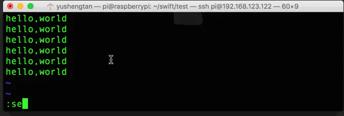

如果要让我们的设置在每次启动vim都生效，则需要修改vim的配置文件`/etc/vim/vimrc`，在最后一行写入一行指令`set nu`并保存即可。
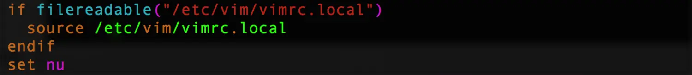

### 二、Vim的正常模式
##### 1. 进入编辑模式 
按`esc`进入正常模式，按键盘小写字母`i`进入编辑模式，光标保持在当前位置。除此之外，按下键盘`i、I、a、A、o、O`都可以进入编辑模式，不过光标的会跳到不同的位置。

按大写字母`I`，光标会跳到当前行的开始位置；
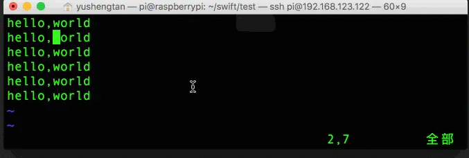
按小写字母`a`，光标会跳到下一个字符的位置；
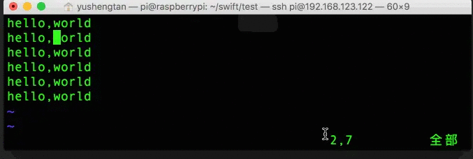
按大写字母`A`，光标会跳到当前行的结尾位置；
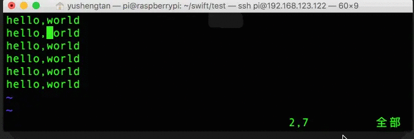
按小写字母`o`，光标会跳到当前行的下一行起始位置并空出一行；
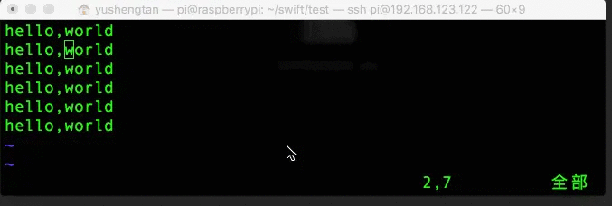
按大写字母`O`，光标会跳到当前行的上一行起始位置并空出一行；
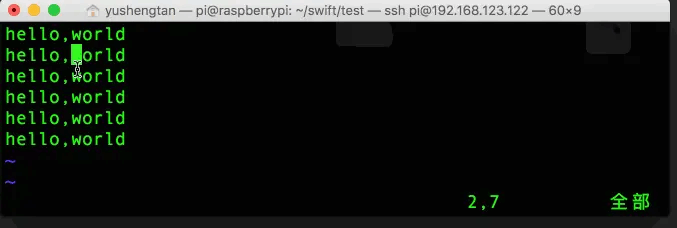

##### 2. 进入可视模式
按`v`键可以进入可视模式，这种模式在后面会继续详细讲解
##### 3. 进入命令模式
按`:`键可以进入命令模式，也成为"末行模式"
##### 4. 控制光标移动
通常我们习惯了使用键盘的上下左右键来控制光标的移动，实际上vim正常模式中可以使用键盘上的`H、J、K、L`来控制光标的`左、下、上、右`移动。
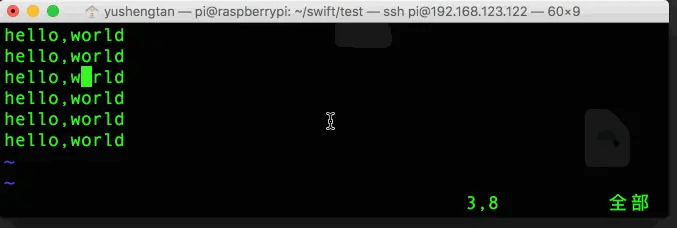

 （1） 光标跳到指定行
输入`行数`+`G`，光标即可跳转到指定行，比如这里我们光标要跳转到第5行，则使用命令`5G`即可。
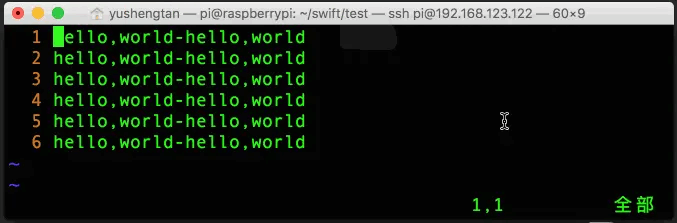
如果光标想要来到第一行，则直接输入小写的`g`
如果光标想要来到最后一行，则直接输入大写的`G`
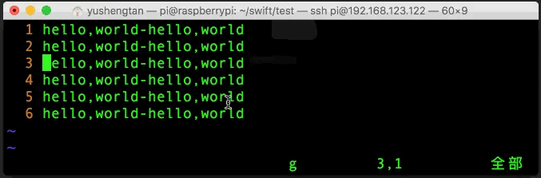

（2）光标跳转到某一行的位置
输入命令`^`，光标可以跳到该行的开头
输入命令`$`，光标可以跳到改行的结尾
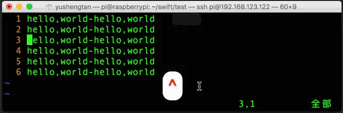

> 我们在使用`图形终端`对文本内容进行控制的时候，键盘上的`↑、↓、←、→`按键控制是有效的，但是在`字符终端`对文本内容进行控制的时候，输入`↑、↓、←、→`按键控制就有可能出现乱码。所以对于`H、J、K、L`还是希望大家能够掌握。

##### 5. 复制粘贴操作
（1）按行复制命令
光标移动到文本文件的某一行，输入`yy`，表示按行复制；

（2）对光标位置到该行的结尾进行复制
命令`y$`表示从当前光标复制到当前光标结尾

（3）多行复制命令
例如这里我们要讲第三行、第四行、第五行都进行复制，我们可以将光标移动到第三行，我们输入命令`3yy`，此时左下角就有提示：3 lines yanked复制了三行。

（4） 粘贴操作
命令`p`表示粘贴，如果需要将复制的内容多次粘贴，则多次按`p`键就可以了。
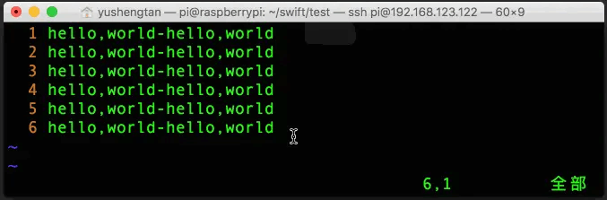

（5）剪切命令
命令`d`表示剪贴命令，同样，可以使用`dd`命令剪切一整行，使用命令`d$`表示从光标位置到剪切到这一行结束。
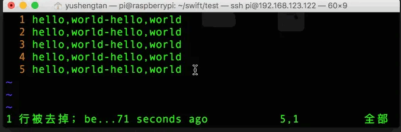

（6）撤销命令
命令`u`表示撤销上一步操作，如果需要多次撤销，则多次按`u`键就可以了
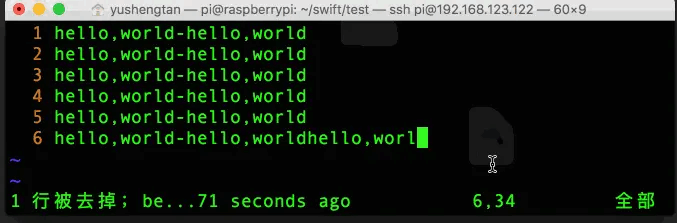

（7）错误撤销恢复
如果我们上一次的撤销错了，取消撤销，可以按`ctrl`+`r`恢复
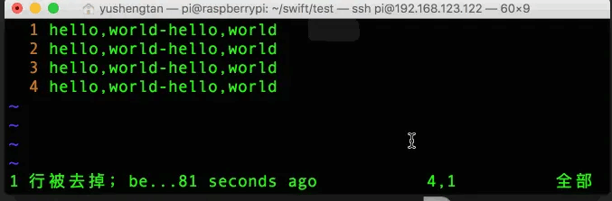（8）单个字符删除命令
命令`x`可以删除单个字符，如果要替换则按`r`+`要替换的新字符`，这里我们将`o`替换成`s`，则使用命令`rs`即可：
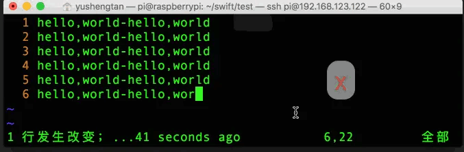

### 三、Vim的命令模式
vim命令模式主要用来文件的保存、退出、查找、替换
##### 1. 保存命令
(1) 在编辑模式中按`ESC`回到正常模式，输入冒号`:`此时我们所有的输入都会来到最后一行，输入命令`:w 路径和文件名`，即可以指定名称保存到指定路径。比如：`:w ~/a.txt` 表示在家目录下写入名叫 a.txt 的文件。
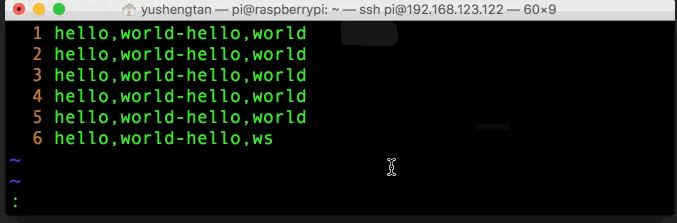

(2) 如果使用vim打开现有文件的话，可以使用命令`:w`直接保存到原始文件中

(3) `:wq`表示写入退出命令

(4) `:q!`表示不保存退出命令

(5)  `:!`表示在使用Vim时临时查看Linux命令的执行结果

##### 2. 查找命令
(1) 对于文本可以使用查找命令，使用`/要查找的字符`，如使用命令`/e`即可查找当前文本中的`e`字符。

(2) 如果文本中含有多个字符，则可以按`n`来自动查找下一个匹配的字符，按`N`键就可以查找上一个匹配的字符。这样就能对查找到的内容进行上下移动。
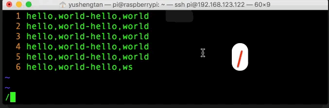

##### 3. 替换指令

(1) 将文本中的某个字符替换成新字符：
指令为`:s/旧字符/新字符`，当我们输入`:s/x/X`意识把字符`x`替换成`X`，但实际使用的时候，可能会出现以下命令：
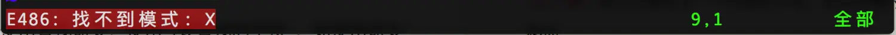
这是因为这个命令替换的范围是光标所在的这一行。

(2) 对整个文件范围进行单个替换：
使用命令`:%s/旧字符/新字符`，如在整个文件范围内，将`x`替换为`X`可使用命令`:%s/x/X`
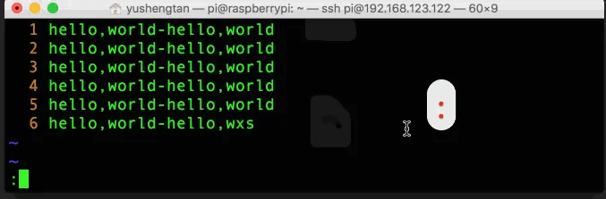

(3) 对整个文件范围将所有匹配的内容进行替换:
可以使用命令`:%s/旧字符/新字符/g`，这里`g`的意思代表的是`global`全局。比如我们要将整个文件中所有的的`h`都替换成`H`，则使用命令`:%s/h/H/g`
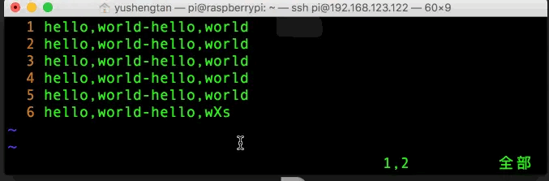

(4) 对指定行的关键字符进行替换：
比如我们需要将第三行与第五行之间的多次出现的字符'o'替换成'e'，则可以使用指令`:3,5s/o/e/g`
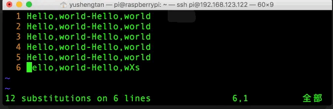

### 四、vim的可视模式
对于文件进行重复的大量操作，我们可以一次性的执行完成。
##### 1. 字符可视模式
按小写`v`  字符可视模式，移动光标时以字符为单位对文本进行选中；
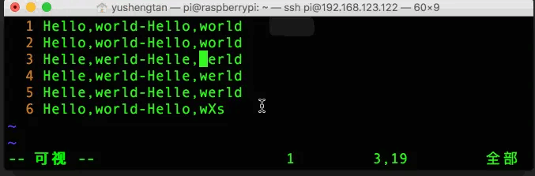

##### 2. 行可视模式
按大写`V`  行可视模式，移动光标时以行为单位对文本进行选中；
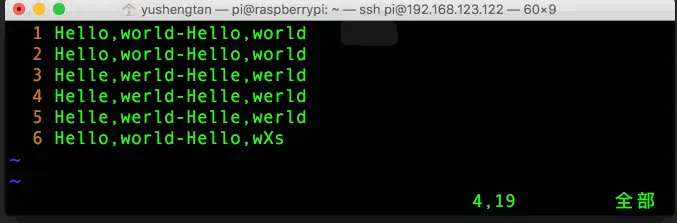

##### 3. 块可视模式
按`ctrl+v`  块可视模式,移动光标时选中的是一个上下对齐的块
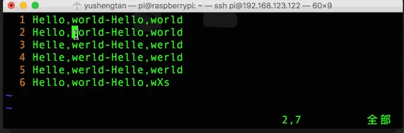

(1) 块插入
如果我们要对选中块的每一行开头都插入字符`123`，选中指定块后，按`I`键进入编辑模式而且光标进入行开始位置，输入我们想要输入的字符后，再按一下`esc`键就可以对每一行的开头都插入字符`123`的操作。
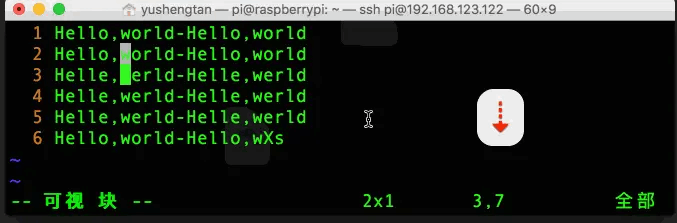

(2) 块删除
我们可以选中指定块，直接按`d`键进行删除。
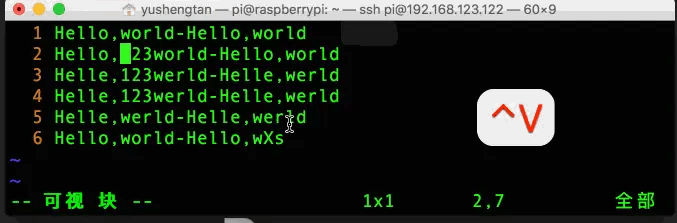

> 更多精彩内容，欢迎关注公众号”小雨编程“