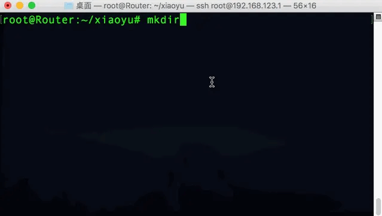
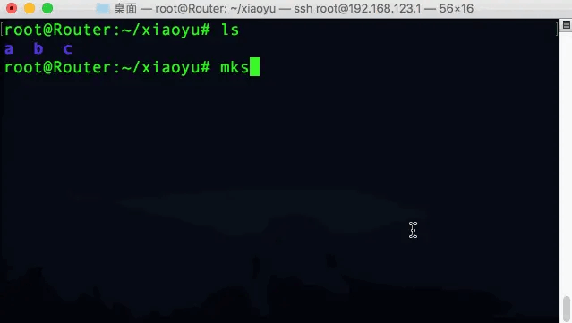
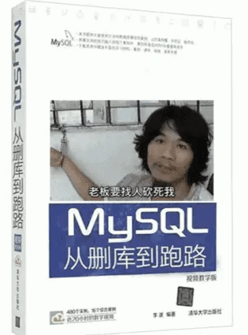
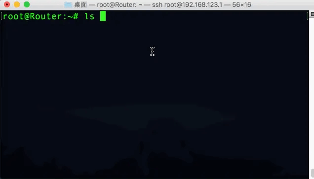
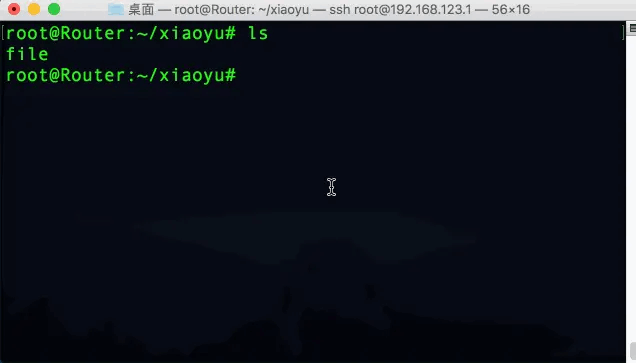
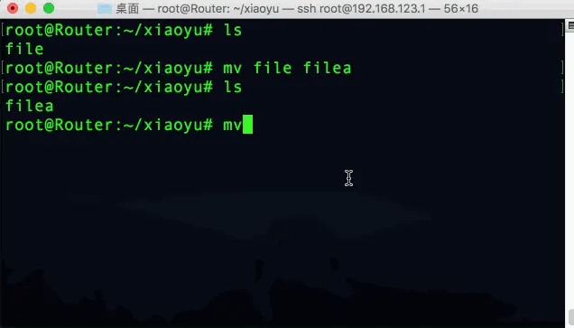
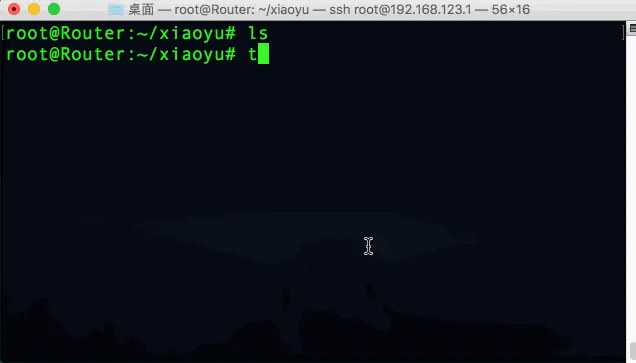

### 一、创建和删除目录
##### 1. `mkdir`命令
使用命令`mkdir 目录名`可以在当前目录再创建一个指定目录名;

（1）同时创建多个目录
* `mkdir a b c` 同时创建a、b、c三个目录

此时目录中已经存在了三个目录`a`、`b`、`c`，如果我们再使用命令:
```
mkdir a
```
再创建一个同名的目录a就会操作失败，因为当前目录中已经存在目录a了，再创建同名目录，系统会阻止其创建；


但是我们可以使用：
```
mkdir a -p
```
来忽略已有目录存在的报错，覆盖式的再创建一个目录a，而且如果这个目录a里之前是有文件的话，它是不会丢失的；

（2）同时创建多级目录
配合cd命令创建多级目录，这是一个常规操作。但是我们是可以直接创建多级目录的，


使用命令：

```
mkdir -p a/b/c
```
创建多级目录，效率会高很多；

##### 2. `rmdir`命令
`rmdir`删除目录（只能删除空目录）
* `rm -r 目录`删除非空目录
* `rm -r -f 目录`无提示删除非空目录可以合并为 `rm -rf `
我们要谨慎使用这个命令，否则就真删库跑路啦😂

所以这里面这个`sudo rm -rf /`无提示以管理员用户命令删除根目录😂

### 二、复制和移动目录
##### 1. `cp`命令

（1）复制文件和目录
* `cp 源目录 目标目录` cp单独使用只能复制文件，如果需要复制目录的话需要加`-r`，
```
cp /root/a /tmp
```
意思是将根用户目录下的a目录复制到tmp目录下


*  `cp -v 源文件 目标目录` 参数`-v`能显示复制的过程
* `cp -p`复制时保留原有的时间
* `cp -a`复制时保留原有的权限、属组、时间

##### 2. `mv`命令
`mv`文件和文件夹的移动功能、重命名功能
（1）将原文件名改为新文件名
我们可以使用命令`mv 原文件名 新文件名`：
```
mv file filea
```
将文件名`file`改为`filea`


（2）将文件移动到目标文件夹
我们可以使用命令`mv 要移动的文件 目标文件夹` 
```
mv filea /tmp
```
将文件`filea`移动到`/tmp`目录下


（3）将文件移动的同时重命名
我们可以使用命令` mv 文件夹中的文件 目标目录及新文件名`
```
mv /tmp/filea /fileb
```
将tmp文件夹下的文件filea移动到根目录下，并重命名为fileb


##### 3. 通配符

我们先创建文件4个以file开头的文件`fileaa`、`fileabc`、`filea`、`fileb`、`filec`


当我们使用`file*`时，系统会匹配到`fileaa  fileabc fileb filec`file后任意个字符，
而使用`file?`只匹配到了` fileb filec`file后单个字符；
表明：
*  `*`通配任意个字符
* `?`通配单个字符