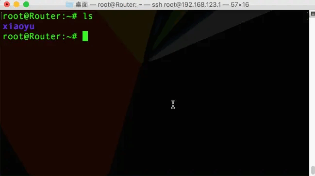
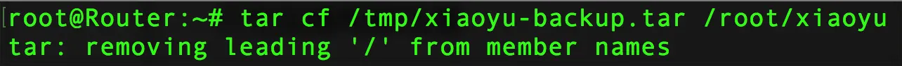
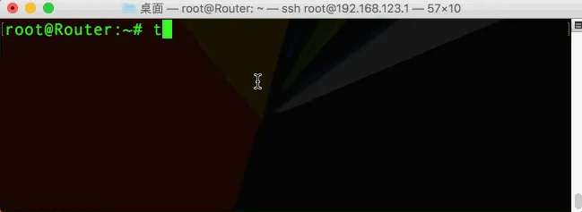
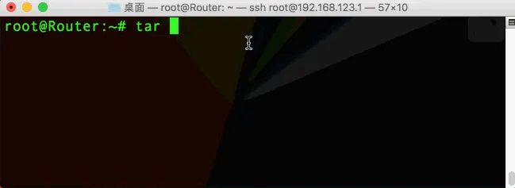
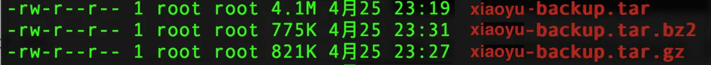
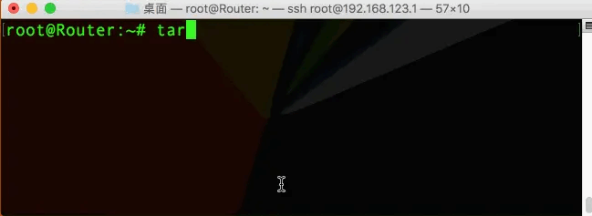

### 一、 打包
我们的根目录下有一个`xiaoyu`文件夹，现在我们要将它打包成一个文件，我们可以使用命令：
```
tar cf /tmp/xiaoyu-backup.tar /root/xiaoyu
```
这里的意思是：将`xiaoyu`目录打包成`xiaoyu-backup.tar`文件放在`/tmp目录下`

##### 1. 相关知识
`tar cf 目标目录及文件名 要打包的目录`，
* 参数`c`表示为打包
* 参数`x`表示为解包的意思 
* 参数`f`表示打包成文件的意思
* `tar`打包命令参数可以不需要用`-`

##### 2. 实际运行

实际在Linux下运行这个命令时，会报错：

因为在Linux系统下，使用tar命令对文件进行打包时，一般不建议使用绝对路径；

#####  3. 解决办法
（1）相对路径解决法
我们只需要将待打包的文件目录换成相对路径即可，如果我们当前已经在根用户目录下，可以使用
```
tar cf /tmp/xiaoyu-backup.tar ./xiaoyu
```


意思是将当前目录下的`xiaoyu`文件夹，打包成`xiaoyu-backup.tar`的包，放在`/tmp`目录下

（2）添加参数`P`
或者我可以给tar命令添加一个参数`P`，就会按照原来的绝对路径打包
```
tar cPf /tmp/xiaoyu-backup.tar /root/xiaoyu
```

> 请谨慎使用这个参数，加这个参数，就会按原来的绝对路径解压，如果目标路径有相同文件，会覆盖原文件

### 二、打包压缩
##### 1. 使用`gzip`进行压缩
我们希望能在打包的同时进行压缩，可以使用命令：
```
tar czf /tmp/xiaoyu-backup.tar.gz ./xiaoyu
```
参数`z`表示打包的同时进行gzip压缩，使用双扩展名表示：打包的同时也进行了压缩。


##### 2. 使用`bzip2`进行压缩
如果使用bzip2进行压缩，则需要使用参数`j`
```
tar cjf /tmp/xiaoyu-backup.tar.bz2 ./xiaoyu
```

于此同时，打包压缩的文件后缀则改为`bz2`，它压缩比率高，速度相对于`gzip`慢。
这里我们可以分别看一下它们的大小：

bz2文件比gz文件更小，说明bzip2的压缩率比gzip高；

### 三、 解包

解包需要将打包参数`c`换成解包参数`x`
`tar xf 指定目录下的文件 -C 要放放位置`解包指定目录下的文件放在指定的目录
```
tar xf /tmp/xiaoyu-backup.tar -C /root
```
将`tmp`录下的`xiaoyu-backup.tar`文件解包至`/root`目录下。



> 补充知识：我们经常会看到一些压缩扩展名`tbz2`和`tgz`，其实它们是`tar.bz2`和`tar.gz`的缩写。