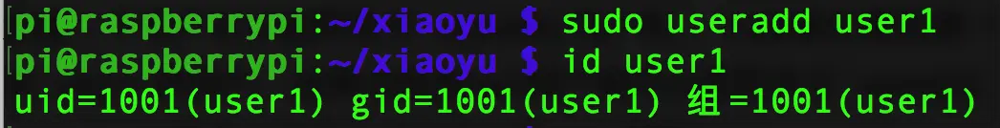
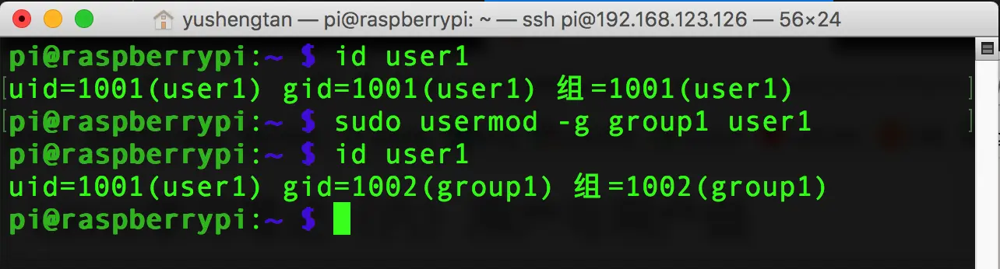
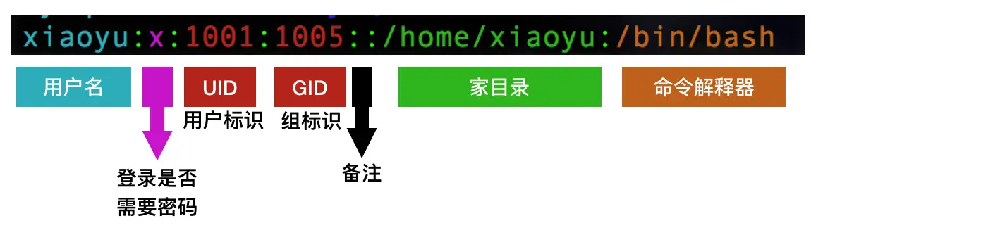
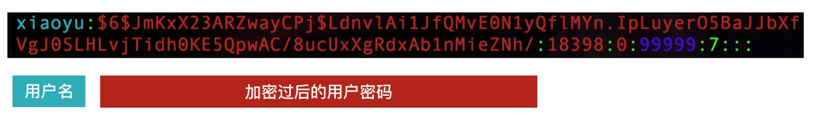
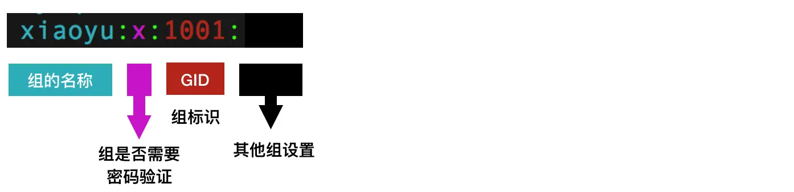
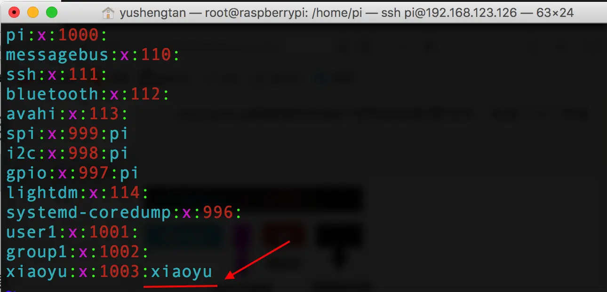
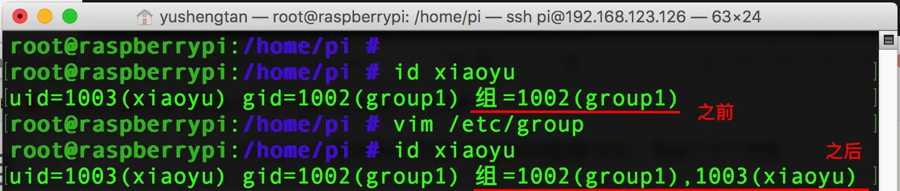

### 一、用户管理常用命令
* `useradd` 新建用户
* `userdel` 删除用户
* `passwd` 修改用户密码
* `usermod` 修改用户属性
* `chage` 修改用户属性
##### 1. 新建用户
新建一个用户可以使用命令`useradd 用户名`，比如我们要新建一个叫`user1`的用户，如果当前是root用户就可以使用命令`useradd user1`，如果是普通用户想创建新用户就需要加上`sudo`命令
##### 2. 查看已经存在的用户
我们可以使用`id 用户名`查看系统中已经存在的用户名，这时我们可以查看一下，我们刚才新建的用户是否成功创建`id user1`


##### 3. 给指定用户设置密码
我们可以使用`passwd 用户名`给指定用户名设置密码，如果我们想给user1修改密码可以使用命令
```
sudo passwd user1  /*修改user1用户的密码*/
```
如果要更改自己的密码，可以直接使用命令`passwd`按回车就可以了

##### 4. 删除用户
使用`userdel 用户名`可以将普通用户删除掉

##### 5. 修改用户账号相应信息
使用`usermod -d 目录 用户`如`usermod -d /home/newhome user1`，就可以将用户`user1`的家目录设置为`/home/newhome`

---
##### 小提示：
当使用useradd创建用户时出现`Creating mailbox file: 文件已存在`错误时该怎么办？


##### 解决办法：
linux系统中添加用户后,会在系统里自动加一个邮箱(系统邮箱)，路径是`/var/spool/mail/用户名`我们可以直接用命令`rm -rf /var/spool/mail/用户名`删除邮箱文件，这样就可以正常添加用户了。

##### 6. 切换用户
`su - USERNAME` 使用login shell方式切换用户

### 二、组管理命令
##### 1. 新建用户组
使用命令`groupadd 组名`新建指定组名的用户组，如`groupadd group1`新建一个名为group1的用户组；
##### 2. 将指定用户设置为指定组名
我们可以使用命令`usermod -g 组名 用户名`给用户分配指定组，如`usermod -g group1 user1`即可将用户`user1`的用户组设置为`group1`；


##### 3. 新建用户之间指定组
使用命令`useradd -g group1 user2`，表示直接新建一个`user2`用户，并设置其组为`group1`
> 注意：新建用户并指定组，这个组必须是已经存在的组，useradd命令不可以创建组，创建组必须用groupadd命令
##### 4. 删除用户组
使用命令`groupdel 组名`删除指定用户组


### 三、用户和用户组的配置文件
Linux中用户和用户组的配置文件主要有3个，
* `/etc/shadow`
* `/etc/passwd`
* `/etc/group`
##### 1. /etc/passwd中的7个常用字段
我们使用vim打开`/etc/passwd`，文件末尾可以看到我们新建的用户配置信息：


它具有7个字段，第一个字段表示`用户名`；第二个字段表示登录是否需要密码，这里我们如果显示`x`则表明需要密码，如果没有`x`则表示登录该用户不需要使用密码；接下来的第三第四个字段分别是用户的`UID`识别用户的标识和`GID`组标识；第五个字段表示注释，第六个字段表示用户的家目录在哪一个位置；第七个字段是：用户登录的命令解释器，表示用户登录以后使用哪个命令解释器来解释你输入的命令。

##### 2. /etc/shadow文件
/etc/shadow是用来保存用户和用户密码相关信息的，这里我只需要了解前两个字段的含义：



第一个字段是用户名称；
第二个字段是用户加密过后的密码，`$ $`符号中间的字符保证了，即使用户设置了多个相同的密码，在这里保存的加密结果也是不同的，有效防止别人破解你的简单密码。

##### 3. /etc/group文件
/etc/group用来保存和用户组相关的配置文件，包含了4个字段


* 第一个字段表示：组的名称

* 第二个字段表示:登录该组是否需要密码验证，x表示需要；

* 第三个字段表示：组标识

* 第四个字段表示：关联其它组设置，如果这里写入某个用户名比如xiaoyu，


则当我们查看用户xiaoyu的id信息时，组标签字段会多一个标识，可以看到多的字段为关联组名xiaoyu
