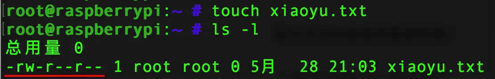
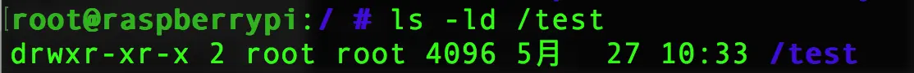
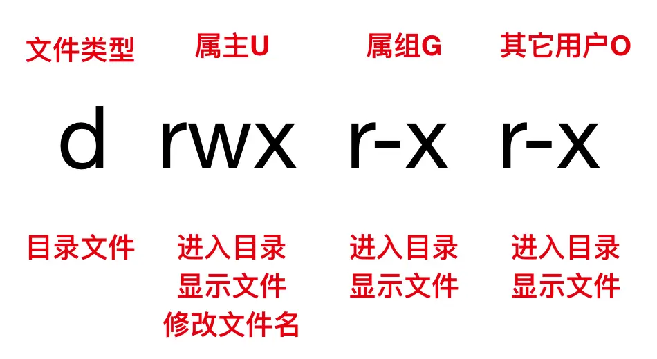
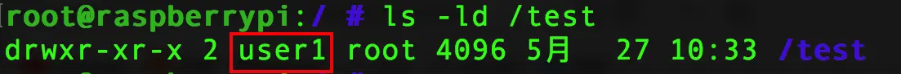
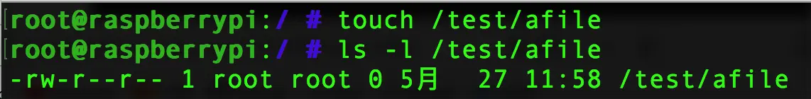
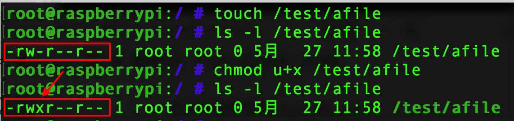
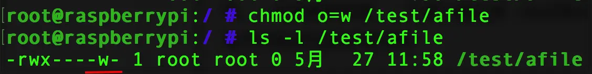
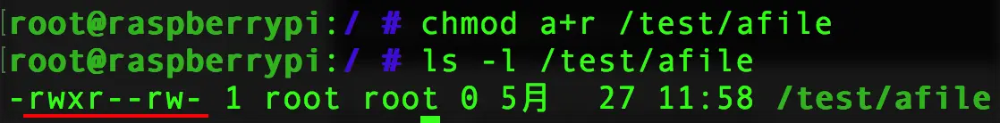
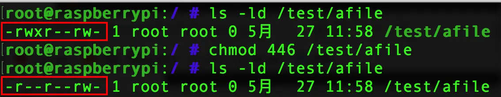
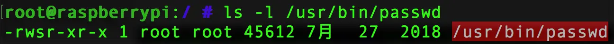

本节我们学习关于Linux文件权限的知识：
### 一、文件与目录权限的表示方法
首先我们在查看Linux文件的详细信息使用`ls -l`的时候，可以查看文件的名称及各种属性，属性的第一个字符就代表了文件的类型。
我们在根用户家目录下创建了一个`xiaoyu.txt`的文本文件，查看其详细的文件属性时，第一个权限符号即为文件的类型，这里`-`代表的是普通文件。


那么文件的类型有哪些种呢？

##### 1. 文件类型（七种类型）
* `-`普通文件
* `d` 目录文件
* `b` 块特殊文件
* `c` 字符特殊文件
* `l` 符号链接，类似于windows里的快捷方式
* `f` 命令管道
* `s`套接字文件

在初学阶段我们遇到比较多的还是目录文件`d`和普通文件`-`，在查看文件详细属性的时候，还有一大串`rw-r--r--`，它们又代表什么意思呢？其实，这些`rwx`其实是不同用户对文件所拥有的权限，那么用户对文件的权限有哪些呢？我们就来看看文件权限由哪些表示方法吧！

##### 2. 文件权限的表示方法

（1）字符权限的表示方法：
* `r`代表`可读`
* `w`代表`可写`
* `x`代表`可执行`

（2）数字权限的表示方法：
这些`rwx`其实是可以用阿拉伯数字替换的，其中：
* `r` = 4
* `w ` = 2
* `x` = 1

（3）目录权限的表示方法：
* `x` 代表`进入目录`
* `rx` 代表`进入目录并显示目录内的文件名`
* `wx` 代表`修改目录内的文件名`

以上我们了解了这些字符所代表的文件权限，那么我们该怎么进行权限的修改呢？

### 二、文件权限的修改方法

在Linux系统中通常使用`chmod`修改权限，我们可以用字符的方式进行修改,也可以用数字的方式进行修改。
```
chmod u+x /tmp/xiaoyu
chmod 755 /tmp/xiaoyu
```
Linux中为了安全的管理文件，一个文件可以被它的主人(u)所使用，称为属主；也可以被它主人同一组的人(g)使用，称为属组；也可以被跟它主人不是同一组的人(o)使用，称为其它用户。不同身份的人，对同一个文件有着不同的权限，有的人可以读、有的人可以写、有的人可以执行，那么如何进行权限分配与修改呢？这就是我们这一节所要重点要讲的内容。

Linux系统中的文件，我们要修改属组、属主通常使用命令
`chown`，而使用命令`chgrp`，可以单独更改属组，但是这个命令不常用。

我们首先在根目录下创建一个`test`目录，
```
mkdir /test
```
我们来查看一下该目录的权限
```
ls -ld /test
```

属性解析:




首先这是一个目录文件，这里我们可以看到root用户有进入目录查看目录文件修改目录文件的权限、同组用户和其它用户进入目录并查看文件内容的权限。但是要注意root用户是没有权限限制的，即使这里什么权限都没有标识，root用户仍然可以读取与修改。

### 1. 修改目录的属主
这里test目录的属主是root 用户，我们把它的属主改为user，可以使用命令`chown <属主> <目录>`
```cpp
chown user1 /test
```
我们再次查看该目录的详细信息时，就会发现其属主已经改为了user1用户



### 2. 修改目录的属组
这里我们test目录的属组是root组，我们将其属组修改为group1，可以使用命令`chown :属组 目录`
```cpp
chown :group1 /test
```

我们再次查看该目录的详细信息时，其属组信息已经改为了group1组


前面说了，我们修改属组也可以使用命令`chgrp <属组> <目录>`也可以进行属组的修改；
```
chgrp group2 /test
```

##### 3. 修改权限（字符方式）

首先我们在/test目录下创建一个`afile`文件，查看一下它的属性


可以看出属主是读写权限，属组与其他用户都只有读的权限。

（1）如果这时候我们想让其属主有执行的权限，可以使用命令
```cpp
chmod u+x /test/afile
```
> 注意：这里`u`代表属主、`g`代表属组、`o`代表其他用户、`a`代表全部用户，`+`代表添加权限、`-`代表删除权限、`=`代表设置权限（无论我们之前有什么权限，这里可以直接设置成某权限）



这时我们发现afile文件的属主多了执行权限。


（2）同理，我们若想让属组去掉读权限，可以使用命令：
```cpp
chomd g-r /test/afile
```
查看一下现在的afile文件权限信息：


属组已经没有了读权限。

（3）如果我们想给其它用户设置一个写权限，可以使用命令：
```
chmod o=w /test/afile
```
现在查看一下afile文件的权限信息：

现在其它用户对afile文件有了写权限。

（4）如果要给所有的用户读权限，可以使用命令：
```
chmod a+r /test/afile
```
现在查看一下afile文件的权限信息：

现在所有的用户都有了读权限。
以上，我们都讲解的是字符方式修改权限，其实Linux系统同样支持数字方式修改，我们只需要了解一个等价代换关系即可：
读权限是4、写权限是2、执行权限是1，就可以用数字方式实现对文件权限 修改。

##### 4. 修改权限（数字方式）
如果我们要给上面的afile文件设置权限为：属主读权限、属组读权限、其它用户读权限和写权限；可以使用命令：
```
chmod 446 /test/afile
```
现在afile文件的权限信息：

现在我们已经发现文件的权限已经按照指定要求发生了改变。

### 三、特殊权限
SUID 用于二进制可执行文件，执行命令时取得文件属主权限，如/usr/bin/passwd
我们查看`usr/bin/passwd`文件的权限信息时：


我们发现文件属主权限是本来是`x`的位置现在是`s`，意思是我们不管是root用户还是普通用户在执行这条命令的时候，它都会以文件的属主root身份来进行一个操作。
Linux系统这样设计的目的是为了什么？目的是为了这样普通用户也能获得修改自己的密码权限。

好了，今天就说这么多，下一节我们继续讲解Linux系统的网络管理。