关于Linux网络管理我们要学习的内容有：
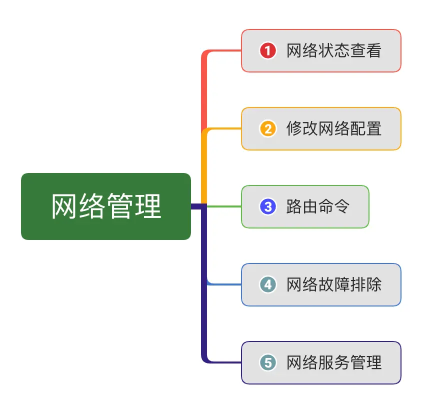


### 一、网络状态查看工具

##### 1.介绍两个网络工具`net-tools`和`iproute`
net-tools，一般用于centOS之前的版本；iproute2，centOS7之后的发行版本
##### 2. 网络接口命名参数修改
网卡命名规则受`biosdevname`和`net.ifnames`两个参数影响
如果你的网卡名不是eth0怎么设置为eth0呢？

（1）编辑`/etc/default/grub`文件
增加biosdevname = 0 net.ifnames=0
（2）更新grub
grub是系统再刚开始启动的时候，它引导系统内核的工具，跟启动菜单一样，我们可以设置一些参数，让它传递到我们的内核。
```
grub2-mkconfig -o /boot/grub2/grub.cfg
```
（3）重启
```
reboot
```

重启后网卡的名称便发生了改变；

---
**修改网卡成其它名称:**
|       | biosdevname | net.ifnames | 网卡名 |
| :---: | :---------: | :---------: | :----: |
| 默认  |      0      |      1      | ens33  |
| 组合1 |      1      |      0      |  em1   |
| 组合2 |      0      |      0      |  eth0  |

##### 3.查看网络情况
查看物理网卡连接情况，可以使用命令：
```
mii-tool eth0
```
如果网线没有接好的话，会显示no link


如果接好网线的话，会显示link ok


##### 4. 查看网关（路由）命令
我们可以使用命令`route`命令查看网关，使用`-n`参数表示不解析主机名
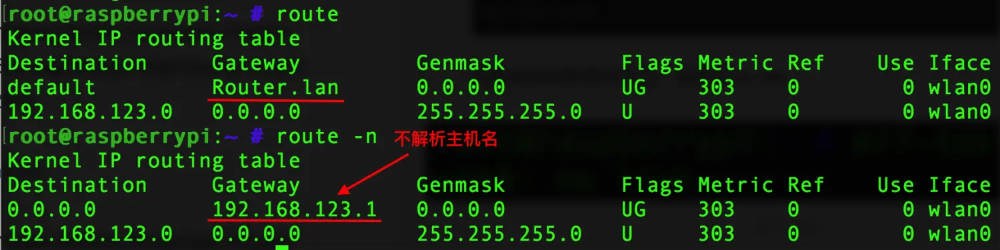

### 二、修改网络配置

##### 1. 设置网卡的IP地址
使用命令`ifconfig <接口> <IP地址> netmask [子网掩码]`
 原始的IP地址是192.168.123.159
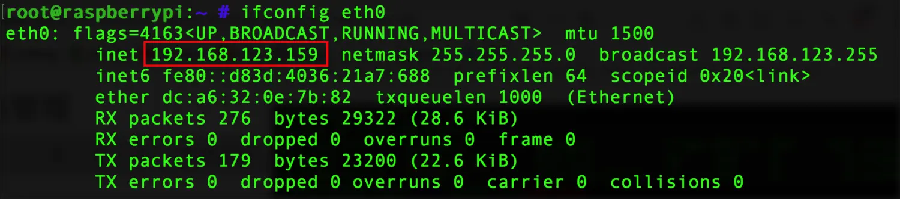
设置网卡新的IP地址192.168.123.158
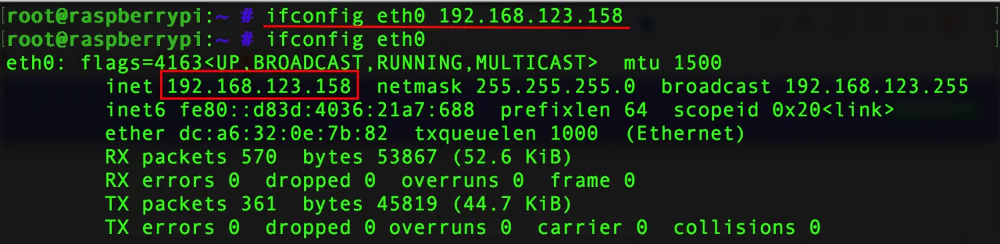

##### 2. 启动网卡
使用命令`ifup 接口`
```cpp
ifconfig eth0 up  /*常规写法*/
ifup eth0  /*简写*/
```
##### 3. 关闭网卡
使用命令`ifdown 接口`，同样的道理可以写成：
```cpp
ifconfig eth0 down
ifdown eth0
```

##### 4. 添加默认网关
这个过程需要分两步：
我们可以看到目前系统初始网关是`192.168.123.1`，
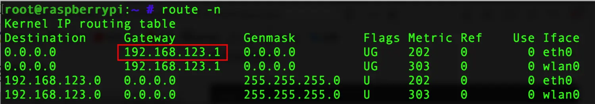

* 第一步：我们修改默认网关，需要先把原网关删除掉，可以使用命令：
```
route del default gw 192.168.123.1
```
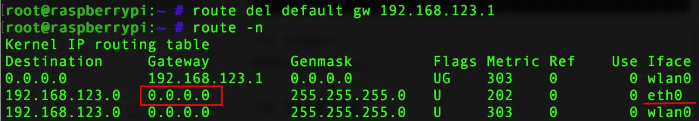
这里我们已经把原网关删除了，eth0网关现在是`0.0.0.0`

* 第二步：再添加新的网关，使用命令：
```cpp
route add default gw 192.168.123.2
```
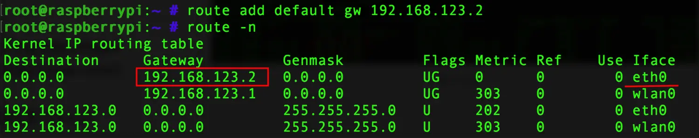

这样我们就把网关改成了192.168.123.2

### 三、路由命令
##### 1. 添加明细路由
使用命令`ruote add -host 指定ip gw 网关ip`
我们想访问某个主机的IP，它的IP地址是10.0.0.1，那么我们就需要使用命令：
```cpp
router add -host 10.0.0.1 gw 192.168.123.2   
```
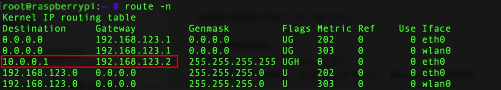

当主机访问ip10.0.0.1时，数据包走网关192.168.123.2

##### 2. 给指定网段添加明细路由
使用命令`route add -net 指定网段 netmask 子网掩码 gw 网关ip`
当我们想访问网段`192.168.0.0`这个网段时，数据包走网关`192.168.123.3`，那么我们就要使用命令：

```cpp
route add -net 192.168.0.0 netmask 255.255.255.0 gw 192.168.123.3
```
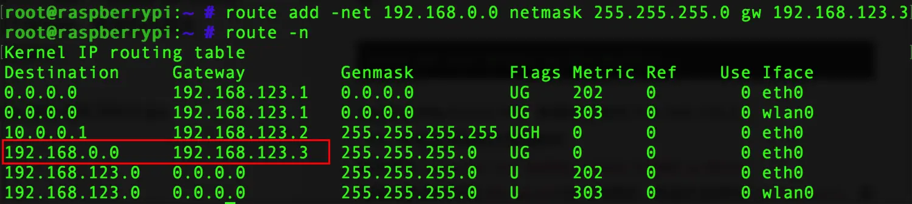

### 四、网络故障排除
我们配置好IP地址，设置好相应的服务之后呢，通常会出现一些故障，如何进行故障排除呢？常见的故障排除命令有：
##### 1. ping
 监测当前主机与目标主机是否畅通，如果ping不通，说明网络可能中断或者对方有防火墙。可以对IP进行ping操作，也可以对域名直接进行ping操作。
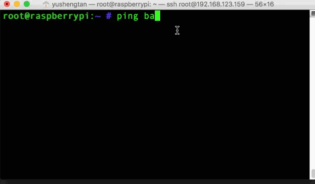

##### 2. traceroute
 检测当前主机到目标主机的状况，追踪服务器每一跳的质量，追踪当前主机到目标主机的网络状态。我们通常会添加一个参数`-w`意思是等待的时间，因为本机到达某个ip长时间没有响应，我们不想等它，只给它一个固定等待时间，超过了就停止等待。
```
traceroute -w 1 baidu.com  /*最多等待1秒*/
```
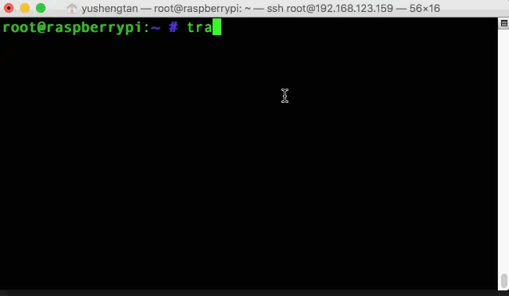
中间路由对应的IP地址会显示出来，以及它的延时是一个什么情况
中间主机如果不支持traceroute追踪，就会以* * *的方式显示。

##### 3. mtr
如果你想看到更详细的追踪数据，mtr是My TraceRoute的简写，可以实时查看丢包率等其他数据。
使用命令：
```
mtr baidu.com
```
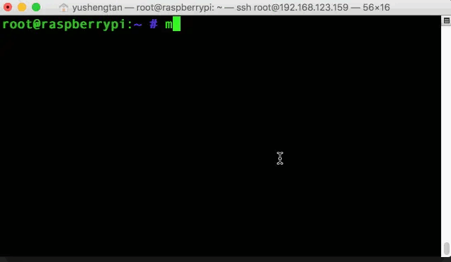
##### 4. nslookup 
 把域名解析成ip地址，可以使用命令：
```
nslookup baidu.com
```
我们就可以查看是哪一个域名服务器进行的域名解析，以及域名对应的IP地址是多少;
##### 5. telnet 
 如果网络是畅通的，主机能连接，但是服务用不了，使用telnet检测端口的状态，使用命令telnet检测端口是否畅通：
```
telnet baidu.com 80
```
如果本地主机与对方主机端口是可以的状态，则显示情况如下


##### 6. tcpdump  
更细致的分析数据包，使用网络抓包工具tcpdump
参数`-i any`表示要抓取所有网卡里的数据包，
参数`-n`数据包如果有域名的话，解析成ip的形式
参数`port 端口`抓取指定端口
```
tcpdump -i any -n port 80  /*监听任何主机的80端口*/
```
如果捕获到了数据包，就会详细的显示出来；
捕获某个主机，可以使用参数`host`
```
tcpdump -i any -n host 10.0.0.1
```
从我的主机到10.0.0.1所有的TCP的通信，都能被tcpdump所捕获下来。如果又想指定主机又想注定端口，可以在命令增加一个and参数：
```
tcpdump -i any -n host 10.0.0.1 and port 80
```
如果想把捕获的信息进行保存，可以再添加一个`-w`参数：
```
tcpdump -i any -n host 10.0.0.1 and port 80 -w /tmp/filename
```
##### 7. netstat  
查看提供服务的监听地址，经常使用的四个参数是：`-n`显示ip地址不要显示域名；`-t`以tcp的方式显示截取的内容；`-p`端口对应的进程也显示出来，`-l`监听服务
```
netstat -ntpl
```
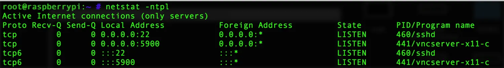

### 五. 网络服务管理
上面讲的一些命令实际上是对网络的临时控制，不管是网络测试还是配置的IP地址，这些参数会随着系统的重启网络服务的重启而丢失，这边我们希望在测试好这些数据后把参数固化下来；
管理配置文件程序分为两种：SysV和systemd(新版本)
网卡配置文件`ifcfg-eth0`；主机配置文件`/etc/hosts`通过这两个文件控制网络常用参数。
##### 1. 查看网络状态
```
service network status
```
##### 2. 网络配置初始化
```
service network restart
systemctl restart NetworkManager.service
```
让网络参数设置生效；
##### 3. 查看主机名
```
hostname
```
##### 4. 修改主机名
临时修改主机名
```
hostname 新昵称
```
如果想让主机永久生效，可使用命令：
```
hostnamectl set-hostname 新昵称
```
如果设置了新的主机名，要在`/etc/hosts`里声明，否则系统启动的时候在某个服务上会卡住，需要把主机名和对应的IP地址的关系写在上面。
**拓展**：以树莓派为例，其默认的主机名为raspberrypi，如何修改树莓派的主机名呢？
**方法**：使用命令`sudo vim /etc/hostname`将raspiberrypi修改成指定名字，再使用命令`sudo vim /etc/hosts`将ip127.0.0.1后的raspiberrypi修改成指定名字，最后再重启一下树莓派即可。