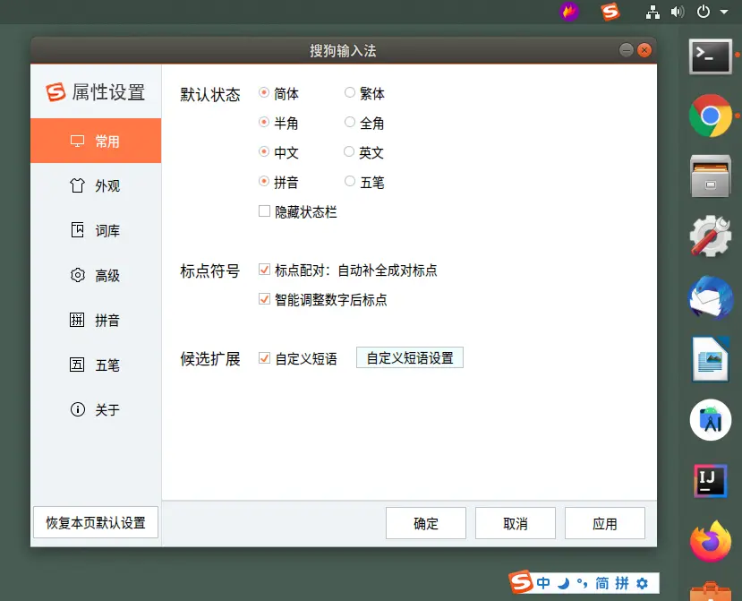
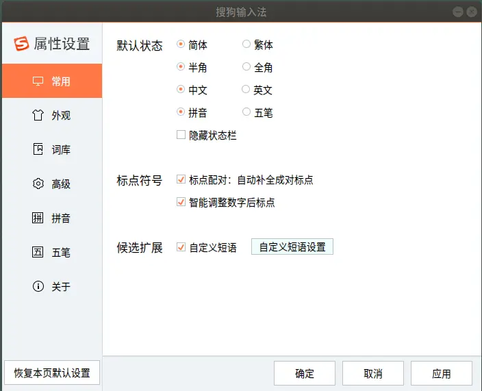
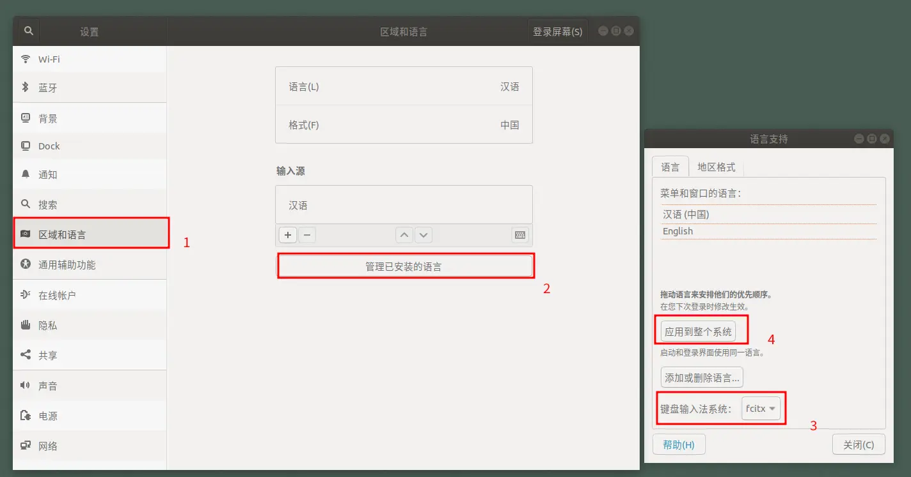

### 前言

>  Ubuntu系统搭建一个开发化环境几个命令就搞定了，但是如果装一个日常使用的搜狗输入法简直折腾得要命！




在搜狗输入法官网虽然提供了Linux版本，但是安装起来还是挺麻烦的，本文就介绍在Ubuntu上如何安装以及使用搜狗输入法（实际体验和Windows一样好）。

### 基础知识

Ubuntu上默认只能输入英文，如果想通过第三方输入法输入中文的话，需要安装键盘输入法系统，Ubuntu的键盘输入法系统通常有以下三种：

1. fcitx

2. IBUS 

3. XIM

而我们的一般要在Ubuntu上安装的谷歌输入法或者搜狗输入法，是需要在fcitx输入法系统的基础上进行安装的。如果你的Ubuntu系统上没有fcitx系统，那么执行以下操作后，系统会自动准备好fcitx系统。

### 安装步骤

##### 1. 添加Ubuntukylin源

该版本为麒麟社区定制版（兼容Ubuntu系统），我们需要安装ukui官方源，此源中包含了搜狗输入法麒麟版本

```shell
curl -sL 'https://keyserver.ubuntu.com/pks/lookup?&op=get&search=0x73BC8FBCF5DE40C6ADFCFFFA9C949F2093F565FF' | sudo apt-key add
```
```
sudo apt-add-repository 'deb http://archive.ubuntukylin.com/ukui focal main'
```
```
sudo apt upgrade
```

##### 2. 安装搜狗输入法

```shell
sudo apt install sogouimebs
```

##### 3. 打开搜狗输入法控制面板

```shell
sogouIme-configtool 
```
系统会自动打开搜狗输入法的配置面板


##### 4. Ubuntu系统设置

这一步是关键，也是难点。在Ubuntu系统中依次打开`设置-区域与语言-管理安装的语言`，打开语言支持面板，将键盘输入法系统选择为`fcitx`,然后点击应用到整个系统之后，重启Ubuntu就可以使用搜狗输入法了！



安装完毕后，键盘按键Ctrl+Space就可以成功调用搜狗输入法了！
### 可能遇到的问题及解决方案

##### 1. 键盘输入法系统fcitx为灰色

    手动安装fcitx包即可

```shell
sudo apt-get install fcitx
```

##### 2.搜狗输入法中英文切换冲突

打开`输入法配置`面板,在`全局配置`，`快捷键`，`切换激活/非激活输入法`,快捷键不要设置为`shift`即可

##### 3. 搜狗输入法状态栏与fcitx面板同时出现

在`输入法配置`，`外观`，`状态栏隐藏模式`中设置为`隐藏`即可

##### 4. 在Ubuntu系统下，间歇性输入断连
原因是ibus与fcitx冲突，禁用一下ibus即可。
```
sudo dpkg-divert --package im-config --rename /usr/bin/ibus-daemon
```

### 参考引用

[Ubuntu 20.04 LTS安装搜狗输入法，只需三条命令，还能自动更新 - ooosy - 博客园](https://www.cnblogs.com/cocode/p/12875555.html)
[Debian Wiki--禁用ibus](https://wiki.debian.org/InputMethodBuster)