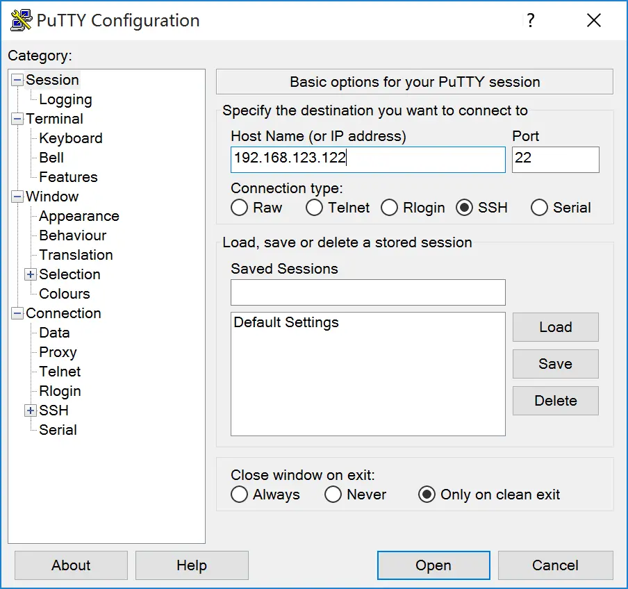
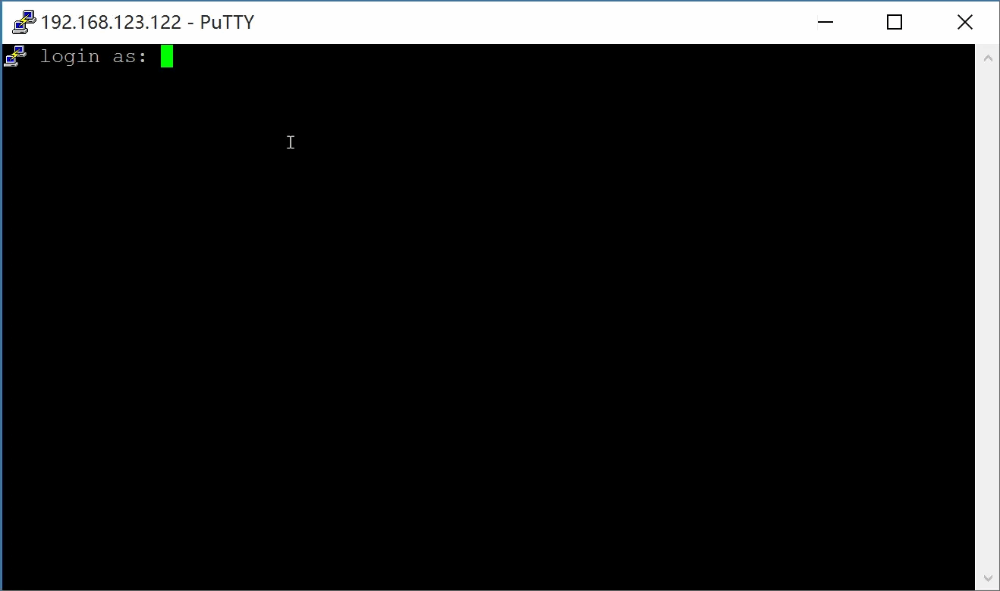
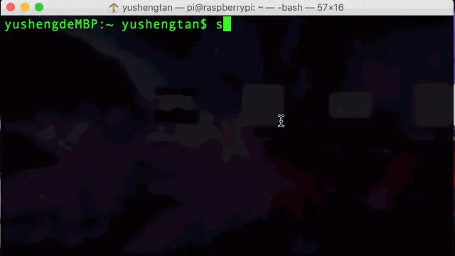
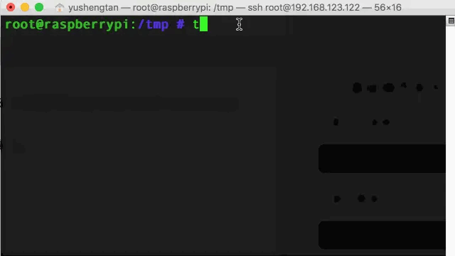
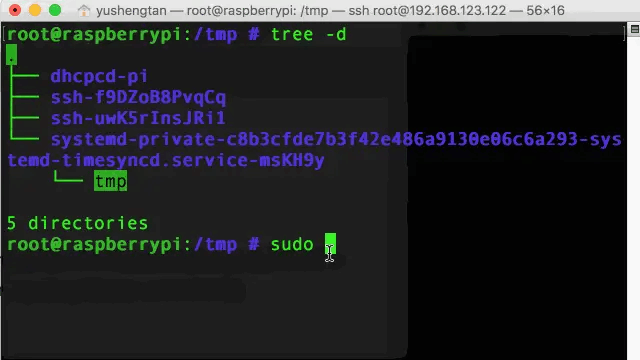
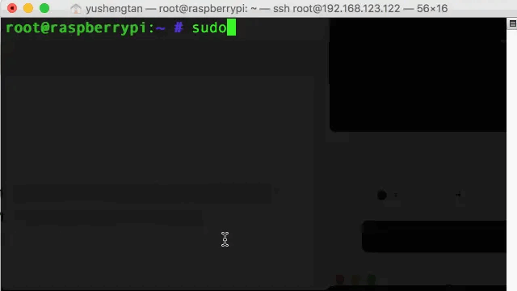
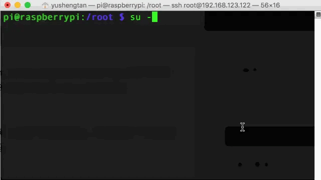
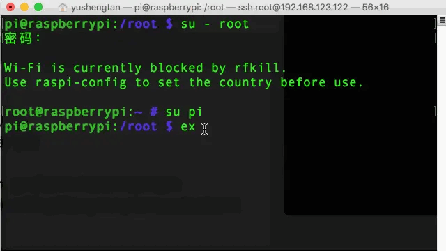
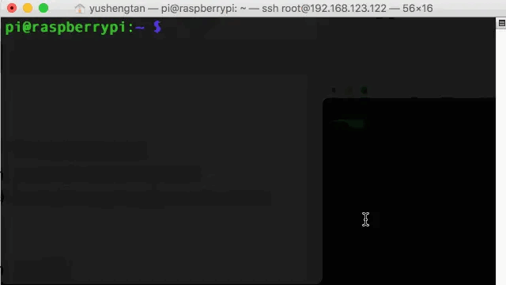

从GUI界面切换到命令行界面，对于初学者来说可能有一些不太习惯。本节介绍几个简单的命令，帮助大家了解使用Linux系统的方法。
### 一、连接Linux主机
我把接在路由器上的树莓派作为我的Linux主机，在路由器后台查看它的IP地址为`192.168.123.122`，树莓派的用户名可以为`pi`也可以`root`；

##### 1. Windows用户

在Windows平台下，我们可以使用putty工具连接，putty[下载链接](https://the.earth.li/~sgtatham/putty/latest/w64/putty-64bit-0.73-installer.msi)

（1）打开应用程序后，输入linux主机的ip地址
（2）再输入用户名和密码，就可以登陆了；



##### 2. Mac用户
Mac用户可以直接使用系统自带的Terminal终端软件，使用命令
```
ssh root@192.168.123.122
```


提示输入密码即可登录成功。

### 二、基础操作命令
##### 1. 显示目录树
```
tree -d
```


##### 2.关闭Linux主机
```
sudo halt
```

##### 3.重启Linux主机
```
sudo reboot
```


##### 4.切换用户
如果当前是普通用户切换为根用户则需要密码，如果根用户切换为普通用户则不需要输入密码
```
su - root   /*切换为根用户*/
su pi       /*切换为普通用户pi*/
```


##### 5. 退出登录
```
exit
```
普通用户退出登录后，会直接切换到根用户，`#`代表`root`用户，`$`代表普通用户。



##### 6. 命令行常用快捷方式
（1）清屏
`clear`或者`ctrl`+`L`，都可以实现清屏的效果

（2）翻查上一次输入的命令
按上下键可以切换上一次输入的命令
（3)搜索之前输入过的命令
可以使用`ctrl`+`r`搜索之前输入过的命令

##### 7. 万能帮助命令
`man`命令（man是manual的缩写）
举例 ：`<指令> --help`便获得该指令的帮助信息
```
man ls  /*指令ls的帮助信息*/
```
