### 一、文件查看命令
##### 1. `pwd` 命令
pwd命令可以显示当前所在目录的位置路径
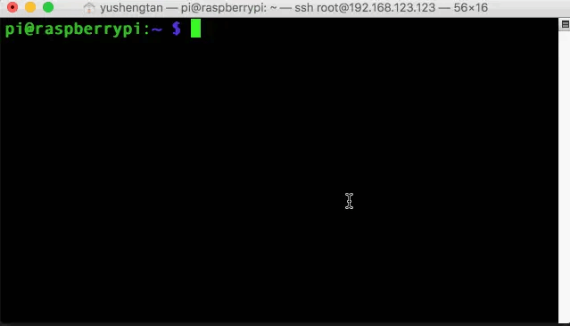

 ##### 2. ` ls` 命令
* ` ls` 查看当前目录文件列表， `ls` 也可以同时显示多个文件下的目录；

```
ls / /root  /*表示同时显示根目录和根用户目录*/
```
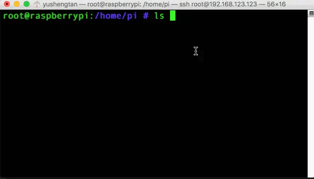
（1) 显示隐藏文件夹

* `ls -a`显示隐藏文件夹，在Linux系统中，加点号的都代表是隐藏文件或者文件夹，可以使用这个命令查看隐藏内容
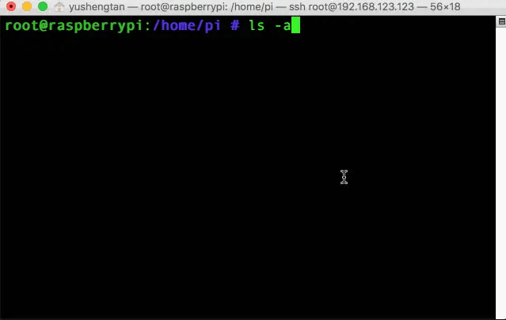

（2）显示文件夹详细信息

*  `ls -l`显示文件夹详细信息，默认是以文件名的首字母进行排序的，这里我们以`pi`用户的家目录为例查看详细信息：
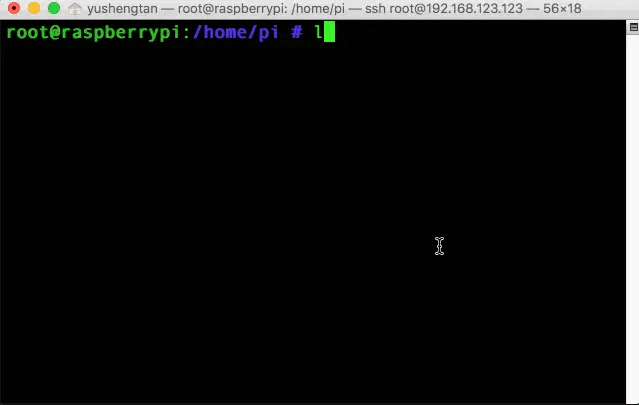


*  `ls -l -d 目录名`也可以简写成`ls -ld 目录名`可以查看指定目录的详细信息，比如当前目录中有一个文件夹叫`xiaoyu`，我们就可以使用命令：
```
ls -ld xiaoyu   /*显示指定文件夹xiaoyu的详细信息*/
```
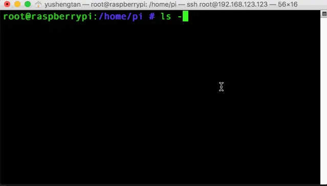

*  `ls -lh`显示详细信息的同时，能查看当前文件夹所占用的空间大小，文件的大小以`K`、`M`、或者以`G`为单位。
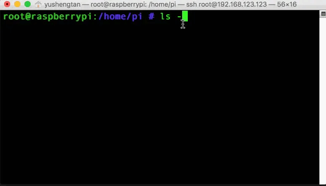

* `ls -l -r`逆向显示当前文件夹内容，我们可以写成`ls -lr`:
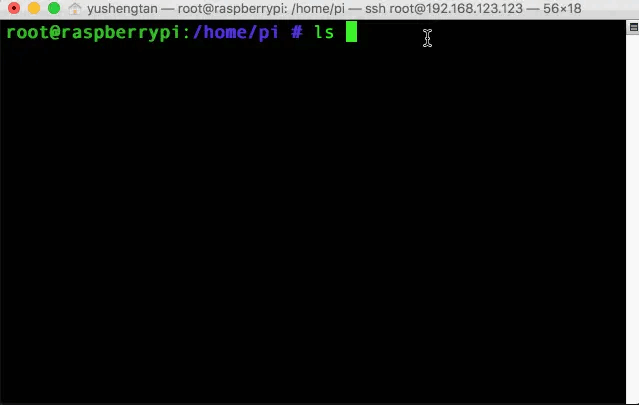

* `ls -l -r -t`以时间顺序逆向显示当前文件夹内容，这里简写成`ls -lrt`
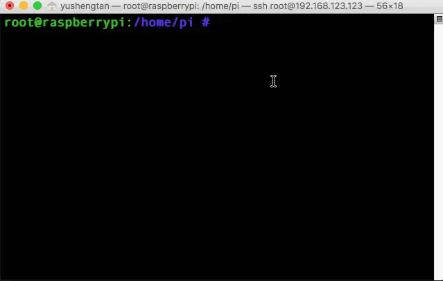
（3)递归显示文件和文件夹
* `ls -R` 递归显示，同时显示文件夹及子文件夹里的内容
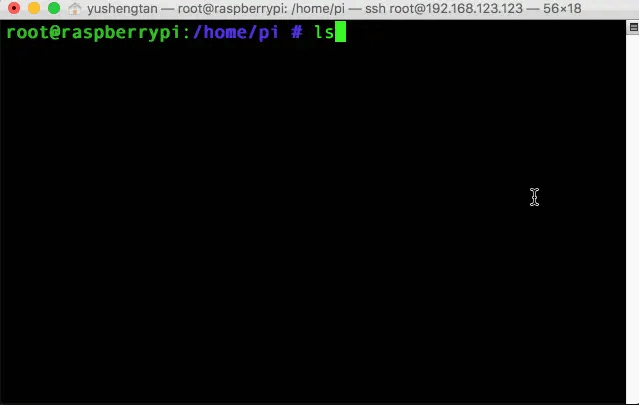

##### 3. `cd`命令
`cd` 更改当前操作目录
* `cd ./xiaoyu`这里的`.`表示当前目录开始，`./`也可以省略
`cd xiaoyu`表示从当前目录进入目录`xiaoyu`，继续输入命令`cd bianchen`表示继续进入子目录`bianchen`
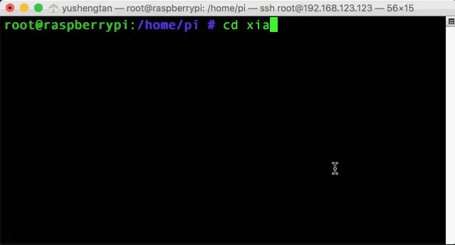

* `cd ../`返回上级目录，这里的`/`可以省略
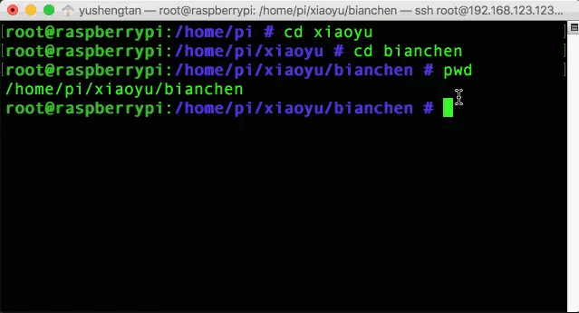
* `cd -`回到上一次访问的目录

### 二、文本查看命令
##### 1. `cat`命令
`cat`命令 将文本内容显示到终端
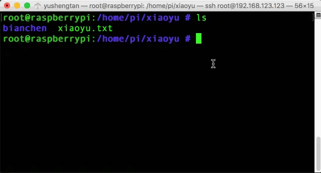

##### 2.`head`命令
`head`查看文件开头,这里我们打开一个有12行内容的文本文件
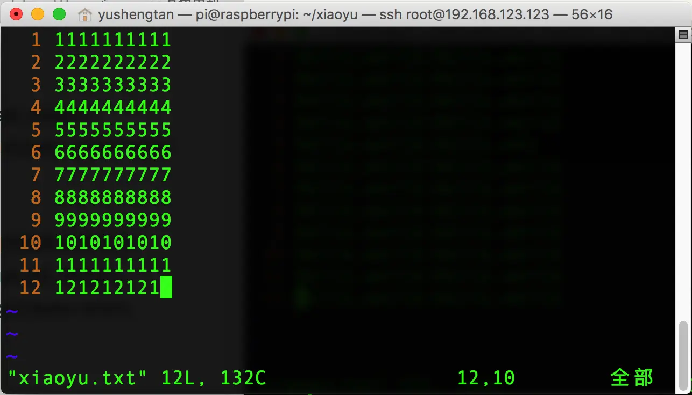
（1)查看文本内容头部
 `head 文件名`默认查看前10行文本内容
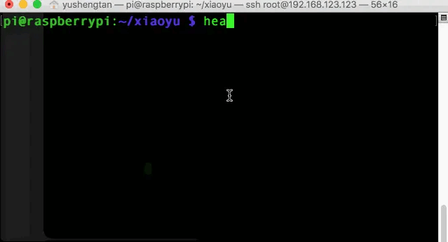

（2）查看指定行的文本内容
 `haad -5 文件名`查看前5行文本内容
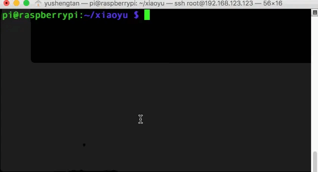

##### 3. `tail`命令
`tail`查看文件结尾
（1） `tail 文件名`查看后10行文本内容
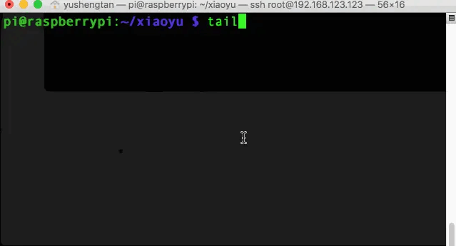

（2） `tail -3 文件名`查看后3行文本内容
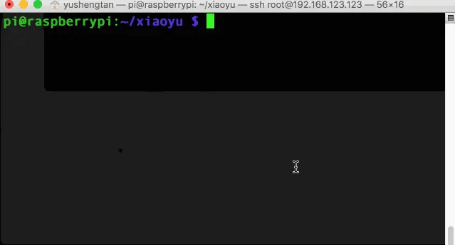

（3） `tail -f 文件名`查看实时变化的文本内容，实时更新，用于查看正在滚动的日志文件；


##### 4.`wc`命令
`wc`统计文件内容信息
`wc 文件名`统计文本文件有多少行，多少字符

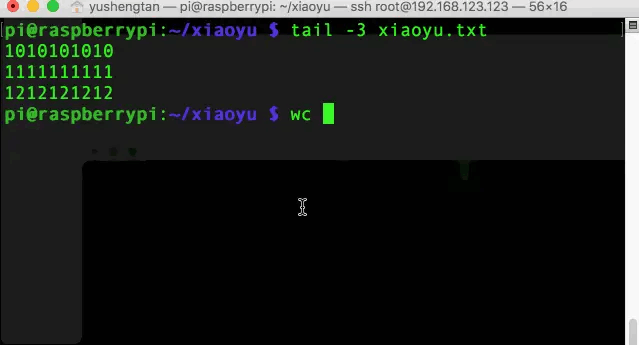
这里显示了，有12行，132个字符；

##### 5. `more`命令
 `more 文件名`百分比显示文本内容。如果某个文本文件内容很多，屏幕一次显示不完，使用该命令可以按百分比进度条显示文本内容。按`Enter`向下继续浏览文本内容，按 ` q`退出浏览；
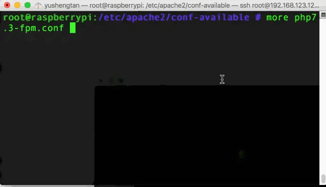