在Linux系统中有多种包管理器，这里我们学习一下软件是如何安装的？包管理器是如何使用的。本节我们将学习到的内容有：
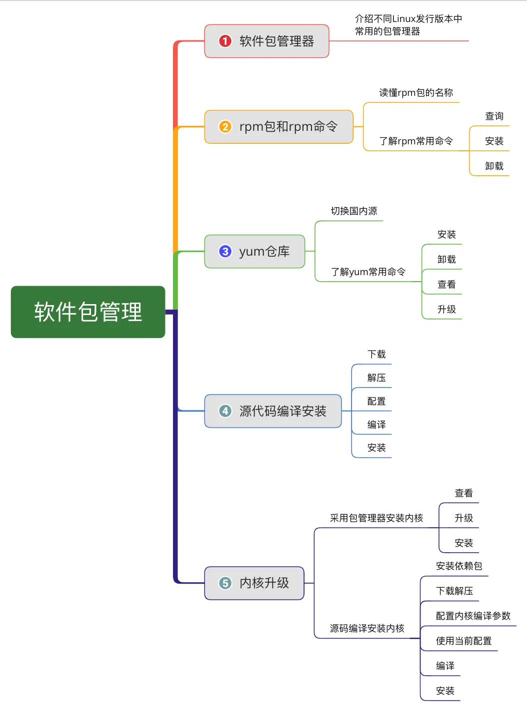

### 一、软件包管理器
包管理器是方便软件安装、卸载，解决软件依赖关系的重要工具
（1）CentOS、Redhat、Fedora使用yum包管理器，软件安装包格式为rpm
（2）Debian、Ubuntu使用apt包管理器，软件安装包格式为deb
### 二、rpm包与rpm命令
##### 1. 读懂rpm包的名称
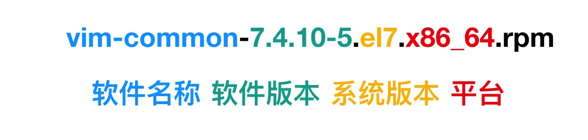
* 所有rpm包都是以`.rpm`后缀结尾的；
* 软件版本需要标记，因为在安装这个软件包的时候呢，软件包之间会有一个互相的依赖关系的问题的，软件版本主要是用来解决依赖关系的；
* 系统版本：这里的`el7`表示软件发行商，`el7`表示此包是由 Red Hat 公司发布，适合在 `RHEL 7.x` (Red Hat Enterprise Linux) 和 CentOS 7.x 上使用。但是如果系统版本是el6的话，是可以强制安装到centos7的系统上，但是其软件的稳定性或者版本的兼容性可能会有问题。所以当我们去选择rpm包的时候，我们第一个要看它的软件版本，是否符合我们的要求。另外我们还需要查看的系统版本是否与我们系统的发行版本对应；
* 平台：目前服务器大部分都是x86_64的平台
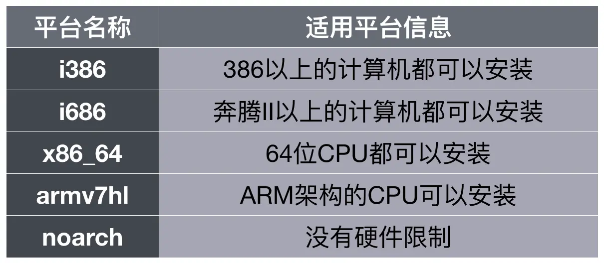

##### 2. 了解rpm常用命令
rpm命令常用参数：
（1）`-q`查询软件包
查询当前系统中安装了哪些软件包；
```
rpm -qa  # 查看系统安装的所有软件包
```
显示当前系统所有已经安装的软件包，条目太多如果想要分屏显示，可以在上面命令的基础上添加一个管道符`|`和`more`参数
```
rpm -qa | more  # 分屏查看系统所有已经安装的软件包
```
按`空格键`换浏览下一页；按`回车键`浏览下一行，按`q`退出；
我们如果想查看某一个单独的软件包是否安装，可以使用命令：`rmp -q <软件包名称>`
```shell
rpm -q vim-common  # 查询是否安装vim-common
```

（2）`-i`安装软件包
安装指定软件包，使用命令`rpm -i <软件包名称>`
```shell
rpm -i vim-enhanced-7.4.629-6.el7.armv7hl.rpm
```
如果安装的时候出现以下报错：
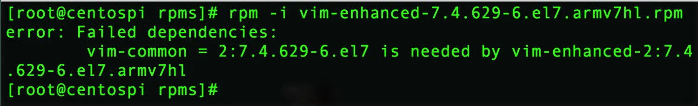

失败原因：依赖错误，它有一个依赖关系需要我们手动去解决，安装vim-enhanced时需要先安装vim-common，再去安装vim-enhanced，这样呢我们才不会被依赖关系所困扰。

如果依赖关系非常多，手动解决太麻烦，我们可以使用解决依赖关系有效的工具：yum仓库，它可以自动帮我们解决依赖关系；

在安装软件包的时候，如果软件包的版本不符合我们的要求，我们还可以通过源代码来编译安装软件包。
（3）`-e`卸载软件包
卸载指定软件包，使用命令`rpm -e <软件包名称>`
```
rpm -e vim-common
```
如果想卸载多个软件包的话，多个软件包之间用空格隔开即可。
在查询和卸载软件包时，我们只需要写上软件包的名称即可，但是安装软件包的时，需要写上完整的软件包名称。

### 三、 yum仓库
yum仓库也叫yum包管理器，官方提供了yum源(http://mirror.centos.org/centos/7/)，但是在国内访问速度较慢，我们可以使用国内一些公司或者机构提供的仓库源速度会快很多
##### 1. 如果切换国内源呢？
方法01：我们可以修改配置文件`/etc/yum.repos.d/CentOS-Base.repo`来切换国内源；
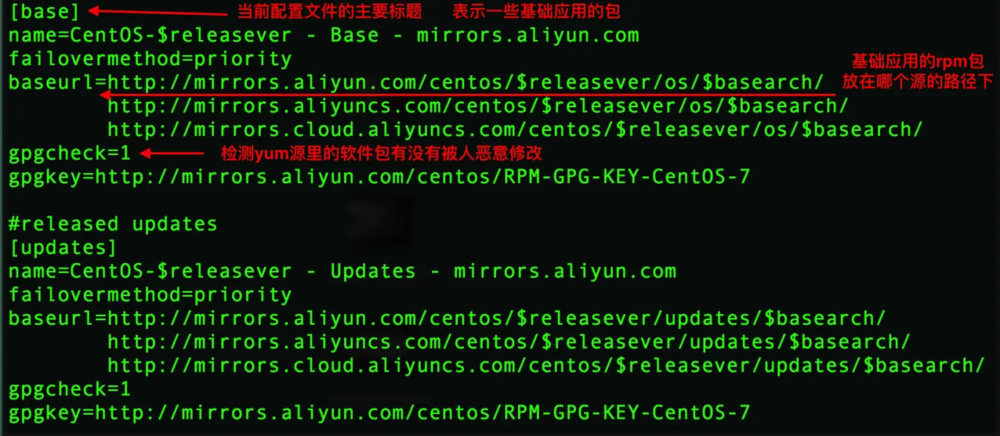

方法02：还有一种方法就是，直接把国内的源配置文件下载下来覆盖系统中的原配置文件，使用命令：
```shell
wget -O /etc/yum.repos.d/CentOS-Base.repo https://mirrors.aliyun.com/repo/Centos-7.repo
```
然后运行`yum makecache`生成新的缓存，让我们的软件包指向开源镜像站。

##### 2. yum命令常用选项
（1） install 安装软件包
使用yum进行安装不用考虑软件包的依赖关系，系统会自动帮你找到你需要的依赖包，一并安装，通过`yum install <软件包名>`就可以安装指定的软件包；比如当我们想安装软件包：`vim-enhanced`就可以使用命令：
```shell
yum install vim-enhanced
```
这些软件包的安装都是一个一个的安装，但是我们使用Linux系统时通常需要一次性安装多个软件。比如我们Linux系统要做服务器的话，通常要安装`httpd`、`mysql`、`php`之类的；如果我们要做c语言开发的话，通常就需要安装`cmake`、`gcc`之类的，但是一个一个的安装可能会由于版本问题或者依赖问题导致安装失败，这时候yum提供了一种很人性化的安装方式`yum groupinstall <整组软件包>`，可以帮我们一次性安装好一整套软件包，我们使用命令：
```
yum grouplist
```
可以查看系统中有哪些可以使用的软件包套件：
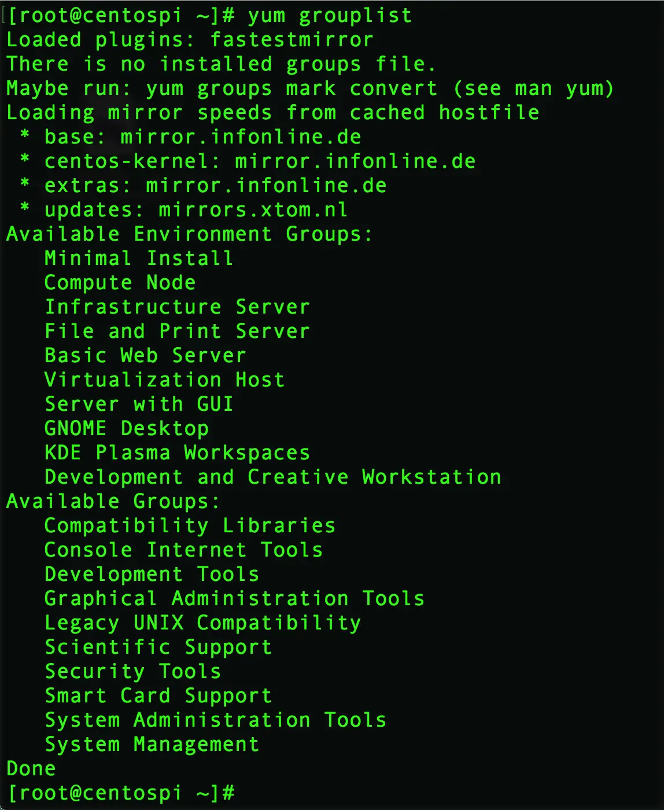
可以看到软件套装有：最小安装、计算节点、基础设施服务、基础网络服务、虚拟化主机、桌面系统、网络控制台工具、图形管理工具、系统管理工具等等，都是可以整套安装的，比如我们想安装基础网络服务套装就可以直接使用命令：

```
yum groupinstall "Basic Web Server"
```
就可以安装一整套基础网页服务器所需要的软件包，然后输入y再回车就可以了，注意不要忘了加双引号哦！
（2）remove 卸载软件包
如果想把已经安装的软件包vim-enhanced卸载，可以通过`yum remove <软件包名>`来卸载指定的软件包。
（3） list 查看软件包
如何查看系统中已经安装过哪些安装包？我们可以使用命令：
```shell
yum list
```
来查看当前系统中已经安装的软件包；

（4） update 升级软件包
系统中的软件怎么更新升级呢，可以使用命令：
```
yum update
```
来更新升级软件包，系统会根据yum仓库里的最新版本，提示哪些软件包需要重新安装哪些需要升级，根据命令按y再回车就可以升级到yum仓库中最新版本了。

### 四、源代码编译安装
使用yum或者rpm安装很高效与便捷，这也是yum、rpm包管理工具被用户广泛使用的原因。但是很多时候最新版本的软件还没有被yum仓库收录，我们想使用最新版本的软件可以通过**源代码编译安装**
我们以安装opentesty为例，使用源码编译的方式进行安装:
**第一步：下载应用程序源代码**
```shell
wget https://openresty.org/download/openresty-1.15.8.1.tar.gz
```
**第二步：解压缩gzip文件**
```shell
tar zxf openresty-1.15.8.1.tar.gz
```
**第三步：进入源码目录**
```shell
cd openresty-1.15.8.1
```
**第四步：配置源码环境**
由于当前的系统环境以及预先设置在源码中了，但是没有真正的和我们系统环境进行匹配，所以我们使用`./config`去自动配置一下我们内核的版本、编译器匹配，再使用`--prefix`参数来指定应用程序安装位置，如果不指定安装位置的话，删除软件的时候就会很不方便；
```shell
./configure --prefix=/usr/local/openresty
```
如果执行命令时出现报错：/usr/bin/env: perl: No such file or directory
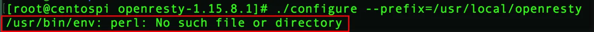
原因：未安装gcc编译环境导致
解决办法：安装gcc、gcc-c++、perl

```
yum -y install gcc gcc-c++ perl make kernel-headers kernel-devel
```
安装完成后如果继续报错：

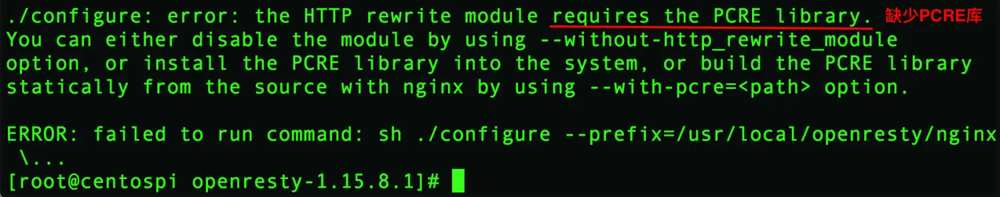
原因：缺少PCRE库
解决办法：我们再安装一下PCRE库
```
yum install pcre-devel
```
安装完成后，我们继续在当前目录进行`./config`配置操作
这是发现又报错了：
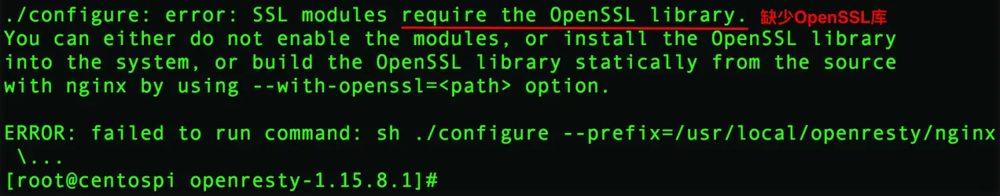
原因：缺少OpenSSL库
解决方法：安装OpenSSL库

```
yum install openssl-devel  
```
一般devel表示该模块的开发包
安装完成后，我们继续在当前目录进行`./config`配置操作
经过一番折腾，我们的./config终于配置通过了
**第五步：编译源码**
将源代码编译为可执行程序，使用`-j2`参数，意味着我们使用两个逻辑内核来编译源码，再一定程度上加快编译速度
```
make -j2
```
实际上我们上一步配置完成后，系统提示我们使用gmake来进行编译，gmake与make都可以达到同样的编译操作目的
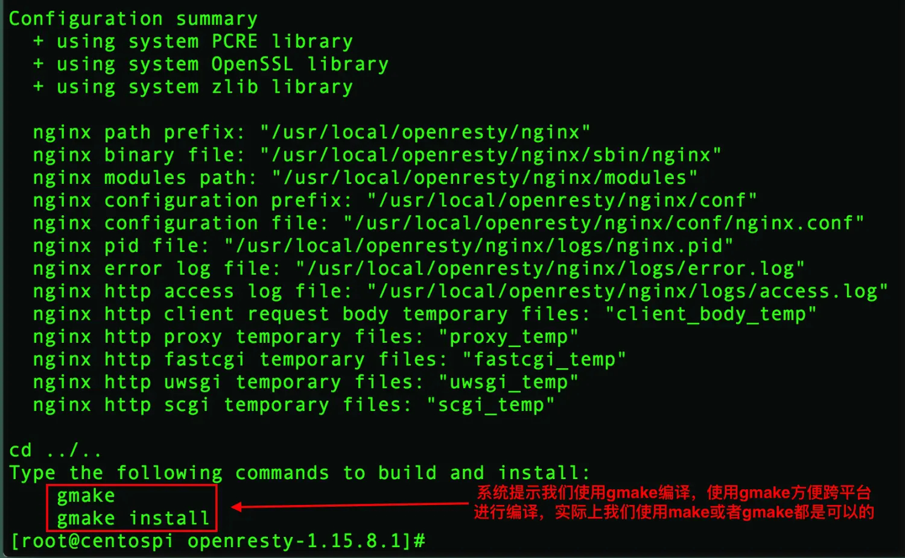
我们可以参照它的需求来使用命令，同样可以加上`j2`参数：

```
gmake -j2
```
**第六步：安装**
执行完编译操作后，我们查看一下源代码目录
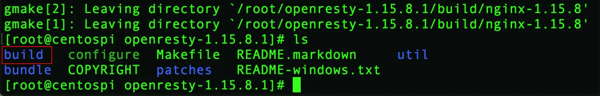
我们编译好的应用文件、配置文件、依赖的模块就会出现在build目录中，这时候我们将编译好的程序安装到指定目录（指定目录我们在配置那一步已经申明好了)

```
make install
```
安装完成后，openresty就会安装到`/usr/local/openresty`目录下：
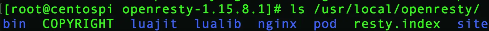
以上，我们就完成了如何通过源代码编译来进行安装我们的软件。

### 五、内核升级
升级Linux内核有两种方式：
* 使用包管理器进行安装；
* 使用源代码编译方式进行安装；
##### 1. 使用包管理器安装内核
**第一步：查看内核版本**
使用命令：
```shell
uname -r
```
**第二步：升级内核版本**
直接使用命令：
```
yum install kernel
```
系统会返回yum仓库中，适合当前架构的最新内核版本，
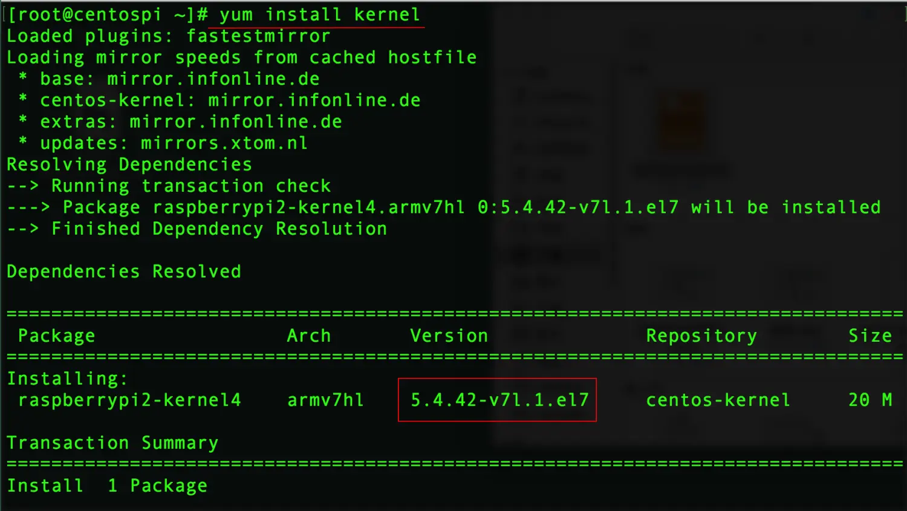

如果我们不想安装最新版本，我们想安装指定版本则使用命令：
```shell
yum install kernel-3.10.0
```
安装指定版本3.10.0的内核。

**第三步：升级已经安装的其它软件包和补丁**
```shell
yum update
```
有时候yum仓库没有最新的软件，我们还可以切换epel仓库进行安装，通过`yum install epel-release`来安装使用epel仓库，可以通过epel仓库来扩展yum仓库里的文件，一些常用的软件都可以通过eple仓库来进行安装；
##### 2.源代码编译安装内核
**第一步：安装依赖包**
安装的时候报错，就新增一个包，所需要的包全部列在这
```
yum install gcc gcc-c++ make ncurses-devel openssl-devel elfutils-libelf-devel
```
**第二步：下载并解压缩内核**
(https://www.kernel.org)下载最新稳定版本的内核，内核版本在2.6以前，版本编号划分主版本、次版本（偶数代表稳定版，奇数代表不稳定版）、末版本，之后就没有这种划分了。
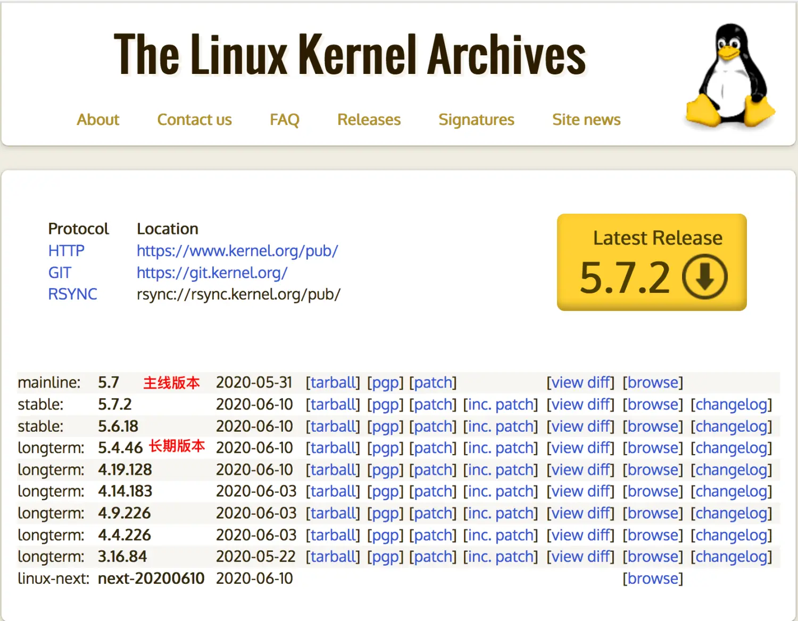
我们选择5.7.2版本下载，然后进行解压缩

```shell
wget https://cdn.kernel.org/pub/linux/kernel/v5.x/linux-5.7.2.tar.xz
tar xvf linux-5.7.2.tar.xz -C /usr/src/kernels
```
**第三步：配置内核编译参数**

```
cd /usr/src/kernels/linux-5.7.2/
make menuconfig | allyesconfig | allnoconfig
```
menuconfig表示：图形化菜单选择配置
allyesconfig表示：只有系统有的功能全部都配置上
allnoconfig表示：只要最小的内核，什么功能都不要带，连启动都启动不了
**第四步：使用当前系统内核配置**
```
cp /boot/config-kernelversion.platform /usr/src/kernels/linux-5.7.2/.config
```
将当前系统以及有的内核配置复制到待安装的内核目录中并重命名为`.config`，这样就会减少配置的复杂的
**第五步：编译**
我们可以使用`lscpu`命令查看当前CPU的信息，CPU的个数:

使用命令：
```
make -j4 all
```
对所有的选项进行编译

**第六步：安装内核**
```
make modules_install  
make install
```
先安装内核所支持的模块，然后在把内核自己安装过去，然后再自动修改启动的配置文件，安装完成后使用命令reboot让系统进行重启，并进入引导grub界面，选中最新的内核版本进入系统。
以上，我们使用源码编译安装内核就完成了~


·