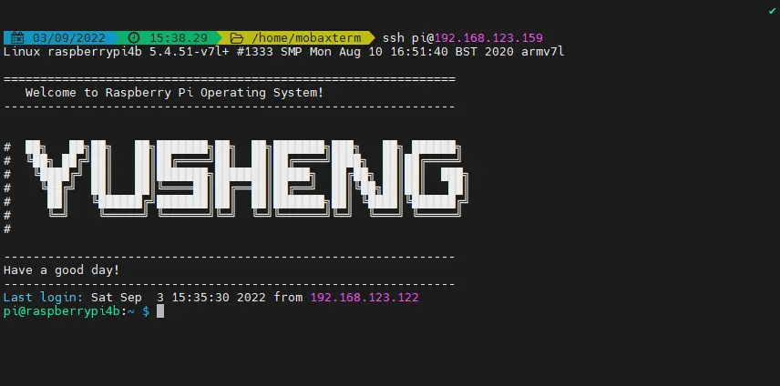

### 背景
当我们通过SSH登录Linux系统时，一般系统会默认输出一些提示信息，如果我们可以自定义提示信息的话，是不是会很酷呢？
### 提示信息文件位置
Linux系统中，定义登录提示信息内容的文本文件是`/etc/issue`或者`/etc/motd`，我们使用vim或者nano等文本编辑器修改它之后，下次登录时的提示信息就会随之改变。
### 根据文字生产文本图形
推荐这个网站，可以根据文字内容生成对应的文本图形[[Text ASCII Art Generator](http://patorjk.com/software/taag/#p=display&f=Graffiti&t=tianmingxing)
](http://patorjk.com/software/taag/#p=display&c=bash&f=Big&t=YUSHENG)
```shell 
#  ██╗   ██╗██╗   ██╗███████╗██╗  ██╗███████╗███╗   ██╗ ██████╗ 
#  ╚██╗ ██╔╝██║   ██║██╔════╝██║  ██║██╔════╝████╗  ██║██╔════╝ 
#   ╚████╔╝ ██║   ██║███████╗███████║█████╗  ██╔██╗ ██║██║  ███╗
#    ╚██╔╝  ██║   ██║╚════██║██╔══██║██╔══╝  ██║╚██╗██║██║   ██║
#     ██║   ╚██████╔╝███████║██║  ██║███████╗██║ ╚████║╚██████╔╝
#     ╚═╝    ╚═════╝ ╚══════╝╚═╝  ╚═╝╚══════╝╚═╝  ╚═══╝ ╚═════╝ 
#                                                                                                                                                
```
 编辑`/etc/motd`文件，后保存！ 开机效果：
