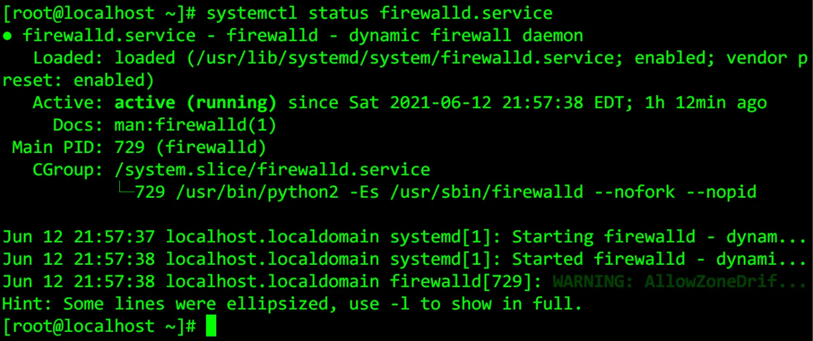
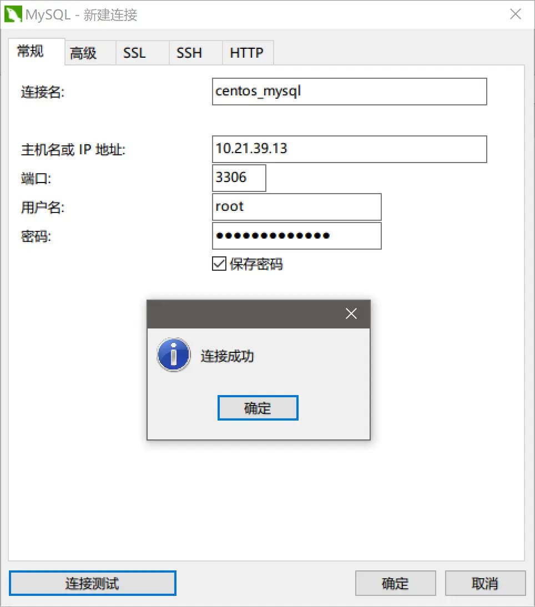

### 前言
在前面的学习中，我们对数据的存储都是通过文本文件读写实现的，现在为了提高效率我们介绍一下数据库的使用，在Django中通过SQL语句操作数据库，原先这些语句是直接控制数据库的，现在我们写在Django里通过接口来控制数据库。
今天我们就正式开始介绍一下最常用的关系数据库--MySQL
对数据库基本操作：增删改查 --- sql语句

* 增 -- insert into Student(Sno,name) values('95001','小雨')
* 删 -- delete from student where name='小雨'
* 改 -- update student set name='小明' where sno=95001
* 查 -- select sno,name from student

### 一、数据库概念
数据库是存储数据的核心，它的特点:
大容量、高并发、易维护
##### 1. 关系型数据库
（1）特点：

* 基于二维表格
* 可以通过标准的SQL语句对数据库进行增删查改。

（2）常见的关系型数据库
MySQL装机量最大，开源，简单易用
Oracle做的最专业的关系型数据库
SQLserver 微软出品，微软产品体系路线
##### 2.非关系型数据库
（1）概念

No-SQL [not only sql]
指的是非关系型数据库，nosql的产生不是要彻底第否定非关系型数据库，而是作为一个传统关系型数据库的有效补充，在特定场景下可以发挥出难以想象的高效率和高性能。

（2）种类

|     数据库类型      |     典型产品      |
| :-----------------: | :---------------: |
| key-value存储数据库 | Redis、memcacheDB |
|    列存储数据库     |       HBase       |
|   面向文档数据库    |      MongoDB      |
|     图形数据库      |     InfoGrid      |

### 二、安装MySQL数据库
在单独的服务器上安装MySQL
mysql基本环境：

centos 7.4(1708)
MySQL Community Server 5.7
##### 1.安装步骤
第一步：查看系统有没有安装MySQL
```
rqm -qa | grep mysql 
```
第二步：安装wget
```
yum install wget
```
第三步：使用wget下载mysql安装包
```
wget https://dev.mysql.com/get/mysql80-community-release-el7-3.noarch.rpm
```
第四步：使用yum安装刚下载的MySQL在线安装工具，获取所有包的列表
```
yum -y install mysql80-community-release-el7-3.noarch.rpm 
```
第五步：安装MySQL安装包
```
yum -y install mysql-community-server
```
第六步：查看MySQL服务情况
（1）查看服务状态
```
systemctl status mysqld.service
```
（2）查看MySQL是否自启动
```
systemctl is-enabled mysqld
```
（3）设置MySQL为开机自启动
```
systemctl enabled mysqld
```
（4）取消设置MySQL为开机自启动
```
systemctl disabled mysqld
```
（5）启动MySQL服务
```
systemctl start mysqld
```
第七步：查看MySQL端口是否正常
MySQL正常运行端口是3306，查看是否开启
方法一：使用netstat查看
```
netstat -ntlp | grep mysql
```
方法二：使用lsof命令查看指定端口是否打开
默认可能没有安装lsof,我们手动安装一下：
```
yum -y install lsof
lsof -i:3306
```
### 三、使用mysql
##### 1. 登录mysql
（1）查看mysql的root账号的初始密码
在`var/log/mysqld.log`中查看密码，使用grep过滤password关键字检索密码；
```
grep 'password' /var/log/mysqld.log
```
（2）使用初始密码登录root账户
```
mysql -u'root' -p'初始密码'
```
（3）修改密码
```
alter user 'root'@'localhost' Identified by '新密码'
```
（4）命令行登录mysql
在命令行使用明文登录MySQL
```
mysql -u'用户名' -p'密码'
```
是无法登录的的，会报错：
```
Using a password on the command line interface can be insecure
```
意思是说把密码输在命令行里面是不安全的，正确的命令行登录mysql的方式是：
```
mysql -u'用户名' -p
```
接下来会打开一个标准的命令行输入密码的界面，此时再输入密码，才可以登录mysql.
##### 2. 基础操作
```sql
show databases;  /*查看mysql有哪些数据库*/
show tables;  /*查看指定数据库中有哪些表*/
create database TestDB;   /* 创建数据库TestDB */
use TestDB;   /* 进入指定数据库 */
create table student(sno int,name varchar(20));   /* 创建表 */
Insert into student values(95001,'xiaoyu');   /* 表中插入相关数据 */
select * from student;   /* 查看表中的全部数据 */
update student set name='toms' where sno=95002;   /* 修改表中的元素 */
delete from student where sno=95002;   /* 删除表中的数据 */
```
##### 3. 解决中文存储异常问题
> 注意： 默认情况下，数据库不能直接存储中文，本质原因没有让数据库使用utf-8编码，我们把中文字符集加上就行了。

```
create database TestDB01 default character set utf8 collate utf8_general_ci;
```
如果之前创建的数据库没有使用utf-8，那怎么修改呢？
```
use TestDB；
show variables like 'character_set_database'; /* 查看数据库所使用的字符集 */
alter database TestDB character set utf8; /* 修改数据库当前编码为utf-8 */
```
实际遇到的情况是，当我们把当前数据库的默认编码修改为utf-8时，之前创建的表student还是不能插入中文。这是因为：修改数据库编码只能对当前操作之后添加的数据的编码做修改，之前创建的内容继续保持原先的编码类型。
```
show create table student; /* 查看当前已存在对象编码 */
alter table student character set utf8; /* 修改当前表为uft-8 */
```
此时如果发现还是，因为我们虽然改了表的字符集，字段的字符集还是没有发生改变，我们再改一下字段的默认编码
```
alter table student change name name varchar(20) character set utf8;
```

### 四、使用Navicat连接数据库
我们试着用telnet 测试客户端能否连上服务端的端口
```
telnet ip地址 3306
```
如果一直连接不上，说明是有问题的！
这是什么原因呢？因为mysql默认配置了防火墙，我们可以看看防火墙有没有开
```
systemctl status firewalld.service
```

果然，防火墙是开着的，需要把防火墙关了

```
systemctl stop firewalld.service
```
默认情况下，root用户只允许在本地登陆，我们需要把mysql数据库中的user表下的host的字段值改为`%`，这样就允许所有ip登陆了;
如果此时还是连接不上，出现错误信息`1251--Client does not support authentication protocol requested by server`，这时我们需要添加以下命令即可连接成功：
```
alter user 'root'@'%' identified with mysql_native_password by '密码';
flush privileges;
```


### 用户的管理与授权
出于安全考虑，除了root用户外，我们会创建一些普通用户,我们使用以下命令创建用户`xiaoyu`,该用户具备远程任意主机登录的权限;
```
create user 'xiaoyu'@'%' identified by '123456'; 
```
给用户xiaoyu赋予数据库students的所有权限：
```
grant all privileges on students.* to `xiaoyu`@'%' identified by '123456'; 
# 执行需要刷新权限flush privileges;
```
这里的数据库students后的`.*`表示授权该数据库下的所有数据表；