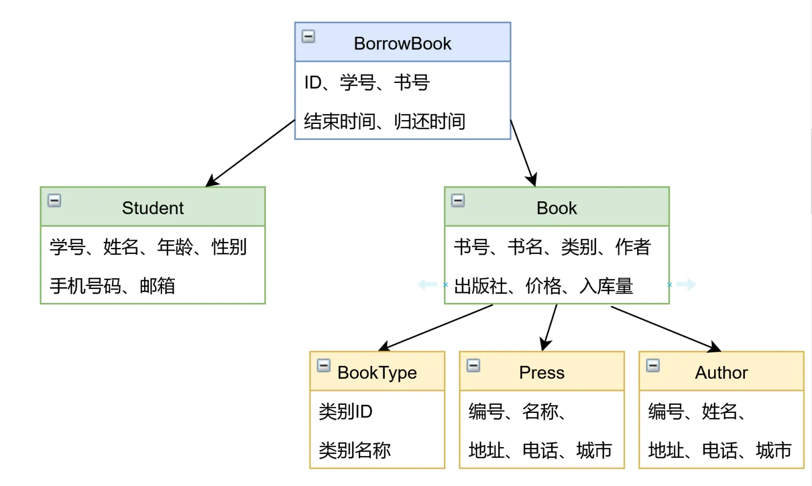
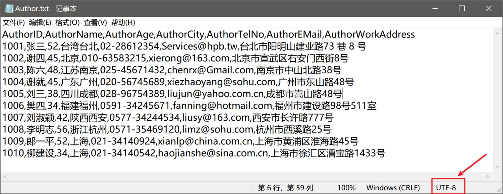
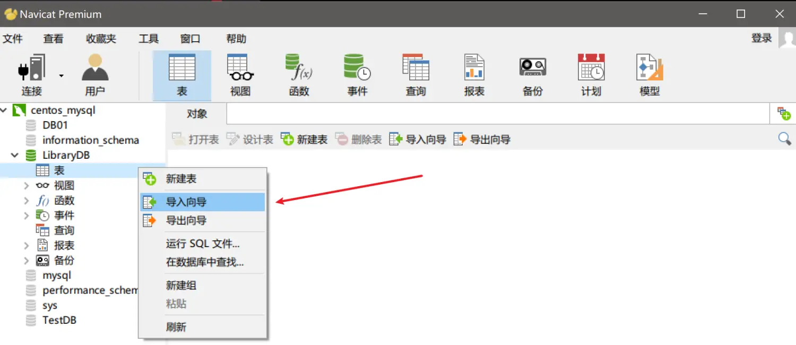
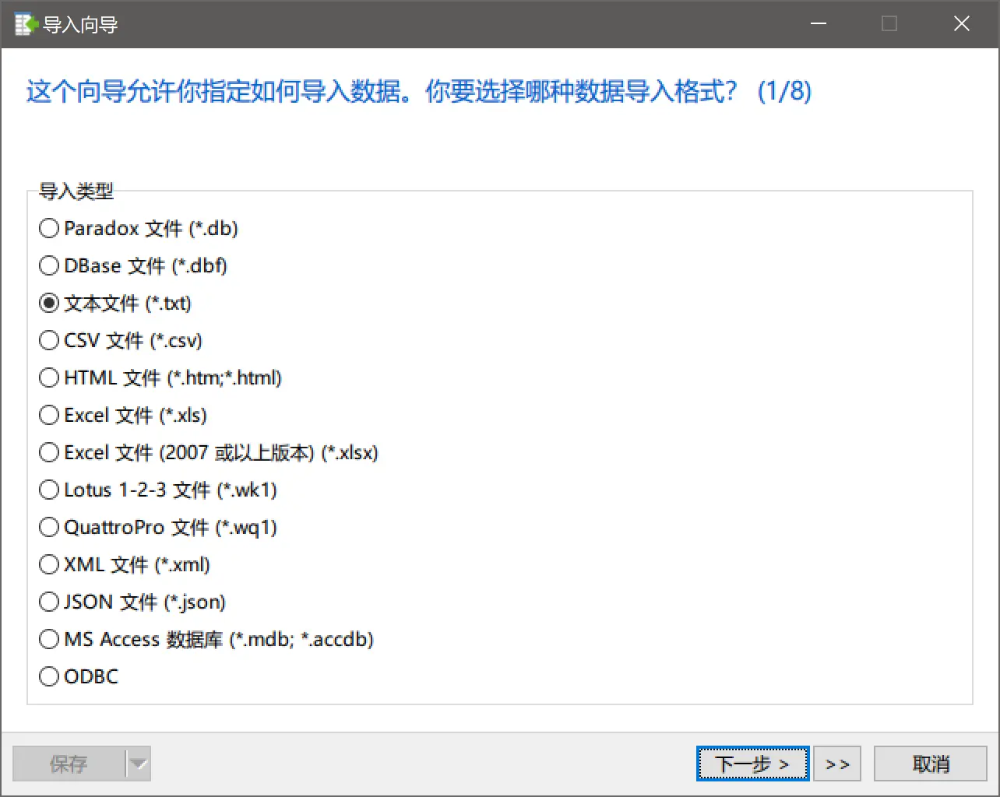
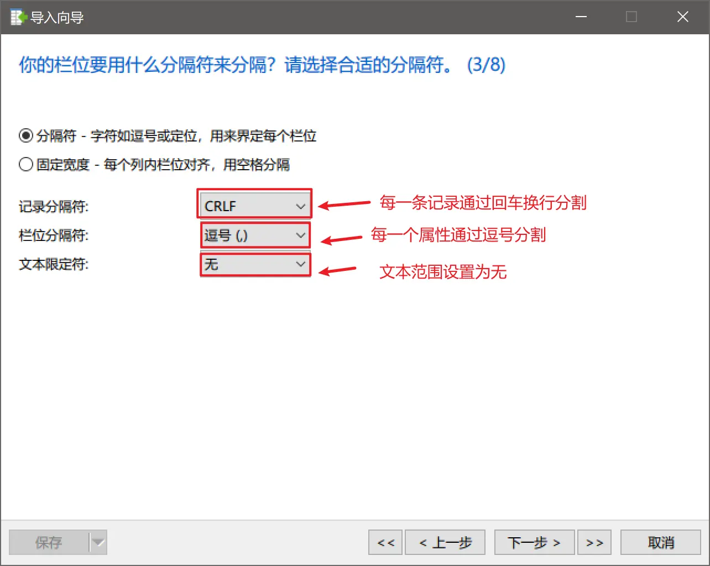
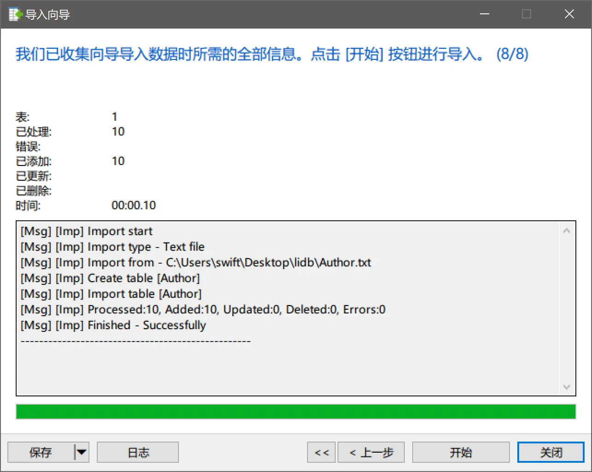
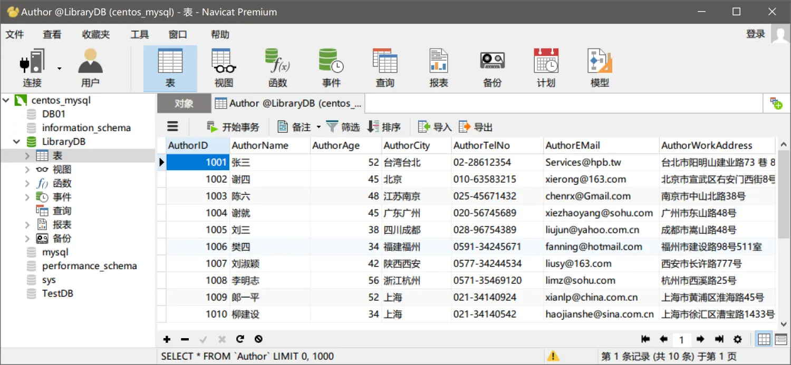
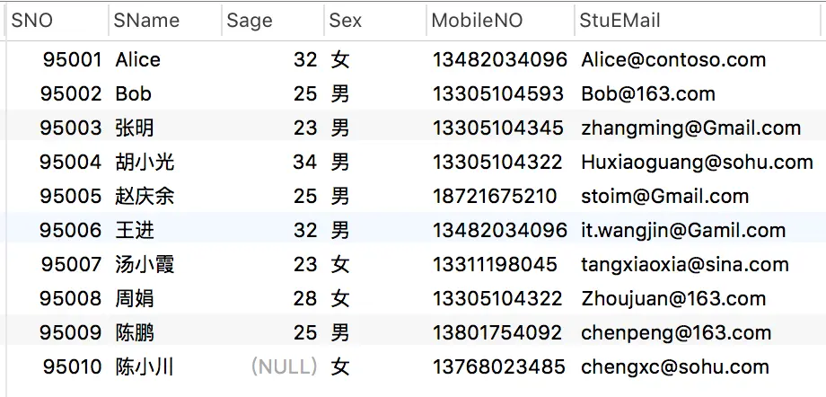

### 前言
如何在大量的数据中筛选出当前应用场景所需要的内容，在增删查改四个动作当中，查询操作是非常重要的。

查询操作最基本的三个关键字是`select`,`from`,`where`,
select 表示列筛选，查询哪些信息
from 表示从哪里查，表的名称
where 表示行筛选，主要筛选满足条件的记录。
例如我们需要在学生信息表中查出所有男生的学号和姓名，就可以写成：
```sql
select SNO,SName from Student where Gender='男',
```
### 一、原始数据准备
##### 1. 数据库结构
我们准备一个用来练习的数据库，原始数据可私信我获取。


##### 2.数据如何导入mysql
我们以新建一个Author为例，介绍一下如何导入数据库。
在Navicat中新建一个数据库，编码选择utf-8，在表中通过导入向导的方式，创建每一个表。
我们的原始数据是用逗号分割的txt文件，现在我们就把它导入到mysql的数据库LibryDB的author表中。





这样，我们就把txt文件中的原始数据导入到mysql表中了；

这样，我们就把Author表导入完成了，接下来，再依次导入Book、BookType、BorrowBook、Press、Student表即可。

> 要点：

（1）一个表对应一个原始文件；

（2）数据库的编码与txt的编码要保持一致；

（3）第一行是字段名；

（4）每行一条数据，主语记录分隔符、栏位分隔符、文本限定符的设置。

### 二、SQL查询语句基础知识
##### 1.常用运算符

| sql运算符  |                常用符号                |
| :--------: | :------------------------------------: |
| 比较运算符 | = 、!=、 >、 <、 >=、 <=、 <>、!>、 !< |
| 逻辑运算符 |             and 、or、 not             |
| 特殊运算符 |        between and 、in、 like         |

##### 2. 通配符：
表示任意一个字符`_`;
表示任意多个字符`%`;

### 三、 数据库查询操作案例
##### 1. 原始数据：

##### 2. 查询案例：
（1）查询出姓名为'胡小光'的学号、手机号码、和邮箱地址；
```sql
select SNO,MobileNO,StuEMail 
from Student 
where SName='胡小光';
```
查询出来的结果，列标签如果希望以中文显示，可以使用`As`语句
```sql
select SNO as '学号',MobileNO as '手机号',StuEMail as '邮箱' 
from Student 
where SName='胡小光';
```
在MySQL语句中，等于号就是用`=`，对于行筛选除了使用`=`还可以使用`in`
```sql
select SNO as '学号',MobileNO as '手机号',StuEMail as '邮箱' 
from Student 
where SName in ("胡小光");
```
（2）查询出姓名不是'胡小光'的学生的所有信息;
在MySQL语句中，不等于可以写成`!=`，`<>`，`not in()`，这里查找语句可以写成：
```sql
select * 
from Student 
where SName != '胡小光';
# where SName <> '胡小光';
# where SName not in ('胡小光');
```

（3）查询出年龄介于20到30之间的学生学号和姓名;
```sql
select SNO as '学号',SName as '姓名'
from Student
where Sage >= 20 and Sage <= 30;
```
除了使用and连接两个条件以外，还可以使用`between and`语句，表明在两个条件之内。
```sql
select SNO as '学号',SName as '姓名'
from Student
where Sage between 20 and 30;
```
（4）查询出哪些学生没有填写‘年龄’信息;
```sql
select SNO,SName
from Student 
where Sage is null;
```
在判断某个字段是否为空时，要使用`is null`语句，如果使用`= null`可能查不出结果。

（5）查询出'胡小光'，'alice'、'bob',的学号、年龄;
```sql
select SNO,Sage 
from Student 
where SName = '胡小光' or SName = 'alice' or SName = 'bob';  
# where SName in ('胡小光',"alice","bob");
```
在使用多个条件时可以使用`or`连接，也可以使用`in ()`表示条件范围。

（6）查询出所有姓’陈‘的学生；
```sql
select * 
from Student 
where SName like '陈%';
```
使用`like`进行模糊查询，通配符`%`表示任意多个字符。

（7）查询出手机号码134或者135开头，倒数第四位不是8或9的学生姓名；
```sql
select SName
from Student
where MobileNO regexp '^[1][3][45][0-9]{4}[^89][0-9]{3}$';
```
这里的手机号码格式可以之间通过`regexp`引出正则表达式来进行限制。

（8）查询出借出过书的同学的学号；
```sql
select distinct SNO as '借书过的学号'
from BorrowBook;
```
这里我们使用关键字`distinct`表示筛选出的结果是去重的，不重复的。

（9）对Student表按照年龄升序排序，如果年龄一样，女生排在男生前面。
```sql
select *
from Student
order by Sage DESC,Sex ASC;
```
排序使用关键字`order by`,`ASC`表示升序，`DESC`表示降序；

（10）查询出Student表中的前5行记录。
```sql
select *
from Student
limit 5
```
获取表的前5行，可以使用关键字`limit`，如果要从第二行开始再找5行，可以使用关键字`offset`设置偏移量。
如果要任意取5行，可以先把每一行打乱
```sql
select *
from Student
order by rand()
limit 5
```