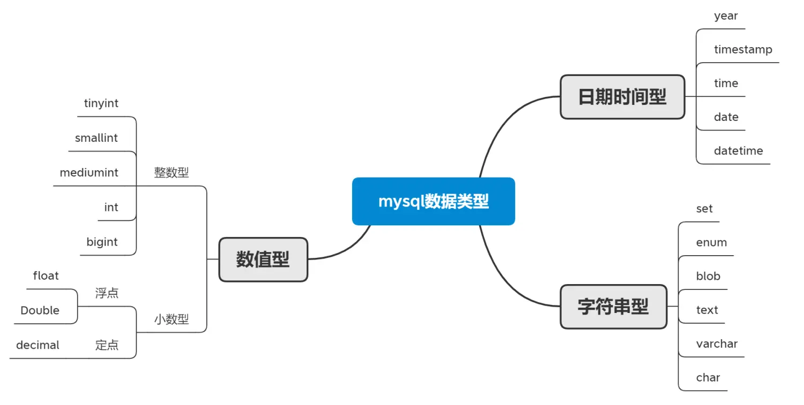

### 一、创建数据库
现在介绍一些创建数据库的基础语句：
```sql
create database TestDB;  # 默认的方式创建数据库
create database TestDB default character set utf8;  # 创建utf-8字符编码的数据库
create database if not exists TestDB;  # 如果TestDB不存在就创建
alter database TestDB default character set utf8;  # 修改数据库TestDB的默认编码方式
drop database TestDB;  # 删除数据库TestDB
```
### 二、创建表
首先进入数据库容器
```sql
use TestDB;
```
创建一个student表
```sql
create table student(sno int,name varchar(20));
```
当我们打开navicat中表格右键选择设计表的时候，正常情况下我们做数据的正常存储时使用的引擎就是`InnoDB`

一般情况下，我们在navicat里也不怎么使用命令行，用的最多是`查询编辑器`界面，只需选中数据库然后右击查询，新建查询，在查询编辑器中可以更灵活的使用mysql语句，支持代码联想、指定片段执行、注释等功能。

> 注意：
> 这里通常会报一些1055的错误，是navicat与MySQL的兼容性问题，可以忽略。
> 另外，在创建表格的语句中，最后一个字段不要加逗号；
### 三、MySQL中数据类型

| MySQL浮点数据类型 |                     含义                      |
| :---------------: | :-------------------------------------------: |
|    float(m,d)     | 单精度浮点类型,8位有效精度，m总个数，n小数位  |
|    double(m,d)    | 双精度浮点类型,16位有效精度，m总个数，n小数位 |

| MySQL时间日期数据类型 |        格式         |           含义           |
| :-------------------: | :-----------------: | :----------------------: |
|         date          |     yyyy-MM-dd      |        存储日期值        |
|         time          |      HH:mm:ss       |        存储时分秒        |
|         year          |        yyyy         |          存储年          |
|       datetime        | yyyy-MM-dd HH:mm:ss |       存储日期时间       |
|       timestamp       | yyyy-MM-dd HH:mm:ss | 存储日期时间，可作时间戳 |

| MySQL字符数据类型 |         含义         |
| :---------------: | :------------------: |
|      char(n)      |       固定长度       |
|    varchar(n)     | 最大长度内的可变长度 |

### 四、表的增删查改
我们以创建一个存储学生信息的表为例，记录学号、姓名、性别、生日、手机、邮箱、地址等信息，来展示数据库表的基本操作。
（1）创建表格
```sql
create table if not exists Student
(
	sno int UNSIGNED,
	sname varchar(10),
	gender char(3),
	birthday date,
	mobile char(11),
	email varchar(100),
	address varchar(200)
)
```
注意：unsigned表示无符号整型，一个中文字符占三个长度；
（2）删除数据
```sql
drop table Student  # 删除整个表格
delete from Student where gender='女';  # 删除表格中的指定数据
```
（3）修改表格
```sql
alter table Student add column StudentDSC text
```
（4）插入一行数据
```sql
insert into Student(sno,sname,gender,birthday,mobile,email,address) values (95001,'小雨','男','2020-10-13','13522362888','12234343@163.com','广东省广州市番禺区广州大学城');
```
（5）插入多行数据
```sql
insert into Student(sno,sname,gender,birthday,mobile,email,address) values 
(95002,'小雨','男','2020-10-13','13522362233','12234343@163.com','广东省广州市番禺区贵州大学城'),
(95003,'小花','女','2020-10-13','13522362888','12234343@163.com','北京市海淀区清华大学'),
(95004,'小点','男','2002-10-13','13522362233','12234343@163.com','江苏省南京市东南大学');
```
（6）查询数据
```sql
select * from Student;
select sno,sname from Student where mobile like '%888'
```
（7）修改数据
```sql
update Student set gender='女';	# 把所有信息都修改了
update Student set gender='男' where sname='小花' or sno='95004';	# 只改其中的某一条信息
update Student set birthday='1998-12-12' where mobile like '%888'
```
### 五、MySQL约束
##### 1. 主键
主键（Primary Key）保证某一个字段唯一，不能为空，在一个表中，主键只能有一个；
设置主键的两种方法：
（1）直接设置主键名
```sql
create table Student01
(
	sno int primary key, 
	sname varchar(20)
);
```
（2）在结尾设置主键，通过约束的方式设置主键并取别名。
```sql
create table Student02
(
	sno int,
	sname varchar(20),
	constraint PA_sno primary key(sno)
);
```
我们以借书表为例
```sql
create table BorrowBook
(
	sno int,	# 学生编号
	bookid int,	# 图书编号
	borrowdate date,	# 借书时间
	returndate date	# 还书时间
)
```
我们该定义哪一个属性为主键呢？
把学生编号定义为主键，不合理，因为一个学生会借多本书；
把图书编号定义为主键，也不合理，因为一本书会被多个学生借阅；
所以正确的办法是，我们把学生编号和图书编号捆绑在一起，形成一个复合主键。因为一个人借一本书是唯一的，因为一个学生借阅了唯一编号这本书后，如果不还就不能在借这本书了！（即使是图书馆中书名相同的书，编号也是不同的）。
##### 复合主键的定义：
```sql
create table BorrowBook
(
	sno int,	# 学生编号
	bookid int,	# 图书编号
	borrowdate date,	# 借书时间
	returndate date,	# 还书时间
	constraint Pk_BorrowBook Primary Key(sno,bookid)  # 定义复合主键
)
```
##### 2.唯一键
唯一键（Unique Key）它主要是用来保证字段不能重复，主键只能设置一个，而唯一键可以设置多个，且唯一键可以设置字段为空。
```sql
# 设置唯一键
create table Student
(
	SNO int,
	SName VARCHAR(20) not null,
	Gender char(3),
	Birthday date,
	Mobile varchar(20),
	Email varchar(100),
	Address varchar(200),
	Constraint Pk_SNO primary key(SNO),  # 主键
	Constraint Uq_Mobile unique(Mobile),  # 唯一键
	Constraint Uq_Email unique(Email)  # 唯一键 
);
```
##### 3.外键
外键(foreign key)用来保证数据的完整性，用来校验某个数据是否在另一个表中存在，如果存在则正常，如果不存在则报错。
如果我们定义一个学生借书的表，填入的学号来自学生表，填入的图书编号来自图书表，这样通过外键的方式定义学号和图书编号就能在一定程度上保证数据的合法性与正确性。
```sql
# 定义学生表
create table Student
(
	SNO int,
	Constraint Pk_SNO primary key(SNO),
);
# 定义图书表
create table Book
(
	Bookid int,
	Constraint Pk_Bookid primary key(Bookid)
);
# 定义读书借阅表
create table BorrowBook 
(
	SNO int,
	Bookid int,
	Constraint Pk_Borrow_Book primary key(SNO,Bookid),
	Constraint Fk_SNO foreign key(SNO) references Student(SNO),
	Constraint Fk_Bookid foreign key(Bookid) references Book(Bookid)
);
```
### 六、创建数据库表综合实践
##### 1. 字段数值自增
我们在添加学生信息的学号时，初始学号时95001，接着是95002，如果每次添加一次数据学号都能自动加一，就不用每次都手动添加学号了。实际上，我们只需要在需要自增的字段后添加一个`Auto_increment`属性，并且可以在括号外面给`Auto_increment`赋一个初始值。
```
SNO int Auto_increment,
```
##### 2. 给字段添加注释
MySQL语句可以添加注释，除此之外我们还可以给定义的每一个字段添加注释。
```
SNO int Auto_increment comment '学号'，
```
##### 3. 获取当前时间
如果需要给字段设置当前时间属性，可以使用`now()`方法，但是字段的类型最好设置成`datatime`型，如果设置成`date`型，可能无法调用now`方法`。
```
Borrow_date datetime default now() comment '借书日期',
```
##### 4. 案例
以创建借书表为例，先创建学生信息表，再创建图书信息表，最后创建借书表，综合了主键、唯一键、外键、备注、数值自增、自动获取时间等知识。
```sql
# === 创建学生信息表 === 
create table Student
(
	SNO int Auto_increment comment '学号', 
	SName varchar(20) not null comment '姓名',
	Gender char(3) not null comment '性别',
	Birthday date comment '出生日期',
	Email varchar(100) comment '邮箱',
	Mobile varchar(20) comment '手机号',
	Address varchar(200) comment '地址',
	Constraint Pk_SNO primary key(SNO),
	Constraint Uk_Mobile unique key(Mobile),
	Constraint UK_Email unique key(Email)
)Auto_increment = 95001;

# ==== 创建图书信息表 ====
create table Book
(
	Bookid int Auto_increment comment '图书编号',
	BookName varchar(20) not null comment '书名',
	Author varchar(20) not null comment '作者',
	Price float(8,2) comment '定价',
	Press varchar(30) comment '出版社',
	Constraint Pk_Bookid primary key(Bookid)
)Auto_increment = 8001;

# === 创建借书表 ===
create table BorrowBook
(
	Borrow_id int Auto_increment comment '借书编号',
	SNO int not null comment '学生编号',
	Bookid int not null comment '图书编号',
	Borrow_date datetime default now() comment '借书日期',
	Return_date datetime default null comment '还书日期',
	Constraint Pk_Borrow_id primary key(Borrow_id),
	Constraint Fk_SNO foreign key(SNO) references Student(SNO),
	Constraint Fk_Bookid foreign key(Bookid) references Book(Bookid)
);
```