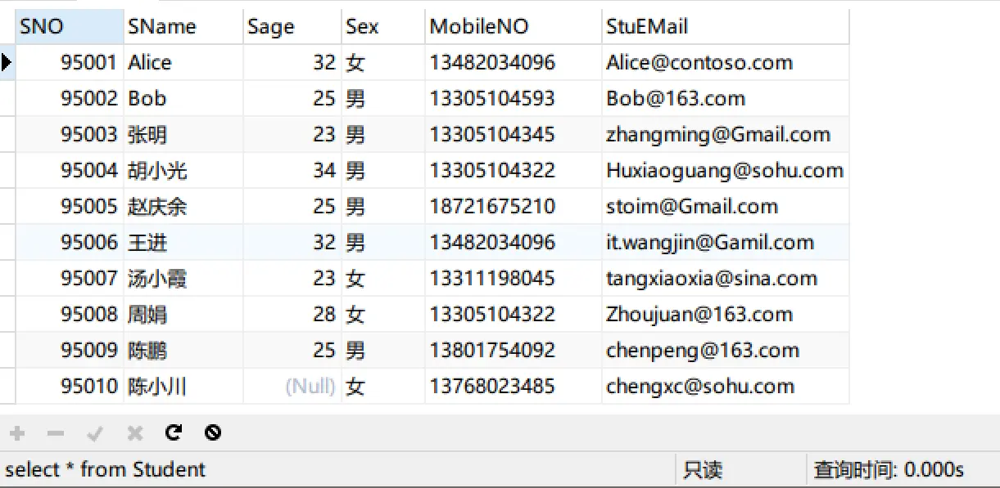
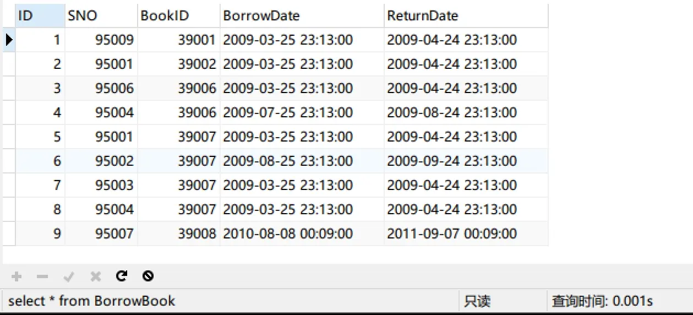
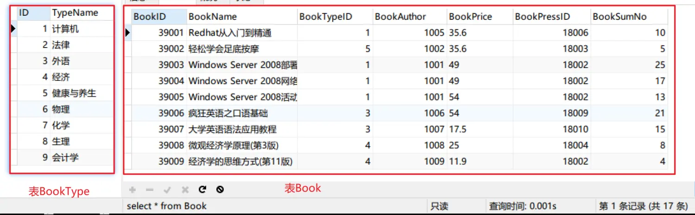

### 一、聚合函数
聚合函数主要是指统计中常用的函数，最一组数据进行计算返回一个值，就叫聚合。
最常用的5个聚合函数：
* count 求所选记录行数
* avg 求所选记录的平均值
* sum 求所选记录求和
* max 求所选记录的最大值
* min 求所选记录的最小值
### 案例：
#### 1. 在学生信息表中使用聚合函数
原始数据:


（1）查询出年龄最大的学生的学号和姓名
##### 错误写法01：
```sql
# 错误写法
select SNO as '学号',SName as '姓名'
from Student
where Sage = max(Sage);
```
注意：包括max在内的所有聚合函数，都是在所有行扫描完后才能出结果，而where语句是每一行判断，所以聚合函数和where是不能写在一起的。
##### 错误写法02：
```sql
# 错误写法
select SNO as '学号',SName as '姓名'
from Student
order by Sage DESC
limit 1
```
注意：先倒序排列然后取第一个是不可取的，因为有时候最大值是多个相同的值的话，就只能得出一个值。
##### 正确写法：
```sql
select SNO as '学号',SName as '姓名'
from Student
where Sage=(
	select max(Sage)
	from Student
)
```
注意：先通过内查询，查询出最大的年龄，然后在外面每条记录和这个年龄比较。
使用嵌套的方式，先把最大值求出来，再进行比较
（2）查询出男生的平均年龄
```sql
select avg(Sage)
from Student
where Sex='男';
```
##### 2.在借书表中使用聚合函数
原始数据：



（1)查询出有多少位学生借书

```sql
select count(distinct(SNO)) as '借书学生的人数'
from BorrowBook;
```
这里我们需要先去重后再进行统计操作。
（2）查询出计算机类的图书有多少本;
```sql
select sum(BookSumNo) as '计算机类图书的总数'
from Book
where BookTypeID=(
	select ID
	from BookType
	where TypeName='计算机'
);
```
### 二、分组查询
##### 1. 基本概念
分组查询，Group By“从字面意义上理解就是根据“By”指定的规则对数据进行分组，所谓分组就是将一个数据集分成若干个“小区域”，然后对若干个“小区域”进行数据处理。对标的是Excel里的分类汇总。
##### 2. 案例
（1）统计出男女生的人数
```sql
select Sex as '性别',Count(SNO) as '人数'
from Student
Group by Sex；
```
（2）统计出每一类书中最高价格
```sql
select BookType.TypeName as '类别名称',T1.maxprice as '最高价格' 
from BookType,
(
	select BookTypeId,max(BookPrice) as 'maxprice'
	from Book
	group by BookTypeId
) as T1
where BookType.ID = T1.BookTypeId
```
（3）查询出借的最多的书的名称
```sql
select BookName as '借的最多的书的id号'
from Book
where BookId in 
(      
        # 获取哪些书借的最多的id
	select BookId
	from BorrowBook
	group by BookId
	Having count(*) = 
	(
                # 图书最多借的人数
		select count(*)
		from BorrowBook
		Group by BookId
		order by count(*) DESC
		limit 1
	)
)
```
这里的过滤关键字用的是having，它与where的区别是：
 *  一般情况下， where用于过滤数据行，而 having用于过滤分组 。
* where查询条件中不可以使用聚合函数，而 having查询条件中可以使用聚合函数。
* where在数据分组前进行过滤，而 having在数据分组后进行过滤 。
* where针对数据库文件进行过滤，而 having针对查询结果进行过滤。也就是说， WHERE 根据数据表中的字段直接进行过滤，而 having是根据前面已经查询出的字段进行过滤。
* where查询条件中不可以使用字段别名，而 having查询条件中可以使用字段别名。

（4）统计出借书多于两本的学生姓名及数量，按照数量的降序排列
```sql
select Student.SName as '学生姓名',T1.count_book as '借书数量'
from Student,
(
	select SNO,count(*) as count_book
	from BorrowBook
	Group by SNO
	having count(*) > 2
) as T1
where Student.SNO = T1.SNO
order by T1.count_book DESC
```
### 三、嵌套查询
##### 1. 基本概念
一个查询语句(select-from-where)查询语句快可以嵌套在另外一个查询块的where子句中，称为嵌套查询。其中外层查询为父查询，内存查询也称为子查询；
嵌套查询的工作方式是:先处理内查询，由内向外处理；
嵌套查询最多可以嵌套32层。
##### 2. 嵌套查询案例
（1）查询出陈鹏借了哪些书
```sql
# 根据BookID查询书名
select BookName as '陈鹏借的书'
from Book
where BookID in 
(
	# 根据学号查询借的书的id
	select BookID
	from BorrowBook
	where SNO =
	(
		# 查出陈鹏的学号
		select SNO
		from Student
		where SName = '陈鹏'
	)
)
```
（2）查询出借的最多的那本书的作者
```sql
# 根据作者id找出作者姓名
select AuthorName
from Author
where AuthorID in
(
		# 根据图书id找作者id
		select BookAuthor from Book
		where BookID in
		(
			# 借出最多的书的id
			select BookID from BorrowBook
			group by BookID having count(SNO) = 
			(
				# 借出最多的书的数目
				select count(SNO)from BorrowBook
				group by BookID order by count(SNO) DESC limit 1	
			)
		)
)
```
（3）查询出计算机书中借的最多的那本书的作者的电话
```sql
# 根据BookAuthor获取AuthorTelNO
select AuthorTelNO from Author where AuthorID = 
(
	# 获取BookAuthor
	select BookAuthor from Book where BookID = 
	(
		# 获取BookID
		select BookID
		from BorrowBook
		group by BookID
		having BookID in 
		(
			# 获取计算机类书的BookID
			select BookID from Book where BookTypeID = 
			(	
				# 获取计算机书籍的类别id
				select ID from BookType where TypeName='计算机'
			)
		)
	)
)
```
（4）统计出被借过超过3本的(包括3本)的书的名称
```sql
# 根据BookID获取BookName
select BookName from Book where BookID in
(
	# 获取超过3本的书BookID
	select BookID
	from BorrowBook
	group by BookID
	having count(SNO)>=3
)
```
##### 3.嵌套查询连接运算符
连接运算符有:`In`,`Exists`,`Any`,`Some`,`All`
其中`in`等价于 `=any` 等价于`=somy`
In需要返回具体的值;
Exist返回False和True