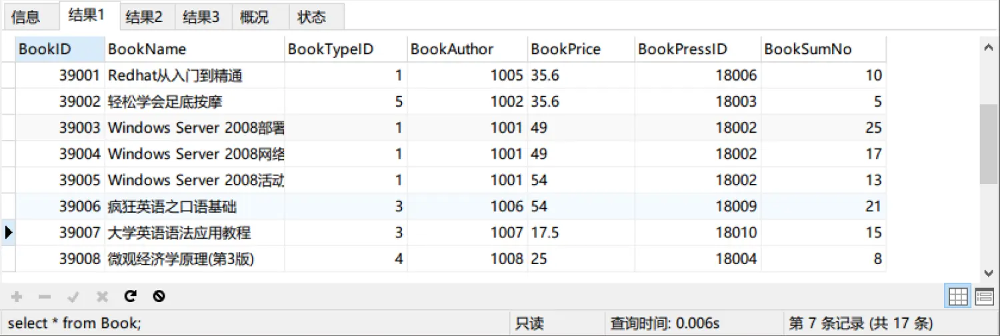
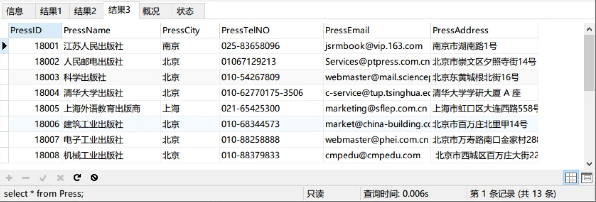
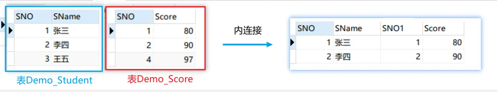
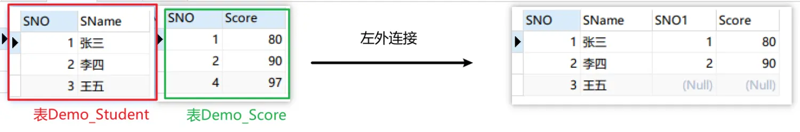

### 一、连接查询的概念
连接查询是指：所查询的信息分布在多张表中，必须要通过连接将多张表合并成一张大表进行查询。
举例：在LibraryDB数据库中，有三张表，Book、Author、Press，如果要查询出所有图书的id，名称，作者，出版社，价格，就需要将这三张表连接成一张表。



现在我们将三个表合并成一张表并显示我们需要的指定字段：

```sql
select Book.BookID as '图书ID',Book.BookName as '图书名称',
Author.AuthorName as '作者',Press.PressName as '出版社',Book.BookPrice as '价格'
from Book,Author,Press
where Book.BookAuthor = Author.AuthorID and Book.BookPressID = Press.PressID
```
一般情况下，可以是用嵌套查询的都可以使用连接查询，需要注意的是嵌套查询的查询效率要高。
### 二、内连接
##### 1. 概念:
把多个表按照某个字段连接成一个大表，满足条件的展示在大表中，不满足条件的隐藏。
##### 2. 理解内连接
为了方便理解内连接，我们创建两个表Demo_Student和Demo_Score

内连接的mysql语句有四种写法写法:

```sql
# ------- 第一种：sql 92 的写法
select *
from Demo_Student,Demo_Score
where Demo_Student.SNO = Demo_Score.SNo
# ------- 第二种：sql9 99 推荐（SqlServer、Oracle通用）------------
select *
from Demo_Student as T1 INNER JOIN Demo_Score as T2 on T1.SNO=T2.SNO
# ------- 第三种：natural (自然连接，去重，有相同的字段名)--------
select *
from Demo_Student natural join Demo_Score
# ------- 第四种：Using关键字 (去重，有相同的字段名)--------
select *
from Demo_Student INNER JOIN Demo_Score USING(SNO)
```
##### 3. 实际案例
（1）查询女生借了哪些书
方法一：推荐写法：
```sql
select distinct T3.BookName
from Student as T1 INNER JOIN BorrowBook as T2 on T1.SNO = T2.SNO
INNER JOIN Book as T3 on T2.BookID = T3.BookID
where T1.Sex = '女'
```
方法二：自然连接写法
由于连接表有相同的字段名，所以可以使用自然连接写法
```sql
select distinct BookName
from Student natural join BorrowBook natural join Book
where Student.Sex='女'
```
方法三：using关键字写法
```sql
select distinct BookName
from Student inner join BorrowBook using(SNO) 
inner join Book using(BookID)
where Student.Sex = '女'
```
（2）查询出被借出的书中是北京作者的
由于这里部分字段名在不同的表中命名不同，所以这里我们只用标准写法:
```sql
select T2.BookName
from BorrowBook as T1 inner join Book as T2 on T1.BookID=T2.BookID
inner join Author as T3 on T2.BookAuthor=T3.AuthorID
where T3.AuthorCity = '北京'
```
### 三、外连接
##### 1. 概念
外连接：以某一个表为主表，从另外一个表按照某一个条件填充数据。
在mysql中，外连接可分为左外连接、右外连接、全外连接；
左外连接是指：以左边的表为主表，在右边的表中找数据，如果找得到就填充数据，如果找不到就在左表中填充为null
##### 2. 理解
为了深入理解外连接，我们还是以前面的两个表Demo_Student,Demo_Score为例

外连接sql语句的写法：

```sql
# 第一种写法：
select * 
from Demo_Student as T1 left 
outer join Demo_Score as T2 on T1.SNO = T2.SNO
# 第二种写法：使用Natural
select *
from Demo_Student natural left outer join Demo_Score
# 第三种写法：使用using
select *
from Demo_Student  left outer join Demo_Score using(SNO)
```
MySQL不像SqlServer或者Oracle直接支持全外连接`full outer`，但是可以使用折中方案，使用union合并并去重左外连接和右外连接；
```sql
select * 
from Demo_Student as T1 left outer join Demo_Score as T2 on T1.SNO = T2.SNO
union
select * 
from Demo_Student as T1 right outer join Demo_Score as T2 on T1.SNO = T2.SNO
```
如果直接合并但是不去重可以使用关键字`union all`
##### 3. 外连接实际案例
（1）查询出哪些书从来没被借过
```sql
# 使用左外连接查询的方式
select T1.BookID,T1.BookName
from Book as T1 left outer join BorrowBook as T2 on T1.BookID = T2.BookID
where BorrowDate is null;
```
（2）统计出所有书的入库量、被借量、库存量
```sql
select T1.BookID ,T1.BookName,T1.BookSumNo as '入库量',
ifnull(borrow_sum,0) as '借出量',
T1.BookSumNo-ifnull(borrow_sum,0) as '库存量'
from Book as T1 left join  
(
	# 借书量
	select BookID,count(SNO) as 'borrow_sum'
	from BorrowBook
	group by BookID
)as T2 
on T1.BookID = T2.BookID
```
> 注意：在mysql中，如果字段的值为null时，我们想进行数值计算的话可以使用ifnull函数`ifnull(exp1,exp2)`，用于判断一个表单时是否为null，如果是空则返回第二个参数的值，否则返回第一个参数的值。

### 四、交叉连接
##### 1. 概念
交叉连接：交叉连接表示两个表的笛卡尔积。
把两个表的每一条记录一一组合。
##### 2. 理解交叉连接
我们还是把前面的两个案例表Demo_Student、Demo_Score用来解释交叉连接。
```sql
# 交叉连接
select * from Demo_Student cross join Demo_Score;
```
> 注意：如果两个表没有相同的字段，那么自然连接的结果就是交叉连接。