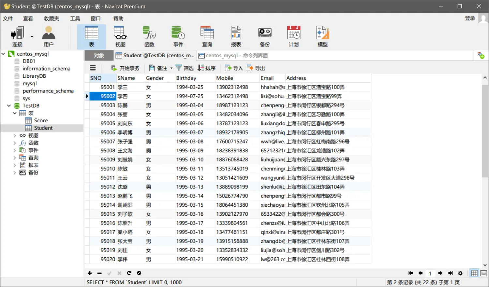
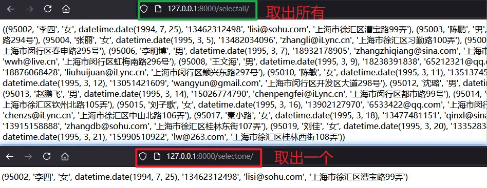

### 一、Django中的MySQL驱动程序
Python中常见的MySQL驱动程序：
* MySQL-python：就是MySQLdb，是对C语言操作MySQL的封装，支持Python2，不支持Python3
* mysqlclient:MySQL-python的另一个分支，支持Python3
* pymysql： 纯Python实现的驱动
* MySQL Connect For Python：MySQL官方退出的Python连接MySQL驱动。
本课程主要讲解Django中pymysql的使用。
### 二、pymysql的安装和使用
##### 1. 安装
在命令行使用命令：
```
pip list
```
查看已经安装的包列表；
如果没有安装就使用pip安装
```
pip install pymysql
```
或者去pycharm的包管理器里去安装也可以。
##### 2. 使用
为了使用pymysql，我们可以在views的函数里直接调用mysql，接下来我们就要介绍如何使用mysql数据库。
首先第一步就是要import导入包
```python
import pymysql
```
接下来，python操作mysql主要分4个步骤：
第一步:使用connect打开数据库连接
```python
mysqldb = pymysql.connect(host='主机ip',user='用户名',password='密码',database='数据库名')
```
第二步:创建游标
```python
cursor = mysqldb.cursor()
```
第三步:执行sql语句
```python
sql = "select version()"  # version表示获取版本号
cursor.execute(sql)
```
第四步:获取执行结果
```python
data = cursor.fetchone()  # fetchone表示返回单个元组，也就是一行记录
```
##### 3. 完善
我们发现，如果每次调用数据库都要写一次数据库连接的ip地址、用户名和密码，是效率是很低的。如果一个项目有50次对数据库的连接操作，一旦ip地址发生变化，就要修改50次。显然这样做是不合理的。我们看能不能在配置文件settings里面一次性写完数据库连接信息，后面连接数据库直接调用，一旦ip地址或者用户信息发生变化只需要在settings里修改一次就好。
实际上，在settings文件的DATABASE字典中，就定义了多条数据库连接信息。
```python
DATABASES = {
    'default': {
        'ENGINE': 'django.db.backends.sqlite3',
        'NAME': BASE_DIR / 'db.sqlite3',
    }
}
```
默认的使用的数据库是sqlite3，现在我们将其改成mysql，并补充相关的连接信息。
```python
DATABASES = {
    'default': {
        'ENGINE': 'django.db.backends.mysql',   # 数据库类型
        'NAME': 'LibraryDB',    # 数据库名
        'USER': 'root',     # 用户名
        'PASSWORD': 'Yusheng123.cn',    # 密码
        'HOST': '192.168.65.133',   # 服务器ip
        'PORT': '3306',     # 端口
    }
}
```
在settings里配置好了数据库连接信息，理论上我们在views里就可以直接使用connect()连接数据库了。然而，实际上当我们在运行时会报错，报错内容如下：
> django.core.exceptions.ImproperlyConfigured: Error loading MySQLdb module.
> Did you install mysqlclient?

这是什么原因呢？
实际上，如果我们在settings里配置了数据库连接信息，我们在连接数据库之前还有一个步骤要做，那就是在我们项目加载的`__init__.py`文件中，添加以下两句代码，数据库才能成功被加载：
```python
import pymysql
pymysql.install_as_MySQLdb()
```
意思是将pymysql以mysqldb的方式进行安装，这是一个标准步骤。
然而，实际上，这样做完之后，我们发现Django还是无法正确连接数据库。
原因：我们以原生pymysql.connect()直接连接数据库，系统是无法识别到我们在settings里的数据库配置。本质上，这里的DATABASE配置是为了我们后面的ORM使用的。
那我们该怎么办呢？
然而，事情总归是有解决办法的，只要把数据库配置信息写在settings里就行了，我们把配置信息定义成字符串表里的形式写在settings里，views里导入settings模块，直接调用就能达到同样的效果。
我们在settings里定义一下字符串变量：
```python
HOST = '192.168.65.133'
DB = 'LibraryDB'
USER = 'root'
PASSWORD = 'Yusheng123.cn'
```
views里连接字符串时，connect方法的参数值设为变量名就可以了。
```python
mysqldb = pymysql.connect(host=HOST, database=DB, user=USER, password=PASSWORD)
```
这样就能成功访问mysql数据库了！
##### 4.总结
为了更清晰的掌握Django连接mysql的方法，我们把数据库配置的过程简化为三步
第一步：把数据库连接信息写入settings
```python
HOST = 'ip地址'
DB = '数据库名'
USER = '数据库用户名'
PASSWORD = '数据库密码'
```
第二步:在项目init里安装mysqldb
```python
import pymsql
pymsql.install_as_MySQLdb()
```
第三步：连接的时候导入settings信息
```python
from 项目名.settings import *
mysqldb = pymysql.connect(host=HOST,user=USER,password=PASSWORD,database=DB)
```
以上，就是配置Django连接mysql数据库的方法！
### 三、创建表
这里我们开始将如果在Django里创建mysql表，和前面一样，先创建数据库连接，然后创建游标，执行SQL语句，提交。
注意：为了方便编辑与阅读sql语句可以写在三个双引号的注释里面，也是同样可以执行的！
```python
def create_table(request):
    # 创建一个数据库连接
    mysqldb = pymysql.connect(host=HOST,user=USER,password=PASSWORD,database=DB)
    # 创建一个游标
    cursor = mysqldb.cursor()
    # 写mysql语句
    sql = """
            Create Table Student
            (
                SNO int,
                SName varchar(20) not null,
                Gender varchar(20) not null,
                Birthday date,
                Mobile varchar(20),
                Email varchar(100),
                Address varchar(200),
                constraint Pk_SNO primary key(SNO),
                constraint Uq_Mobile unique key(Mobile),
                constraint Uq_Email unique key(Email)
            )
            """
    # 执行
    try:
        cursor.execute(sql)
        # 如果没问题,提交
        mysqldb.commit()
        # 成功的提醒
        return HttpResponse("创建表成功！")
    except Exception as e:
        return HttpResponse("创建数据库异常，具体原因:"+str(e))
    finally:
        # 关闭连接
        mysqldb.close()
```
### 四、数据操作
##### 1. 手动插入一行数据
前面我们新建了一个Student表，现在我们在Django中手动插入一行数据到这个表里。只需要定义一个方法，与前面创建表一样的过程，sql语句换成插入语句即可。唯一需要注意的是把插入过程放在一个异常处理中，如果插入失败，就多一个撤销操作的语句即可。
```python
try:
    cursor.execute(sql)
    mysqldb.commit()
    return HttpResponse("插入完成")
except Exception as e:
    # 撤销操作
    mysqldb.rollback()
    return HttpResponse("插入失败"+str(e))
finally:
    mysqldb.close()
```
##### 2. 将文件的数据插入到数据库中
为了能够一次性的插入大量数据到数据库中，我们可以对txt文件进行处理，例如可以将txt文件中存储的学生信息，打包到一个列表中，然后通过for循环将数据依次插入数据库中。
第一步：从文件中读取学生信息：
```python
def read_from_file(path:str):
    """
    从文件中读取学生信息
    :param path: txt文件路径
    :return: [{},{},{}]
    """
    students = []
    infos = ['sno', 'sname', 'gender', 'birthday', 'mobile', 'email', 'address']
    # 读取
    try:
        with open(path, mode='r', encoding='utf-8') as fd:
            current_line = fd.readline()
            while current_line:
                # 切分属性信息
                student = current_line.replace('\n', '').split(",")
                # 定义临时学生集合
                temp_student = {}
                for index in range(len(infos)):
                    temp_student[infos[index]] = student[index]
                students.append(temp_student)
                current_line = fd.readline()
            return students
    except Exception as e:
        print("读取失败"+str(e))
```
第二步:将读取到的数据循环插入数据库
```python
def insert(request):
    """
    想表中写入，txt文件中的数据
    :param request:
    :return:
    """
    # 获取文件中的数据
    path = r'D:\Python\Project\Dj020601\app01\static\file\Student.txt'
    students = read_from_file(path)
    # 创建一个数据库
    mysqldb = pymysql.connect(host=HOST,user=USER,password=PASSWORD,database=DB)
    # 创建一个游标
    cursor = mysqldb.cursor()

    # 遍历集合
    for student in students:
        # 准备sql语句
        sql = "Insert into Student(SNO,SName,Gender,Birthday,Mobile,Email,Address) values " \
              "(%s,'%s','%s','%s','%s','%s','%s')" % (student['sno'], student['sname'], student['gender'],
                student['birthday'], student['mobile'], student['email'], student['address'])
        try:
            cursor.execute(sql)
            mysqldb.commit()
        except Exception as e:
            mysqldb.rollback()
            return HttpResponse("数据插入异常"+str(e))
    # 反馈
    return HttpResponse("数据插入成功！")
```
把insert方法配置到url中，这样我们通过访问指定链接就能实现对数据库的写入操作了。
于是，数据就成功插入到数据库中，最后我们再用navcat查看一下表中的数据是否正常：

##### 3. 修改和删除数据
修改与删除数据基本套路与上面的插入数据一样，只是sql语句改为相对应的操作即可。
修改数据库
```sql
update Student set Birthday='2002-08-09' where SNO=95001
```
删除数据库
```sql
delete from Student where SNO=95022
```
需要注意的是，进行数据库操作的时候不要忘了commit提交，操作完成了不要忘了close关闭数据库。
### 五、查询数据
在Django中查询数据库中值，我们重点需要掌握两个方法：`fetchall`和`fetchone`，分别获取数据库表中的所有行数据和一行数据。返回的结果都是以元组的形式呈现的。
```python
def select_one(request):
    """
    获取一条数据 -- fetchone
    """
    mysqldb = pymysql.connect(host=HOST, user=USER, password=PASSWORD, database=DB)
    # 创建游标
    cursor = mysqldb.cursor()
    # 准备sql语句
    sql = "Select SNO,SName,Gender,Birthday,Mobile,Email,Address from Student where SNO>95001"
    # 执行
    try:
        cursor.execute(sql)
        # 获取执行的结果
        students = cursor.fetchone()
        # 返回到页面
        return HttpResponse(str(students))
    except Exception as e:
        return HttpResponse("获取数据失败，具体原因" + str(e))
    finally:
        mysqldb.close()
```
fetchone取出一条记录，结果是以一个元组的形式返回；
fetchall取出所有记录，结果是以一个大元组嵌套多个小元组的形式返回的。
##### 返回结果如下：
