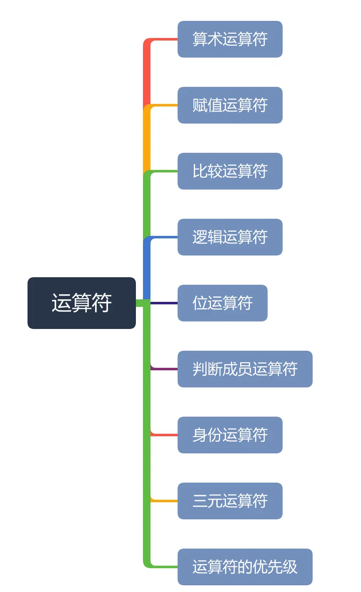
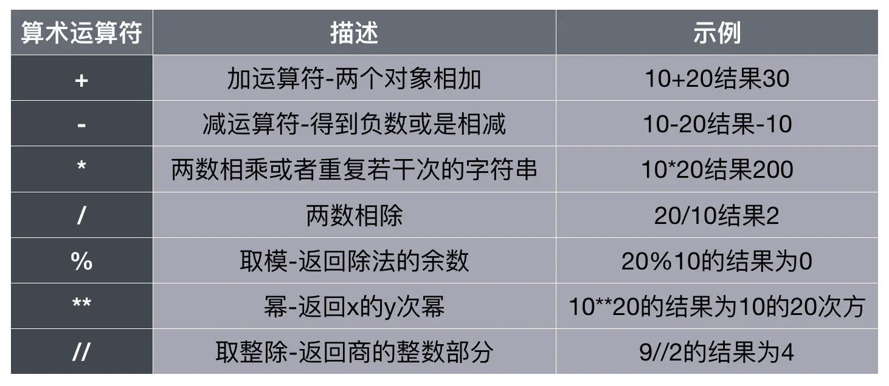
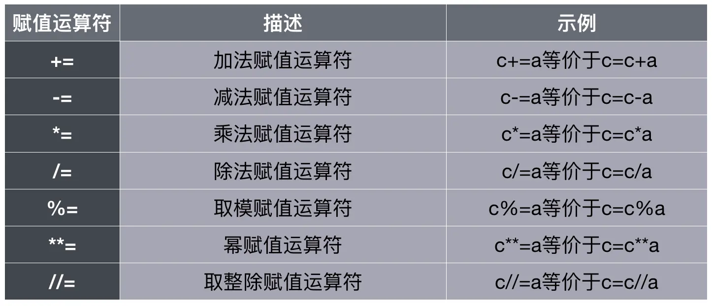
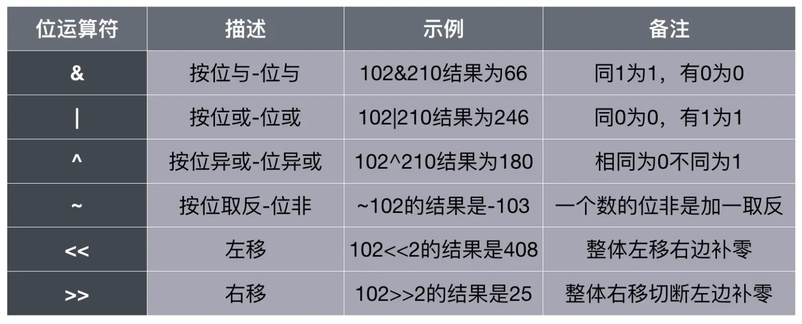
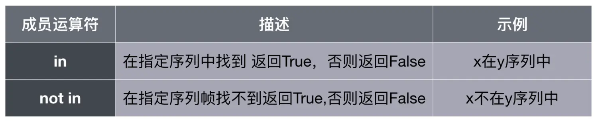
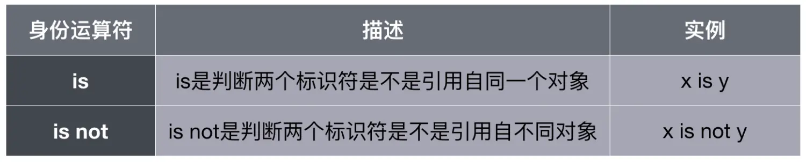
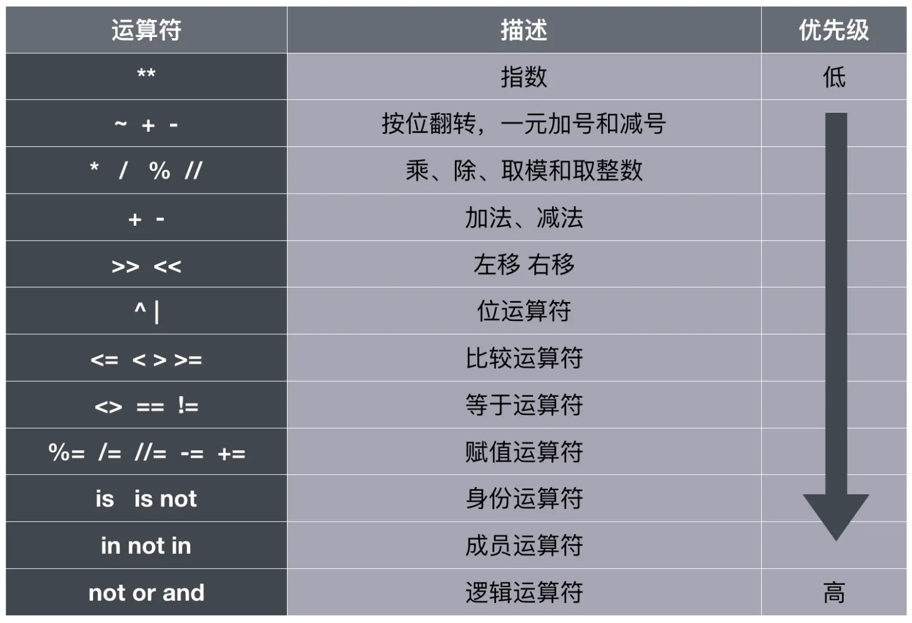

本节介绍Python中运算符基础知识，本节的知识框架为：



### 一、算术运算符

例题：输入一个三位数，返回每个位置的数字
方法一(通过算术运算)：
```python
num01 = input("请输入一个三位数：")
print("百位数是:{:d}".format(int(num01)//100))
print("十位数是:{:d}".format(int(num01)%100//10))
print("个位数是:{:d}".format(int(num01)%10))
```
方法二(通过字符串读取位置)：
```python
num = input("请输入一个三位数：")
print("三位数{0}的百位数:{1},十位数是:{2},个位数是:{3}".format(num,num[0],num[1],num[2]))
```
### 二、赋值运算符

例题：
（1）编程实现145893是几天几小时几分几秒？
```python
# 编程实现145893是几天几小时几分几秒
total = 145893
day = total // (24*60*60)
hour = total % (24*60*60)//(60*60)
minute = total % (60*60) // 60
second = total % 60
#打印
print("%d秒 有%d天、%d小时、%d分钟、%d秒"%(total,day,hour,minute,second))
```
（2） 用户输入语文数学外语分数，输出总分和平均分
```python
# 用户输入语文数学外语分数，输出总分和平均分
chinese = int(input("请输入语文成绩："))
math = int(input("请输入数学成绩："))
English = int(input("请输入英语成绩："))
print("总分{0},平均分{1:.2f}".format((chinese+math+English),(chinese+math+English)/3))
```
### 三、比较运算符
例题：
（1） 输入三个互不相等的整数，按从小到大输出
```python
#输入三个互不相等的整数，按从小到大输出
num01,num02,num03 = eval(input("请输入三个整数，用逗号分割:"))
if num01 > num02 :
    if num02 > num03:
        print("从小到大输出%d,%d,%d"%(num03,num02,num01))
    elif num01 > num03:
        print("从小到大输出%d,%d,%d" % (num02, num03, num01))
    else:
        print("从小到大输出%d,%d,%d" % (num02, num01, num03))
else:
    if num03 < num01:
        print("从小到大输出%d,%d,%d" % (num03, num01, num02))
    elif num03>num02:
        print("从小到大输出%d,%d,%d" % (num01, num03, num02))
    else:
        print("从小到大输出%d,%d,%d" % (num03, num01, num02))
```
（2）登录判断
提示输入用户名和密码
如果用户名等于Admin，密码等于123.com ，提示登录成功
如果用户名不是Admin，提示用户名不存在
如果密码不等于123.com，提示密码错误
```python
username = input("请输入用户名：")
password = input("请输入密码：")
if username != "Admin":
    print("用户名错误")
elif password!="123.com":
    print("密码错误")
else:
    print("登录成功")
```

### 四、逻辑运算符
逻辑运算符主要包括`and与`、`or或`、`not非`
例题：
（1）让用户输入语文数学成绩，输出一下判断是否正确，正确（True）错误（False）
语文和数学成绩都大于90分
语文和数学成绩有一门大于90分
```python
chinese,math = eval(input("请依次输入语文数学成绩："))
if chinese>=90 and math >= 90:
    print("语文和数学成绩都大于90分")
elif chinese>=90 or math >= 90:
    print("语文和数学有一门成绩大于90分")
else:
    print("成绩不怎么样哦")
```
（2）用户输入一个年份，判断是否是闰年。
闰年判断条件：能被400整除 or 能被4整除但是不能被100整除
```python
# 判断是否是闰年
year = int(input("请输入年份："))
if year%400 == 0:
    print("%d是闰年"%year)
elif (year % 4 == 0) and (year % 100 != 0):
    print("%d是闰年"%year)
else:
    print("%d不是闰年"%year)
```

### 五、位运算符

测试：
```python
print(102&210)  #66
print(102|210)  #246
print(102^210)  #180
print(~102)  #-103
print(102<<2)  #408
print(102>>2)  #25
```
### 六、判断成员运算符


### 七、身份运算符


身份标识符，主要判断两个变量是否是引用同一个对象

### 八、三元运算符
三元运算符也被称为条件表达式，是条件选择的一种简单写法
`[条件为真的结果] if 条件 else [条件为假时的结果]`
案例：
（1）模拟登陆
```python
#模拟登陆利用三元运算符
username = input("请输入用户名：")
password = input("请输入密码：")
result = "登陆成功!" if username == "Admin" and password == "123.com" else "用户名或密码错误"
print(result)
```
（2）输入两个不相等的数判断大小
```python
#输入两个不相等的数判断大小
num01,num02 = eval(input("请输入两个数，并用逗号隔开:"))
result = "num01比num02大" if num01>=num02 else "num01比num02小"
print(result)
```


> 不用刻意的记优先级，如果不清楚优先级，小括号是个很好的解决办法