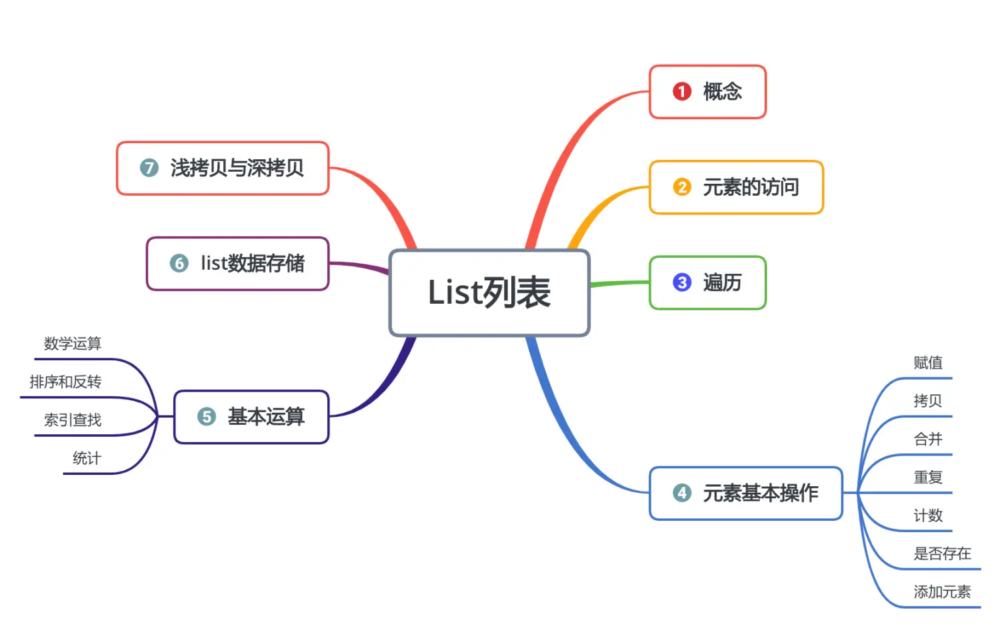
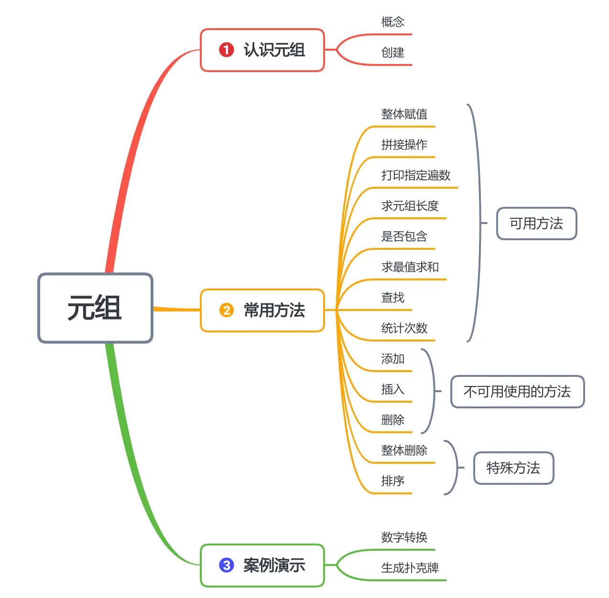
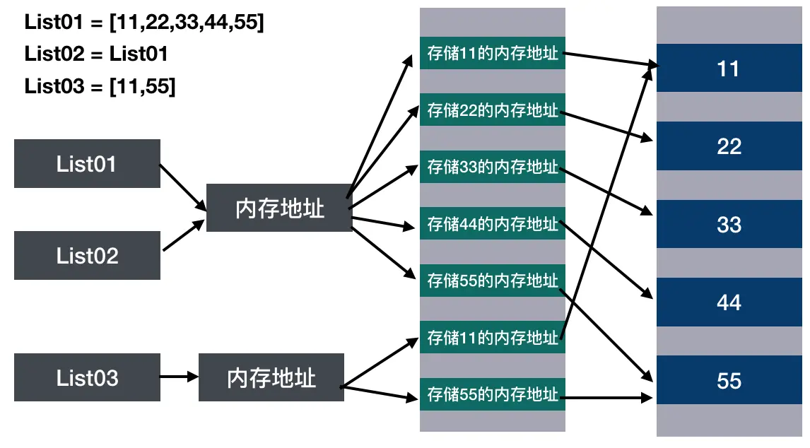
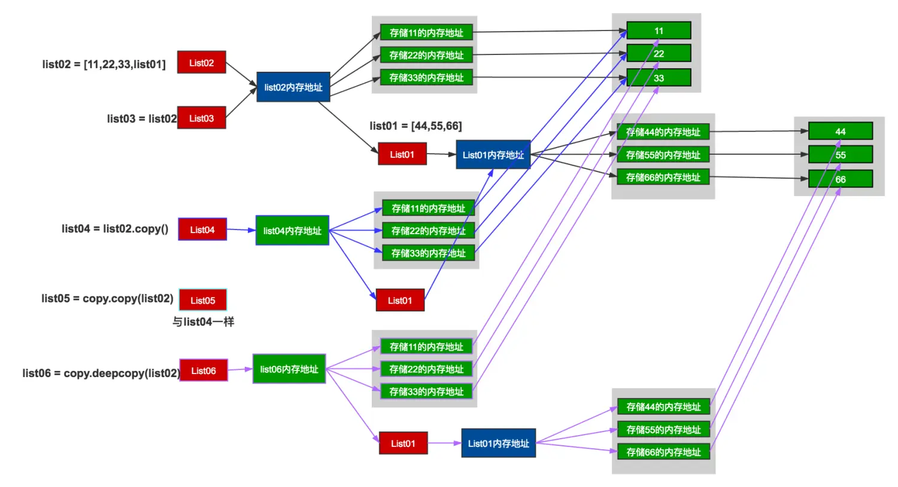
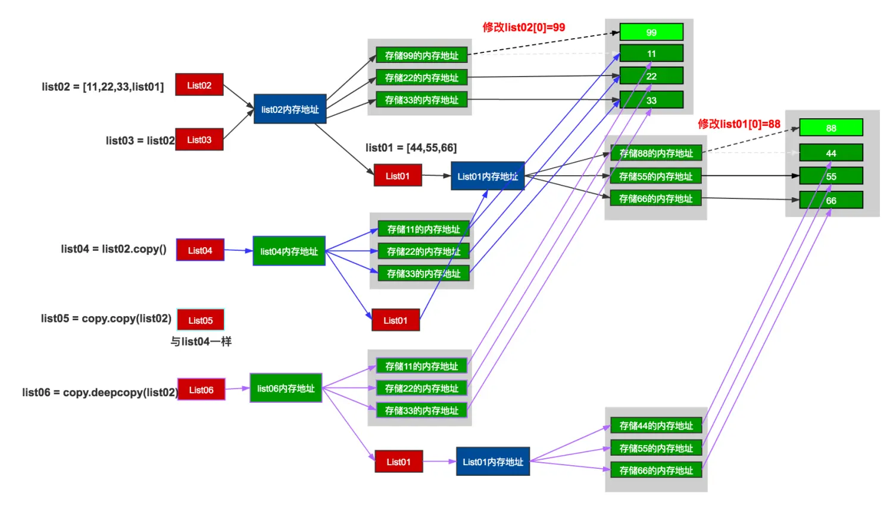

变量只能存一个数据，而集合能存储一组数据；本节我们来介绍两种重要的集合：列表与元组
本节知识大纲：



### 一、List列表的概念
List列表---一组有序、可变的数据集合；我们可以通过List列表的索引编号（位置编码）来访问列表中的元素；
集合中的任何一个元素，称为集合的元素或者成员；
同一个列表集合中可以同时存储数字、字符、字符串，甚至包含另一个List；
创建List列表的方法有两种：

（1）创建的时候直接复制
```python
list01 = [100,90,80,70]
```

（2）创建空list然后插入
```python
list01 = []
list01.append(100)
list01.append(90)
```

示例：

输入学生的数量，依次输入学生的成绩，打印出所有的成绩
```python
student_number = int(input("请输入学生的数量："))
student_result = []
for i in range(1,student_number+1):
    student_result.append(int(input("请输入第【%d】个学生的成绩是:" % i)))
for j in range(0,student_number):
    print("第%d个学生的成绩是:%d"%(j+1,student_result[j]))
```

### 二、List列表元素的访问
如何取List列表中的元素？`[起始索引：结束索引：每次变化的索引值]`

```python
list01 = [10,20,30,40,50,60,70,80,90,100]
print(list01[0])    # 结果：10 解释：访问列表集合的第一个元素
print(list01[-1])   # 结果：100 解释：访问集合的最后一个元素
print(list01[4:])   # 结果：[50,60,70,80,90,100]
print(list01[:4])   # 结果：[10,20,30,40] 解释：如果只有右边的数字，右边的编号取不到
print(list01[:-5])  # 结果：[10,20,30,40,50]
print(list01[-5:])  # 结果：[60,70,80,90,100]
print(list01[1:5])  # 结果：[20,30,40,50]
print(list01[-4:-1])    # 结果：[70,80,90]
print(list01[1::2])  #结果：[20, 40, 60, 80, 100]    解释：[开始索引:结束索引:每次变化索引]
print(list01[-1:-4:-1]) # 结果：[100,90,80]
```

### 三、List列表集合的遍历

遍历：依次取出集合中所有的元素

1. 第一种遍历方法：while循环遍历
```python
i = 0
while i < len(list01):
    print("第【%d】个元素是"%(i+1),list01[i])
    i+=1
```

2. 第二种遍历方法：for循环数值索引遍历
```python
i = 0
for i in range(0,len(list01)):
    print("第【%d】个元素是" % (i + 1),list01[i])
```

3. 第三种遍历方法：for循环集合索引遍历
```python
i = 0
num = 1
for i in list01:
    print("第【%d】个元素是" % num,i)
    num+=1
```

案例：

（1）随机生成10个三位的整数，打印出大于500的元素；
补充知识：如何生成随机数
```
import random
a = 0
a = random.randint(100,999)  
```
生成随机数需要导入包random，使用`random.randint(起始值,结束值)` 包含头尾生成范围内的随机数。
```python
import random
list01 = []
# 生成10个随机数
for i in range(10):
    list01.append(random.randint(100,999))
# 打印大于500的元素
for j in list01:
    if j>500:
        print(j,end=" ")
```
### 四、List元素的基本操作

##### 1. 赋值：
```python
list01 = [1,2,3]
list02 = list01  # 把list01的值赋给list02
```
##### 2. 拷贝：
```python
list03 = list01.copy()  # 使用copy把list01的值拷贝给list03
```
虽然值一样，但是赋值与拷贝是有本质的区别的，我们后面会详细讲解。
##### 3. 合并
```python
list01 = [1,2,3]
list02 = [4,5,6]
print(list01+list02)  # 让两个list集合合并
```
##### 4. 重复
```python
list01 = ['a','b','c']
print(list01*3)  # 让list集合重复3次
```
##### 5. 计算元素的个数
```python
list01 = ['a','b','c']
print(len(list01))  # 返回list集合元素的个数
```
##### 6. 判断某个元素是否存在于集合中
```python
list01 = ['a','b','c']
# 使用成员运算符
print("a是否在list01中",'a' in list01)  # in、not in都可以使用
```
##### 7. 元素的添加
```python
list01 = [1,2,3,4,5]  # 直接创建
list02 = []  # 创建一个空列表集合
```
方法01：使用append方法添加,添加到最后
```python
list02.append("AAA")
list02.append("BBB")
print(list02)
```
方法02：使用insert方法插入，添加到指定位置
```python
list02.insert(1,"CCC")
print(list02)
```
方法03：使用extend添加，可以添加一个集合
```python
list02.extend(["DDD","EEE","FFF"])
print(list02)
```
##### 8. 元素的删除
方法01：remove(具体的元素的值)
如果列表中有多个要删除的元素，remove只删除第一个元素
```python
list01 = ['a','b','c','d','e','f','g','h','i','j']
list01.remove('f')
print(list01)
```
方法02：pop（元素的索引值）
pop()如果不带索引值，默认情况下删除最后一个元素
```python
list01.pop(1)   # 删除第二个元素
print(list01)
list01.pop()    # 删除最后一个元素
print(list01)
```
方法03：使用del删除
支持切片删除
```python
del list01[1]
print(list01)
del list01[1:5] # 切片删除第二个到第五个
print(list01)
```
方法04：clear ---清空
```python
list01.clear()  # 清空list中所有的元素
print(list01)
```
### 五、List集合基本运算
##### 1. 数学运算
（1）最大值max()
```python
list01 = [45,90,123,987,-10,78,96]
print("List01的最大值：",max(list01))
```
如果列表中的元素是字符串，则最大值根据字符串首字母的ASCII码值进行大小排序，最小为`A`，最大为`z`
（2）最小值min()
```python
list01 = [45,90,123,987,-10,78,96]
print("List01的最小值：",min(list01))
```
（3）求和sum()
```python
list01 = [45,90,123,987,-10,78,96]
print("list所有元素和:%d"%sum(list01))
```
##### 2. 排序和反转

（1）使用sort()进行排序
默认是升序
```python
list01 = [12,33,44,55,6,22]
list01.sort()
print(list01)
```
使用sort排序，是更改存储的顺序

（2）倒序排列
方法01：先升序，再反转
使用reverse()方法进行逆序操作
```python
list01 = [12,33,44,55,6,22]
list01.sort()
list01.reverse()
print(list01)
```
方法02：添加参数reverse
```python
list01 = [12,33,44,55,6,22]
list01.sort(reverse=True)
print(list01)
```

（3）临时排序
使用sort()方法进行排序后，会更改原有存储的顺序；但是我们只想要其按照顺序打印但是不改变原有的存储顺序，我们可以使用sorted()方法
```python
list01 = [12,33,44,55,6,22]
print(sorted(list01))  # 临时排序，不影响存储数据的顺序
print(list01)
```
##### 3. 索引查找
如果能找找到，返回该元素的第一个索引值，也支持指定片段查找，index(元素值,开始,结束)，查到显示索引，查不到显示异常
```python
list01 = [45,90,45,123,987,-10,78,96]
print(list01.index(45))  # 查找第一个45
print(list01.index(45,1,3)  # 查找第二到第三个元素范围内值为45的索引
```
##### 4. 统计
统计list集合中，指定数值的元素出现多少次，如果没有则返回0
```python
list01 = [45,90,45,123,987,-10,78,96]
print(list01.count(45))  # 获取45这个元素出现的次数
```
案例：

（1）有五名学生【张三、李四、王五、赵六、马七】，每个学生有五门科目【语文、数学、英语、物理、化学】，为这5名同学随机生成5门考试成绩【介于50-100之间】，需求：按照平均分的倒序打印出成绩的明细。

```python
import random
# student_name存储学生姓名
student_name = ['张三','李四','王五','赵六','马七']
# student_result存储学生明细
student_result = []
# 使用循环生成每个人每个科目的成绩
for i in range(len(student_name)):
    list_temp = []
    for j in range(5):  # 5门科目成绩
        list_temp.append(random.randint(50,100))    # 每次一个成绩

    # 把5门科目插入到student_result
    student_result.append(list_temp)

# 统计出每个人的总分
student_total_result = []   # 存储每个人的总分
for i in student_result:
    student_total_result.append(sum(i))

print("名次 姓名 语文 数学 英语 物理 化学 总分 均分")
print("=====================================")
for i in range(len(student_name)):
    max_result = max(student_total_result)  # 获取最高分数
    max_index = student_total_result.index(max_result)  # 获取最高分的编号
    # 打印--名次
    print(i+1,end="\t")
    # 打印--姓名
    print(student_name[max_index],end="\t ")
    # 打印--成绩5门
    for i in range(5):
        print(student_result[max_index][i],end="\t ")
    # 打印--总分
    print(max_result,end=" ")
    # 打印--均分
    print(max_result/5)

    # 删除信息--总分
    student_total_result.pop(max_index)
    # 删除信息--成绩明细
    student_result.pop(max_index)
    # 删除信息--姓名
    student_name.pop(max_index)
print("=====================================")

```
### 六、List数据存储
具体的值在内存中只存一份，列表存储的过程原理如下图所示

如果list01里的数据发生了变化，list02也会跟着变化，但是list03不受影响。

### 七、浅拷贝和深拷贝
浅拷贝与深拷贝有什么区别？

案例：

```python
import copy
list01 = [44,55,66]
list02 = [11,22,33,list01]
list03 = list02     # 直接赋值
list04 = list02.copy()  # 浅拷贝-copy
list05 = copy.copy(list02)  # 浅拷贝-copy
list06 = copy.deepcopy(list02)  # 深拷贝-deepcopy
```
我们用示意图来解释以上浅拷贝与深拷贝具体原理：

如果我们将list01与list02的部分数值进行修改：
```python
list01[0] = 88
list02[0] = 99
```
那么此时的原理图如下：

最终打印list01至list06的结果为：
```python
# 打印结果
list01:[88, 55, 66]
list02:[99, 22, 33, [88, 55, 66]]
list03:[99, 22, 33, [88, 55, 66]]
lisr04:[11, 22, 33, [88, 55, 66]]
list05:[11, 22, 33, [88, 55, 66]]
list06:[11, 22, 33, [44, 55, 66]]
```

**赋值**：直接把变量关联的地址赋值到另一个变量
**浅拷贝**：把内存地址的下一层完全复制一份出来,实现的方式有两种：
```python
# 浅拷贝方式一：
list04 = list02.copy(）
```
```python
 # 浅拷贝方式二：
import copy
list05 = copy.copy(list02)
```
**深拷贝**：把对应的整个架构都完整的复制一份出来
但是不管哪一种存储方式，值在内存空间只存储一份！
### 八、认识元组
##### 1. 元组的概念
元组（Tuple）是一组有序的、不可变的数据集合（不可改的List）
在定义的时候，主要元组用的是小括号（），是可以通过下标进行访问的，也可以通过切片进行访问
```python
# 元组的创建和访问
tuple01 = (11,22,33,44,55,66)
print(tuple01[0])  # 通过下标访问第一个元素
print(tuple01[1:5])  # 通过切片访问第二个到第五个元素
```
##### 2. 元组的创建

（1）常规元组创建

一开始就得全部声明，因为后面是不可以更改的
```
# 常规元组创建的方法
tuple01 = (11,22,33,44,55)  # 元组的创建
tuple02 = ()  # 空元组也是可以创建的
```

（2）单个元组的创建

如果创建单元素的元组不能直接写成tupel03 = (11)，因为这种创建方式默认创建的整型，那么怎么创建单元素的元组呢？
我们需要在单个元素后面添加一个逗号，这样就能够创建单个元素的元组了：
```python
# 创建单元素元组
tuple03 = (11,)  # 单元素元组一定要加逗号
```

（3）元组的拼接

元组虽然不可以修改，但是支持多个元组的拼接；
```
# 元组的拼接
tuple04 = tuple01 + tuple03
```

### 九、元组常用的方法
##### 1. 元组中可以用的常用方法

（1）整体赋值操作

```python
# 元组使用整体赋值运算符
tuple01 = (11,22,33,44)
tuple02 = tuple01
```

（2）拼接操作

```python
tuple01 = (11,22,33,44)
tuple02 = (55,66)
tuple03 = tuple01 + tuple02
print(tuple03)
```

（3）打印指定遍数

```python
# 元组使用*运算符
tuple01 = (11,22)
print(tuple01 * 3)
```

（4）求元组的长度

```python
# 元组使用求长度运算符
tuple01 = (11,22,33)
print(len(tuple01))
```

（5）是否包含

```python
# 元组使用是否包含运算符
tuple01 = (11,22,33)
print("是否包含11:",11 in tuple01)
```

（6）求最值、求和

```python
# 元组的计算
tuple01 = (11,22,33,44,999,66,2)
print(max(tuple01))
print(min(tuple01))
print(sum(tuple01))
```

（7）查找

```python
# 元组的查找
tuple01 = (-11,11,13,44,999,66,2)
print(tuple01.index(11))
```

（8）统计元素的次数

```python
# 统计出现的次数
tuple01 = (-11,11,13,44,999,66,11)
print(tuple01.count(11))
```

##### 2.元组不可以使用的方法

元组不可以直接使用列表中的添加、插入、删除方法，但是注意：虽然元组里直接的元素没法改，但是元组里嵌套了list的话，还是可以非常方便的增加、删除、修改list元素的。
```python
# 修改元组中嵌套的列表元素
tuple01 = (11,22,33,44,[44,55,66])
tuple01[4].append(77)
tuple01[4].remove(55)
tuple01[4].extend([88,99])
print(tuple01)
```
##### 3. 特殊方法

（1）元组的删除

元组里的单个元素是无法删除的，但是可以用del方法，把整个元组删除
```python
# 元组的删除
tuple01 = (11,22,33)
del tuple01
```

（2）元组的排序

用于排序的sort()方法，和反转排序的reverse()方法，改变了元素的存储位置所以不可用于元组的排序，但是临时排序sorted()方法就可以，因为它并没有改变元素的原始存储位置，只是用于排序输出
```python
tuple01 = (-11,1,13,44,999,66,2)
print(sorted(tuple01))
```

### 十、元组的案例演示

案例1：

输入一个数字，转换成中文数字，比如：1234567890转换成壹贰叁肆伍陆柒捌玖零

```python
# 定义汉字数字元组
tuple_chinese = ('零','壹','贰','叁','肆','伍','陆','柒','捌','玖')
# 定义阿拉伯数字元组
tuple_num = (0,1,2,3,4,5,6,7,8,9)
# 读取输入的数值字符串
num_input = input("请输入数字：")
for i in range(len(num_input)):
    if num_input[i] == '.':
        print("点",end="")
    else:
        # 把读取到的数值字符串每一个数逐一转为整型
        num_single = int(num_input[i])
        print(tuple_chinese[num_single],end="")
```

案例2：

根据花色和数字生成一副扑克牌
```python
# 案例：根据花色和数字生成一副扑克牌
poker_type = ("♣","♦","♠","♥")
poker_number = ("3","4","5","6","7","8","9","10","J","Q","K","A","2")
count = 0
for i in poker_number:
    for j in poker_type:
        print(j+i,end="\t")
        count+=1
    print()
print("扑克有%d张"%count)
```