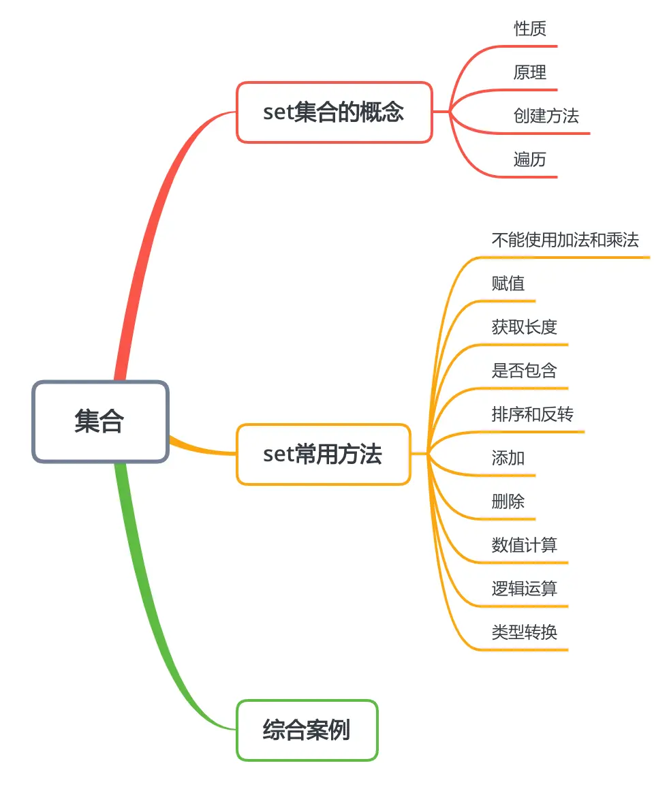
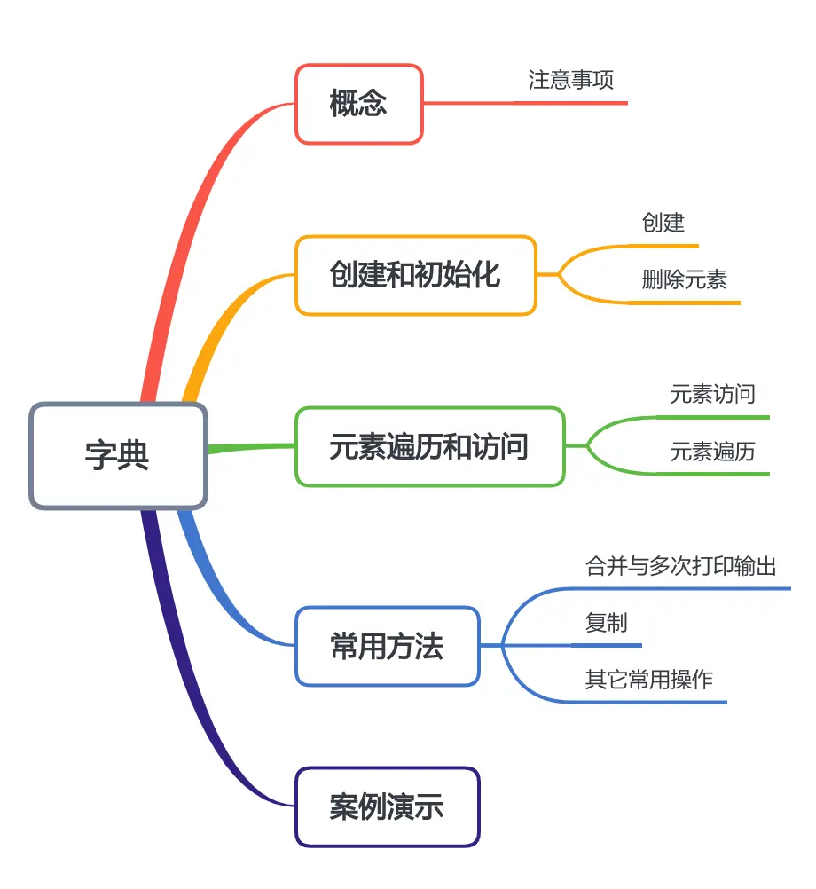
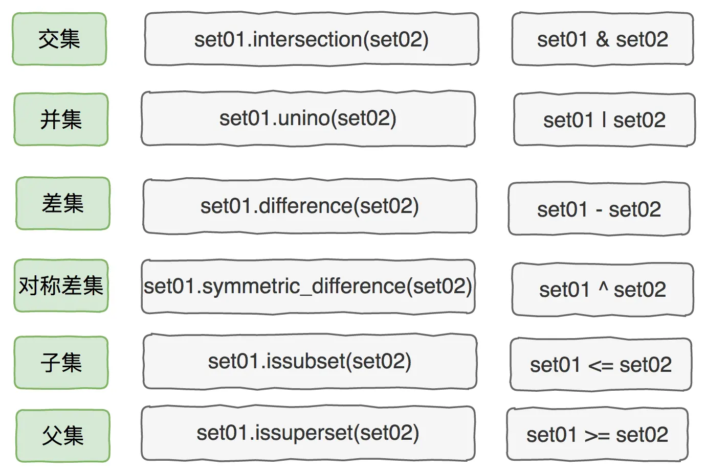

本节知识大纲：

一、Set集合的概念

##### 1. set集合的性质
set集合是一组无序的且不能重复的集合，打印set集合时会自动消除重复的元素项；
set集合用大括号表示；
set集合存储的时候就是无序的，它不支持通过索引的方式进行访问；
set集合在初始化时的顺序与打印出来时的顺序是不一样的；
```
set01 = {11,22,33,44,55}
```
##### 2. set集合存储的原理
set集合在存储的时候，先把元素转为哈希值，哈希值是顺序存储的，哈希算法是用来判断两个对象是否是同一个；

##### 3. 创键set集合的方法
（1）创建的时候，直接初始化
```python
# 创建set集合
set01 = {11,22,33,44,55,66,77}
print(set01)
```
（2）创建空的set集合，然后往里加入值
创建空set不能想当然的使用`set{}`，这样创建的是一个空字典，创建空set集合应该使用方法`set()`
```python
# 创建空set
set02 = set()
set02.add("Tom")
set02.add("Bob")
set02.add("Jerry")
print(set02)
```
##### 4.遍历set集合的方法
使用for循环遍历集合
```python
# 遍历set集合
set01 = {11,22,33,44,55,66,77}
for i in set01:
    print(i,end=" ")
```

### 二、set集合常用方法
##### 1. 不可以使用加法运算和乘法运算符
列表可以使用加法运算符将两个列表拼接在一起，set集合不可以使用；
列表可以使用乘法运算符将指定列表打印指定次数，set集合不可以使用；
##### 2. 赋值运算符
```python
set01 = {11,22,33}
set02 = set01
```
##### 3. 返回集合中元素的长度
```python
set01 = {11,22,33}
print(len(set01))
```
##### 4. 判断是否包含元素
```python
# 判断是否包含元素
set01 = {11,22,33}
print("是否包含22：",22 in set01)
```
##### 5. 排序和反转
直接的排序是不支持的，`sort()`、`reverse()`
但是支持临时排序
```python
# set支持临时排序
set01 = {11,2,-1,222,23}
print(sorted(set01))
```
##### 6. 添加元素
使用add()方法添加元素
```python
set01 = {11,22,33}
set01.add(44)
print(set01)
```
##### 7. 删除元素
删除元素有discard、remove、pop方法
discard删除原先不存在的值，集合不发生变化而且也不会报错
```python
# discard方法删除元素
set01 = {11,0,22,-22,99,100,33}
print("删除22前",set01)
set01.discard(22)
print("删除22后",set01)
set01.discard(122)
print("删除一个不存在的122",set01)
```
输出结果：
```
删除22前 {0, 33, 99, 100, -22, 11, 22}
删除22后 {0, 33, 99, 100, -22, 11}
删除一个不存在的122 {0, 33, 99, 100, -22, 11}
```
但是如果用remove方法，要删除的值如果不存在，那么程序便会报KeyError错；
使用pop方法删除，默认删除集合中第一个元素（按照hash值存储的），pop函数的参数不能指定某一个要删除元素的具体的值。

##### 8. 数值元素计算（max,min,sum）
```python
set03 = {11,2,222,12,1,456,-2}
print(min(set03))  # 打印集合中的最小值
print(max(set03))  # 打印集合中的最大值
print(sum(set03))  # 打印集合中的数值元素的和
```

##### 9. set集合逻辑运算
交集、并集、差集、对等差集、是否子集、是否父集，两种表示方法任选一个即可；

```python
# 逻辑运算
set01 = {11,22,33,44,55}
set02 = {44,55,66,77,88}
# 交集
print(set01 & set02)
print(set01.intersection(set02))
# 并集
print(set01 | set02)
print(set01.union(set02))
# 差集
print(set01 - set02)
print(set01.difference(set02))
# 对等差集
print(set01 ^ set02)
print(set01.symmetric_difference(set02))
print((set01-set02) | (set02-set01))
# 判断是否是子集
set01 = {11,22,33}
set02 = {11,22}
print(set01.issubset(set02))
print(set01 <= set02)
print(set01.issuperset(set02))
print(set01 >= set02)
```
##### 10. 类型转换
set集合可以转化为list列表、tuple元组、str字符串，可以直接通过类型转换来实现：
```python
# 类型转化
set01 = {11,2,2,3,0,1,2}
list01 = list(set01)  # 转换为列表
tuple01 = tuple(set01)  # 转换为元组
str01 = str(set01)  # 转换为字符串
```
### 三、set集合综合案例
案例01： 生成0-10之间5个不相等的数
```python
# 生成0-10之间5个不相等的数
import random
set01 = set()
while len(set01) < 5:
    set01.add(random.randint(1,10))
print(set01)
```
案例02：十个学生，姓名自行添加，有三门考试：语文、数学、英语，随机为这10名学生
生成分数【50-100】，要求每一门科目中所有学生分数不能重复
需求：
【1】统计出每门分数前三名和后三名
【2】统计出总分的前三名和后三名
【3】在【50-100】的数字中，哪些数字没有在三门的分数中出现过
```python
import random

# 定义一个生成学科成绩的函数
def get_result(result:set):
    while True:
        temp = random.randint(50,100)
        if temp not in result:
            result.add(temp)
            break
        else:
            continue
    return result

student_name = ["赵一","钱二","孙三","李四","周五","吴六","郑七","王八","冯九","陈十"]
subject_list = ["语文","数学","英语"]
student_result = []
chinese_result = set()  # 存储语文的分数
math_result = set() # 存储数学的分数
english_result = set()  # 存储英语的分数

# 开始生成分数
for i in range(len(student_name)):
    chinese_result = get_result(chinese_result)
    math_result = get_result(math_result)
    english_result = get_result(english_result)

# 把三个set集合转为list
chinese_result = list(chinese_result)
math_result = list(math_result)
english_result = list(english_result)

# 生成成绩明细
for i in range(10):
    temp_list = []
    temp_list.append(chinese_result[i])
    temp_list.append(math_result[i])
    temp_list.append(english_result[i])
    student_result.append(temp_list)

# 需求1：统计每门科目的前三名和后三名【包括姓名和具体的分数】
chinese_one = max(chinese_result)
print("语文第一名：姓名：%s 分数：%d"%(student_name[chinese_result.index(chinese_one)],chinese_one))
chinese_two = sorted(chinese_result)[8]
print("语文第二名：姓名：%s 分数：%d"%(student_name[chinese_result.index(chinese_two)],chinese_two))
chinese_three = sorted(chinese_result)[7]
print("语文第三名：姓名：%s 分数：%d"%(student_name[chinese_result.index(chinese_three)],chinese_three))
chinese_last_one = sorted(chinese_result)[0]
print("语文倒数第一名：姓名：%s 分数：%d"%(student_name[chinese_result.index(chinese_last_one)],chinese_last_one))
chinese_last_two = sorted(chinese_result)[1]
print("语文倒数第二名：姓名：%s 分数：%d"%(student_name[chinese_result.index(chinese_last_two)],chinese_last_two))
chinese_last_three = sorted(chinese_result)[2]
print("语文倒数第三名：姓名：%s 分数：%d"%(student_name[chinese_result.index(chinese_last_three)],chinese_last_three))
# 【2】统计出总分的前三名和后三名
student_total_result = []
for i in student_result:
    student_total_result.append(sum(i))
total_one = sorted(student_total_result)[9]
print("总分第一名是%s 分数%d"%(student_name[student_total_result.index(total_one)],total_one))
total_two = sorted(student_total_result)[8]
print("总分第二名是%s 分数%d"%(student_name[student_total_result.index(total_two)],total_two))
total_three = sorted(student_total_result)[7]
print("总分第三名是%s 分数%d"%(student_name[student_total_result.index(total_three)],total_three))
# 【3】在【50-100】的数字中，哪些数字没有在三门的分数中出现过
all_num = set()
for i in range(50,101):
    all_num.add(i)
had_num = (set(chinese_result) | set(math_result) | set(english_result) )
print("未出现的数字有:",all_num - had_num)
print(len(all_num - had_num))
```
输出结果：
```python
语文第一名：姓名：赵一 分数：98
语文第二名：姓名：王八 分数：90
语文第三名：姓名：周五 分数：86
语文倒数第一名：姓名：吴六 分数：54
语文倒数第二名：姓名：郑七 分数：56
语文倒数第三名：姓名：冯九 分数：60
总分第一名是赵一 分数292
总分第二名是周五 分数248
总分第三名是李四 分数236
未出现的数字有: {50, 52, 53, 55, 58, 62, 63, 64, 66, 67, 69, 72, 73, 75, 76, 77, 78, 81, 88, 89, 91, 92, 93, 94, 97, 99, 100}
27
```
### 四、字典的概念
##### 1. 概念：
字典是一组无序的且不重复的(key-value)数据集合，它是一种特殊的set集合；
字典中元素由key和value组成，比如：95001：“张三”，
冒号前面称为key，冒号后面称为value
##### 2. 注意事项：
（1）通过key可以访问value，反之不可以
（2）对字典某个键值对的值进行访问需要使用字典名加中括号来进行访问
```python
dic01 = {95001:"张三",95002:"李四",95004:"王五"}
print(dic01[95001])
```
（3）字典中的元素不能重复，即字典中不允许出现相同的键值对，在字典中key不能重复，如果多个键值对有相同的key则以最后一个key的键值对为准，因为覆盖了全面的键值对。
value是可以重复的；
（4）字典中的键值对是无序的，不可以用下标进行访问
（5）key必须要是不可改变的类型：int、float、bool、tuple、str，不可以是列表、集合等可以改变的数据类型
```python
# 字典中使用元组作为键表示地理位置经纬度
dic01 = {(32,122):"徐家汇",(31,120):"无锡"}
```
（6）value类型可以存储任何类型的Python数据类型


### 五、字典创建和初始化
##### 1. 字典的创建
（1）创建的时候直接初始化
```python
# 字典在创建的时候直接初始化
student_result = {"张三": 342,"李四": 334,"王五": 443}
print(student_result["张三"])
```
（2）创建空的后期添加
```python
# 创建一个空的字典，后期一个个添加
student_result = {}
student_result["张三"] = 344
student_result["李四"] = 321
student_result["王五"] = 345
print(student_result)
```
##### 2. 删除字典的元素
删除字典的元素有三种方法
（1）pop()方法
参数传入key，pop(key)可以删除指定键值对
```python
# 使用pop(key)
student_result = {"张三": 342,"李四": 334,"王五": 443}
print(student_result)
student_result.pop("张三")  # 删除“张三”
print(student_result)
```
如果传入的key不存在，程序会报keyvalue异常
（2）popitem()方法
不需要参数即可删除字典中最后一个元素
```python
# 使用popitem() 删除字典的最后一个
student_result = {"张三": 342,"李四": 334,"王五": 443}
print(student_result)
student_result.popitem()
print(student_result)
```
（3）clear方法
使用clear方法删除整个字典
```python
student_result = {"张三": 342,"李四": 334,"王五": 443}
print(student_result)
student_result.clear()
print(student_result)
```
### 六、字典元素的遍历和访问
##### 1. 字典元素的访问
这里我们先假设有一个字典，key为学生学号，value为成绩
```python
dict01 = {95001:56,95002:89,95003:77,95004:87}
```
可以通过dict01[95001]来访问该学号的，但是如果key不存在怎么办呢？有两个解决办法，setdefault()和get()方法
```python
print(dict01.setdefault(95004,"None")) # 如果key存在正常查找，如果不存在返回定义的"None"
print(dict01.get(95001,"None")) # 避免获取每个key不存在出现异常，所设置的初始值
```
我们前面关于字典元素的删除也可以通过这种方式来避免异常的发生
```python
print(dict01.pop(95001,"None"))  # 如果key存在则返回对应的值，否则返回None
```
##### 2. 字典元素的遍历
（1）标准遍历方式
```python
dict01 = {95001:56,95002:89,95003:77,95004:87}
for i in dict01:
    print(i,":",dict01[i])
```
（2)使用items遍历
```python
dict01 = {95001:56,95002:89,95003:77,95004:87}
print(dict01.items())   # 使用items遍历
print(list(dict01.items())) # 结果转化为list
print(list(dict01.items())[0])  # 访问list第一个元素，这里是(95001,56)
# 遍历
list01 = list(dict01.items())
for i in list01:
    print(list(i)[0],list(i)[1])
```
（3）使用keys遍历
```python
keys_list = list(dict01.keys())
for i in keys_list:
    print(i,":",dict01[i])
```
（4）使用keys和values遍历
```python
keys_list = list(dict01.keys())  # 把字典转化为keys
values_list = list(dict01.values())  # 把字典转化为values
for i in range(len(keys_list)):
    print(keys_list[i],":",values_list[i])
```
### 七、字典的常用方法
##### 1. 合并与多次打印输出
字典和set的存储模式使一样的，乘号和加号是不能用的。
两个字典的合并不能用加号，而是用update进行合并；
字典的多次打印输出不能像列表那样直接使用乘号
```python
dic01 = {95001:88,95002:99,95003:67}
dic02 = {95004:89,95005:87,95006:99}
# print(dic01 + dic02)  # 加号合并输出不支持
# print(dic01 * 3)  # 乘号多次输出不支持
dic01.update(dic02)
print(dic01)
```
##### 2. 复制操作
可以直接使用赋值符号将dic01赋给dic03，如果dic01里某个元素发生了改变，dic03也会发生改变。如果不想让dic03元素跟着发生改变则可以使用浅复制方法，把存储的每一个值索引复制一份，改变字典元素的一个元素而另外一个复制的字典值不变。
```python
dic03 = dic01.copy()
```
##### 3. 其它常用操作
（1）获取字典的长度
使用len()方法获取字典的长度
```python
dic01 = {95001:88,95002:99,95003:67}
print(len(dic01))
```
（2）判断字典是否包含
使用关键词`in`判断key是否包含
```python
dic01 = {95001:88,95002:99,95003:67}
print(95001 in dic01)
```
（3）排序
按照key进行排序
```python
dic01 = {95001:88,95002:99,95003:67}
print(sorted(dic01))
```
打印出来的结果为只有key的列表
（4）计算
max、min、sum都是针对key的
```python
dic01 = {95001:88,95002:99,95003:67}
print(max(dic01)) # 打印最大的索引
print(min(dic01))  # 打印最小的索引
print(sum(dic01))  # 打印索引的和
```
（5）用列表作为索引创建新的字典
如果我们已经有了某个列表，我们可以根据列表创建字典的键，比如已知学号列表student_no，可以创建一个新的由学号列表为键的成绩字典student_result。
```python
student_no = [95001,95002,95003,95004]  # 学号列表
student_result = {}.fromkeys(student_no)  # 从学号列表获取keys
student_result[95001] = 97  # 对字典中的元素进行直接赋值
print(student_result)
```

### 八、字典的案例演示
 案例：
有10个学生，姓名自行添加。有三门考试：语文、数学、英语，随机为这10名学生生成分数【50-100】需求：打印一张总分倒序的成绩表：
```python
# 有10个学生，姓名自行添加。有三门考试：语文、数学、英语，随机为这10名学生生成 分数【50-100】需求：打印一张总分倒序成绩表

import random
# 初始化学生基本信息
dict_student_info = {95001:"赵一",95002:"钱二",95003:"孙三",95004:"李四",95005:"周五",
                 95006:"吴六",95007:"郑七",95008:"王八",95009:"冯九",95010:"陈十"}
# 生成成绩
student_result = []
for i in range(len(dict_student_info)):
    temp_result = []
    for j in range(3):
        temp_result.append(random.randint(50,100))
    student_result.append(temp_result)
# 组合存储结构
total_student_result = {}
# total_student_result = {}.fromkeys(list(dict_student_info.keys()))
# print(total_student_result)
# 生成总分的list
total_result = []
for i in student_result:
    total_result.append(sum(i))
# print(total_result)

# 把总分倒序排列
total_result.sort(reverse = True)
# print(total_result)

# 获得学生的学号
student_sno = list(dict_student_info.keys())
# 遍历
index = 0
for i in student_sno:
    temp_total = {}
    temp_total["姓名"] = dict_student_info[i]
    temp_total["明细"] = student_result[index]
    temp_total["排名"] = total_result.index(sum((student_result)[index])) + 1
    temp_total["总分"] = sum((student_result)[index])
    total_student_result[i] = temp_total
    index += 1

# for i in student_sno:
#     print(i,":",total_student_result[i])
# 打印成绩
print("\n################成绩表################")
print("=====================================")
print("名次 学号  姓名 语文 数学 英语 总分  均分")
for i in range(len(total_student_result)):
    for j in total_student_result:
        if total_student_result[j]["排名"] == (i+1):
            print(i+1,end="\t")
            print(j,end=" ")
            print(total_student_result[j]["姓名"],end=" ")
            print(total_student_result[j]["明细"][0],end="  ")
            print(total_student_result[j]["明细"][1],end="  ")
            print(total_student_result[j]["明细"][2],end="  ")
            print(total_student_result[j]["总分"],end=" ")
            print("%.2f" % ((total_student_result[j]["总分"])/3))
            break
        else:
            continue
print("=====================================")
```
输出结果：
```python
################成绩表################
=====================================
名次 学号  姓名 语文 数学 英语 总分  均分
1	95003 孙三 100  94  65  259 86.33
2	95006 吴六 53  80  97  230 76.67
3	95001 赵一 68  69  90  227 75.67
4	95007 郑七 63  82  74  219 73.00
5	95004 李四 56  72  85  213 71.00
7	95010 陈十 63  60  83  206 68.67
8	95009 冯九 90  56  56  202 67.33
9	95002 钱二 66  56  76  198 66.00
10	95008 王八 58  60  73  191 63.67
=====================================
```