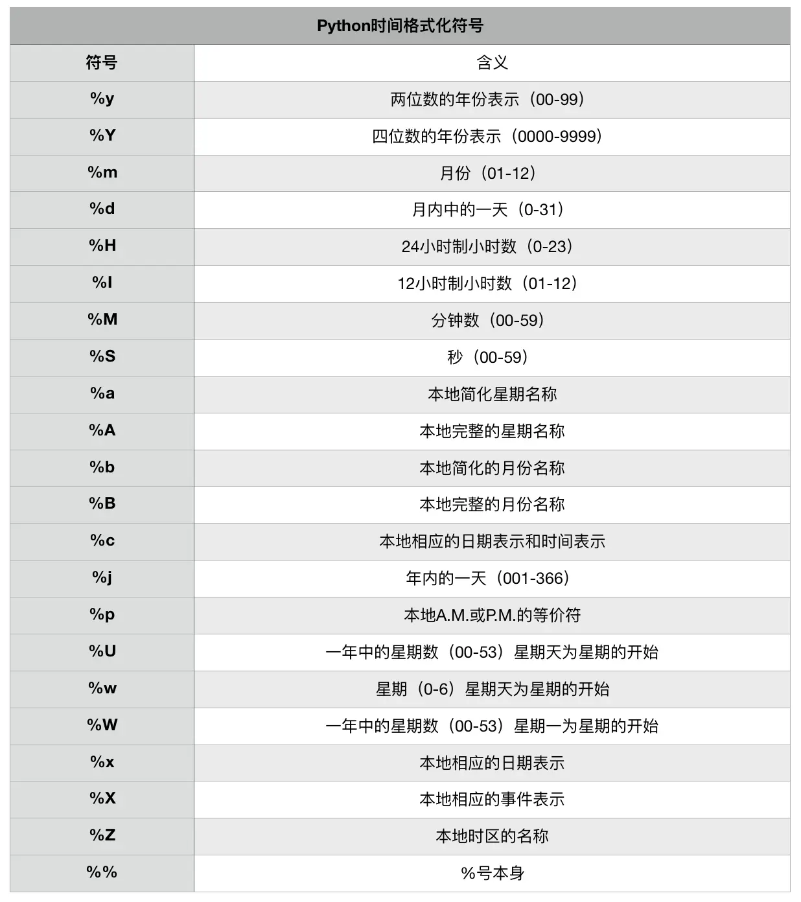

本节知识大纲：


### 一、时间日期基本介绍
时间日期类型在Python中主要有两个模块：time模块和datetime模块
**time模块**:是基于Unix Timestamp（时间戳）实现的，所能表述的范围被限定在1970-2038年之间；
**时间戳**：是指格林尼治时间1970年01月01日00时00分00秒起至现在的总秒数，结果是一个浮点数。


### 二、时间日期类型--time模块
##### 1. 获取当前时间戳
```python
print(time.time())
```
案例：
获取一个程序执行了多少秒
```python
import time
start_time = time.time()
sum = 0
for i in range(1000000):
    sum += i
end_time = time.time()
print("程序执行了%f秒"%(end_time - start_time))
```
输出结果：
```python
程序执行了0.128733秒
```
##### 2. 将时间戳转化为标准时间日期格式
如何将一个浮点数时间戳转为标准时间日期格式
通过时间元组进行转换，使用`time.localtime(时间戳)`把获取的时间戳转为当地的时间元组，使用`time.gmtime(时间戳)`把获取的时间戳转为格林尼治时间元组；如果不加参数，默认为当前时间戳。
```python
import time
time_tuple = time.localtime(time.time())
print("当前时间为{}年{}月{}日{}点{}分{}秒".format(time_tuple[0],time_tuple[1],time_tuple[2],time_tuple[3],time_tuple[4],time_tuple[5]))
```
##### 3. 格式化时间
（1）以(RPC)标准时间格式输出时间
```python
time.asctime(time.localtime())  # 参数为时间元组
time.ctime(time.time())  # 参数为浮点数时间戳
```
输出结果：`Thu Jun 25 10:31:48 2020`

（2）以time.strftime()格式化时间
```python
# 格式化成2020-06-25 11:18:29形式
print(time.strftime("%Y-%m-%d %H:%M:%S",time.localtime()))
# 格式化成Thu Jun 25 11:18:29 2020形式
print(time.strftime("%a %b %d %H:%M:%S %Y",time.localtime()))
```
> 注意：strftime语句中时间格式化符号中是不能包含中文的，如果想输出中文，还是通过上面%语句输出或者format格式输出。

Python时间格式化符号：

##### 4. 将时间元组转化为时间戳
可以使用time.mktime()方法将时间元组转化为时间戳。我们可以自定义时间元祖，但是必须要填入9个参数，比如2008年8月8日，晚上8点8分8秒的时间元组为（2008,8,8,20,8,8,0,0,0）未知的参数可以使用0代替。
##### 5. 让程序暂停运行
`time.sleep(秒数)`可以让程序运行指定秒数。

### 三、time模块案例演示
案例：
2008年8月8日，20:08:08往后88,888,888秒是哪天？星期几？
```python
import time
# time.mktime()方法可以把时间元组转为时间戳
tuple01 = (2008,8,8,20,8,8,0,0,0)
# 待求时间戳
time01 = time.mktime(tuple01) + 88888888
# 待求时间元组
tuple02 = time.localtime(time01)
# 打印结果
print("结果:",time.strftime("%Y-%m-%d %H:%M:%S",tuple02),end="\t")
tuple_week = ("星期一","星期二","星期三","星期四","星期五","星期六","星期天")
print(tuple_week[tuple02[6]])
```
输出结果：
```python
结果: 2011-06-03 15:29:36	星期五
```
### 四、datetime模块基本使用
datetime模块:
比time模块功能更加强大，主要可以使用下面五个类：

##### 1. date类
获取今天的日期
```python
date01 = datetime.date.today()
```
返回的结果是`2020-06-26`
可以对年、月、日各个属性单独访问：
```python
print("年份",date01.year)
print("月份",date01.month)
print("日期",date01.day)
```
##### 2. time类
time类可以直接定义当前的时间，精确到微秒
```python
time01 = datetime.time(8,23,2,121212)
```
可以对时、分、秒、微秒各个属性单独访问：
```python
print("时",time01.hour)
print("分",time01.minute)
print("秒",time01.second)
print("微秒",time01.microsecond)
```
##### 3. datetime类
获取日期和时间（年份、月份、日期、时
分、秒、微秒、时区）
```python
datetime01 = datetime.datetime.now()
```
##### 4. 三种类型的转换
（1）datetime中去date
```
datetime01.date()
```
（2）datetime中取time
```
datetime01.time()
```
（3）date和time组合成datetime
```
datetime.datetime.combine(date01,time01)
```
##### 5. timeDelta时间差
计算两个指定日期之间的天数
```python
date01 = datetime.date(2020,6,26)
date02 = datetime.date(2016,11,23)
print((date01-date02).days)  
```
### 五、import关键字
import关键字表示引入外部某一个功能模块
##### 1. 引入模块
引用整个模块：`import <模块名>`，表示我们需要引入整个datetime模块，包含了该模块下的所有类。当我们要调用某一个类时必须要携带模块名
```python
import datetime
print(datetime.datetime.now())
```
##### 2. 引入模块中的指定类
如果引入模块中的部分类：`from <模块名> import <类名>`，当我们要调用该类时不需要声名模块名
```python
from datetime import datetime
print(datetime.now())
```
##### 3. 引入模块中的多个类
如果要引用模块中的多个类可以用逗号隔开，比如
```python
from datetime import date,time,timedelta
```
我们也可以使用
```
from datetime import *
```
 虽然是引入了模块下的所有类，但是实际函数调用的时候也是无需加上模块名也可以直接调用的
```python
from datetime import *
print(datetime.now())
```
### 六、datetime基本使用
##### 1. 获取当前时间
```python
from datetime import datetime
print(datetime.now())   # 获取当前日期时间
print(datetime.today()) # 获取当前时间
print(datetime.utcnow())    # 获取当前的格林尼治时间
```
输出结果：
```python
2020-06-26 16:35:43.928699
2020-06-26 16:35:43.928732
2020-06-26 08:35:43.928741
```
##### 2. 获取当前日期时间的日期和时间
```python
from datetime import datetime
dt01 = datetime.today()
print(dt01.date())
print(dt01.time())
```
输出结果：
```python
2020-06-26
16:35:43.929583
```
##### 3. 获取日期时间的年、月、日、时、分、秒、微秒
```
from datetime import datetime
dt01 = datetime.today()
print(dt01.year)
print(dt01.month)
print(dt01.day)
print(dt01.hour)
print(dt01.minute)
print(dt01.second)
print(dt01.microsecond)
```
输出结果：
```python
2020
6
26
16
35
43
929583
```
##### 4. 构造一个datetime
```
from datetime import datetime
dt01 = datetime(2008,8,8,20,8,8,888888)
print(dt01)
```
输出结果：
```python
2008-08-08 20:08:08.888888
```
##### 5. RPC方式格式化时间--ctime
```
from datetime import datetime
dt01 = datetime.today()
print(dt01.ctime())
```
输出结果：
```python
Fri Jun 26 16:38:35 2020
```
##### 6. 自定义方式格式化
```
# 时间格式化符号方式
from datetime import datetime
dt01 = datetime.today()
print(dt01.strftime("%Y-%m-%d %H:%M:%S"))
```
输出结果：
```python
2020-06-26 16:38:35
```
时间格式化符号中是不能直接加入中文的，如果想输出中文日期时间，还是得通过传统格式化输出方式
```
# 加入中文
from datetime import datetime
dt01 = datetime.today()
print("%d年%d月%d日"%(dt01.year,dt01.month,dt01.day))
```
输出结果：
```python
2020年6月26日
```
### 七、日期时间类型转换
time类型怎么与datetime类型相互转换
##### 1. time类型转换为datetime类型
使用fromtimestamp()方法
```python
from time import time
from datetime import datetime
time01 = time()  # 获取当前时间
print("转化前",time01)
print("转化后",datetime.fromtimestamp(time01))  
```
输出结果：
```python
转化前 1593160246.8704221
转化后 2020-06-26 16:30:46.870422
```

##### 2. datetime类型怎么转换为time类型
使用timestamp()方法
```python
from time import time
from datetime import datetime
datetime01 = datetime.today()
print("转化前",datetime01)
print("转化成时间戳",datetime01.timestamp())
print("转化为时间元组",datetime01.timetuple())
```
输出结果：
```python
转化前 2020-06-26 16:30:46.870481
转化成时间戳 1593160246.870481
转化为时间元组 time.struct_time(tm_year=2020, tm_mon=6, tm_mday=26, tm_hour=16, tm_min=30, tm_sec=46, tm_wday=4, tm_yday=178, tm_isdst=-1)
```
### 八、时间日期的运算
##### 1. 计算两个指定时间的时间差
```python
from datetime import datetime
dt01 = datetime(2020,6,26,12,12,12,121212)
dt02 = datetime(2016,5,26,11,12,12,121202)
print((dt01-dt02).days)
print((dt01-dt02).seconds)
print((dt01-dt02).microseconds)
print(dt01.strftime("%Y-%m-%d %H:%M:%S"),end="和")
print(dt02.strftime("%Y-%m-%d %H:%M:%S"),end="相差")
print((dt01-dt02).days,"天",(dt01-dt02).seconds,"秒",(dt01-dt02).microseconds,"毫秒")
```
输出结果：
```python
1492
3600
10
2020-06-26 12:12:12和2016-05-26 11:12:12相差1492 天 3600 秒 10 毫秒
```

##### 2. 对某个时间段增加或减少指定时间
```python
from datetime import datetime,timedelta
# 对某一个时间增加或者减少
dt01 = datetime(2020,6,26,12,12,12,121212)
print("100天之后",dt01 + timedelta(days=100))
print("100天之前",dt01 + timedelta(days=-100))
print("100周之后",dt01 + timedelta(weeks=100))
print("100小时之后",dt01 + timedelta(hours=100))
print("100秒之后",dt01 + timedelta(seconds=100))
```
输出结果：
```python
100天之后 2020-10-04 12:12:12.121212
100天之前 2020-03-18 12:12:12.121212
100周之后 2022-05-27 12:12:12.121212
100小时之后 2020-06-30 16:12:12.121212
100秒之后 2020-06-26 12:13:52.121212
```
### 九、时间日期案例演示
案例：
准备10个人姓名，然后为这10个人随机生成生日【都是90后】
1. 统计出哪些人是夏季【6月-8月】出生的
2. 最大的比最小的大多少天
3. 谁的生日最早，谁的生日最晚
```python
from datetime import date,datetime
from random import randint

# 为每个人构建生日
def build_birthday(list_person_name:list):
    # 初始化存储姓名:生日字典
    name_birthday = {}.fromkeys(list_person_name)
    # 生成生日
    for key in name_birthday:
        temp_year = randint(1990,1999)
        temp_month = randint(1,12)
        temp_day = randint(1,30)
        name_birthday[key] = date(temp_year,temp_month,temp_day)
    # 返回
    return name_birthday

# 获得夏天出生的人的列表
def person_birthday_summer(name_birthday:dict):
    # 用于存储夏天出生的key
    list_person = []
    for key in name_birthday:
        if name_birthday[key].month>=6 and name_birthday[key].month<=8:
            list_person.append(key)
    # 返回
    return list_person

# 获得最大与最小的人出生隔了多少天
def get_person_year_max_min(name_birthday:dict):
    # 在字典中提取出生日
    person_birthday = name_birthday.values()
    distance_birthday = max(person_birthday) - min(person_birthday)
    return distance_birthday.days

# 获得最早的生日
def get_person_early_birthday(name_birthday:dict):
    for key in name_birthday:
        # 把所有的人的出生年份替换为1990年，忽略年龄对比较生日日期的影响
        name_birthday[key] = name_birthday[key].replace(year=1990)
    person_birth = list(name_birthday.values())
    return sorted(person_birth)[0]

# 获得最早生日的人的姓名
def get_person_from_early_birthday_name(name_birthday:dict):
    early_birthday = get_person_early_birthday(name_birthday)
    for key in name_birthday:
        if name_birthday[key] == early_birthday:
            early_birthday_name = key
            return early_birthday_name

# 获得最迟的生日
def get_person_later_birthday(name_birthday:dict):
    for key in name_birthday:
        name_birthday[key] = name_birthday[key].replace(year=1990)
    person_birth = list(name_birthday.values())
    return sorted(person_birth)[len(person_birth)-1]

# 获得最迟生日的人的姓名
def get_person_from_later_birthday_name(name_birthday:dict):
    later_birthday = get_person_later_birthday(name_birthday)
    for key in name_birthday:
        if name_birthday[key] == later_birthday:
            later_birthday_name = key
            return later_birthday_name

if __name__ == '__main__':
    list_name = ["赵一","钱二","孙三","李四","周五","吴六","郑七","王八","冯九","陈十"]
    # 为十个人生成生日
    name_birthday = build_birthday(list_name)
    print(name_birthday)
    # 统计出哪些人是在夏天出生的
    birthday_summer_list = person_birthday_summer(name_birthday)
    if (len(birthday_summer_list) == 0):
        print("没有人的生日在夏天")
    else:
        print("生日为夏天的有:",birthday_summer_list)
    # 最大的比最小的大多少天
    distance = get_person_year_max_min(name_birthday)
    print("最大的比最小的大%d天"%distance)

    # 生日最早的
    early_birthday = get_person_early_birthday(name_birthday)
    print("生日最早的是%d月%d日"%(early_birthday.month,early_birthday.day))
    name_of_early_birthday = get_person_from_early_birthday_name(name_birthday)
    print("生日最早的人的姓名是",name_of_early_birthday)
    # 生日最迟的
    later_birthday = get_person_later_birthday(name_birthday)
    print("生日最迟的是%d月%d日"%(later_birthday.month,later_birthday.day))
    name_of_later_birthday = get_person_from_later_birthday_name(name_birthday)
    print("生日最迟的人的姓名是",name_of_later_birthday)
```
输出结果：
```python
{'赵一': datetime.date(1998, 4, 17), '钱二': datetime.date(1997, 10, 11), '孙三': datetime.date(1997, 7, 26), '李四': datetime.date(1993, 8, 28), '周五': datetime.date(1995, 8, 9), '吴六': datetime.date(1990, 10, 12), '郑七': datetime.date(1998, 7, 18), '王八': datetime.date(1994, 1, 9), '冯九': datetime.date(1997, 8, 24), '陈十': datetime.date(1999, 9, 1)}
生日为夏天的有: ['孙三', '李四', '周五', '郑七', '冯九']
最大的比最小的大3246天
生日最早的是1月9日
生日最早的人的姓名是 王八
生日最迟的是10月12日
生日最迟的人的姓名是 吴六
```
为了让结构清晰我们使用了函数，下一节我们重点讲解函数用法。