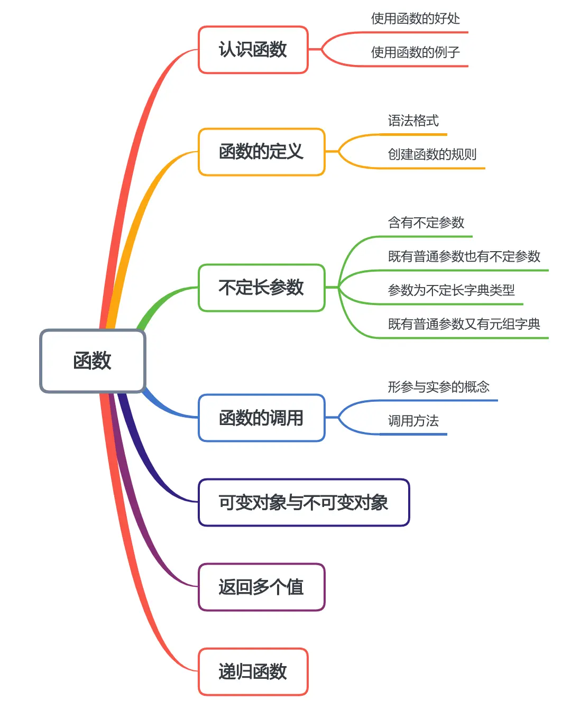

本节知识大纲：


### 一、认识函数
##### 1.使用函数的好处：
函数是实现某个特定功能的代码块的集合，使用函数的好处有：
（1） 分而治之：通过函数将程序分一个个小模块，如果代码出现了问题调试起来要容易得多，否则写在一个代码块里会很麻烦
（2） 代码复用：反复使用某一功能的代码，不需要进行多次书写，大大减少代码量
（3） 可读性强：分开成多个小的代码块可读性强
（4） 代码的封装：使用函数的用户不需要了解方法实现的细节，可以直接使用方法
##### 2. 使用函数的例子
通过函数实现两个数的加减乘除
```python
def get_add_result(num01,num02):
    return num01 + num02

def get_sub_result(num01,num02):
    return num01 - num02

def get_mul_result(num01,num02):
    return num01 * num02

def get_div_result(num01,num02):
    return num01 / num02

if __name__ == "__main__":
    print(get_add_result(100,20))   # 调用两数相加的函数
    print(get_sub_result(100,20))   # 调用两数相减的函数
    print(get_mul_result(100,20))   # 调用两数相乘的函数
    print(get_div_result(100,20))   # 调用两数相除的函数
```
### 二、函数的定义
##### 1. 语法格式
```
def 函数名称(参数列表):
    """函数的功能说明"""
    函数具体代码
return[expression]
```
##### 2. 创建函数的规则
（1）函数代码块以`def`关键词开头，后接函数标识名称和圆括号()
（2）传入的参数和自变量放于圆括号中间
（3）函数的第一行语句最好写上注释用于说明函数的功能
（4）return关键词既是一个返回值的关键词也是标志函数结束的标识符
（5）如果函数无返回值，可以不写return语句或者只写一个return关键词
案例：
生成若干个整数的集合，求最大数、最小数、元素之和、元素的平均数：
```python
from random import randint

def build_array(start_num:int,end_num,number:int):
    """
    功能描述：生成若干个固定长度的整数集合
    ~~~~~~~~~~~~~~~~~~~
    :param start_num: 指定整数范围的起始值
    :param end_num: 指定整数范围的结束值
    :param number: 生成的数量
    :return: 整数的集合
    """
    number_list = []
    for i in range(number):
        number_list.append(randint(start_num,end_num))
    return number_list

def max_of_list(num_list):
    """
    功能描述：求集合中的最大数
    :param num_list: 集合
    :return: 集合中的最大数
    """
    max_value = num_list[0]
    for i in range(len(num_list)):
        if num_list[i] > max_value:
            max_value = num_list[i]
    return max_value

def min_of_list(num_list):
    """
    功能描述：求集合中的最小数
    :param num_list: 集合
    :return: 最小数
    """
    min_num = min(num_list)
    return min_num

def sum_of_list(num_list):
    """
    功能描述:求集合中元素之和
    :param num_list: 集合
    :return: 元素之和
    """
    sum_list = 0
    for i in num_list:
        sum_list += i
    return sum_list

def avg_of_list(num_list):
    """
    功能描述：求集合中元素的平均数
    :param num_list: 集合
    :return: 平均数
    """
    avg_num = sum_of_list(num_list)/len(num_list)
    return avg_num

if __name__ == "__main__":
    # 创建10个整数集合
    num_list = build_array(10,100,10)
    print(num_list)
    # 求最大数
    print("最大数为:",max_of_list(num_list))
    # 求最小数
    print("最小数为:",min_of_list(num_list))
    # 求和
    print("和为:",sum_of_list(num_list))
    # 求平均值
    print("平均值为：",avg_of_list(num_list))
```
输出结果：
```python
[93, 17, 17, 34, 69, 33, 98, 21, 18, 80]
最大数为: 98
最小数为: 17
和为: 480
平均值为： 48.0
```
### 三、不定长参数
##### 1. 含有不定参数
定义一个函数时，如果不确定参数的数量，则使用不定长参数，即在参数前面加*号表示这是一个不定长参数。
```python
def sum_of_num(*args):
```
当我们查看这个不定长参数的数据类型时，发现它其实是一个元组类型；
> 注意：当给不定参数的函数传递列表或者字典时，一定要给实参变量加*号解封装，否则会报错

案例：
求一些整数之和
```python
def sum_of_num(*args):
    """
    功能介绍：求一组数字之和
    :param args: 提供的数字元组
    :return: 所有的数字之和
    """
    sum = 0
    for i in args:
        sum += i
    return  sum

if __name__ == "__main__":
    print(sum_of_num(11,22,22,22))
    list01 = [11,22,33,44,55]
    tuple01 = (11,22,33)
    print(sum_of_num(*list01))  # 加*号给列表解封装
    print(sum_of_num(*tuple01))  # 加*号给元组解封装
```
##### 2. 既有普通参数也有不定参数
如果函数具有不定长参数外还有其它参数，一定要把不定长参数放到最后。
```python
# 求不定长参数
def print_number(num01,num02,*args):
    print("num01:",num01)
    print("num02:",num02)
    print("args:",args)

if __name__ == "__main__":
    print_number(11,22,33,44,55,66)
```
输出结果：
```python
num01: 11
num02: 22
args: (33, 44, 55, 66)
```
注意：在调用的时候，系统会把实参先匹配普通参数，普通参数全部匹配完之后再匹配不定参数
##### 3. 参数为不定长的字典
 参数为不定长的字典类型，定义函数时使用两个`*`号，给定义的函数传值时，key即使是字符串也不要双引号，且把冒号改为等于号；如果直接把字典变量传递给定义的函数记得也要加双`*`号解包。

```python
def sum_of_result(**kwargs):
    sum = 0
    for key in kwargs:
        sum += kwargs[key]
    return sum

if __name__ == '__main__':
    print(sum_of_result(语文=82,数学=99))
    print(sum_of_result(语文=82, 数学=99,外语=89))
    dict01 = {"语文":89,"数学":98,"英语":88,"物理":87}
    print(sum_of_result(**dict01))
```
##### 4. 参数既有普通参数又有元组又有字典
如果定义的函数有普通参数、不定长元组、不定长字典，那么在函数定义的时候的顺序是：普通参数->不定长元组->不定长字典；
在调用的时候先匹配普通参数再匹配不定长元组再匹配不定长字典。
```python
def print_result(num01,*args,**kwargs):
    print("num01=",num01)
    print("args=",args)
    print("kwargs=",kwargs)

if __name__ == '__main__':
    print_result(100,200,300,400,语文=100,数学=98)
```
输出结果：
```python
num01= 100
args= (200, 300, 400)
kwargs= {'语文': 100, '数学': 98}
```
### 四、函数的调用
##### 1. 形参与实参的概念
形参：函数中的参数
实参：调用函数的时候提供的参数
##### 2. 调用方法
（1）调用的标准做法:实参、形参必须要一一对应
```python
from random import randint
def build_array(start_num:int,end_num:int,number:int):
    number_list = []
    for i in range(number):
        number_list.append(randint(start_num,end_num))
    return number_list

if __name__ == '__main__':
    # 实参、形参一一对应，生成5个从10到20的随机数
    print(build_array(10,20,5))
```
（2）调用的时候指明参数的名称，这种情况下调用的顺序可以和函数的顺序不一致
```python
from random import randint
def build_array(start_num:int,end_num:int,number:int):
    number_list = []
    for i in range(number):
        number_list.append(randint(start_num,end_num))
    return number_list

if __name__ == '__main__':
    # 指明参数的名称调用的时候不需要按照形参的顺序，这里表示生成5个从10到99的随机数
    print(build_array(number=5,end_num=99,start_num=10))
```
（3）在形参后面设置默认值，如果实参没有声明,函数就以默认值执行
```python
from random import randint
def build_array(start_num:int = 100 ,end_num:int = 200,number:int = 10):
    number_list = []
    for i in range(number):
        number_list.append(randint(start_num,end_num))
    return number_list

if __name__ == '__main__':
# 在形参后面设置默认值，如果实参没有声明,函数就以默认值执行，这里表示生成10个从1000到2000的随机数
    print(build_array(start_num= 1000,end_num= 2000))
```
### 五、多个返回值
我们知道函数中是以return关键字来返回函数执行的结果，但是如果一个函数想要返回多个值该怎么处理呢？
案例：
生成若干整数的集合，求最大数、最小数、元素之和:

方法一：把输出的结果存在一个列表里，函数返回一个列表，在主函数调用的时候调用这个列表里的元素；
```python
from random import randint
def build_array(start_num:int,end_num:int,number:int):
    number_list = []
    for i in range(number):
        number_list.append(randint(start_num,end_num))
    return number_list
def get_result_01(list01:list):
    result_list=[]  # 第一个元素就是最大值、第二个元素就是最小值、第三元素就是和
    max_result = list01[0]
    min_result = list01[0]
    sum_result = 0
    # 求最大值、最小值、求和
    for i in list01:
        if i > max_result: max_result = i
        if i < min_result: min_result = i
        sum_result += i
    result_list.append(max_result)
    result_list.append(min_result)
    result_list.append(sum_result)
    # 返回一个列表
    return result_list

if __name__ == '__main__':
    # 生成集合
    list_number = build_array(number=10,start_num=100,end_num=200)
    print(list_number)
    # 最大值、最小值、求和
    result_list = get_result_01(list_number)
    print("最大值",result_list[0])
    print("最小值",result_list[1])
    print("所有元素之和",result_list[2])
```
方法二：把函数返回的结果封装在元组里，用逗号隔开，可以加括号也可以不加，
```python
# 生成若干整数的集合，求最大数、最小数、元素之和

from random import randint

def build_array(number:int,start_number:int,end_number):
    number_list = []
    for i in range(number):
        number_list.append(randint(start_number,end_number))
    return number_list

# 方法02
def get_result_02(list01:list):
    max_number = list01[0]
    min_number = list01[0]
    sum_number = 0
    number_result = []
    for i in list01:
        if i > max_number: max_number = i
        if i < min_number: min_number = i
        sum_number += i
    return (max_number,min_number,sum_number)

if __name__ == '__main__':
    # 生成整数集合
    raw_number_list = build_array(10,10,100)
    # 最值、求和
    max_number,min_number,sum_number = get_result_02(raw_number_list)
    print("最大值为", max_number)
    print("最小值为", min_number)
    print("和为", sum_number)
```
### 六、可变对象和不可变对象
先看一个案例：
```python
def update_number(num01,result:list):
    num01 = num01 +100
    result[0] = result[0] + 100

if __name__ == '__main__':
    num01 = 100
    result_array = [11,22,33,44,55]
    # 调用函数
    update_number(num01,result_array)
    # 输出
    print(num01)
    print(result_array[0])
```
输出结果:
```
100
111
```
传递参数的方式：
（1）按值传递，针对不可变对象，有数值类型：int、float、bool;字符串类型：string；元组：tuple
> 按值传递指每次传递参数时，把参数的原始数值拷贝一份新的，把新拷贝出来的数值传递到方法内部，在方法内部修改时，则修改的是拷贝出来的值，而原始的值不发生改变。
> 使用该方法传递的参数，参数原始的值不发生改变。

（2）按地址传递，针对可变对象，有list、dict
> 按地址传递指每次传递参数时，把引用类型参数的存储在栈中的内存地址复制一份，把新拷贝出来的内存地址传递到方法内部，在方法内部修改时，则修改的是内存地址指向的对空间的值，所以修改完成后对于原数据也产生影响。
> 使用该方式传递的参数，参数原始的值发生改变。

总结：按值传递，在函数中的修改不影响调用的实参；按地址传递，修改的值影响调用的实参
### 七、递归函数
递归函数就是自己对自己的反复调用
案例1：
求一个数的阶乘
```python
def get_result(num01):
    if num01 == 1:
        return 1
    else:
        return num01 * get_result(num01-1)

if __name__ == '__main__':
    result_mul = get_result(10)  # 10的阶乘
    print(result_mul)
```
结果：
```
3628800
```
案例2：
求包含列表和元组内所有元素之和
```python
 def sum_of_result(*args):
    sum_result = 0
    for i in args:
        if isinstance(i,(int,float,bool)):
            sum_result += i
        elif isinstance(i,(list,tuple)):
            sum_result += sum_of_result(*i)
    return sum_result

if __name__ == '__main__':
    result = sum_of_result(10,10,[10],(10,10,[10,10,[10]]))
    print(result)
```
输出结果：
```
80
```