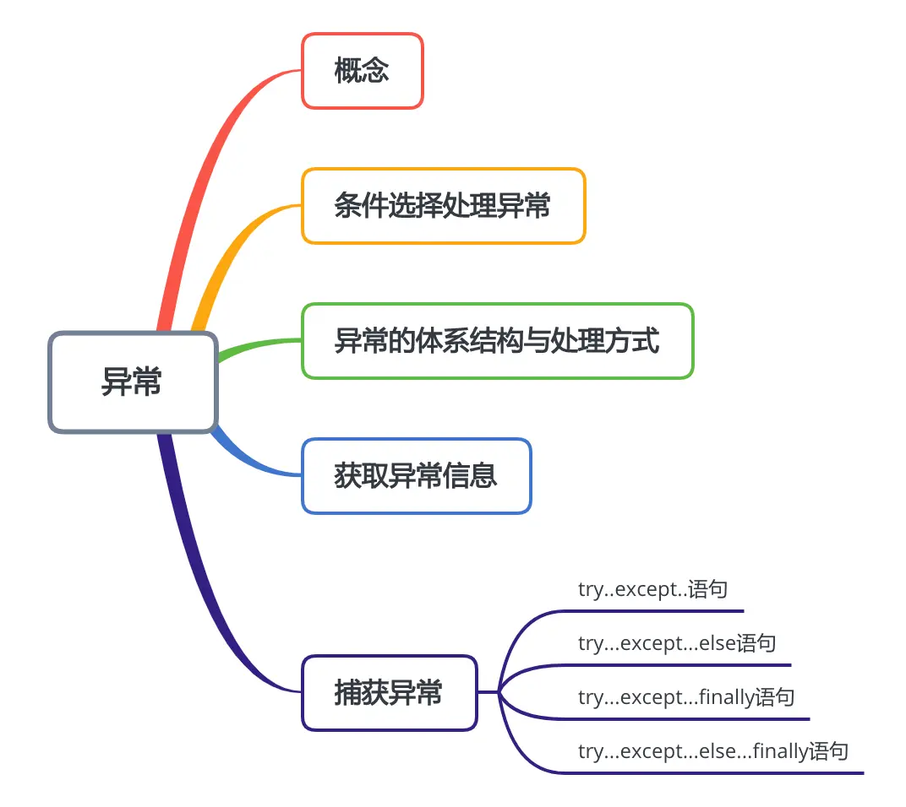
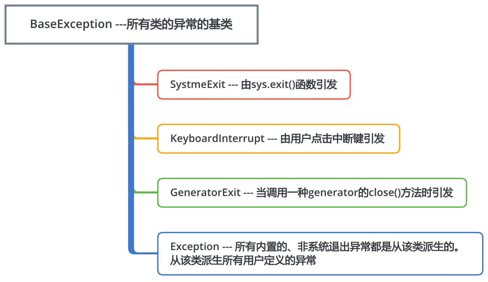

本节知识大纲：


### 一、概念
什么是异常？
在程序运行过程中发生错误和意外，这些错误和意外往往不是语法错误。
定义：语法错误不属于异常，因为语法错误没办法让软件正常运行；正确情况下的异常指的是软件运行过程中出现的意外。
```python
num01 = int(input("请输入第一个数:"))
num02 = int(input("请输入第二个数:"))
print(num01/num02)
```
以上代码可能出现两种异常:
（1）如果输入的值为字符型，那么会抛出数据类型转换异常，
（2）num01如果输入的值为0，那么会抛出除数为0异常
### 二、条件选择处理异常
为了处理上面出现的两种异常，我们可以使用条件选择处理方式
```python
# 有可能出现两种异常:数据类型转换、除数等于0
str01 = input("请输入第一个数:")
str02 = input("请输入第二个数:")
num01 = 0
num02 = 0

# 判断是否是数
if str01.isdigit() and str02.isdigit():
    # 确定输入的都是数字的情况下，除数等于0
    num01 = int(str01)
    num02 = int(str02)
    if num02 == 0:
        print("除数不能等于0")
    else:
        print("%d / %d = %d"%(num01,num02,num01/num02))
else:
    print("输入的两个数不都是整数")
```
但是使用条件选择的方式处理异常是有弊端的，因为在写程序时候，我们不可能把所有可能出现的异常都考虑得很全面，我们应当使用更加简单专业的处理方式：try...except...else...finally语句来处理异常。
### 三、异常的体系结构与处理方式
##### 1. 体系结构：
##### 2.异常处理
如果程序不进行异常处理，当程序遇到异常的时候，程序会终止运行（强制退出）
异常处理:当出现异常的时候，告诉用户或者开发人员出现了异常，并不影响程序的继续运行。
异常处理在代码中主要有两种方式:异常捕获、抛出异常
异常捕获有如下四种形式：
（1）try --- except
（2）try --- except --- else
（3）try --- except --- finally
（4）try --- except --- else --- finally
抛出异常:使用关键字`raize`
```python
try:
    num01 = int(input("请输入第一个数:"))
    num02 = int(input("请输入第二个数:"))
    print(num01 / num02)
except:
    print("输入的数据不符合要求！")
```
### 四、获取异常信息
捕获异常时，将异常设置一个变量`e`，反馈异常的基本信息
```python
import traceback
list01 = [11,22,33,44,55,66]
try:
    print(list01[11])
except Exception as e:
    print("访问集合的元素出现异常！")
    print(str(e))   # 反馈异常的基本信息
    print(e.args[0])    # 反馈异常基本信息
    print(repr(e))  # 反馈的是异常的类型和异常的基本信息
```
输出结果：
```
访问集合的元素出现异常！
list index out of range
list index out of range
IndexError('list index out of range')
```
也可以打印异常的详细信息或者将异常信息生成txt文件保存下来
```python
print(traceback.format_exc())   # 打印异常的详细信息
traceback.print_exc(file=open("./SystemLogError.txt","w"))  # 把异常信息输出到当前目录下的txt文件中
```
### 五、捕获异常
关于捕获异常其实就是对于异常的一种处理方式，主要是用try -- except语句来捕获异常；
##### 1. try...except...语句
```
try：
    可能出现异常的代码
except:
    如果出现异常执行的代码
```
下面我们通过一个案例来说明捕获异常该怎么使用？
案例：
输入两个数，求两数之商
（1）通用性异常
方法一：最基本的的处理异常：
```python
try:
    num01 = int(input("请输入第一个数:"))
    num02 = int(input("请输入第二个数:"))
    print("%d / %d = %.2f"%(num01,num02,num01/num02))
except:
    print("程序出现异常！")
```
这种没有把具体什么异常反馈出来
方法二：给用户一个基本提示，然后将详细信息写入日志
```python
import traceback
try:
    num01 = int(input("请输入第一个数:"))
    num02 = int(input("请输入第二个数:"))
    print("%d / %d = %.2f"%(num01,num02,num01/num02))
except:
    print("代码运行出现异常，请联系管理员")
    traceback.print_exc(file = open("./AppErrorLog.txt","w"))
```
方法三：尽量展示异常的信息
```python
import traceback
try:
    num01 = int(input("请输入第一个数:"))
    num02 = int(input("请输入第二个数:"))
    print("%d / %d = %.2f"%(num01,num02,num01/num02))
except Exception as e:
    print("程序出现异常",str(e))  # 展示基本信息
    print("程序出现异常",repr(e)) # 展示异常类型和基本信息
    print(traceback.format_exc())   # 展示详细信息
```
（2）具体化异常
我们在捕获的时候不用通用的异常类Exception，而是使用具体的如`ValueException`、`ZeroDivisionError`，这样来捕获更加具有针对性：
```python
import traceback
try:
    num01 = int(input("请输入第一个数:"))
    num02 = int(input("请输入第二个数:"))
    print("%d / %d = %.2f"%(num01,num02,num01/num02))
except ValueError as e:
    print("输入的值不是整数:")
except ZeroDivisionError as e:
    print("除数不能为整数")
except Exception as e:
    print("未知的异常，具体查看日志")
    traceback.print_exc(file=open("./AppErrorLog.txt","w"))
```
这样我们的程序才会更具有健壮性
##### 2. try...except...else语句
```python
import traceback
try:
    num01 = int(input("请输入第一个数:"))
    num02 = int(input("请输入第二个数:"))
    print("%d / %d = %.2f"%(num01,num02,num01/num02))
except ValueError as e:
    print("输入的值不是整数:")
except ZeroDivisionError as e:
    print("除数不能为整数")
except Exception as e:
    print("未知的异常，具体查看日志")
    traceback.print_exc(file=open("./AppErrorLog.txt","w"))
else:
    print("所有程序均正常运行！")
```
这里else语句代码在执行过程中没有发生任何异常，才会打印提示信息“所有程序均正常运行”。
##### 3. try...except...finally语句
```python
try:
    可能出现异常的代码
except:
    如果出现异常执行的代码
finally:
    无论是否有异常都执行的代码
```
这里的finally主要的功能是做资源的回收，比如我们打开一个文件读取里面的东西，当我们把文件读完了后，我们需要把这个文件关闭；当我们访问数据库的时候需要跟数据库建立连接当访问结束的时候，我们需要把这个连接关闭，这些都属于资源的回收针对这种场景，我们都应该把它放到finally语句后。
```python
try:
    num01 = int(input("请输入第一个数:"))
    num02 = int(input("请输入第二个数:"))
    print("%d / %d = %.2f"%(num01,num02,num01/num02))
except Exception:
    print("代码出现异常")
finally:
    print("===fianlly中代码执行了===")
```
无论try中的代码是否正常，finally中的代码都会被执行
finally代码主要是针对资源的回收：打开文件的关闭，或者打开数据库后关闭连接。
##### 4. try...except...else...finally语句
```python
try:
    可能出现异常的代码
except:
    如果出现异常执行的代码
else:
    如果没有出现异常则执行的代码
finally:
    无论是否有异常都执行的代码
```
案例：
```python
try:
    num01 = int(input("请输入第一个数:"))
    num02 = int(input("请输入第二个数:"))
    print("%d / %d = %.2f"%(num01,num02,num01/num02))
except Exception:
    print("代码出现异常")
else:   # 如果没有异常则执行的代码
    print("===else中的代码===")
finally:    # 不管有没有异常都执行的代码
    print("==fianlly中代码===")
```