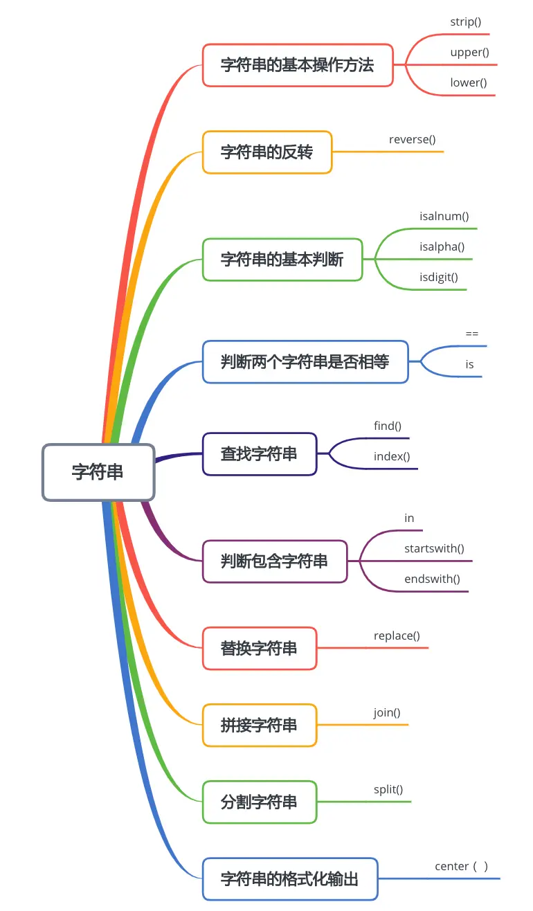
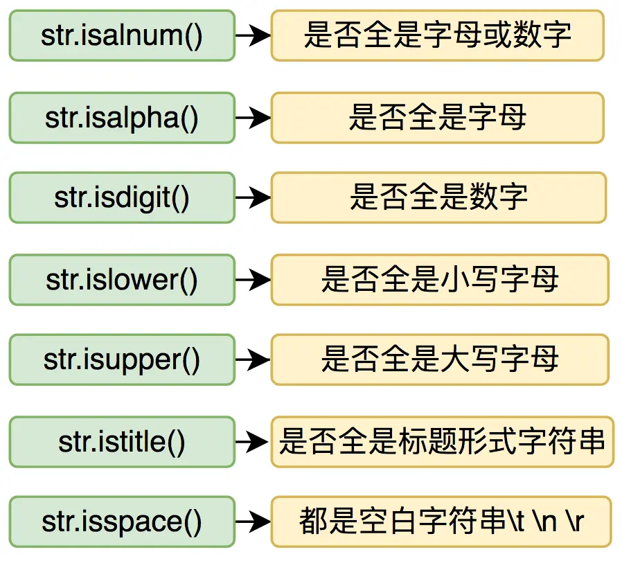

本节知识大纲：


### 一、字符串基本操作方法
（1）字符串，使用单引号、双引号都可以
（2）取字符串中的字符，如果从前往后取，第一个字符下标为0，逐一加一；如果从后往前取，最后一个下标是-1，往前逐一减一。
（3）长字符串使用续航符号，反斜杠`\`，在行尾可以直接按回车使用续航符；或者使用`""" """`注释符号，可以保留长字符串的样式，保留了其中的空格与回车。
（4）转义字符：具有特殊意义的带反斜杠的字符标记；取消转义：在字符串双引号或者单引号之前加`r`或者`R`，使其原样输出，取消转义的功能。
（5）获取字符串的长度：使用`len()`方法
（6）去除空格：`strip()`去除前后的空格；`rstrip()` 去除后边的空格；
lstrip() 去除前面的空格。
```python
str01 = "     abc      "
print(str01.strip())
print(str01.lstrip())
print(str01.rstrip())
```
（7）字符串的大小写：
字符串转大写`upper()`；
字符串转小写`lower()`；
字符串大小写互换`swapcase()`；
字符串第一个字母大写`capitalize()`
字符串内的所有单词的首字母大写`title()`

```python
str01 = "hello, world"
print(str01.lower())
print(str01.upper())
print(str01.swapcase())
print(str01.capitalize())
print(str01.title())
```
输出结果
```
hello, world
HELLO, WORLD
HELLO, WORLD
Hello, world
Hello, World
```
（8）判断字符串是否为空，有两种方法，第一种：通过求字符串的长度是否为0来判断；第二种：直接判断是否等于一个空字符串
```python
str01 = ""
print("是否为空",len(str01) == 0)
print("是否为空",str01 == "")
```
（9）字符串运算符加号和乘号，加号表示连接字符串，乘号表示将字符串输出多少倍。

### 二、字符串的反转
什么是字符串的反转，如果字符串本来是"abcd"反转过来就是”dcba“，那么该如何实现呢？
方法一：使用for循环反转字符串
```python
str01 = "abcd"
for i in range(-1,-len(str01)-1,-1):
    print(str01[i],end="")
```
方法二：先把字符串转为list再用reverse方法逆序输出
```python
str01 = "abcd"
list01 = []
# 把字符串写入list
for i in str01:
    list01.append(i)
list01.reverse()
for i in list01:
    print(i,end="")
```
方法三:通过字符串切片的方法逆序输出
```python
str01 = "abcd"
print("第三种方法",str01[::-1])
```
### 三、字符串的基本判断

字符串的基本判断语句可以用来判断字符串中的内容是数字、大小写、是否空白等，这种对字符串的判断语句如果是就返回True，否则就返回False
我们从几个案例来巩固一下对这些判断语句的掌握
案例01：输入密码，要求是数字或者字母,大于6位
```python
str01 = input("请输入密码:")
if str01.isalnum() and len(str01) >= 6:
    print("密码符合要求！")
else:
    print("密码不符合要求！")
```
案例02：输入手机号，要求必须是数字
```python
str01 = input("请输入手机号码:")
if str01.isdigit() and len(str01) == 11:  # 一般手机号都是11位数字
    print("手机号符合要求")
else:
    print("手机号不符合要求")
```
案例03：输入一段话，统计大写字母、小写字母、数字字符、汉字、其它字符数量
```python
str01 = input("请输入一段话:")
upper_char = 0
lower_char = 0
number_char = 0
chinese_char = 0
other_char = 0
for i in str01:
    if i.islower():
        lower_char += 1
    elif i.isupper():
        upper_char += 1
    elif i.isdigit():
        number_char += 1
    elif i >= "\u4e00" and i <= "\u9fa5":
        chinese_char += 1
    else:
        other_char += 1
print("字符串总数%d 大写字母%d 小写字母%d 数字字符%d "
      "汉字%d 其它字符%d"%(len(str01),upper_char,lower_char,number_char,chinese_char,other_char))
```
> **知识补充**：如何判断一个字符是否是汉字，可以通过比较其与汉字的Unicode编码的大小来判断，汉字的Unicode编码范围:4e00-9fa5
> 如果`i >= "\u4e00" 且 i <= "\u9fa5"`则说明字符`i`是一个汉字。
### 四、判断两个字符串是否相等
判断两个字符串是否相等我们通常有两个办法：`等号`和`is`;
`==`:判断字符串是否相等
`is`:判断两个字符串是否是同一个对象
```python
```
**总结**：`==`表示两个字符串内容是否相等；`is`判断两个字符串是否是同一个对象(存储的内存地址是否是同一个)
如果有有两个字符串虽然内容相同，但是字符串足够的大的话，它们存储的地址也是不同的，故用`is`判断两个字符串是否是同一个字符串结果则显示为`false`，所以通常情况下，比较两个字符串是否一致，主要指的是内容是否一致，所以通常是用运算符`==`
案例：
默写李白的《静夜思》，提示当前默写为第几句，如果连续错误超过三次，自动显示正确答案并跳转下一句
```python
# 正确的答案用元组存储起来（因为元组是不可修改的）
tuple01 = ("《静夜思》","李白","床前明月光","疑是地上霜","举头望明月","低头思故乡")
# 总共有多少句
total_number = len(tuple01) - 2
# 当前默写到第几句
this_time= 0
# 总共正确的有多少句
right_total = 0
# 当前错误几次
wrong_time = 0
# 当前默写
print("当前默写"+tuple01[1]+"的"+tuple01[0]+"总共"+str(total_number)+"句")
while this_time < total_number:
    this_time += 1  # 每次数字+1
    current = input("请默写第"+str(this_time)+"句:")
    if current.strip() == tuple01[this_time + 1]:
        print("恭喜你！第"+str(this_time)+"句默写正确!")
        right_total += 1
    else:
        wrong_time += 1
        if wrong_time == 3:
            print("很遗憾,第"+str(this_time)+"句默写错误已达三次！正确答案为："+tuple01[this_time+1])
            wrong_time = 0
            continue
        else:
            print("第"+str(this_time)+"默写错误！请重新默写！")
            this_time -= 1
            continue
print("本次默写总共%d句，其中正确的%d句，正确率为%.2f"%(total_number,right_total,right_total/total_number))
```
### 五、查找字符串
##### 1. 查找字符串的两种主要方法
查找字符串在Python中主要使用两个函数`find`和`index`
（1）字符串查找函数：find()
```python
str01 = "www.yusheng123.cn"
print(str01.find("yusheng"))    
print(str01.find("abc"))    # 如果查不到，返回的是-1
```
输出结果：
```
4
-1
```
使用find方法，在字符串中如果能够查到，返回的是包含字符串的起始位置的索引；如果查找不到，则返回-1
（2）字符串查找函数：index()
```python
str01 = "www.yusheng123.cn"
print(str01.index("yusheng"))
print(str01.index("abcd"))
```
输出结果：
```
4
Traceback (most recent call last):、、、、、报错
```
使用index函数查找，如果能够查到，和find函数一样，返回的是包含字符串的起始位置的索引；如果查不到就会报错，所以使用index函数查找最好使用异常处理防止报错（异常处理的知识上一节我们已经介绍过了）
```python
# index查找防止查找不到，故使用异常处理
str01 = "www.yusheng123.cn"
try:
    print(str01.index("abcd"))  # 如果用index查找，如果查不到就会抛出异常，所以使用索引查找最好使用异常处理
except ValueError as e:
    print("查找不到！")
```
##### 2. 查找字符串的方法
（1）搜索到多少个指定字符串：
```python
str.count('t')
```
（2）指定起始位置搜索：
```python
str.find('t',start）
```
（3）指定起始位置和结束位置搜索：
```python
str.find('t',start,end)
```
（4）从右边开始查找:
```python
str.find('t')
```
以上的方法都可以用index代替，不同的是使用index查找不到会抛出异常，而find会返回-1

案例：
生成500个数字的字符串，判断”88“出现的次数并打印出现的位置
```python
import random
str_total = ""
for i in range(500):
    str_total += str(random.randint(0,9))
# 出现88的次数
print("生成的字符串出现88的次数:%d"%(str_total.count("88")))
# 打印具体的值
start_index = 0
current = 0
while True:
    if str_total.find("88",start_index) == -1:
        break
    else:
        current += 1
        current_position = str_total.find("88",start_index)
        print("第"+str(current)+"个88的位置:",current_position)
        start_index = current_position+1
```
输出结果：
```python
生成的字符串出现88的次数:4
第1个88的位置: 120
第2个88的位置: 264
第3个88的位置: 375
第4个88的位置: 405
```
### 六、判断包含字符串
##### 1.判断是否包含字符串的两种方法
（1）判断包含字符串，关键字就是`in`
判断是否包含字符串可以使关键字in来实现：
```python
str01 = "www.yusheng123.cn"
print("str01是否包含yusheng:",("yusheng" in str01))
```
输出结果：
```python
str01是否包含yusheng: True
```
（2）使用查找的方法也能实现判断是否包含字符串
```python
print("str01中是否包含yusheng",str01.find("yusheng") >=0 )
```
虽然查找函数返回的是索引但是其结果只要大于0就能看成是包含了指定字符串
##### 2. 判断字符串是否以某个字符串开头或结束
判断字符串是否以某个字符串开头使用关键字`startswith`
判断字符串是否以某个字符串结尾使用关键字`endswith`
```python
str01 = "https://www.yusheng123.cn"
if str01.startswith("https"):
    print("这个是一个安全加密访问的域名")
if str01.endswith("cn"):
    print("这是一个中国的域名")
```
输出结果：
```
这个是一个安全加密访问的域名
这是一个中国的域名
```
案例：
模拟一个聊天窗口，事先设定一些关键字，如果发送的消息中包含设置的关键字，提示“禁止发送，含有敏感信息！”
```python
tuple01 = ("垃圾","滚")
send_message = input("请输入要发送的信息:")
# 通过一个布尔类型的值来判断它是否匹配
is_unsafe = False
for i in tuple01:
    if i in send_message:
        is_unsafe = True
if is_unsafe:
    print("禁止发送，含有敏感信息！")
else:
    print("发送成功！")
```
### 七、替换字符串
##### 1. 使用replace替换关键字
替换字符串使用的关键字`replace`，基本语法是:`str.replace(<旧字符串>,<新字符串>)`
```python
str01 = "www.yusheng123.cn"
# 把cn换成com
print(str01.replace("cn","com"))
```
##### 2. 应用场景
（1）去除空格
最常见的应用的地方是去除空格，我们之前去除空格的使用的`strip()`方法，但是只能去除字符串前面或者后面的空格，使用`replace()`能去除所有的空格，包括字符串中间的；
```python
# 应用：去除空格
str01 = " xiao yu 1926"
print(str01)
print(str01.replace(" ",""))
```
输出结果：
```
 xiao yu 1926
xiaoyu1926
```
（2）多出匹配的情况
如果待替换的字符串中有多处待匹配的地方，一般默认是全部替换，如果想只替换前面几个，可以直接在函数的第三参数声明
```python
str01 = "abcdabcdabcd"

print(str01.replace("ab","12"))  # 默认全部替换
print(str01.replace("ab","12",2))  # 只替换前面两个
```
输出结果：
```
print(str01)
abcdabcdabcd
12cd12cd12cd
12cd12cdabcd
```
案例：
模拟一个聊天窗口，事先设定一些关键字，如果发送的消息中包含发送的关键字，把发送的信息中包含的关键字用*代替发送。
```python
special_key_word_tuple = ("垃圾","滚蛋")
message = input("请输入要发送的内容:")

for i in special_key_word_tuple:
    if i in message:
        message = (message.replace(i, "*"))
print("要发送的信息为:",message)
```
### 八、拼接字符串
拼接字符串就是把多个字符串拼接成为一个，我们通常可以使用三种方法拼接字符串
（1）加号拼接
```python
list_name = ["Tom","Jerry","Bob"]
# 加号拼接,并且用逗号隔开
names = ""
for i in list_name:
    names += i + ","
print("加法拼接后的字符串为:",names)
```
输出结果：
```python
加法拼接后的字符串为: Tom,Jerry,Bob,
```
（2）基本格式化拼接
```python
name = "%s,%s,%s"%(list_name[0],list_name[1],list_name[2])
print("格式化拼接后的字符串为:",names)
```
输出结果：
```python
格式化拼接后的字符串为: Tom,Jerry,Bob,
```
（3）join拼接
通常是用先定义分隔符，然后使用分隔符对象调用join函数，join函数的参数为待分割的对象，可以是字符串也可以是列表、元组或集合
```pyhon
sep  = ","  # 分隔符
list_name = {"Tom","Jerry","Bob"}
print(sep.join(list_name))
```
输出结果：
```python
Jerry,Tom,Bob
```
案例：
把多条学生信息导出到当前目录的./student.txt，用逗号分割每一个学生的属性。
```python
student_info =[["95001","张三","男","zhangsan@gmail.com"],
               ["95002","李四","女","lisi@gmail.com"],
               ["95003","王五","男","wangwu@gmail.com"],
               ["95004","赵六","男","zhaoliu@gmail.com"],
               ["95005","马七","女","maqi@gmail.com"]]
# 分割符
sep = ","
# 循环读取每一个学生的信息
try:
    global fd
    fd = open("./student.txt","a",encoding="UTF-8") # a表示追加写入
    for i in student_info:
        temp = sep.join(i)
        fd.write(temp+"\n")
except:
    print("打开或者写入文件出错")
finally:
    fd.close()
```
### 九、分割字符串
分割字符串的操作和我们上面拼接字符串的操作刚好相反，把一个大字符串分割成多个小字符串。通常使用函数时`split()`，传入的参数是字符串中已经有的字符，以此字符为分割符标记进行分割。
```python
# 分割字符串
str01 = "Tom,Jerry,Bob,Swift"
name_list = str01.split(",")
print(name_list)
```
输出结果：
```python
['Tom', 'Jerry', 'Bob', 'Swift']
```
分割完成之后，它返回的是一个列表;
案例：
在当前目录下读取./student.txt中所有男生的学号和姓名
方法一：每次读取一行
```python
try:
    global fd
    fd = open("./student.txt",encoding="UTF-8")
    current_line = fd.readline()

    while current_line:
        student_list = current_line.split(',')
        if student_list[2] == "男":
            print("学号：%s,姓名：%s"%(student_list[0],student_list[1]))
        current_line = fd.readline()
except:
    print("文件读取失败！")
finally:
    fd.close()
```
方法二：把整个数据读取到变量找那个，第一步区分学生、第二步区分属性
```python
all_line = ""
try:
    global fd
    fd = open("./student.txt",encoding="UTF-8")
    all_line = fd.read()
    # print(all_line)
except:
    print("文件打开失败")
finally:
    fd.close()

# 区分出学生
student_list = all_line.split("\n")
# 使用循环读出每一个学生的属性
for current_student in student_list:
    detail_list = current_student.split(",")
    if detail_list[2] == "男":
        print(detail_list[0],detail_list[1])
```
### 十、格式化输出
关于字符串格式化输出的内容，我们在第一讲变量与数据类型里面有具体讲解；这里再扩充一个函数的用法：
center函数，在指定字符空间中居中显示
```python
str01 = "1234"
print(str01.center(10))  # 在10个字符空间中居中显示str01
print(str01.center(10,"*"))  # 在10个字符空间中居中显示str01，其余用*填充
```
输出结果：
```
   1234   
***1234***
```
字符串格式化输出：
|   %s   |          标准输出          |
| :----: | :------------------------: |
|  %10   |     右对齐，占位符10位     |
| %-10s  |     左对齐，占位符10位     |
|  %.2s  |       截取两位字符串       |
| %10.2s | 10位占位符，截取两位字符串 |