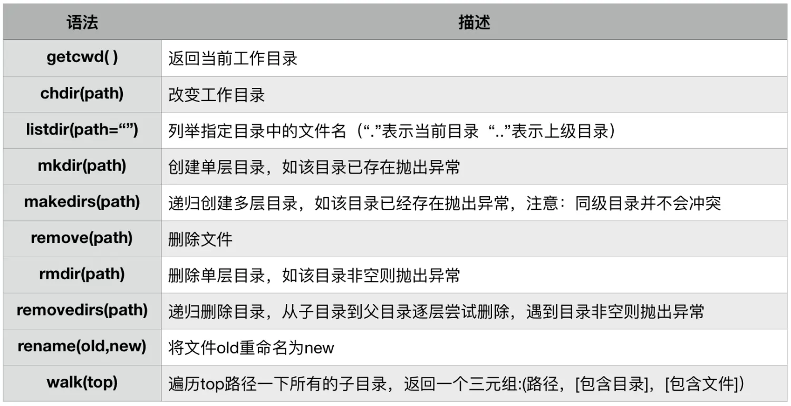
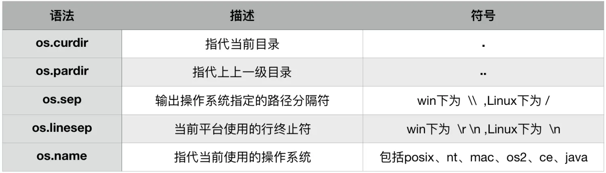
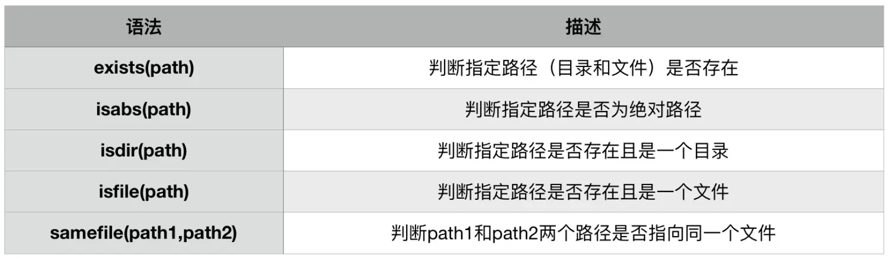
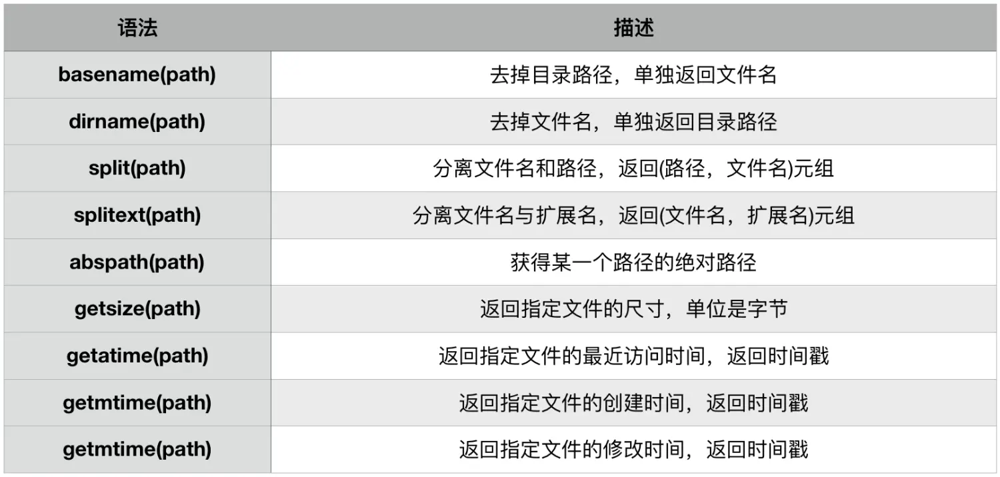
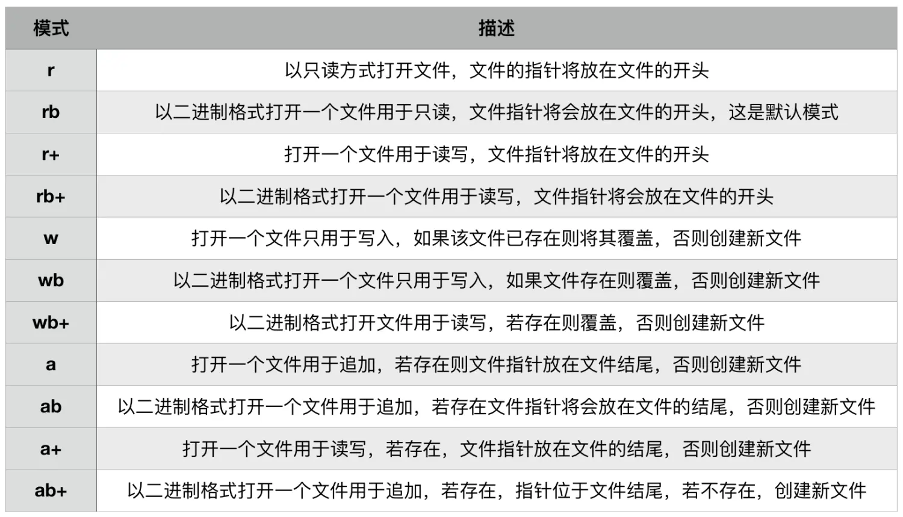

本节知识大纲：


### 一、文件目录的基本操作
说明：由于Windows和macOS文件目录系统的格式不同，下面代码中的文件目录格式是匹配macOS系统的
基本操作函数：
1. 创建文件--mknod()方法和open()方法

（1）mknod方法
```python
import os
# 创建文件
file_path = "./file_path.txt"
os.mknod(file_path)
```
在window平台不支持这个操作，在Mac平台虽然支持这个语法但是系统出于安全考虑也会拒绝这个操作，需要超级管理员权限。
（2）open方法
在桌面创建一个py_test.txt的文件
```
open("/Users/yushengtan/Desktop/py_test.txt",mode = "w",encoding = "UTF-8")
```
创建文件，文件都还没有怎么使用参数`w`来写入呢？因为在没有文件的情况下，系统会默认自动创建一个空白文件，这样就达到了创建文件的功能。

##### 2. 创建目录--mkdir()方法
比如我们要在当前目录下创建一个`py_test`的空目录
```python
path = "./py_test"
if not os.path.exists(path):  # 如果目录不存在
    os.mkdir(path)
else:
    print("文件已存在")
```
案例：
在桌面`/Users/yushengtan/Desktop/`文件夹创建一个Demo文件夹，在Demo中创建一个文本文件Test01.txt；
```python
import os
# 创建目录
path = "/Users/yushengtan/Desktop/Demo"
path_txt = path + "text01.txt"
if not os.path.exists(path):
    os.mkdir(path)
    print("目录"+path+"创建成功！")
else:
    print("目录"+path+"文件夹已经存在")

# 创建文件
if not os.path.exists(path_txt):
    fd = open(path_txt,mode="w",encoding="UTF-8")
    print("文件"+path_txt+"创建成功！")
    fd.close()  # 资源释放
else:
    print("文件创建失败")
```
##### 3. 删除目录和文件--rmdir()方法和remove()方法
案例：删除test01.txt和Demo
```python
import os
path = "/Users/yushengtan/Desktop/Demo"
path_txt = path + "text01.txt"
# 删除文件
# 如果要删除文件夹必须要保证文件夹是空的
if os.path.exists(path_txt):
    os.remove(path_txt)
    print("文件"+path_txt+"删除成功！")
else:
    print("要删除的文件"+path_txt+"不存在")

# 删除目录
if os.path.exists(path):
    os.rmdir(path_txt)
    print("文件"+path+"删除成功！")
else:
    print("要删除的文件"+path+"不存在")
```
##### 4. 文件目录程序完善
（1）跨平台目录分隔符
在windows系统里面支持的路径分隔符是反斜杠`\`，Linux和macOS系统路径分隔符是斜杠`/`；`os.path.sep`或者`os.sep`提供了自动匹配系统的路径分隔符。
所以上面的代码中的文件路径在macOS系统下可以执行，在Windows就不能执行了，那么如何让我们的程序可以跨平台执行呢？
解决办法：代码中路径里的斜杠或者反斜杠通过`os.path.sep`来代替，这样在不同的操作系统下，路径会自动适配。
（2）异常处理
涉及到文件和目录的读写和删除一定要用上异常处理，因为会有很多意外的情况发生，捕获异常来防止程序崩溃

### 二、创建多个文件
案例：在当前系统的桌面目录下创建一个文件夹Demo，在文件夹中创建10个文本文件（命名格式：Test+3为随机数字）
难点：创建的文件名有可能重复
思路01：每次创建文件的的时候判断是否已经存在，如果存在则重新创建
```python
import os
import random

# 方法01：每次创建文件的的时候判断是否已经存在，如果存在则重新创建
def get_file_name():
    return "Test"+"%03d"%(random.randint(0,999))+".txt"

path = os.path.sep+"Users"+os.path.sep+"yushengtan"+os.path.sep+"Desktop"+os.path.sep+"Demo"+os.path.sep
# 创建目录
if not os.path.exists(path):
    try:
        os.mkdir(path)
        print("目录创建成功！")
    except:
        print("目录创建异常！")
else:
    print("目录已经存在")
# 通过循环创建文件
total_number = 10
current_number = 0
while current_number < total_number:
    # 构建文件名
    file_path = path + get_file_name()
    # 判断是否存在
    if not os.path.exists(file_path):
        try:
            global fd
            fd = open(file_path,mode="w",encoding="UTF-8")
            print("文件"+file_path+"创建成功！")
            current_number += 1
        except:
            print(file_path+"文件创建失败")
        finally:
            fd.close()
    else:
        print("文件"+file_path+"已存在")
```
思路02：先构建好10个不同的名字，然后依次创建
```python
def get_file_name(num:int):
    file_name_list = []
    current = 0
    while current < num:
        # 判断构建的名称是否重复
        temp_name = "Test"+"%03d"%(random.randint(0,999))+".txt"
        if temp_name not in file_name_list:
            file_name_list.append(temp_name)
            current += 1
    return file_name_list

# 根据列表创建文件
path = os.path.sep+"Users"+os.path.sep+"yushengtan"+os.path.sep+"Desktop"+os.path.sep+"Demo"+os.path.sep

# 创建目录
if not os.path.exists(path):
    try:
        os.mkdir(path)
        print("目录创建成功！")
    except:
        print("目录创建异常！")
else:
    print("目录已存在！")

# 创建文件
for i in get_file_name(10):
    path_file = path + i
    if not os.path.exists(path_file):
        global fd
        try:
            fd = open(path_file,mode="w",encoding="UTF-8")
            print("文件"+path_file+"创建成功")
        except:
            print("文件"+path_file+"创建失败")
        finally:
            fd.close()
    else:
        print("文件已存在")

```
### 三、OS模块常见的操作方法
##### 1. os模块常用操作函数

（1）getcwd()
获取当前的工作路径
```python
print(os.getcwd())
```
（2）chdir()
修改当前工作路径
```python
path = os.path.sep+"Users"+os.path.sep+"yushengtan"+os.path.sep+"Desktop"+os.path.sep+"Demo"+os.path.sep
os.chdir(path)  # 调整当前的工作路径
file = "abc.txt"
if not os.path.exists(file):
    fd = open(file,mode="w",encoding="UTF-8")
    fd.close()
```
（3）listdir()
列出一个目录下的所有的文件夹和子文件夹，返回list集合
```python
list01 = os.listdir(os.path.sep+"Users"+os.path.sep+"yushengtan"+os.path.sep+"Desktop"+os.path.sep)
for i in list01:
    file = os.path.sep+"Users"+os.path.sep+"yushengtan"+os.path.sep+"Desktop"+os.path.sep+i
    if os.path.isfile(file):
        print("文件："+file)
    else:
        print("目录:"+file)
```
（4）mkdir()
创建单层目录
```python
path = os.path.sep+"Users"+os.path.sep+"yushengtan"+os.path.sep+"Desktop"+os.path.sep+"yusheng"+os.path.sep
if not os.path.exists(path):
    os.mkdir(path)
```
（5）makedir()
创建多层目录
```python
path = os.path.sep+"Users"+os.path.sep+"yushengtan"+os.path.sep\
       +"Desktop"+os.path.sep+"AAA"+os.path.sep+"BBB"
if not os.path.exists(path):
    os.makedirs(path)
```
（6）remove()
删除文件
```python
path = os.path.sep+"Users"+os.path.sep+"yushengtan"+os.path.sep\
       +"Desktop"+os.path.sep+"Demo"+os.path.sep+"abc.txt"
if os.path.exists(path):
    os.remove(path)
```
（7）rmdir()
删除单层目录
```python
path = os.path.sep+"Users"+os.path.sep+"yushengtan"+os.path.sep\
       +"Desktop"+os.path.sep+"AAA"+os.path.sep+"BBB"
if os.path.exists(path):
    os.rmdir(path)
```
（8）removedits()
删除多层目录（仅需了解）
（9）rename()
重命名文件和目录
```python
path = os.path.sep+"Users"+os.path.sep+"yushengtan"+os.path.sep\
       +"Desktop"+os.path.sep+"Demo"
os.chdir(path)
os.rename("Test002.txt","yusheng.txt")
```
（10）walk(top)
遍历top路径下所有的子目录，返回一个三元组：（路径，【包含目录】，【包含文件】）
```python
path = os.path.sep+"Users"+os.path.sep+"yushengtan"+os.path.sep\
       +"Desktop"+os.path.sep+"Demo"
tuple01 = os.walk(path)
for root,dirs,files in tuple01:
    print(root)
    print(dirs)
    print(files)
```

##### 2. os模块常用路径操作符
（1)os.curdir
指代当前目录

```python
path = os.path.sep+"Users"+os.path.sep+"yushengtan"+os.path.sep+"Desktop"+os.path.sep
new_path = path + os.curdir
print(os.path.abspath(new_path))
```
输出结果：
```python
/Users/yushengtan/Desktop
```
（2）os.pardir()
指代上级目录
```python
path = os.path.sep+"Users"+os.path.sep+"yushengtan"+os.path.sep+"Desktop"+os.path.sep
new_path = path + os.pardir
print(os.path.abspath(new_path))
```
输出结果：
```python
/Users/yushengtan
```
（3）os.name
指代操作系统名称:
```python
print(os.name)
```
Windows系统输出结果为：nt
macOS系统输出结果为：posix

##### 3. os模块常用判断函数

##### 4. os模块路径常用函数

案例：获取指定文件的创建时间

```python
import time
import os
path = "/Users/yushengtan/Desktop/Demo/Test003.txt"
time_stamp = os.path.getctime(path)
print(time.asctime(time.localtime(time_stamp))) # 标准时间格式
print("上次访问的时间:",time.strftime("%Y-%m-%d %H:%M:%S",time.localtime(time_stamp)))
```
输出结果：
```python
Sat Jul 11 18:56:47 2020
上次访问的时间: 2020-07-11 18:56:47
```
##### 5. 案例演示
把/Users/yushengtan/Desktop/Demo/中文件名为奇数的文件给删除，显示删除前的文件总数，删除后的文件总数，删除了哪些文件；
**思路**：
（1） 删除前计算文件的数量，删除后计算文件的数量，--通过函数来实现
（2）如何筛选文件名数字为奇数（A:是文件，不是文件夹；B:包含的数字是奇数）--通过正则表达式效率更高
（3）删除前存入list,因为要打印要删除哪些文件
```python
import os
import re

def get_file_number(path):
    """
    统计出相应目录下的文件数量
    :param path: 提供的目录
    :return: 文件的数量
    """
    total_list = os.listdir(path = path)
    file_number = 0
    for i in total_list:
        abs_path = path + i
        if os.path.isfile(abs_path):
            file_number += 1
    return file_number
def get_file(path):
    """
    找出文件中文件名为奇数的文件
    ~~~~~~~~~~~~~~~~~~~~~~
    :param path: 提供的路径
    :return: 返回文件名称的集合
    """
    total_file = os.listdir(path = path)
    # 实例化一个正则表达式对象
    pattern = re.compile(r"[\w]+[13579][.][\w]")
    # 新建list,存储匹配上的文件名
    need_file = []
    # 遍历
    for i in total_file:
        if pattern.search(i):
            need_file.append(i)
    return need_file
def delete_file(file_list,path):
    """
    删除指定路径的下文件
    ~~~~~~~~~~~~~~~~~~
    :param file_list: 提供要删除文件的list
    :param path: 删除文件的连接
    :return:
    """
    for current in file_list:
        abs_path = path + current
        try:
            os.remove(abs_path)
        except Exception as e:
            raise e


if __name__ == '__main__':
    path = "/Users/yushengtan/Desktop/Demo/"

    # 打印删除前文件的数量
    print("删除前的文件数量",get_file_number(path))

    # 找出文件名为奇数的文件
    file_list = get_file(path)
    print(file_list)

    # 删除符合条件的文件
    try:
        delete_file(file_list,path)
    except:
        print("删除出现异常！")
    else:
        print("删除已成功！")

    # 删除完后数量统计
    print("删除后的文件数量", get_file_number(path))

    # 删除的文件内容

    for i in file_list:
        print(i)
```
##### 6.案例演示：统计文件信息
统计出某个目录下的文件的信息，信息包含：文件的名称、类型、大小、创建时间:
```python
import time
import os
import re

def get_all_files(path):
    total_list = os.listdir(path)
    file_list = []
    # 筛选出文件
    for current in total_list:
        abs_path = path + current
        if os.path.isfile(abs_path):
            file_list.append(current)
    # 返回文件的列表
    return file_list
def get_file_name(filename):
    pattern = re.compile("[\w]*(?=[.])")
    return pattern.search(filename).group()

def get_file_type(filename,path):
    type_dic = {
        "文本文件":["txt"],
        "图片文件":["bmp","jpg","png"],
        "office文件":["docx","doc","xls","ppt"],
        "音频文件":["mp3"],
        "视频文件":["mp4","avi"]
        }
    # 获取字典的key的list
    name_list = list(type_dic.keys())
    # 获取value的list
    value_list = list(type_dic.values())
    # 获取文件的后缀
    current_type = os.path.splitext(path + filename)[1][1:]
    # 判断属于哪个类型
    for i in range(0,len(value_list)):
        if current_type in value_list[i]:
            return name_list[i]

def format_datetime(time_number:float):
    return time.strftime("%Y-%m-%d %H:%M:%S",time.localtime(time_number))

if __name__ == '__main__':
    # 【1】获取指定目录下的所有的文件
    path = "/Users/yushengtan/Desktop/Demo/"
    file_list = get_all_files(path)
    # 【2】遍历获取的文件，依次获得类型、大小、创建时间、修改时间信息
    all_file_info = []  # 存储所有文件的所有信息
    # 遍历
    for current_file in file_list:
        temp_file_info = []
        # 添加文件信息
        temp_file_info.append(get_file_name(current_file))

        # 添加文件类型
        temp_file_info.append(get_file_type(current_file,path))

        # 添加文件大小
        temp_file_info.append(os.path.getsize(path+current_file)/1024)

        # 添加文件创建时间
        temp_file_info.append(format_datetime(os.path.getctime(path+current_file)))
        all_file_info.append(temp_file_info)


    # 【3】打印
    print("文件名称     文件类型    文件大小   单位（大小kb）  创建时间")
    print("======================================================")
    for i in all_file_info:
        print(i[0],end="\t\t")
        print(i[1], end="\t\t")
        print("%10s" % i[2], end="\t\t")
        print("%-20s" % i[3], end="\n")
```
### 四、读取文件
##### 1. 读取文件的基本演示
打开和读取文件最好要用异常处理，open()方法创建一个打开文件的对象，
```python
fd = open(path,mode="r",encoding="UTF-8")
```
再调用read()方法读取内容存储在变量中。
```python
content = fd.read()
```
案例：
读取指定文件夹下的文本文件，筛选出手机号码
```python
import re
def get_mobile(text):
    """
    在文本中找出手机号码
    ~~~~~~~~~~~~~~~~~~~~~~~~~
    :param text: 提供的文本
    :return: 返回手机号码的list
    """
    # 实例化一个正则表达式对象
    pattern = re.compile(r"[1][3578][\d]{9}")
    # 获取匹配的结果
    mobile_list = pattern.findall(text)
    # 返回
    return mobile_list

if __name__ == "__main__":
    # 步骤01：打开文件
    path = "/Users/yushengtan/Desktop/Demo/student.txt"
    global fd, content
    try:
        fd = open(path,mode="r",encoding="UTF-8")
    # 步骤02：读取
        content = fd.read() # 把所有内容存储在变量（内存）中
        print(content)
    except IOError as e:
        print("打开文件出现异常！")
    except Exception as e:
        print("未知异常")
    finally:
        fd.close()
    # 步骤03：处理内容
    list_mobile = get_mobile(content)
    # 输出
    print("获取的手机号码有:")
    for i in list_mobile:
        print(i)
```
##### 2. with关键字读取文本文件
使用with读取的好处在于不需要手动关闭资源，读取完成后系统自动关闭；
了解一个文件对象是否关闭，可以直接查看其closed属性，如果是True则表明已经关闭；
```python
print("打开的文件是否关闭",fd.closed)
```
案例：使用with关键字读取文本文件
```python
path = "/Users/yushengtan/Desktop/Demo/student.txt"
with open(path,mode="r",encoding="UTF-8") as fd:
    print(fd.read())
```
##### 3. 打开文件模式和编码
open函数
open(文件路径，模式mode="",编码encoding="")
r --- 读取文本文件
rb --- 读取二进制文件（非Unicode编码存储的文件，如图片、音频、视频）

##### 4. 读取文件的三种方式
（1）read() 每次读取整个文件，它通常用于将文件内容放到一个字符串变量中
```python
with open(path,mode="r",encoding="UTF-8") as fd:
    content = fd.read()
print(content)
```
（2）readlines()  逐行读取，将文件内容返回到一个列表中，每一个元素就是一行
```python
with open(path,mode="r",encoding="UTF-8") as fd:
    content_list = fd.readlines()
for i in content_list:
    print(i,end="")
```
（3）readline()   每次只读取一行，通常比readlines()慢得多，仅当没有足够内存可以一次读取整个文件时才应该使用readline()
```python
with open(path,mode="r",encoding="UTF-8") as fd:
    content = fd.readline() # 读取一行
    while content:  # 如果有内容，循环执行，如果没有内容那么循环结束
        print(content,end="")
        content = fd.readline() # 读取下一行
```

##### 5. 读取大文件
（1）常规做法
如果读取的文件特别大，内存不够会导致内存溢出`MemoryError`，常规的解决办法有两种：
* 如果文件有分行，使用readline()方法；
* 如果没有分行，使用read(size)方法
（2）推荐做法
使用with结构的迭代器，进行迭代遍历，for line in f，会自动地使用缓冲IO以及内存管理，而不必担心任何大文件的问题。
```python
with open(path,mode="r",encoding="UTF-8") as f:
    for line in f:
        print(line,end="")
```
##### 6. 读取二进制文件
计算机数据存储在物理上是二进制的，所有文本文件与二进制文件的区别并不是物理上的，而是逻辑上的。这两者只是在编码层次上有差异，文本文件是基于字符编码的文件，常见的编码由ASCII编码，Unicode编码等等。二进制文件是基于值编码的文件，常见的编码有Base64编码。
使用Base64编码存储图片、读取图片、展示图片；
案例：
将文件夹中的图片转为base64编码的二进制文件，并写入磁盘
```python
import base64
path = "/Users/yushengtan/Desktop/Demo/2.png"
with open(path,mode="rb") as fd:
    image_data = fd.read()  # 读取图片文件
    base64_data = base64.b64encode(image_data)
    # 把编码文件存储到磁盘
    write_image = open("/Users/yushengtan/Desktop/Demo/base64_image.txt","wb")
    write_image.write(base64_data)
    write_image.close()
```
案例：
将base64编码的二进制文件解码成图片并写入磁盘
```python
path = "/Users/yushengtan/Desktop/Demo/base64_image.txt"
with open(path,mode= "rb") as fd:
    base64_data = fd.read() # 读取二进制文件
    image_data = base64.b64decode(base64_data)  # 把二进制base64文件解码
    # 将图片转存到磁盘
    write_image = open("/Users/yushengtan/Desktop/Demo/image_write.png","wb")
    write_image.write(image_data)
    write_image.close()
```
##### 7. 综合案例
案例：在某文件夹中有file01和file02，找出两个文档中相同的手机号码；
```python
import os
import re
def get_mobile(path):
    """
    更加提供的文件路径，找出该文件所有的手机号码
    ~~~~~~~~~~~~~~~~~~~~~~~~~~~~~~~~~~~~~
    :param path: 文件路径
    :return: 手机号码的列表
    """
    # 准备判断手机号码的正则表达式对象
    pattern = re.compile(r"[1][3578][\d]{9}")
    # 定义一个变量存储文本内容
    content = ""
    # 定义存储手机号码的list
    mobile_list = []
    if not os.path.isfile(path):
        return 0
    else:
        # 读取里面所有的内容到文本

        try:
            with open(path,"r") as fd:
                content = fd.read()
        except Exception as e:
            raise e
    # 使用正则表达式匹配
    mobile_list = pattern.findall(content)
    # 返回
    return mobile_list

if __name__ == '__main__':
    path01 = "/Users/yushengtan/Desktop/Demo/file01.txt"
    path02 = "/Users/yushengtan/Desktop/Demo/file02.txt"
    # 获取file01中的手机号码
    file01_mobile = []
    file02_mobile = []
    set01 = set()
    try:
        file01_mobile = get_mobile(path01)
        file02_mobile = get_mobile(path02)
    except:
        print("获取手机号码出现异常！")
    # 找出相同的，遍历file01_mobile
    print("两个文件中相同的手机号码为:",end=" ")
    for mobile in file01_mobile:
        if mobile in file02_mobile:
            set01.add(mobile)
    # 打印set集合
    print(set01)
```
### 五、文件的写入
读文件是把文件的中的内容读取程序中来，写文件是把程序中的内容写入到文件中去；
##### 1.写入文件的基本演示
（1）传统方式写入
通过open创建打开对象后操作完成要手动关闭文件；
```python
path = "/Users/yushengtan/Desktop/Demo/w_file01.txt"
global fd
try:
    fd = open(path,mode="w",encoding="UTF-8")
    fd.write("yusheng123.cn")
except Exception as e:
    print("写入文件出现异常！")
else:
    print("写入成功！")
finally:
    fd.close()
```
（2）使用with关键字写入
调用完成后自动关闭文件
```python
path02 = "/Users/yushengtan/Desktop/Demo/w_file02.txt"
with open(path02,mode="w",encoding="UTF-8") as fd:
    try:
        fd.write("yusheng123.cn")
    except:
        print("写入file02失败")
    else:
        print("写入file02成功")
```
**注意：**
当mode = "w"时：
以写的方式打开，只能写文件；
如果文件不存在，创建该文件；
**如果文件已经存在，先清空，再打开文件。**
只能写入字符类型
##### 2.write和writelines
write写入单行，writelines多行写入，多行写入不是直接写入，是要把要写入的字符串存入列表、元组、集合、字典(key)，然后再写入
```python
with open(path02, mode="w", encoding="UTF-8") as fd:
    # 写入多行需要借助于列表、元组 、集合、字典
    list01 = ["1000","2000","3000"] # list集合可以作为多行写入的参数
    tuple01 = ("tuple1000","tuple2000","tuple3000")    #元组集合可以作为多行写入的参数
    set01 = {"set1000","set2000","set3000"} # set集合也可以作为多行写入的参数
    dit01 = {"上海":3000,"北京":4000,"广州":3000} # 字典集合也可以作为多行写入的参数，但是只写入key

    # 处理list:写完一行后换行
    for i in range(0,len(list01)):
        list01[i] = "第" + str(i+1) + "个元素" + list01[i] + "\n"
        i += 1
    # 输出经过处理的结果
    fd.writelines(list01)   # 写入list集合
```
案例演示：
在文件夹中有一个txt文件有很多手机号码，提取手机号码写入到mobile.txt中；
```python
import re
import os

path_write = "/Users/yushengtan/Desktop/Demo/mobile.txt"
def get_mobile(path):
    """
    提取文件中的手机号码
    ~~~~~~~~~~~~~~~~~
    :param path: 文件路径
    :return: 手机号码列表
    """
    pattern = re.compile(r"[1][3578]\d{9}")
    # 判断是不是文件
    if not os.path.isfile(path):
        raise Exception("提供的文件不存在！")
    else:
        # 读取内容
        try:
            with open(path,mode="r",encoding="UTF-8") as fd:
                return pattern.findall(fd.read())
        except Exception as e:
            raise Exception("获取手机号码出现异常！")


if __name__ == '__main__':
    # 读取文件的手机号码
    path = "/Users/yushengtan/Desktop/Demo/student.txt"
    mobile_list = []
    try:
        mobile_list = get_mobile(path)
    except Exception as e:
        print(e)
    print(mobile_list)
    # 处理list---【1】去重;【2】换行
    for index in range(len(mobile_list)):
        mobile_list[index] = mobile_list[index] + "\n"
    # 转换为set集合
    set01 = set(mobile_list)
    # 输出到文件
    new_path = os.path.dirname(path) + os.path.sep + "mobile.txt"
    try:
        with open(new_path,mode="w",encoding="UTF-8") as fd:
            fd.writelines(mobile_list)
    except:
        print("写入文件出现异常！")
    else:
        print("手机号码写入到文件成功！")
```
##### 3.追加写入
在文件写入时使用mode参数如果是`w`，在打开文件时会将文件内容清空，如果我们想保留前面写入的内容就要使用追加写入的方法。
打开一个文件用于追加，如果该文件已经存在，文件指针将会放在文件结尾，新的内容将会被写入到已有的文件内容之后，如果该文件不存在，创建新文件进行写入。
追加写入的关键字是`append`，相应mode后的参数为`a`
案例：
追加写入到mobile.txt一个手机号码
```python
path = "/Users/yushengtan/Desktop/Demo/mobile.txt"
mobile_number = "18812345678"
try:
    with open(path,mode="a",encoding="UTF-8") as fd:
        fd.write("追加写入的手机号码："+mobile_number)
except:
    print("写入文件出现异常！")
else:
    print("追加号码写入成功！")
```
##### 4.读写模式
Python文件读写模式有以下几种：

##### 重点掌握：
（1）r 只读模式
open()函数的默认模式，只能读，不能写；
（2）w 只写模式
打开前清空文件内容，只能写，不能读；
（3）a 追加模式
打开前不清空文件内容，只能追加写入，不能读；
（4）r+ 可读可写模式
不会创建不存在的内容，从顶部开始写入，写多少覆盖多少；
如果先读后写，结果就是追加写入；如果先写后读，结果是覆盖文档相应位置字符，读取的时候，从写入之后的位置开始读取
（5）w+ 可读可写
如果文件存在则覆盖整个文件，不存在则创建文件，创建完成后立马就读是读不到的，因为此时文件指针在文件的结尾处，如果要读取文件需要将文件指针指向文件开头`fd.seek(os.SEEK_SET)`。
```python
import os
print("=======w+ 模式=======")
path = "/Users/yushengtan/Desktop/Demo/mobile1.txt"
with open(path,mode="w+") as fd:
    fd.write("yusheng")
    fd.seek(os.SEEK_SET)
    print(fd.read())
```
（6）a+ 可读可写模式
从文件顶部读取内容，从文件底部添加内容，不存在则创建，同样的道理，如果写入文件后直接读取是读取不到的，因为此时文件指针指向底部，如果想读取文件内容则需手动将文件指针指向文件顶部。与w+模式的区别是可追加的读写。
##### 5.案例演示
在文件夹中某个指定的txt文件中有一些号码，为这些手机号码加上编号。
思路：【1】读出内容【2】编辑内容 【3】写入内容
```python
def get_mobile(path):
    """
    读取指定路径下的所有手机号
    ~~~~~~~~~~~~~~~~~~~~~~~
    :param path: 提供的文本路径
    :return: 所有的手机号码列表
    """
    try:
        with open(path,mode="r",encoding="UTF-8") as fd:
            content = fd.read()
            if len(content) == 0:
                raise Exception("没有任何内容！")
            else:
                return content.split("\n")
    except:
        raise Exception("读取文件出错！")

if __name__ == '__main__':
    # 读取指定路径下的手机号码
    path = "/Users/yushengtan/Desktop/Demo/mobile.txt"
    mobile_list = get_mobile(path)
    # 处理
    for i in range(len(mobile_list)):
        mobile_list[i] = str(i+1) + ")" + mobile_list[i]+"\n"
    print(mobile_list)
    # 写入
    with open(path,mode="w",encoding="UTF-8") as fd:
        try:
            fd.writelines(mobile_list)
        except:
            print("写入出现异常！")
        else:
            print("添加手机号码的编号成功")
```