本节知识大纲：
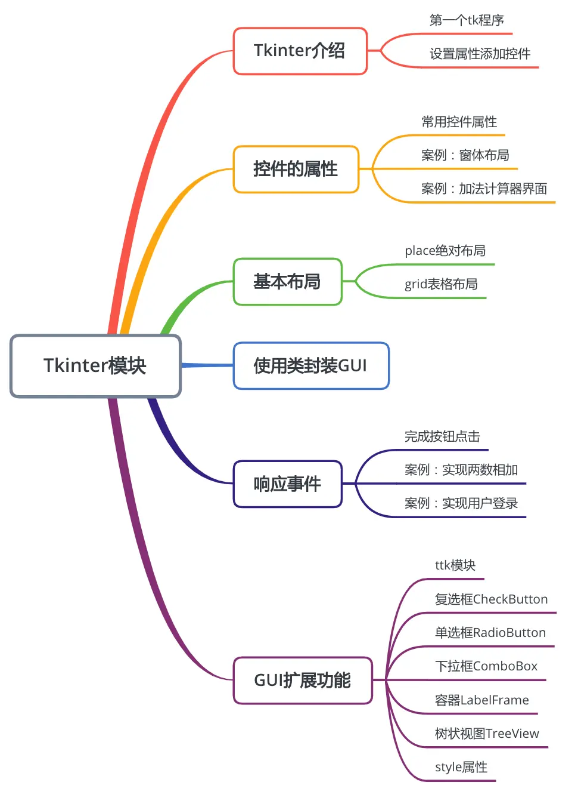

Python里的图形化界面（GUI）模块主要有Tkinter(python自带)、PyQt、wxPython，我们这节主要讲解Tkinter组件：
### 一、Tkinter介绍
tkinter模块只要用户安装好Python环境就可以直接使用；
##### 1. 第一个tkinter程序
```python
import tkinter as tk  # 给tkinter重命名为tk
root = tk.Tk()  # 新建一个窗体
root.mainloop()  # 展示窗体
```
##### 2. 设置属性并添加控件
设置窗体标题、指定窗体大小、添加按钮、输入框、标签并布局
```python
import tkinter as tk  
root = tk.Tk()
# 为窗体设置一个标题
root.title("第一个tkinter窗体")
# 指定窗体的大小，这里的乘号是小写字母x
root.geometry("400x300")
# 添加一个标签
Label01 = Label(root,text = "第一个label标签")
# 将标签布局到窗体上
Label01.pack() 
# 添加一个按钮,可以在创建按钮的同时在句尾调用pack语句进行布局
Button01 = Button(root,text = "确定").pack()
# 添加一个单行文本框
Entry01 = Entry(root).pack()
# 展示窗体
root.mainloop()
```
### 二、控件的属性
##### 1. tkinter常用的控件属性

（1）定义控件的名称使用参数`text`，传入的字符串值即为控件的名称；

（2）定义控件高度使用参数`hight`，宽度使用参数`width`，传入的值为整形数值；

（3）定义控件在空间中的位置，使用参数`anchor`，传入的字符参数为`e、s、w、n`以地图的东南西北来定义为右下左上，也可以同时设置左下sw、左上nw、右下se、右上ne；

（4）定义控件的背景色，使用参数bg，前景色使用参数fg，传入字符值可以直接是对应颜色的英文名称；

（5）设置布局在pack()函数里，使用参数side，传入的值为常量`tk.LEFT`或者`tk.RIGHT`，表示从左到右或者从右到左布局

（6）创建图片控件时，图片控件的文件源使用参数file，传入的字符值为为文件路径，在控件中使用图片则使用参数image，传入的值为图片控件变量；

（7）设置整个窗体的尺寸，使用参数geometry，传入的值为字符值，注意乘号用小写字母x代替；如果要设置长400宽300的窗体则使用语句`geometry = "400x300"`

（8）设置控件与边界的距离在pack函数里使用参数padx，设置左右距离，使用pady设置上下距离

##### 2. 案例演示:画出一个简单的窗体布局
```python
import tkinter as tk

# 新建一个窗体名称:root
root = tk.Tk()
# 为窗体添加一个标题
root.title("第二个Python窗体")

# 新建标签
photo = tk.PhotoImage(file = "/Users/yushengtan/Desktop/image.png")
Label01 = tk.Label(root,text = "第一个Label标签",anchor = "se").pack(side = tk.LEFT)
imageLable01 = tk.Label(root,image = photo).pack(side = tk.LEFT)
Label02 = tk.Label(root,text = "第二个Label标签",bg = "blue",fg = "white",font = ("华文宋体",20)).pack()
Label03 = tk.Label(root,text = "第三个Label标签",).pack()
Label04 = tk.Label(root,text = "第四个Label标签").pack()
Label05 = tk.Label(root,text = "第五个Label标签").pack()
Button01 = tk.Button(root,text = "确定").pack()

# 显示
root.mainloop()
```
效果演示：
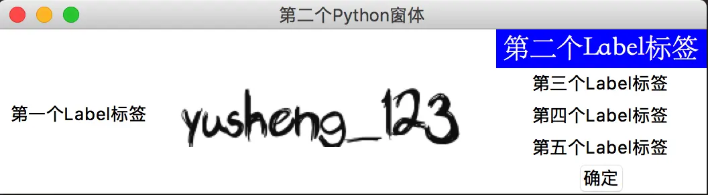3. 案例演示：画出能计算加法的计算器界面

```python
# 导包的时候使用*，创建控件的时候不用写类名了
from tkinter import *

# 创建一个窗体，名称为root
root = Tk()
# 为窗体添加标题
root.title("求两数之和")
root.geometry("700x80")
photo = PhotoImage(file = "/Users/yushengtan/Desktop/calc.png")
# 定义控件
PhotoLabel = Label(root,image = photo).pack(side = LEFT,padx = 10,pady = 5)
# 第一个数字文本框
Entry01 = Entry(root,bg = "pink",width = 10,font = ("华文黑体",20)).pack(side = LEFT,padx = 5,pady = 5)
# 加号
Label_plus = Label(root,text = "+",font = ("华文黑体",20)).pack(side = LEFT,padx = 5,pady = 5)
# 第二个数字文本框
Entry02 = Entry(root,bg = "pink",width = 10,font = ("华文黑体",20)).pack(side = LEFT,padx = 5,pady = 5)
# 等于号
Label_equal = Label(root,text = "=",font = ("华文黑体",20)).pack(side = LEFT,padx = 5,pady = 5)
# 第三个数字文本框
Entry03 = Entry(root,bg = "green",width = 10,font = ("华文黑体",20)).pack(side = LEFT,padx = 5,pady = 5)
Button01 = Button(root,text = "计算",width = 10,height = 2,font = ("华文黑体",15)).pack(side = LEFT,padx = 10,pady = 5)

# 运行
root.mainloop()
```
界面效果:
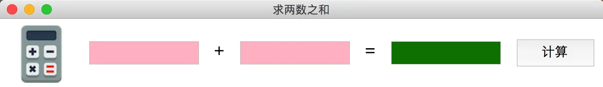三、基本布局

##### 1. place绝对布局
pack布局是按顺序布局，而place布局可以直接定义绝对位置，只需要给place()函数里传入两个参数x和y，其值为整型数值表示相对于窗体左上角的坐标位置；用法如`place(x=10,y=20)`
##### 案例演示：
绘制一个简易的登录界面
```python
from tkinter import *

root = Tk()
root.title("用户登录")
root.geometry("400x180")

Label_username = Label(root,text = "登录名：",font = ("华为黑体",16)).place(x = 50,y = 20)
Entry_username = Entry(root,font = ("华文黑体",16),width = 20).place(x = 120,y = 20)
Label_password = Label(root,text = "密   码：",font = ("华为黑体",16)).place(x = 50,y = 60)
Entry_password = Entry(root,font = ("华文黑体",16),width = 20).place(x = 120,y = 60)
Button_login = Button(root,text = "登录",font = ("华文黑体",16),width = 8).place(x = 70,y = 120)
Button_cancer = Button(root,text = "取消",font = ("华文黑体",16),width = 8).place(x = 210,y = 120)

root.mainloop()
```
##### 运行效果：
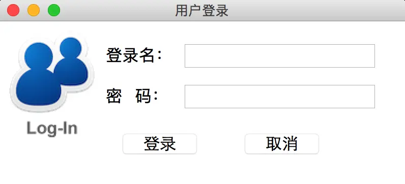

##### 2. grid表格布局
grid是一种网格布局，`grid(row = 1,column = 2)`，n行n列分别表示表格的行数和列数，从0开始计数；可以使用参数sticky控制控件靠近单元格的位置，字符值可以给出`n、s、w、e`设置`上、下、左、右`，我们还是以登录窗体为例：
```python
# grid窗体布局
from tkinter import *

root = Tk()
root.title("用户登录")
root.geometry("450x160")

# 表格图片
photo = PhotoImage(file = "/Users/yushengtan/Desktop/login.png")
img_label = Label(root,image = photo).grid(row = 0,column = 0,rowspan = 2)
# 第一行 第二列
Label_username = Label(root,text = "用户名：",font = ("华文黑体",16)).grid(row = 0,column = 1)
# 第一行 第三列
Entry_username = Entry(root,font = ("华文黑体",16)).grid(row =0,column = 2)
# 第二行 第二列
Label_password = Label(root,text = "密  码：",font = ("华文黑体",16)).grid(row = 1,column = 1)
# 第二行 第三列
Entry_password = Entry(root,font = ("华文黑体",16)).grid(row =1,column = 2)
# 第四行 第二列
Button_login = Button(root,text = "登录",width = 8,font = ("华文黑体",16)).grid(row = 3,column = 2,sticky = "e")
# 第四行 第三列
Button_cancer = Button(root,text = "取消",width = 8,font = ("华文黑体",16)).grid(row =3,column = 2,sticky = "w")

root.mainloop()
```
##### 输出效果：
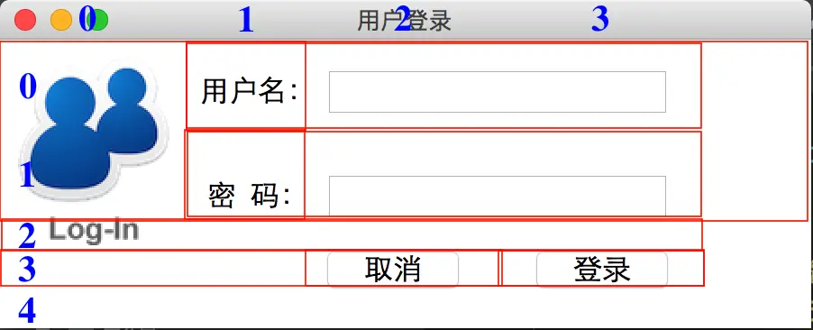注意：红色辅助线帮助理解表格布局
### 四、使用类封装GUI
这里我们使用类来封装GUI程序，以至于我们后面需要调用的时候直接实例化一个对象就可以产生一个窗口，类与对象的知识我们后面会深入讲解，现在我们只需怎么使用即可；
我们把前面的登录窗口通过类来进行封装
```python
from tkinter import *

class login_GUI(object):
    def __init__(self):
        """
        窗体的构造函数，用来做界面的初始化，GUI代码放在此函数中
        """
        self.frame = Tk()
        self.frame.title("登录窗体")
        self.frame.geometry("400x160")

        self.photo = PhotoImage(file="/Users/yushengtan/Desktop/login.png")
        imgLabel = Label(self.frame, image=self.photo).grid(row=0, column=0, rowspan=2)
        # 第一行 第一列
        Label_username = Label(self.frame, text="用户名:", font=("微软雅黑", 14)).grid(row=0, column=1)
        # 第一行 第二列
        Entry_username = Entry(self.frame, font=("华文黑体", 16)).grid(row=0, column=2)
        # 第二行 第二列
        Label_password = Label(self.frame, text="密  码:", font=("华文黑体", 16)).grid(row=1, column=1)
        # 第二行 第三列
        Entry_password = Entry(self.frame, font=("华文黑体", 16)).grid(row=1, column=2)
        # 第四行 第二列
        Button_login = Button(self.frame, text="登录", width=8, font=("华文黑体", 16)).grid(row=3, column=2, sticky="e")
        # 第四行 第三列
        Button_cancer = Button(self.frame, text="取消", width=8, font=("华文黑体", 16)).grid(row=3, column=2, sticky="w")

    def run(self):
        self.frame.mainloop()

if __name__ == '__main__':
    # 由窗体的模板实例化一个具体的登录窗体
    this_login = login_GUI()
    # 展示窗体
    this_login.run()
```
### 五、响应事件
以上我们实现了GUI界面的设计，加法计算器、登录窗口，但是没有程序并不能工作，如果想要程序工作起来还得给控件设置响应事件；
事件是什么呢？事件就是响应某一个动作，如点击某一个按钮、输入键盘的某一个键等等。
我们现在来完善前面设计加法计算器，让其能真正做加法计算;
##### 1. 完成点击按钮响应事件的步骤

（1）完成时间的功能---函数

（2）把功能捆绑到按钮上，添加command参数，其值为功能函数名，注意没有小括号

> 注意：取出文本框的数值可以使用get()方法，设置文本框的数值可以使用set()方法；控件基本属性的设定和控件的布局语句要分开；
##### 2. 案例：实现两数相加的功能
通过响应事件完成加法计算器
```python
# 实现加法计算器的的GUI界面
from tkinter import *
from tkinter.messagebox import  *

# 写一个类：实现两数相加的页面和功能
class get_sum(object):
    def __init__(self):
        # 新建一个窗体
        self.frame = Tk()
        # 窗体添加标题
        self.frame.title("实现两数相加")
        self.frame.geometry("700x80")
        self.photo = PhotoImage(file="../assets/cal.png")
        # 定义控件
        self.img_Label = Label(self.frame, image=self.photo)
        self.img_Label.pack(side=LEFT, padx=10, pady=5)

        # 第一个数字文本框
        self.num01_Entry = Entry(self.frame, bg="pink", width=10, font=("华文黑体", 20))
        self.num01_Entry.pack(side=LEFT, padx=5, pady=5)

        # 加号
        self.Label01 = Label(self.frame, text="+", font=("华文黑体", 20))
        self.Label01.pack(side=LEFT, padx=5, pady=5)

        # 第二个数字文本框
        self.num02_Entry = Entry(self.frame, bg="pink", width=10, font=("华文黑体", 20))
        self.num02_Entry.pack(side=LEFT, padx=5, pady=5)

        # 等于号
        self.Label02 = Label(self.frame, text="=", font=("华文黑体", 20))
        self.Label02.pack(side=LEFT, padx=5, pady=5)

        # 第三个数字文本框
        self.var = StringVar()
        self.result_Entry = Entry(self.frame, bg="green", width=10, font=("华文黑体", 20),textvariable = self.var)
        self.result_Entry.pack(side=LEFT, padx=5, pady=5)

        self.cal_Button = Button(self.frame, text="计算", width=10, height=2, font=("华文黑体", 15),command = self.cal_sum)
        self.cal_Button.pack(side=LEFT, padx=10, pady=5)
    # 展示窗体
    def run(self):
        self.frame.mainloop()
    # 实现两数相加
    def cal_sum(self):
        # 先取出字符串
        num01 = self.num01_Entry.get()
        num02 = self.num02_Entry.get()
        # 判断
        if num01.isdigit() and num02.isdigit():
            self.var.set(str(int(num01) + int(num02)))
        else:
            showinfo("系统提示","输入的值不都是数字无法计算")
if __name__ == '__main__':
    this_cal = get_sum()
    this_cal.run()
```
运行效果：
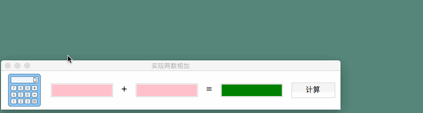

##### 3. 案例：实现用户登录功能

需求：

（1）如果用户名为admin，密码为123.com,显示登录成功！

（2）如果用户名不对，显示用户名不存在；

（3）如果密码不对，显示密码错误，如果错误三次，提示：账号已锁定。

提示：实现窗体的关闭，可以使用方法`self.frame.destory()`关闭窗体；

```python
# 用户登录
from tkinter import *
from tkinter.messagebox import *

class login_GUI(object):
    def __init__(self):
        """
        窗体的构造函数，用来做界面的初始化，GUI代码放在此函数中
        """
        self.frame = Tk()
        self.frame.title("登录窗体")
        self.frame.geometry("400x160")

        self.photo = PhotoImage(file="/Users/yushengtan/Desktop/login.png")
        self.imgLabel = Label(self.frame, image=self.photo)
        self.imgLabel.grid(row=0, column=0, rowspan=2)
        # 第一行 第一列
        self.Label_username = Label(self.frame, text="用户名:", font=("微软雅黑", 14))
        self.Label_username.grid(row=0, column=1)
        # 第一行 第二列
        self.Entry_username = Entry(self.frame, font=("华文黑体", 16))
        self.Entry_username.grid(row=0, column=2)
        # 第二行 第二列
        self.Label_password = Label(self.frame, text="密  码:", font=("华文黑体", 16))
        self.Label_password.grid(row=1, column=1)
        # 第二行 第三列
        self.Entry_password = Entry(self.frame, font=("华文黑体", 16))
        self.Entry_password.grid(row=1, column=2)
        # 第四行 第二列
        self.Button_login = Button(self.frame, text="登录", width=8, font=("华文黑体", 16),command = self.login)
        self.Button_login.grid(row=3, column=2, sticky="e")
        # 第四行 第三列
        self.Button_cancer = Button(self.frame, text="取消", width=8, font=("华文黑体", 16),command = self.cancer)
        self.Button_cancer.grid(row=3, column=2, sticky="w")

        # 定义全局变量
        self.password_error_times = 0
        self.is_disable = False
    def run(self):
        self.frame.mainloop()

    def login(self):
        # 【1】先获取用户名和密码
        username = str(self.Entry_username.get())
        password = str(self.Entry_password.get())
        # 【2】验证
        if username.strip().lower() != "admin":
            showinfo("系统消息","用户名不存在，请核实后再登录！")
        elif password.strip() != "123.com":
            self.password_error_times += 1
            # 判断是否达到三次
            if self.password_error_times >= 3:
                self.is_disable = True
            # 判断禁用标志
            if self.is_disable:
                showinfo("系统消息","密码输入错误已达三次，账号已锁定，请联系管理员")
            else:
                showinfo("系统消息", "密码错误！")
        else:
            showinfo("系统消息","登录成功")
            # 如果在3次以内输入正确，则错误次数计数归零
            self.password_error_times = 0

    def cancer(self):
        # 实现窗体的关闭
        self.frame.destroy()

if __name__ == '__main__':
    # 由窗体的模板实例化一个具体的登录窗体
    this_login = login_GUI()
    # 展示窗体
    this_login.run()
```
注意事项：在执行tkinter项目的时，直接在vscode等编辑器里运行会出现图片无法读取的情况，建议使用系统命令行terminal工具执行Python tkinter程序。

演示效果：


### 六、GUI扩展功能

##### 1. ttk模块
ttk模块是对传统tkinter模块的增强，传统的tkinter模块界面比较单一，控件种类有限，界面布局逻辑性差。ttk模块是tkinter下的一个子模块，它的界面比tkinter更丰富更美观。ttk的用法同tkinter大体相同，但是有一些属性ttk不再支持，而tkinter中的fg、bg、font属性在ttk中不再被支持，取而代之的是style对象；
##### 2. 复选框Checkbutton
```python
# Checkbutton控件
from tkinter import *
# from tkinter.ttk import *
from tkinter.messagebox import *

# 新建一个窗体还是需要tkinter
root = Tk()
root.geometry("450x100")
root.title("CheckButton控件")


#Label标签
Label01 = Label(root,text = "请选择你去过的城市")
Label01.grid(row = 0,column = 0,padx = 0,pady = 20)

city_list = ["北京","上海","广州","深圳","南京"]
# 用一组值存储选中哪些
is_check_list = []

# 通过循环展示
for city in city_list:
    is_check_list.append(IntVar())
    CheckButton01 = Checkbutton(root,text=city,variable = is_check_list[-1])    # 为啥是-1
    CheckButton01.grid(row = 0,column = len(is_check_list),padx = 5,pady = 5)

# sel函数
def sel():
    all_select = ""
    for i in range(0,len(is_check_list)):
        if is_check_list[i].get() == 1:
            all_select += city_list[i] + " "
    Label_select["text"] = "所选城市为:"+all_select

# 添加一个Button
Button01 = Button(root,text = "确认选择",command = sel)
Button01.grid(row = 1,column = 0,padx = 5,pady = 5)

# 添加一个Label标签，用于展示显示后的结果
Label_select = Label(root,text = "")
Label_select.grid(row = 1,column = 1,columnspan = 5)


# 加载
root.mainloop()
```
演示效果：
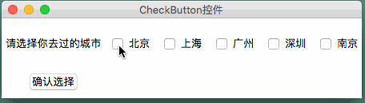

##### 3. 单选框Radiobutton

```python
# RadioButton
from tkinter import *
# from tkinter.ttk import *
# radiobutton --- 单选框----多个值中只能选一个
root = Tk()
root.title("RadioButton组件")
root.geometry("400x100")

def sel_gender():
    if gender_check.get() == 1:
        Label_select_gender["text"] = "男"
    else:
        Label_select_gender["text"] = "女"

def sel_education():
    Label_select_education["text"] = education_list[int(education_check.get())]

# 性别单选
Label_gender = Label(root,text = "性别:")
Label_gender.grid(row = 0,column = 0,padx = 5,pady = 5)

gender_check = IntVar()

# 用哪个变量接收它是否被选中，variable，绑定的值是同一个表示一组,variable通过get方法能获得value的值
# 最终选中后取什么值： value，同一组radiobutton中value的值最好是不同的
# 性别的单选
radio_boy = Radiobutton(root,text = "男",variable = gender_check,value = 1,command = sel_gender)
radio_boy.grid(row = 0,column = 1,padx = 5,pady = 5)
radio_boy = Radiobutton(root,text = "女",variable = gender_check,value = 0,command = sel_gender)
radio_boy.grid(row = 0,column = 2,padx = 5,pady = 5)
# 学历
education_list = ["高中","专科","本科","硕士","博士"]
Label_education = Label(root,text = "学历:")
Label_education.grid(row = 1,column = 0,padx = 5,pady = 5)

education_check = IntVar()
for i in range(0,len(education_list)):
    radio = Radiobutton(root,text = education_list[i],variable = education_check,value = i,command = sel_education)
    radio.grid(row = 1,column = i + 1,padx = 5,pady = 5)

Label01 = Label(root,text = "所选的值为:")
Label01.grid(row = 2 , column = 0)

Label_select_gender = Label(root,text = "")
Label_select_gender.grid(row = 2 , column = 1)
Label_select_education = Label(root,text = "")
Label_select_education.grid(row = 2 , column = 2)

# 展示控件
root.mainloop()
```
演示效果：
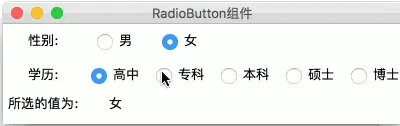

##### 4. 下拉框ComboBox
```python
# ComboBox
from tkinter import *
from tkinter.ttk import *

# ComboBox 控件 --- 下拉框单选
root = Tk()
root.title("ComboBox控件")
root.geometry("400x100")

# 做下拉选择的时候定义函数一定要使用可变长参数
def sel_gender(*args):
    Label_select_gender["text"] = combo_gender.get()

def sel_education(*args):
    Label_select_education["text"] = combo_education.get()

# 性别单选
Label_gender = Label(root,text = "性别")
Label_gender.grid(row = 0,column = 0,padx = 5,pady = 5)

gender = StringVar()
combo_gender = Combobox(root,textvariable = gender)
combo_gender["values"] = ["男","女"]  # 下拉列表填充
combo_gender["state"] = "readonly"  # 只允许读，如果没有这个参数，输入框可以输入值
combo_gender.current(0) # 默认情况下选择的值的索引
combo_gender.grid(row = 0 ,column = 1)

# 学历单选
education_list = ["高中","专科","本科","硕士","博士"]
Label_education = Label(root,text = "学历:")
Label_education.grid(row = 1,column = 0)

education = StringVar()
combo_education = Combobox(root,textvariable = education,values = education_list)
combo_education["state"] = "readonly"
combo_education.current(0)
combo_education.grid(row = 1,column = 1)

# 绑定选择性别的事件
combo_gender.bind("<<ComboboxSelected>>",sel_gender)
# 绑定选择学历的事件
combo_education.bind("<<ComboboxSelected>>",sel_education)

# 获取结果：
Label01 = Label(root,text = "所选的值为:")
Label01.grid(row = 2 , column = 0)
Label_select_gender = Label(root,text = "")
Label_select_gender.grid(row = 2,column = 1,sticky = "e")
Label_select_education = Label(root,text = "")
Label_select_education.grid(row = 2,column = 2,sticky = "w")

# 窗体展示
root.mainloop()
```
效果演示：
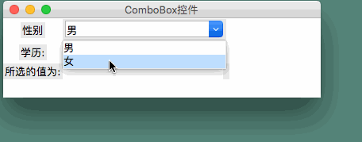

##### 5. 容器LabelFrame
把具有相同功能的模块组合在一起，并且加上一个名字，这个控件能让你的界面更加有条理
```python
# LabelFrame
from tkinter import *
from tkinter.ttk import *

root = Tk()
root.title("LabelFrame控件")

LabelFrame_query = LabelFrame(root,text = "学生信息查询")
LabelFrame_query.pack(padx = 10,pady = 10)
# 如果不加控件的话，LabelFrame是看不见的

Label01 = Label(LabelFrame_query,text = "学号")
Label01.pack(side = LEFT,padx = 5,pady = 5)
Entry01 = Entry(LabelFrame_query,width = 10)
Entry01.pack(side = LEFT,padx = 5,pady = 5)
Label02 = Label(LabelFrame_query,text = "姓名")
Label02.pack(side = LEFT,padx = 5,pady = 5)
Entry02 = Entry(LabelFrame_query,width = 10)
Entry02.pack(side = LEFT,padx = 5,pady = 5)
Label03 = Label(LabelFrame_query,text = "班级")
Label03.pack(side = LEFT,padx = 5,pady = 5)
Entry03 = Entry(LabelFrame_query,width = 10)
Entry03.pack(side = LEFT,padx = 5,pady = 5)
Button01 = Button(LabelFrame_query,text = "查询",width = 5)
Button01.pack(side = LEFT,padx = 15,pady = 5)

root.mainloop()
```
运行效果：
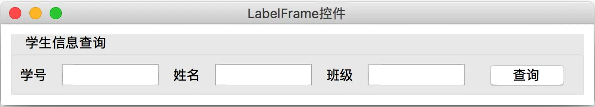

##### 6. 树状视图TreeView
```python
# Treeview控件
from tkinter import *
from tkinter.ttk import *

root = Tk()
root.title("TreeView模块")
root.geometry("440x225")
# frame容器放置表格
frame01 = Frame(root)
frame01.place(x = 10,y = 10,width =420,height = 220 )
# 加载滚动条
scrollBar = Scrollbar(frame01)
scrollBar.pack(side = RIGHT,fill = Y)
# 准备表格TreeView
tree = Treeview(frame01,columns = ("学号","姓名","性别","年龄","手机号"),show = "headings",yscrollcommand = scrollBar.set)
# 设置每一列的宽度和对齐方式
tree.column("学号",width = 80,anchor = "center")
tree.column("姓名",width = 80,anchor = "center")
tree.column("性别",width = 60,anchor = "center")
tree.column("年龄",width = 60,anchor = "center")
tree.column("手机号",width = 120,anchor = "center")
# 设置表头的标题文本
tree.heading("学号",text = "学号")
tree.heading("姓名",text = "姓名")
tree.heading("性别",text = "性别")
tree.heading("年龄",text = "年龄")
tree.heading("手机号",text = "手机号")
# 设置关联
scrollBar.config(command = tree.yview)
# 加载表格信息
tree.pack()
# 插入数据
for i in range(10):
    # i 是索引
    tree.insert("",i,values=["9500"+str(i),"张三","男","23","15622338793"])
# 展示
root.mainloop()
```
运行效果:
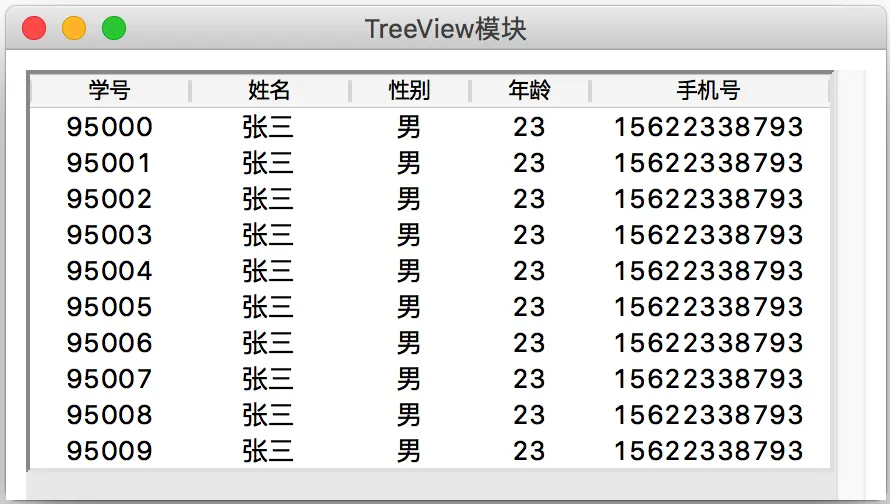

##### 7. Style属性
增强的ttk包里没法用tkinter的传统属性进行设置比如bg和fg，我们需要通过style对象来对其设置；
注意：我们对实例化对象style01进行配置,
```python
style01.configure("TLabel",font = ("华文黑体",18),background = "green",foreground = "blue")
```
第一个参数不是对象的名称,而是对象的某一类，其名称是有规定的，不是随便取的，由于这里是对Label 的style进行命令，所以我们只能命名成`TLabel`，具体的组件与名称的对应关系如下：
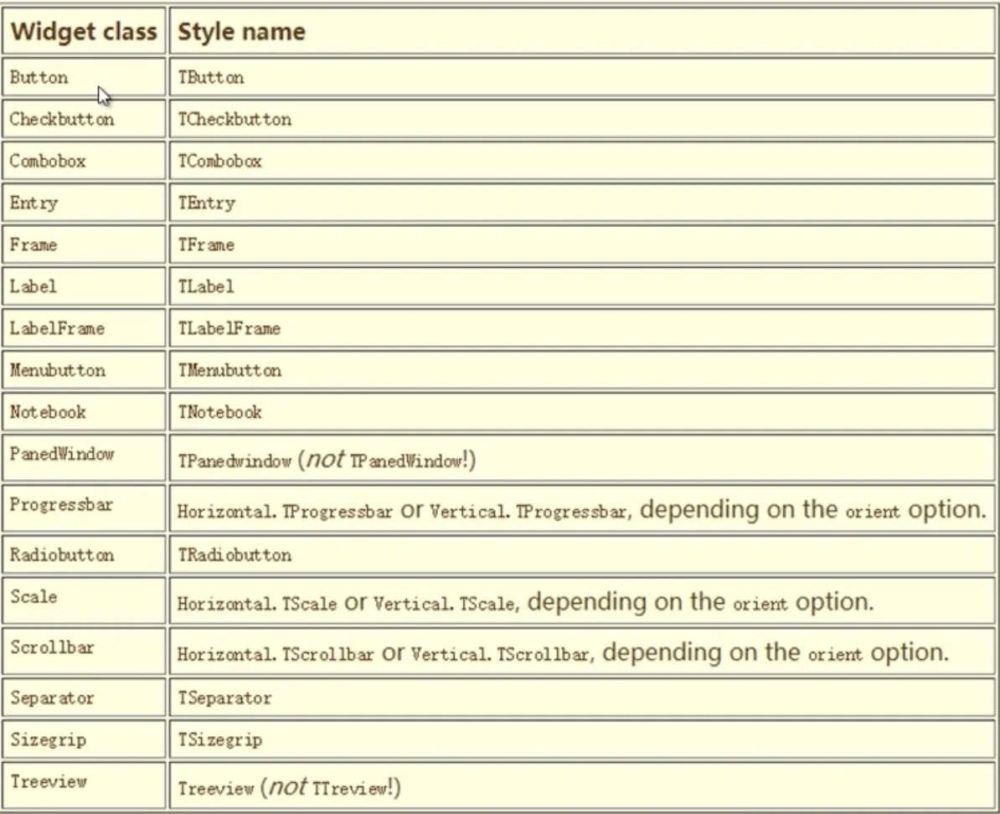：
如果此时创建一个Label02对象它的style属性没有绑定style01对象，但是它的属性依然是style01对象里定义的特征，这是怎么回事呢？
**解答**：
其实只要在配置style的时候，填写标准的Stylename，后面无论某个控件是否绑定，Stylename 对应的控件都会生效；

```python
from tkinter import *
from tkinter.ttk import *
root = Tk()
root.title("style属性")
root.geometry("300x200")

# 实例化一个style对象style01
style01 = Style()
# 对style01进行配置,Stylename属性设置为标准的TLable
style01.configure("TLabel",font = ("华文黑体",18),background = "green",foreground = "blue")
# 把Label01控件绑定给style01对象
Label01 = Label(root,text = "用户名",style = "TLabel")
Label01.pack(padx = 10,pady = 10)
Label02 = Label(root,text = "密码")
Label02.pack(padx = 10,pady = 10)
# 展示窗体
root.mainloop()
```
效果演示：
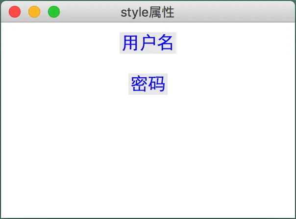

**拓展**：
如果只想对某类中的某些控件生效，那么就必须要使用custom.Stylename格式来进行命名；
如我创建的style01的Stylename名称是username.TLabel，这里的username是自定义字段，那么后面的Label控件如果没有指定style是username.TLabel就不会具有style01的属性

```python
from tkinter import *
from tkinter.ttk import *
root = Tk()
root.title("style属性")
root.geometry("300x200")

# 实例化一个style对象style01
style01 = Style()
# 对style01进行配置,Stylename属性设置为password.TLable
style01.configure("password.TLabel",font = ("华文黑体",18),background = "green",foreground = "blue")
# 把Label01控件绑定给style01对象
Label01 = Label(root,text = "用户名",style = "password.TLabel")
Label01.pack(padx = 10,pady = 10)
Label02 = Label(root,text = "密码")
Label02.pack(padx = 10,pady = 10)
# 展示窗体
root.mainloop()
```
这样控件的显示效果如下：
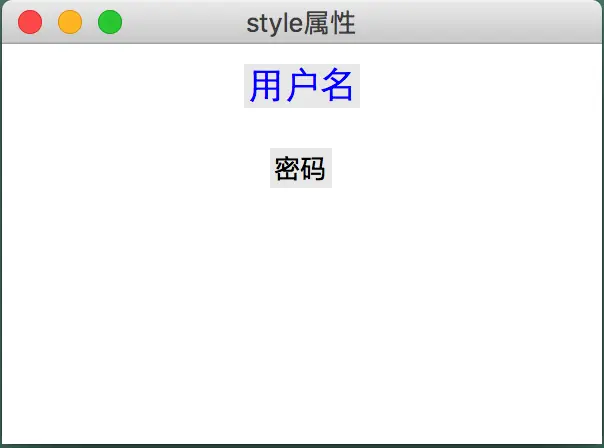

这样就能使具体某一个组件生效，这样就能做到既能控制全局保持整体的统一，又能对具体某一类或者某一个特别对待，这种机制就很棒！
好啦，关于Tkinter的基础知识点就介绍到这里啦！