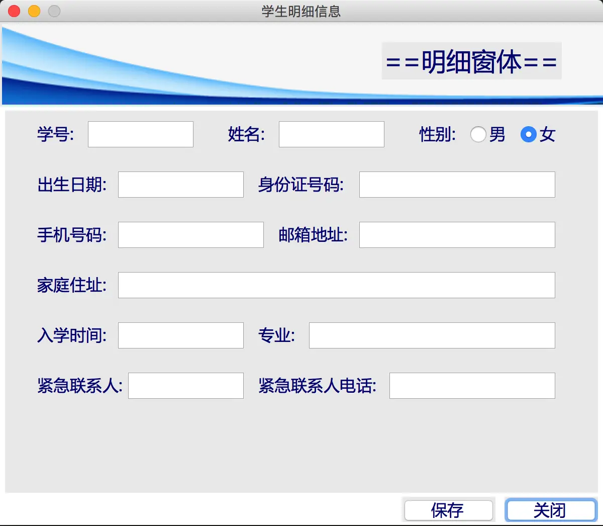
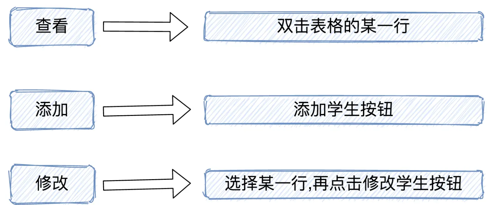
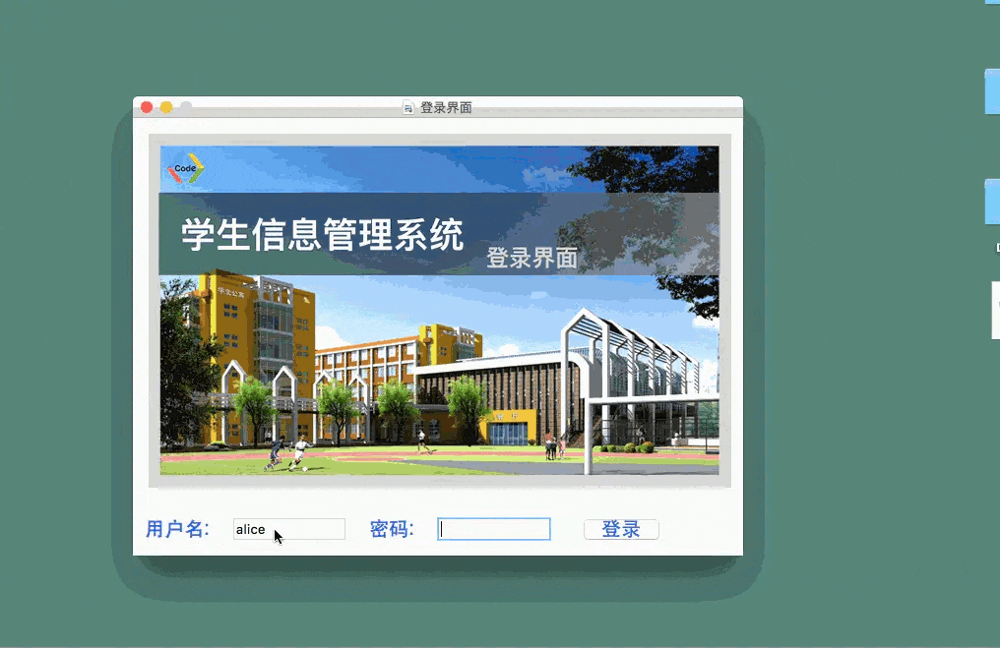
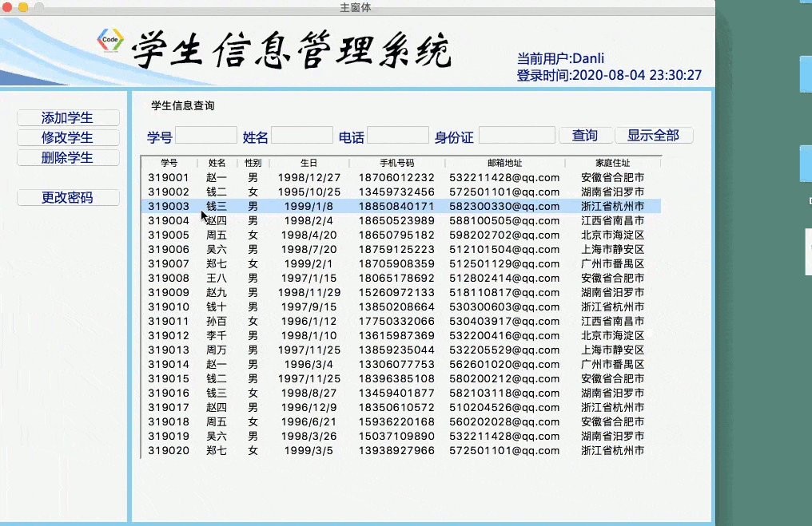

### 前言
上一节我们实现了在主窗体的数据查询功能，系统能够在所有的数据中精确地找到某个具体的符合条件的学生信息。但是在主窗体中显示的都是概要信息，我们想要鼠标双击即可查看某个具体的学生信息该怎么实现呢？

这一节我们将搭建一个显示学生明细信息的窗体，显示该学生的所有信息，只要双击表格中的某一行就能打开明细窗体，显示学生明细信息。显示学生明细窗体有三种不同的状态，在不同的状态下窗体显示的标题是不同的。由于内容比较多，我们这一节主要的工作内容是GUI框架的搭建。
### 一、学生明细窗体GUI基本布局
我们新建一个detailgui.py文件，显示学生明细信息。主要显示的内容有：学号、姓名、性别、出生日期、身份证号码、手机号码、邮箱地址、家庭住址、入学时间、专业、紧急联系人、紧急联系电话；其中性别我们通过`Radiobutton`的方式显示，其余都通过`Label`和`Entry`来显示。
> 本文重点讲解的内容是逻辑与实现部分；关于tkinter布局的基础知识，这里主要用到的主要是Label标签和Entry输入框还有Radiobutton单选框的绘制，我们前面的文章《Python基础学习笔记：Tkinter》已经做了具体的讲解，这里就不再继续重复了。

下面直接给出界面布局的代码：
```python
from tkinter import *
from tkinter.ttk import *
import os

class DetailWindow(Tk):
    def __init__(self):
        super().__init__()
        self.title("学生明细信息")
        self.geometry("600x500+600+150")
        self.resizable(0,0) # 不能改变大小

        # 加载控件
        self.setup_UI()

    def setup_UI(self):
        # 设置style
        self.Style01 = Style()
        self.Style01.configure("title.TLabel",font=("微软雅黑",25,"bold"),foreground = "navy")
        self.Style01.configure("TLabel", font=("微软雅黑", 16, "bold"), foreground="navy")
        self.Style01.configure("TButton",font=("微软雅黑",16,"bold"),foreground = "navy")
        self.Style01.configure("TEntry", font=("微软雅黑", 16, "bold"),width = 10)
        self.Style01.configure("TRadiobutton",font=("微软雅黑",16,"bold"),foreground = "navy")
        # 加载上面的banner
        self.Login_image = PhotoImage(file = "."+os.sep+"img"+os.sep+"stu_detail_banner.png")
        self.Label_image = Label(self,image = self.Login_image)
        self.Label_image.pack()

        # 添加一个title
        self.var_title = StringVar()
        self.Label_title = Label(self,text="==明细窗体==",style = "title.TLabel")
        self.Label_title.place(x=380,y=20)

        # 加载一个pane
        self.Pane_detail = PanedWindow(width = 590,height = 380)
        self.Pane_detail.place(x = 5,y = 88)

        # 添加属性
        # 第一排：学号
        self.Label_sno = Label(self.Pane_detail,text = "学号:")
        self.Label_sno.place(x=30,y=10)
        self.var_sno = StringVar()
        self.Entry_sno = Entry(self.Pane_detail,textvariable = self.var_sno,font=("微软雅黑", 16, "bold"),width = 10)
        self.Entry_sno.place(x=80,y=8)
        # 姓名
        self.Label_name = Label(self.Pane_detail,text = "姓名:")
        self.Label_name.place(x=220,y=10)
        self.var_name = StringVar()
        self.Entry_name = Entry(self.Pane_detail,textvariable = self.var_name,font=("微软雅黑", 16, "bold"),width = 10)
        self.Entry_name.place(x=270,y=8)
        # 性别
        self.Label_gender = Label(self.Pane_detail,text = "性别:").place(x=410,y = 10)
        self.var_gender = IntVar()
        self.Radio_man = Radiobutton(self.Pane_detail,text="男",variable = self.var_gender,value = 1)
        self.Radio_man.place(x=460,y = 10)
        self.Radio_woman = Radiobutton(self.Pane_detail, text="女", variable=self.var_gender, value=0)
        self.Radio_woman.place(x=510, y=10)
        # 第二排：出生日期
        self.Label_age = Label(self.Pane_detail,text="出生日期:")
        self.Label_age.place(x=30,y=60)
        self.var_age = StringVar()
        self.Entry_age = Entry(self.Pane_detail,textvariable = self.var_age,font=("微软雅黑", 16, "bold"),width = 12)
        self.Entry_age.place(x=110,y=58)
        # 身份证号码
        self.Label_id = Label(self.Pane_detail, text="身份证号码:")
        self.Label_id.place(x=250, y=60)
        self.var_id = StringVar()
        self.Entry_id = Entry(self.Pane_detail, textvariable=self.var_id,font=("微软雅黑", 16, "bold"), width=19)
        self.Entry_id.place(x=350, y=58)
        # 第三排：手机号码
        self.Label_mobile = Label(self.Pane_detail, text="手机号码:")
        self.Label_mobile.place(x=30, y=110)
        self.var_mobile = StringVar()
        self.Entry_mobile = Entry(self.Pane_detail, textvariable=self.var_mobile,font=("微软雅黑", 16, "bold"), width=14)
        self.Entry_mobile.place(x=110, y=108)
        # 邮箱地址
        self.Label_email = Label(self.Pane_detail, text="邮箱地址:")
        self.Label_email.place(x=270, y=110)
        self.var_email = StringVar()
        self.Entry_email = Entry(self.Pane_detail, textvariable=self.var_email,font=("微软雅黑", 16, "bold"), width=19)
        self.Entry_email.place(x=350, y=108)
        # 第四排：家庭住址
        self.Label_home = Label(self.Pane_detail, text="家庭住址:")
        self.Label_home.place(x=30, y=160)
        self.var_address = StringVar()
        self.Entry_home = Entry(self.Pane_detail, textvariable=self.var_address,font=("微软雅黑", 16, "bold"), width=43)
        self.Entry_home.place(x=110, y=158)
        # 第五排：入学时间
        self.Label_studyin = Label(self.Pane_detail, text="入学时间:")
        self.Label_studyin.place(x=30, y=210)
        self.var_studyin = StringVar()
        self.Entry_studyin = Entry(self.Pane_detail, textvariable=self.var_studyin,font=("微软雅黑", 16, "bold"), width=12)
        self.Entry_studyin.place(x=110, y=208)
        # 专业：
        self.Label_pro = Label(self.Pane_detail, text="专业:")
        self.Label_pro.place(x=250, y=210)
        self.var_pro = StringVar()
        self.Entry_pro = Entry(self.Pane_detail, textvariable=self.var_pro,font=("微软雅黑", 16, "bold"), width=24)
        self.Entry_pro.place(x=300, y=208)
        # 第六排：紧急联系人
        self.Label_emcon = Label(self.Pane_detail, text="紧急联系人:")
        self.Label_emcon.place(x=30, y=260)
        self.var_emcon = StringVar()
        self.Entry_emcon = Entry(self.Pane_detail, textvariable=self.var_emcon,font=("微软雅黑", 16, "bold"), width=11)
        self.Entry_emcon.place(x=120, y=258)
        # 紧急联系电话
        self.Label_emtel = Label(self.Pane_detail, text="紧急联系人电话:")
        self.Label_emtel.place(x=250, y=260)
        self.var_emtel = StringVar()
        self.Entry_emtel = Entry(self.Pane_detail, textvariable=self.var_emtel,font=("微软雅黑", 16, "bold"), width=16)
        self.Entry_emtel.place(x=380, y=258)
        # 放置两个按钮
        self.Button_save = Button(self,text = "保存",style = "TButton").place(x=400,y=472)
        self.Button_exit = Button(self,text = "关闭",style = "TButton").place(x=502,y=472)
if __name__ == '__main__':
    this_window = DetailWindow()
    this_window.mainloop()
```
效果演示：


### 二、加载明细窗体

##### 1. 功能需求

加载学生明细信息我们应该设置三种状态：查看、添加、修改；

（1）在查看状态下，标题是：查看学生明细，各信息栏输入框中所有的信息都是只读状态，并且右下角的保存按钮处于隐藏状态；

（2）在添加状态下，标题是：添加学生明细，各信息栏输入框清空，右下角保存按钮可用；

（3）在修改状态下，标题是：修改学生明细，各信息栏除学号不能修改外，其余信息栏均可修改，并且右下角保存按钮可用。

##### 2. 触发条件
我们实现查看学生明细信息的三种状态的触发条件：



##### 3. 遇到问题
为了能查看学生明细信息，我们要在主窗体中定义一个函数`load_detail_window()`,在此之前我们要导入detailgui模块，调用`DetailWindow`类；
```python
import detailgui
def load_detail_window(self):
    detail_window = detailgui.DetailWindow()
```
接着，我们再定义一个`add_student`的函数，在这个函数中调用`load_detail_window`方法
```python
def add_student(self):
    self.load_detail_window()
```
然后在按钮中添加`command`参数，其值为`add_student`;
这样做似乎貌似实现了简单的加载学生明细窗体的功能，实际上当我们执行程序，点击添加学生按钮后，系统会报错
```python
_tkinter.TclError: image "pyimage4" doesn't exist
```
##### 这是什么原因呢？
> 在tkinter里面有一个类Tk,其功能是产生一个主窗体，我们前面每次创建窗体时都用到了它。但是在tkinter里有一个规定，应用程序同时只能运行一个主窗体。而这里我们的主窗体一直在运行，是没有办法再加载一个主窗体（明细信息）的。如果想同时加载两个窗体，第二个窗体必须要以子窗体的形式打开，这里我们就可以使用`Toplevel`来创建子窗体。

所以，detialgui的DetailWindow类所继承的类应该由`Tk`，换成`Toplevel`即可。
这时候又出现了一个小bug,pane与明细窗体发生了脱离，这是因为我们前面创建pane容器的时候忘记设置它的属主了，这里添加一个构建函数中添加一个self参数就可以了。现在点击添加学生按钮，就可以正常加载明细信息窗口了！

所以，出现这个问题的根源所在就是：使用Tk这个类实例化一个窗体，这个窗体是一个主窗体。已经实例化了一个主窗体，再实例化一个是不可以的。所以第二个窗体必须用`Toplevel`实例化。

### 三、实现三种状态加载明细窗体
##### 1. 点击按钮触发
前面我们已经实现了添加明细信息的功能，现在我们继续实现修改明细信息的功能。我们新定义一个`update_student()`函数：
```python
def update_student(self):
    self.load_detail_window()
```
然后在修改学生按钮中添加`command`参数即可。
##### 2. 双击表格触发
我们想双击TreeView中的某一行表格，就能触发查看明细信息的功能，首先我们定义一个查看明细信息的方法`view_student()`,由于双击是一个事件，所以在调用函数的时候需要添加一个参数`event`
```python
def view_student(self,event):
    self.load_detail_window()
```
然后在 `setup_UI()`函数的结尾处，添加触发双击表格某一行的事件，写法是：使用`bind()`方法，第一个参数一定要以`Double`开头，体现是一个双击事件，第二个函数为对应的触发函数。
```python
self.Tree.bind("<Double-1>",self.view_student)
```
效果演示：


### 四、呈现三种不同的状态
以上三种触发函数实现的都是同一种功能，然而我们想实现查看、添加、修改三种不同状态，那么怎样才能体现差异化呢？
##### 1.添加标志参数
在实例化明细窗体的时候，添加一个标志参数`action_flag`,我们通过区分`action_flag`参数的值，来确定以什么样的模式进行加载。
这里我们规定：

* 当action_flag = 1时，表示查看模式；

* 当action_flag = 2时，表示添加模式；

* 当action_flag = 3时，表示修改模式。
##### 2. 修改窗体标题
我们在明细窗体的构造函数中，定义一个全局变量：
```python
self.flag = action_flag
```
再定义一个修改窗体标题的函数：
```python
def load_windows_flag(self):
    if self.flag == 1:
        self.Label_title.configure(text="==查看学生明细==")
    elif self.flag == 2:
        self.Label_title.configure(text="==新建学生明细==")
    elif self.flag == 3:
        self.Label_title.configure(text="==修改学生明细==")
```
创建好修改标题的函数后，不要忘了在构造函数中添加上：
```python
self.load_windows_flag()
```
我们在主窗体函数中也定义一个全局变量，作为修改明细窗体标题的标志位：
```python
self.action_flag = 0
```
然后在主窗体函数中，给`load_detail_window()`函数添加参数`self.action_flag`：
```python
def load_detail_window(self):
    detail_window = detailgui.DetailWindow(self.action_flag)
```
于此同时，`add_student()`、`update_student()`、`view_student()`三个方法也要做相应的修改：
```python
def add_student(self):
    self.action_flag = 2
    self.load_detail_window()

def update_student(self):
    self.action_flag = 3
    self.load_detail_window()

def view_student(self,event):
    self.action_flag = 1
    self.load_detail_window()
```
这样三种不同的触发事件，对应的明细窗体标题也发生了相应的变化：

点击添加学生按钮，明细窗体标题显示“添加学生明细”；点击修改学生按钮，明细窗体标题显示“修改学生明细”；双击表格学生学生信息某一行，明细窗体标题显示“查看学生明细”。

### 最后

本节我们完成了明细窗体GUI的搭建，设置了明细窗体的查看模式、添加模式、和修改模式，并且实现了在不同触发按钮下同一个明细窗体显示不同的标题。希望小伙伴们不仅仅学习的同时，思考一下为什么要这么做？我们是怎么实现呈现三种不同窗体状态的，并且结合着前面的文章自己动手练一练，所有的数据源、素材和源码直接私信我，我发给你。
本节的明细窗体GUI的搭建已经完成了，前期准备工作已经做好了，下一节我们就要正式将数据源学生信息填充进明细窗体中显示出来，敬请期待吧~