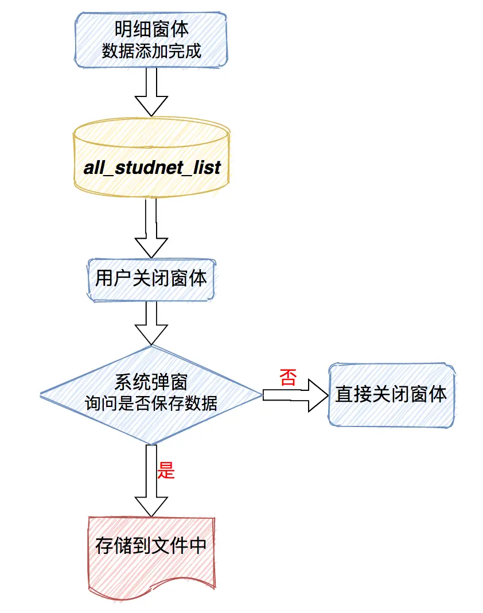
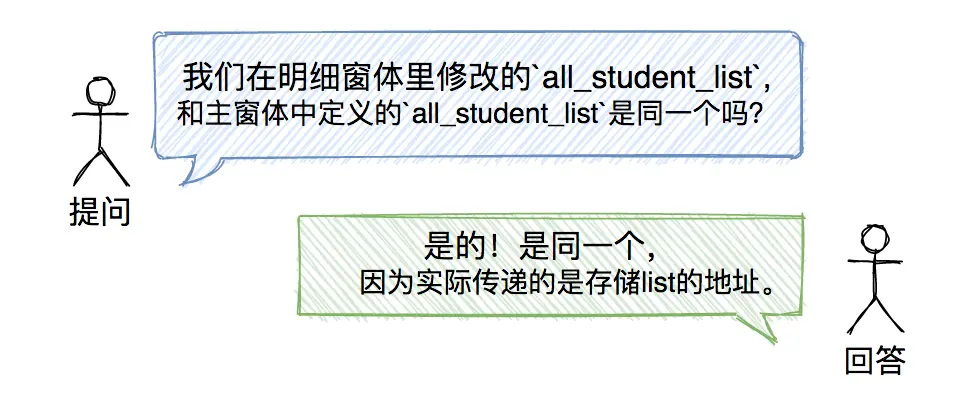
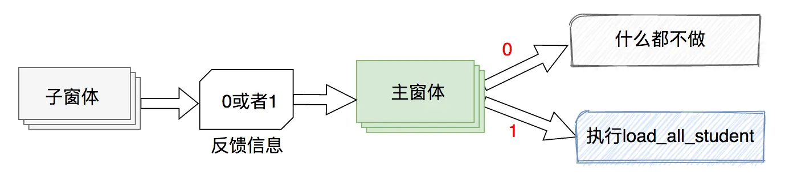

### 前言
在上一节中，我们完成了明细窗体的最终数据填充，我们完成了明细窗体的最终数据填充，双击任意一行即可显示该行学生的详细信息，完成了学生信息的查看，那么作为一个学生信息管理系统，能够向系统中添加学生信息也是一个必需的基础功能。所以本小节我们要实现学生信息的添加功能。
### 一、添加流程中数据的分析
##### 1. 添加数据的思路
在主窗体点击`添加学生`按钮，跳转到明细窗体，这个我们在前面的章节中已经实现了，现在我们要考虑的是，在明细窗体的页面数据添加完成后所要进行的操作。首先需要考虑的是将明细窗体中写入的数据项存储起来。怎么存储起来呢？现在有两种主要思路：
##### 思路01：

第一步：写入到文件；

第二步：将新添加的信息在主界面显示；

然而由于本项目没有使用数据库技术存储数据，而每次添加、修改和删除都要写入文件的话，一方面会影响到程序运行的速度。另一方面会存在这样的情况：添加或者修改数据时反悔了、不想保存了，要是默认直接写入会产生垃圾数据。所以这种思路是存在缺陷的。

##### 思路02：


由于我们所有的学生信息都存储在列表`all_student_list`中，所以当学生明细窗体中数据添加完成后，我们将新添加的数据直接插入到`all_student_list`中。等到关闭窗体的时候，系统弹窗询问是否保存数据，点击是，再把数据存储到文件中。

##### 2. 注意事项：
`all_student_list`数据是在主窗体里定义的，然而执行添加功能是在明细窗体中进行的，所以我们必须要在明细窗体的构造函数中再添加一个参数来接收主窗体传递的数据！！！



### 二、添加数据的实现
明细窗体已经添加了`all_student_list`参数，那么我们主窗体的加载明细窗体的方法`load_detail_window()`也要跟着做出相应的调整：
```python
def load_detail_window(self):
    detail_window = detailgui.DetailWindow(self.action_flag,self.current_student_list,self.all_student_list)
```
于此同时，在明细窗体中我们新建一个`commit()`方法，为了将明细窗体中各个输入框中输入的字符串保存到`all_student_list`中，最后把`commit()`方法绑定在保存按钮上。
```python
def commit(self):
    if self.flag == 1:  # 查看
        pass
    elif self.flag == 2:    # 添加
        # 准备数据
        temp_list = []
        if len(str(self.Entry_sno.get()).strip()) == 0:
            showinfo("系统消息","学号不能为空！")
        else:
            temp_list.append(str(self.Entry_sno.get()).strip())
            temp_list.append(str(self.Entry_name.get()).strip())
            if self.var_gender.get() == 1:
                temp_list.append("男")
            else:
                temp_list.append("女")
            temp_list.append(str(self.Entry_age.get()).strip())
            temp_list.append(str(self.Entry_mobile.get()).strip())
            temp_list.append(str(self.Entry_email.get()).strip())
            temp_list.append(str(self.Entry_home.get()).strip())
            temp_list.append(str(self.Entry_id.get()).strip())
            temp_list.append(str(self.Entry_studyin.get()).strip())
            temp_list.append(str(self.Entry_pro.get()).strip())
            temp_list.append(str(self.Entry_emcon.get()).strip())
            temp_list.append(str(self.Entry_emtel.get()).strip())

            # 添加到all_student_list
            self.all_student_list.append(temp_list)
            # 提醒添加成功
            showinfo("系统消息","学生信息添加成功")
            # 关闭窗体
            self.destroy()
```
### 三、完善添加的操作
##### 1. 需求
我们希望添加完善后，主窗体的表格能自动刷新，这样才能让用户觉察到，哦，数据确实添加进去了；
##### 2. 思路
怎样在点击保存按钮时，主窗体表格自动刷新呢，实际上只要在主窗体执行`load_all_student`方法即可。


点击明细窗体的“保存”按钮，反馈信号（整数1），主窗体接收到信号，执行`load_all_student`方法；
点击明细窗体的“关闭”按钮，反馈信号（整数0），主窗体接收到信号，什么都不做。
##### 3. 方法
我们再明细窗体里给`commit()`函数添加一个反馈信号，
```python
self.userinfo = 1
```
同时给`colse_window()`函数添加反馈信号：
```python
self.userinfo = 0
```
然后回到主窗体，在加载明细窗体的方法中`load_detail_window()`,将我们实例化的`detail_window`对象作为参数传入`self.wait_window()`方法中，这样就可以获取`detail_window`的`userinfo`属性（反馈信号）了。

```python
def load_detail_window(self):
    detail_window = detailgui.DetailWindow(self.action_flag,self.current_student_list,self.all_student_list)
    self.wait_window(detail_window)
    return detail_window.userinfo
```
然后修改`add_student()`方法,如果反馈信号是1则加载全部学生信息到Treeview中，否则就什么都不做。
```python
def add_student(self):
    self.action_flag = 2
    if self.load_detail_window() == 1:
        self.load_all_student()
    else:
        return
```
##### 最终效果：


至此，我们实现了添加学生信息，并且实现了在主窗体的TreeView中立即显示结果。

### 最后
本节完成了，本项目添加学生信息的功能，这一套基础的操作流程希望大家能够理解。只要添加操作的流程理解了，后面再对学生信息进行修改、删除、保存也就不难了。我们下一节将实现学生信息的修改、删除、保存功能，尽请期待吧~