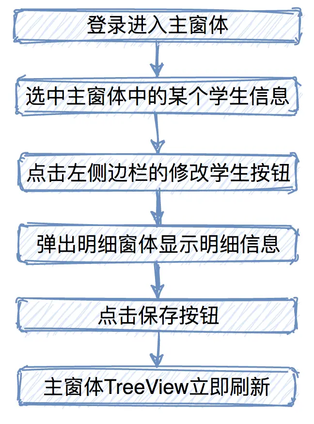
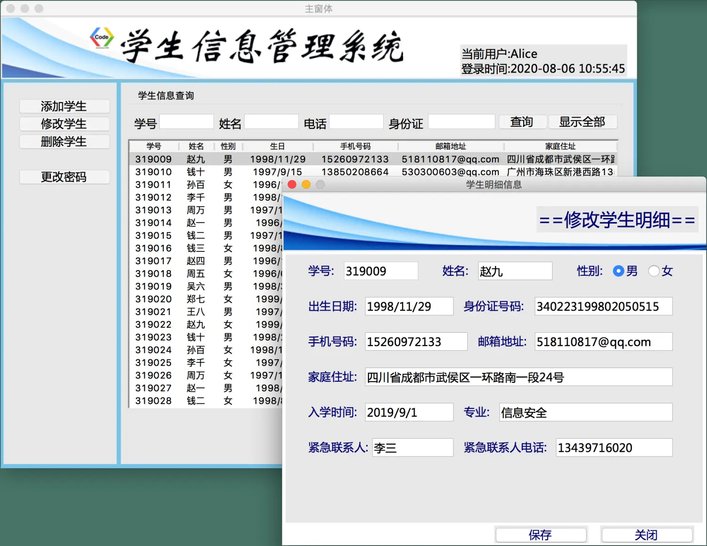
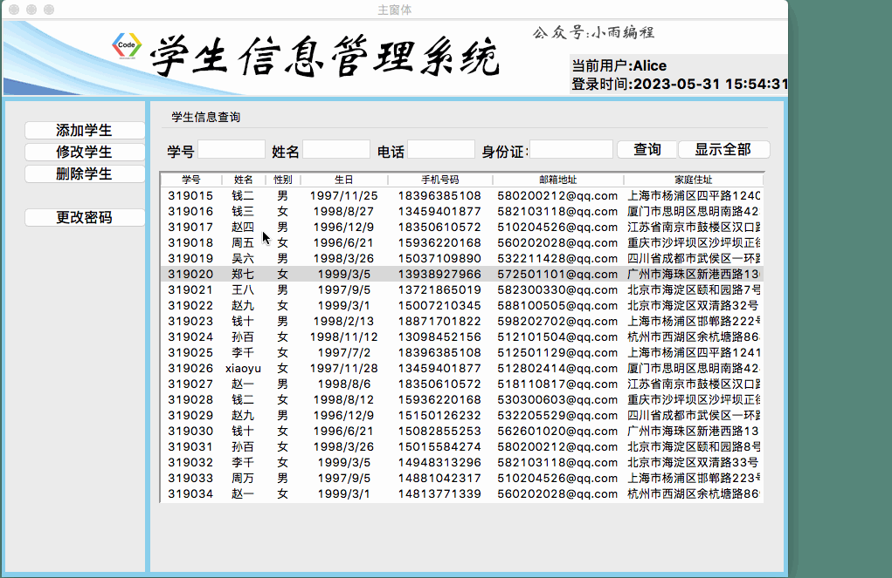
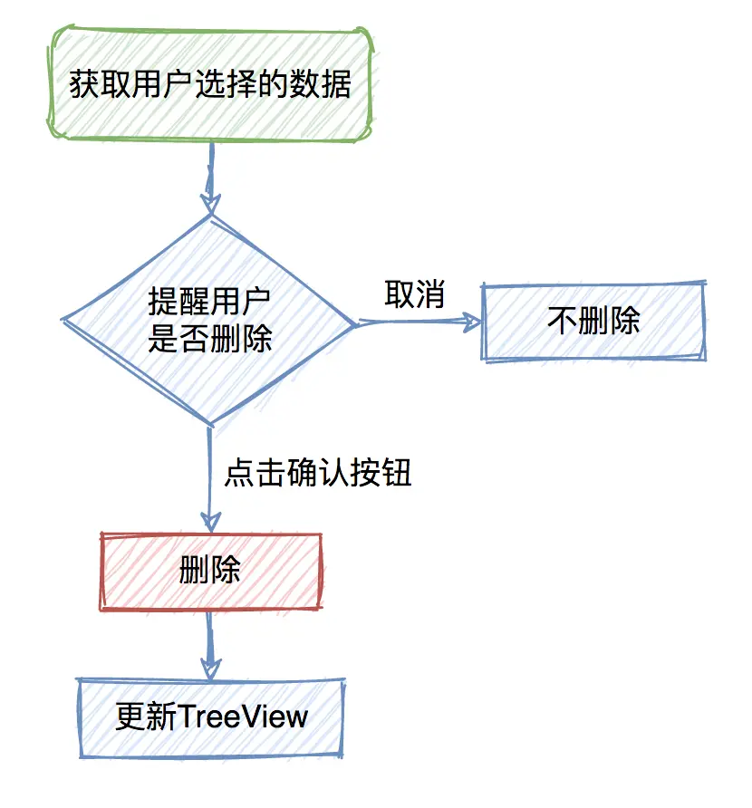
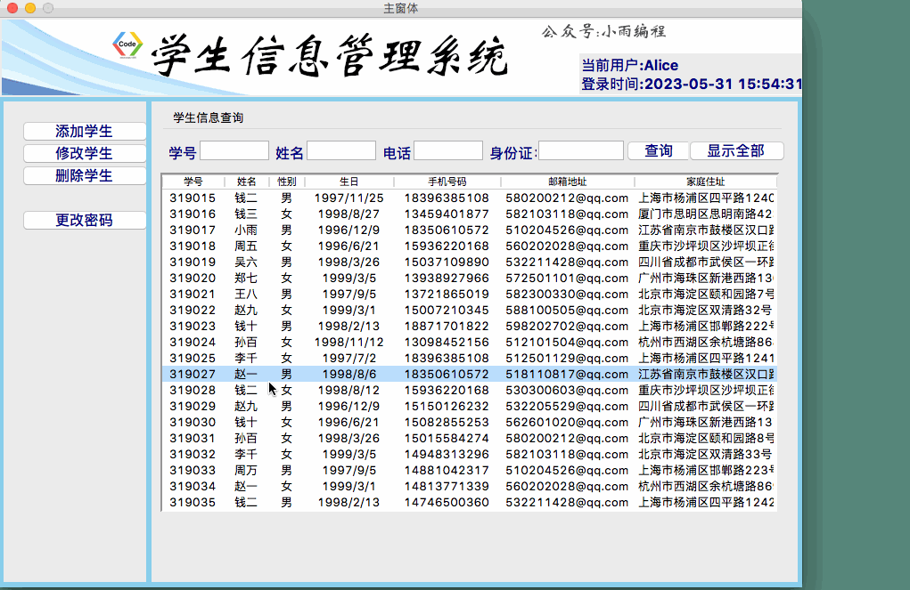
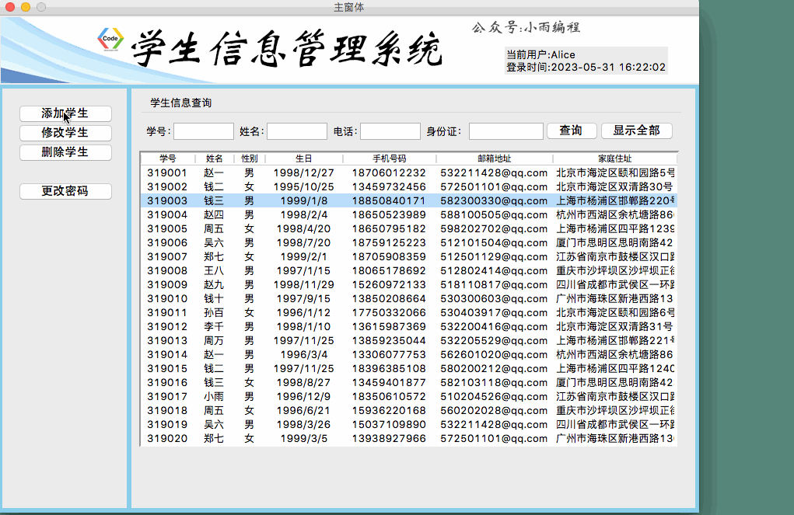

### 前言
上一节，我们实现了添加学生信息的功能，在明细窗体中输入的学生信息并添加到总列表中，与此同时在主窗体的表格中能自动刷新添加的数据。作为一个学生信息管理系统除了具备添加信息的功能，同时也要能够完成修改、删除以及最后的数据保存并写入到文件的功能。
### 一、修改学生信息
我们有了前面查看学生信息、添加学生信息的操作基础，修改学生信息的功能实现起来就不难了。
##### 操作逻辑：
我们执行修改学生信息的操作逻辑是：


##### 1. 数据载入明细窗体
首先我们要做的是：点击修改按钮载入明细窗体的时候，相应的信息应当被填充进明细窗体中。我们需要在明细窗体的代码中找到`load_windows_flag`函数，在`self.fiag == 3`的条件分支下，调用`load_student_detail`方法加载学生数据。
```python
# 填充数据
self.load_student_detail()
```
同时在明细窗体的修改模式下，我们设置学号不允许修改：
```python
# 学号不允许修改
self.Entry_sno["state"] = DISABLED
```
我们修改窗体的时，主窗体应当能获取到选中的学生信息，这样调用明细窗体的时候才会有数据显示。主窗体中修改学生信息对应的方法是`update_student`,我们对该函数进行完善，我们需要获取某一行的学生数据：
```python
def update_student(self):
    self.action_flag = 3
    item = self.Tree.selection()[0]  
    Temp_student_list = self.Tree.item(item, "values")  
    # 遍历获得完整学生明细信息
    for item in self.all_student_list:
        if item[0] == Temp_student_list[0]:
            self.current_student_list = item
    #载入窗体
    self.load_detail_window()
```
现在已经完成了，指定学生明细信息的载入，以及窗体状态的修改。
##### 效果演示：

##### 2. 对all_student_list指定项进行修改
接下来我们就要完成修改完成后提交的功能：
我们要在啊明细窗体的代码中找到`commit`函数，在`self.flag == 3`也就是修改状态下的操作逻辑。
由于我们从主窗体传递过来有两个列表，一个是`all_student_list`和`current_student_list`。怎样根据`currrent_student_list`来修改`all_student_list`列表中的内容呢？
我们对`all_student_list`列表中的内容进行遍历，如果每一条数据与当前明细窗体中的数据的第一项“学号”匹配，那么就把`all_student_list`对应该索引的数据修改为采集到的当前明细窗体中的数据。代码如下：
```python
# 把当前界面中的数据存储在集合中
temp_list = []
if len(str(self.Entry_sno.get()).strip()) == 0:
    showinfo("系统消息", "学号不能为空！")
    return
else:
    temp_list.append(str(self.Entry_sno.get()).strip())
    temp_list.append(str(self.Entry_name.get()).strip())
    if self.var_gender.get() == 1:
        temp_list.append("男")
    else:
        temp_list.append("女")
    temp_list.append(str(self.Entry_age.get()).strip())
    temp_list.append(str(self.Entry_mobile.get()).strip())
    temp_list.append(str(self.Entry_email.get()).strip())
    temp_list.append(str(self.Entry_home.get()).strip())
    temp_list.append(str(self.Entry_id.get()).strip())
    temp_list.append(str(self.Entry_studyin.get()).strip())
    temp_list.append(str(self.Entry_pro.get()).strip())
    temp_list.append(str(self.Entry_emcon.get()).strip())
    temp_list.append(str(self.Entry_emtel.get()).strip())
# 遍历集合
for index in range(len(self.all_student_list)):
    if self.all_student_list[index][0] == self.current_student_list[0]:
        self.all_student_list[index] = temp_list
```
##### 3. 反馈信息
此时我们的`all_student_list`列表已经发生了修改，我们要让主窗体的TreeView中的表格立刻发生变化，我们就需要把明细窗体的操作反馈信息给主窗体。
我们可以显示：数据修改成功、反馈信号给主窗体、然后关闭明细窗体。
```python
# 提醒
showinfo("系统消息","学生信息修改成功！")
# 反馈信号给主窗体
self.userinfo = 1
# 关闭窗体
self.destroy()
```
然后我们在主窗体的代码中的`update_student`方法中继续完善，接收明细窗体的明细信号。
```python
if self.load_detail_window() == 1:
    self.load_all_student()
else:
    return
```
至此我们学生信息的修改工作就已经完成了！
##### 效果演示：


### 二、删除学生信息
##### 思路：


##### 1. 获取用户选择的数据
和前面修改学生信息的操作一样，使用selection方法获取TreeView中的选中信息
```python
item = self.Tree.selection()[0]
Temp_student_list = self.Tree.item(item, "values")
```
##### 2. 提醒用户是否删除
##### （1）调用询问窗体

这里我们可以使用Tkinter提供的另一种窗体提示信息`askyesno`,用户选择确认或取消，该函数就会返回对应的`1`或者`0`。我们把询问窗体`askyesno`返回的值存储在变量`choose`中，然后在if语句里判断，如果用户选择了yes,则执行删除动作。否则什么都不做。

##### （2）删除的用户信息

我们遍历`all_student_list`列表，对每条学生信息的第一个元素（学号）与前面获取到的`Temp_student_list`的第一个元素（学号）进行判断。如果相等，则使用pop()方法对`all_student_list`对应的数据项进行删除操作。否则，这就break跳出上一级的遍历操作。

```python
# 询问是否删除
choose = askyesno("删除确认","确定要删除该学生【学号:"+Temp_student_list[0]+",姓名:"+
         Temp_student_list[1]+"】的信息吗？")
if choose:
    # 执行删除动作
    for index in range(len(self.all_student_list)):
        if self.all_student_list[index][0] == Temp_student_list[0]:
            self.all_student_list.pop(index)
            break
    showinfo("系统消息","删除成功！")
else:
    return
```

##### 3. 更新表格
删除操作执行完成后，TreeView中的表格需要立刻更新。由于删除操作直接是在主窗体中进行的，就不需要和前面一样再设置反馈信号了，直接调用载入全部学生信息的方法即可。
```python
    # 更新表格
    self.load_all_student()
```
##### 效果演示：


### 三、保存学生信息
以上我们学生信息的增删查改的功能，但是数据全部都存储在`all_student_list`中，并没有写入到文件磁盘中。我们希望在关闭窗体的时候触发写入操作，系统会弹出窗体提醒是否将修改保存到系统？如果选择“yes”则保存到文件系统中，如果选择“no”则不保存直接关闭。
这里的写入操作涉及到两个动作：原文件清空；`all_student_list`数据写入。
##### 1.关闭窗体

（1）出现的问题

我们点击系统窗体上的"叉号"如何触发事件？

（2）解决方案

我们可以利用tkinter提供的`protocol`方法，捕获窗体的行为并转化为方法。在主窗体构造函数中添加这个方法：
```python
self.protocol("WM_DELETE_WINDOW",self.close_window)
```
就可以把点击窗体叉号的行为转化为自动执行`close_window`的方法。
我们在主窗体中定义`close_window`方法：
```python
def close_window(self):
    # 给用户提示：是否要保存数据
    choose = askyesno("关闭前提醒","关闭窗体前是否要将修改写入文件")
    if choose:
        try:
            with open(self.file_path,mode = "w",encoding="UTF-8") as fd:
                fd.write("")
            with open(self.file_path,mode="w",encoding="UTF-8") as fd:
                for item in self.all_student_list:
                    temp = ",".join(item)
                    temp = temp.replace("\n","")+"\n"
                    fd.write(temp)
        except:
            showinfo("系统消息","写入文件出现异常")
        # 提醒
        showinfo("系统消息","所有的修改已经写入到文件")
        # 关闭
        self.destroy()
    else:
        self.destroy()
```
##### 2.写入文件
做好窗体的关闭的捕获，我们就需要写入文件了，写入文件时，我们要做好异常处理，先把文件内容清空，再将`all_student_list`列表中的数据写入到文件中。

##### （1）出现的问题

我们添加的学生信息的数据项由于结尾没有换行符，在添加多个学生信息时，写入的字符都会集中在一行。如果我们直接在每个学生信息数据项后添加换行符，这也是不可取的，因为在原始列表中已经有了换行符。

##### （2）解决方法：

统一把原始数据项中的换行符都去掉，再添加换行符。这样不管之前有没有，现在都只有一个换行符。

```python
for item in self.all_student_list:
    temp = ",".join(item)
    temp = temp.replace("\n","")+"\n"
    fd.write(temp)
```
##### 效果演示：


### 最后
至此，我们学生学生信息管理系统最基础的增删查改存就已经全部完成了！下一节，我们继续讲解如何实现用户密码的修改，敬请期待吧~