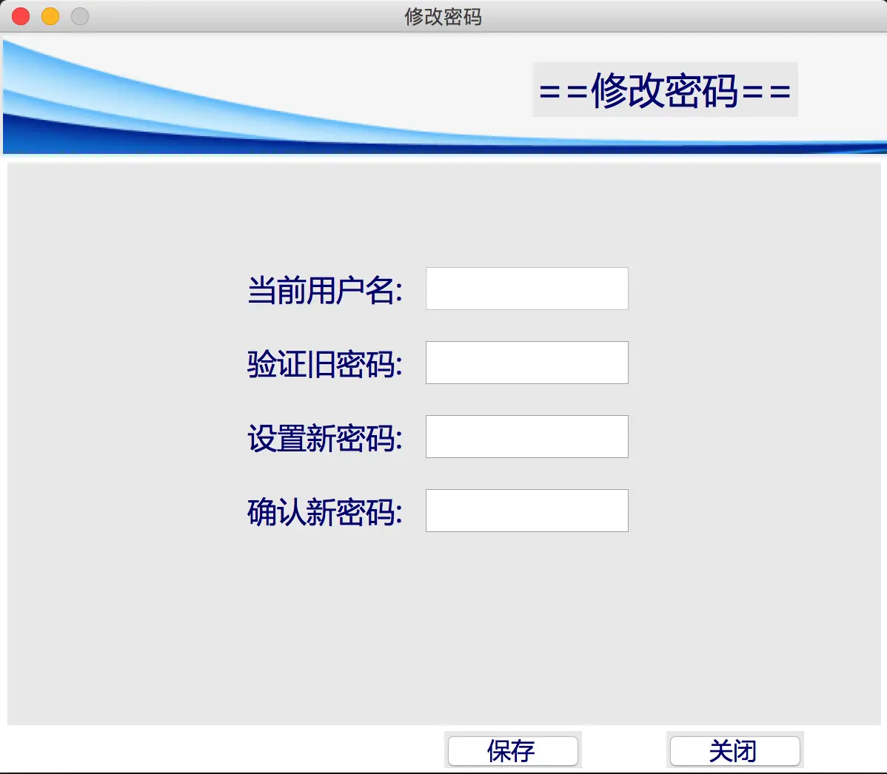

### 前言
上一节我们完成了学生信息的修改删除和保存功能，本项目的基础功能已经基本完善了，但是我们还需要添加一个修改用户密码的功能，即用户登录后可以修改自己的登录密码。
### 一、修改密码GUI的设计
首先我们创建一个py文件`changepasswordgui.py`先绘制实现修改密码功能的界面。
##### 1. 要求

（1）主体框架与明细窗体保持一致；

（2）能够读取当前用户名、验证旧密码、设置新密码、确认新密码的功能；

（3）输入密码时显示`*`

（4）当前用户名只显示数据，不可修改

##### 2. 方法
修改密码的窗体我们大部分代码可以直接使用明细窗体的代码，只需在关键的部分做一些修改即可；输入密码显示*，我们可以给Entry对象添加一个`show`参数，其值设为*；显示当前用户名的Entry对象我们设置为只读状态，只需添加一个state参数，其值设为DISABLE即可。
```python
from tkinter import *
from tkinter.ttk import *
from tkinter.messagebox import *
import os

class ChangePasswordWindow(Toplevel):
    def __init__(self):
        super().__init__()
        self.title("修改密码")
        self.geometry("600x500+600+150")
        self.resizable(0,0) # 不能改变大小

        # 加载界面
        self.setup_UI()

    def setup_UI(self):
        # 设置style
        self.Style01 = Style()
        self.Style01.configure("title.TLabel", font=("微软雅黑", 25, "bold"), foreground="navy")
        self.Style01.configure("TLabel", font=("微软雅黑", 20, "bold"), foreground="navy")
        self.Style01.configure("TButton", font=("微软雅黑", 16, "bold"), foreground="navy")
        self.Style01.configure("TEntry", font=("微软雅黑", 16, "bold"), width=10)
        self.Style01.configure("TRadiobutton", font=("微软雅黑", 16, "bold"), foreground="navy")
        # 加载上面的banner
        self.Login_image = PhotoImage(file="." + os.sep + "img" + os.sep + "stu_detail_banner.png")
        self.Label_image = Label(self, image=self.Login_image)
        self.Label_image.pack()

        # 添加一个title
        self.Label_title = Label(self, text="==修改密码==", style="title.TLabel")
        self.Label_title.place(x=360, y=20)

        # 加载一个pane
        self.Pane_detail = PanedWindow(self, width=590, height=380)
        self.Pane_detail.place(x=5, y=88)

        # 账号
        self.Label_login = Label(self.Pane_detail,text = "当前用户名:")
        self.Label_login.place(x=160,y=70)
        self.var_login = StringVar()
        self.Entry_login = Entry(self.Pane_detail,state=DISABLED,textvariable = self.var_login, font=("微软雅黑", 18, "bold"),width = 12)
        self.Entry_login.place(x=280,y=68)

        # 旧密码
        self.Label_old_password = Label(self.Pane_detail, text="验证旧密码:")
        self.Label_old_password.place(x=160, y=120)
        self.var_old = StringVar()
        self.Entry_old_password = Entry(self.Pane_detail, show="*",textvariable=self.var_old, font=("微软雅黑", 18, "bold"), width=12)
        self.Entry_old_password.place(x=280, y=118)

        # 新密码
        self.Label_new_password = Label(self.Pane_detail, text="设置新密码:")
        self.Label_new_password.place(x=160, y=170)
        self.var_new = StringVar()
        self.Entry_new_password = Entry(self.Pane_detail,  show="*",textvariable=self.var_new, font=("微软雅黑", 18, "bold"), width=12)
        self.Entry_new_password.place(x=280, y=168)

        # 确认新密码
        self.Label_two_new_password = Label(self.Pane_detail, text="确认新密码:")
        self.Label_two_new_password.place(x=160, y=220)
        self.var_two_new = StringVar()
        self.Entry_two_new_password = Entry(self.Pane_detail,  show="*",textvariable=self.var_two_new, font=("微软雅黑", 18, "bold"), width=12)
        self.Entry_two_new_password.place(x=280, y=218)
        # 放置两个按钮
        self.Button_save = Button(self, text="保存", style="TButton")
        self.Button_save.place(x=300, y=472)
        self.Button_exit = Button(self, text="关闭", style="TButton")
        self.Button_exit.place(x=450, y=472)
```
##### 3. 效果演示

### 二、修改密码前的准备
##### 1. 数据传递的思路
因为用户自己只能更改自己的密码，所以当前用户名在修改密码窗体加载的时候就应该自动填充进去。
由于只有在登录窗体才能获取到当前用户名和密码，主窗体需要显示用户名、修改密码窗体需要显示用户名和校验旧密码。所以我们必须想办法将用户名密码由登录窗体传至主窗体再传至修改密码窗体。
在登录窗体的构造函数中添加全局变量
```python
self.current_user_list = []
```
用于存储当前用户的用户名、密码、状态信息
然后在`login()`函数身份验证成功后，可以直接将`user_list[index]`存入`current_user_list`中。
```python
self.current_user_list = self.user_list[index]
```
之后，我们在加载主窗体的函数`load_main()`中，将参数设置为`self.current_user_list`和`self.get_now_time`；
```python
main_window = maingui.MainWindow(self.current_user_list,self.get_now_time())
```
在主窗体中，构造函数中的参数设置为`current_user_list`和`current_time`,并添加一个全局变量
```python
self.current_login_list = current_user_list
```
接着把`self.current_login_list`作为参数传递给构造修改密码的窗体中。
与此同时修改密码窗体的构造函数也要添加参数用来接收用户列表`current_login_list `,并且定义全局变量
```python
self.current_login_list = current_login_list
```
当修改密码窗体接收到用户列表数据后，在构造函数中就可以直接设置当前登录的用户名，在`Entry_login`中显示出来。
```python
# 初始化当前用户
self.var_login.set(self.current_login_list[0])
```
##### 2. 修改密码前的判断
修改密码需要有以下条件：

（1）旧密码是否正确

（2）新旧密码不允许相同

（3）新密码不许为空

（4）两次输入新密码是否一致

在修改密码窗体中，我们分别给保存和关闭两个按钮绑定方法`commit()`和`close_window()`
```python
def commit(self):
    # 获取输入的值
    old_pass = self.var_old.get()
    new_pass = self.var_new.get()
    new_two = self.var_two_new.get()
    # 判断旧密码输入是否正确
    if old_pass != self.current_login_list[1]:
        showinfo("系统提示","旧密码错误")
        return
    if new_pass == old_pass:
        showinfo("系统提示","新密码和旧密码一样！系统不允许")
        return
    if len(new_pass.strip()) == 0:
        showinfo("系统提示","新密码不许为空")
        return
    if new_pass != new_two:
        showinfo("系统提示","两次新密码不一致！")
        return
def close_window(self):
    self.destroy()
```
这样我们实现了密码前的判断，紧接着我们就要继续实现密码的修改和写入到文件中。
### 三、写入到文件
由于我们只能读取到当前用户的密码信息，如果直接写入到文件，其它用户的信息就会丢失。所有我们必须想办法读取到其它用户的用户信息和密码。
##### 1. 读取其它用户登录信息
我们之间从文件中读取所有的用户信息
定义一个全局变量file_path存储用户信息的文件路径,还有一个全局变量all_login_list存储所有的用户登录信息。
```python
self.file_path = "/Users/yushengtan/Desktop/Demo/Studentmgr/User.txt"
self.all_login_list = []    # 存储所有的用户登录信息
```
接着我们定义一个方法`get_all_login`，获取所有的用户登录信息,和登录窗口类似，通过对文件的读取将所有的用户信息存储在`all_login_list`中
```python
def get_all_login(self):
    if not os.path.exists(self.file_path):
        showinfo("系统消息","提供的文件名不存在！")
    else:
        try:
            with open(file = self.file_path,mode = "r") as fd:
                # 一次读一行
                current_line = fd.readline()
                while current_line:
                    temp_list = current_line.split(",") # 长字符串分割层三个
                    self.all_login_list.append(temp_list)
                    # 读取下一行,读完了循环就结束了
                    current_line = fd.readline()
        except:
            showinfo("系统消息","文件读取出现异常！")
```
接着我们在构造方法中添加这个方法，当这个窗体被打开时自动执行该方法把所有的用户登录信息存储在`all_login_list`中。
##### 2. 正式修改密码
在`commit()`方法中，对所有的用户登录信息进行遍历如果所有的用户信息的用户名与当前登录的用户名一致则执行修改操作。
```python
# 修改密码
for index in range(len(self.all_login_list)):
    if self.all_login_list[index][0] == self.current_login_list[0]:
        self.all_login_list[index][1] = new_pass
```
##### 3. 用户密码写入文件
所有的用户登录信息都存储在`User.txt`文件中，对其修改，我们所采取的方案是先清空文件，再将all_login_list列表中的数据写入到文件中。注意去除换行符带来的干扰。
```python
try:
    with open(self.file_path,mode="w") as fd:
        fd.write("")
    with open(self.file_path,mode="a") as fd:
        for item in self.all_login_list:
            temp = ",".join(item)
            temp = temp.replace("\n","")+"\n"
            fd.write(temp)
except:
    showinfo("系统消息","写入文件出现异常")
```
至此，我们用户密码的修改功能就已经实现了！
##### 4. 效果演示

### 最后
本节实现了用户账号的密码修改功能，本项目的主体功能已经相对完善了，但这毕竟只是一个练手的小项目，目前还存在很多不足。
比如：

（1）应当引入数据库存储技术，文本文件存储效率低下；

（2）我们当前的账户密码还是明文存储，很不安全，作为一个合格的账户管理系统应当具备密码的密文存储的功能；

（3）我们应当对添加学生信息数据的规范性做校验；

（3）应当添加管理员账户，具备管理普通用户的权限；

（4）应当具备注册用户的功能，并且添加用户照片的功能。

这些功能都有待补充，后面有机会我会继续完善这个项目！
另外本项目所有的源码、素材、数据源私信我免费获取，我们一起共同交流学习！