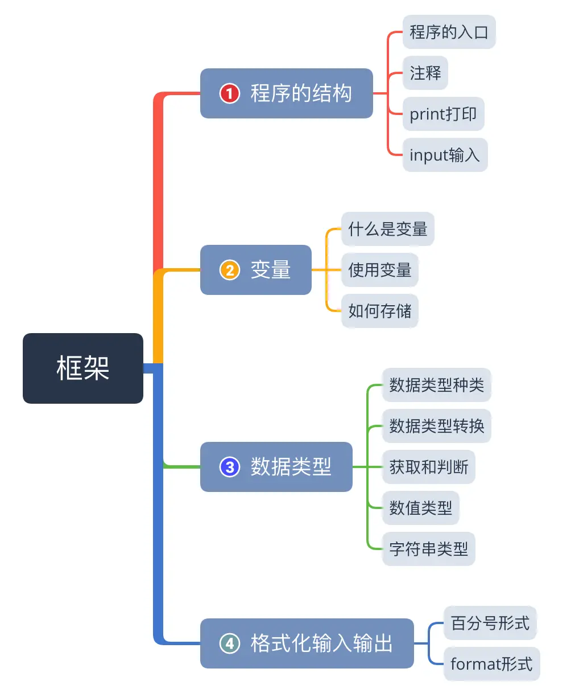
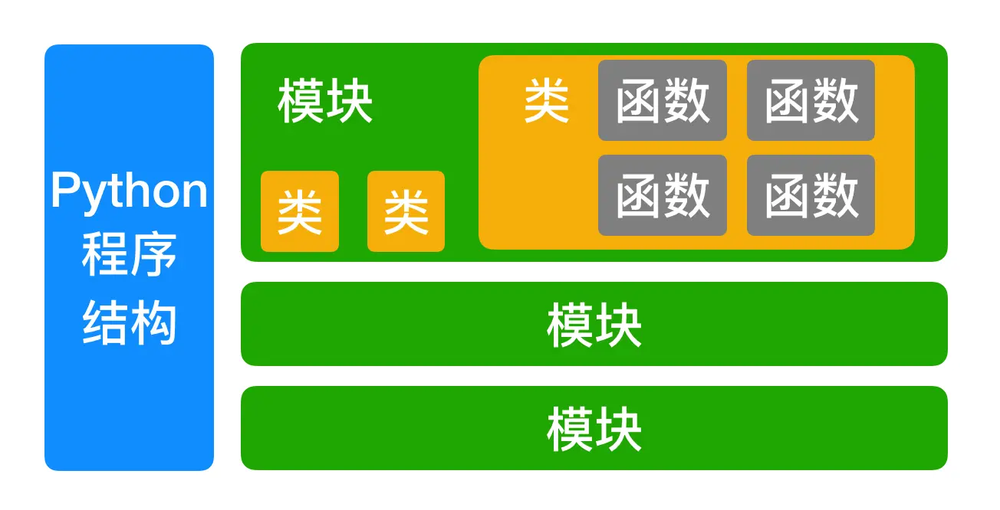
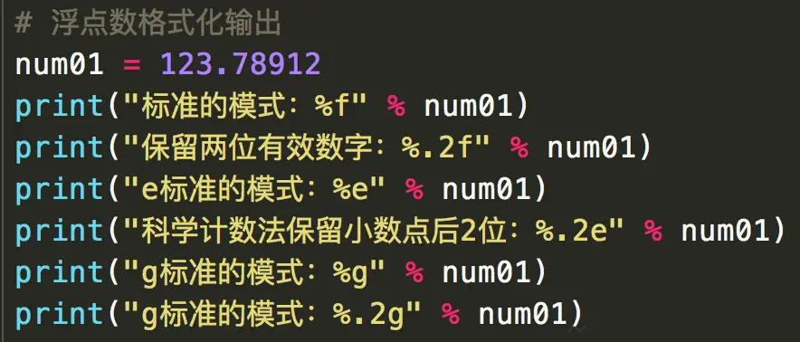
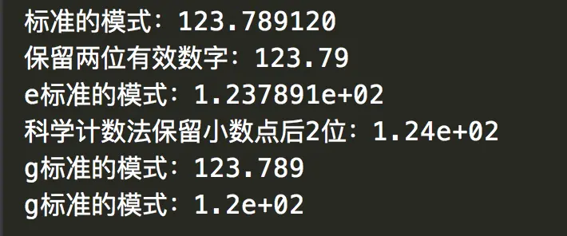
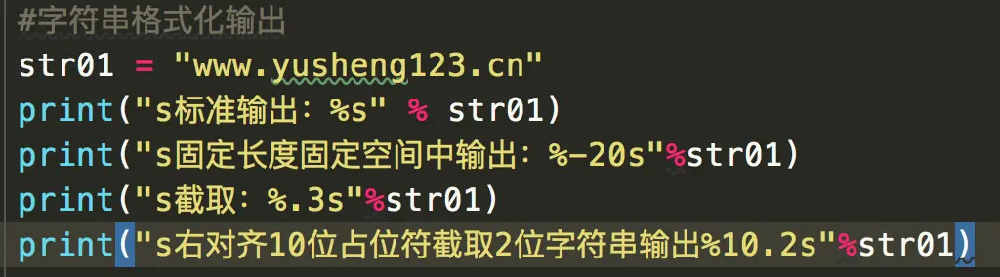
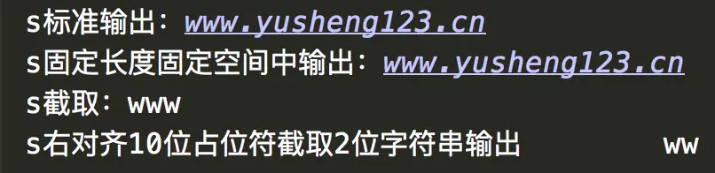

Python是一门易学的面向对象的程序设计语言，可以轻易地完成界面、文件、封装等高阶需求，可移植性好，有非常多功能强大的库与包，如Numpy(数值计算)、SciPy(数学、科学与工程计算)、Matplotlib(数据绘图工具)等等
我们从今天开始，以记笔记的方式记录Python的基础知识：

本节知识框架：


### 一、程序的结构

##### 1. 程序的入口main函数
定义了一个个函数后，怎么调用这些函数呢？使用main函数调用它
```python
# 程序的入口：main函数
if __name__ == "__main__":
    function()# 要调用的函数
```
为了让程序具有更强的可读性，需要为程序设置一个入口，这个入口就是main函数。
print()函数，中间可以使用逗号隔开；
```
print("两数之和是："，add(1,2))
```
##### 2. 注释

（1） Python里单引号与双引号所具有的功能是一样的，多行注释通常使用三对单引号或者三对双引号；

（2）对与某一句代码的注释通常写在代码的上一行使用`#`进行注释;

（3）像下面这种注释比较规范
```python
# !/usr/share/pythonprj/
# -*- coding:UTF-8 -*-

'''
模块介绍：实现加减乘除运算
~~~~~~~~~~~~~~~~~~~~~
两数相加：add(num01,num02)
两束相减：sub(num01,num02)
两数相乘：mul(num01,num02)
两数相除：del(num01,num02)
'''

def add(num01,num02):
    # 返回两数之和
    return num01 + num02

def sub(num01,num02):
    # 返回两数之差
    return num01-num02

def mul(num01,num02):
    # 返回两数之乘
    return  num01*num02

def div(num01,num02):
    # 返回两数之商
    return num01/num02
```
##### 3. print打印
（1）print("helloworld")其实系统默认隐藏了一个参数end，完整的print()语句是`print("helloworld",end="\n")`，所以print语句打印会自动换行，如果想让其不换行打印，我们把end参数的`\n`去掉即可。

（2）print(a,b)实际含义是不换行分别打印print(a)和print(b)

（3）一次性打印多个值
```
print("tom","jerry","alice","tom")
```
打印的结果是
```
tom jerry alice tom
```
打印的内容直接默认是用空格连接，如果我们想打印的内容之间使用其它连接符连接可以使用分割符`sep`参数，如果使用`==`连接，就可以这样写：
```
print("tom","jerry","alice","tom",sep="==")
```
这样打印的结果就是
```
tom==jerry==alice==tom
```
这样就可以在所有的元素之间加上你想要的分隔符

（4）把打印的内容输出到文件
```
str01 = "本次消费的金额为100元"
f = open("/Users/yushengtan/desktop/sales.txt",'w')
print(str01,file = f)
```
这样就能把打印的内容输出到文件中。

##### 4. Input输入
所有输入的字符，都会被系统当做字符串
题目：输入两个数，求两个数之和：
```python
# 方法一
num01 = input("请输入第一个数：")
num02 = input("请输入第二个数：")
print("两个数之和等于:{:d}".format(int(num01)+int(num02)))
# 方法二
num01,num02 = eval(input("请输入两个数，以逗号分割:"))
print("%d + %d = %d" % (num01,num02,num01+num02))
```
这里的eval函数的特点：
a. 只能一次输入多个整数，不能是字符串
b. 输入后自动转化为int类型


### 二、变量
##### 1. 什么是变量
变量是一个什么都能装的容器，只要是数据都能存；
不需要事先声明变量类型
##### 2. 使用变量

（1）变量名由字母、数字、下划线、组成，不能以数字开头

（2）区分大小写

（3）变量名中不能包含空格

（4）不能使用Python中的关键字

（5）变量命名使用小写字母，见名知意，多个单词用下划线连接;

（6）一次定义多个变量，可以写成一行`a=1;a=2;a=3`或者`a,b,c = 1,2,3`

##### 3. 变量如何存储数据
变量是为了方便取出存储在内存中的数据，对于数值类型，相同的值只存储一份。

### 三、 数据类型
##### 1. 数据类型的种类

（1）Python3里整形只有`int`型，无论多大的数值都可以存；

（2）浮点型float精度只有17位，超过17位自动转化为科学计数法进行表示

（3）布尔类型，True和False

（4）字符串型，可以直接通过取字符串中的数值。

```python
str01 = "xiaoyu"
print(str01[0])  #打印的结果就是`x`
print(str01[1:3])  #打印的结果就是`ia`
print(str01[-1])  #打印的结果就是`u`
```

##### 2. 数据类型转换

方法：`要转换的类型(数据)`

* 要把字符类型x转换为整数类型 `int(x)`
* 把x转化为字符串：`str(x)`
* 把整数x转化为字符：`chr(x)`
* 把一个字符串转化为它的整数值：`ord(x)`
* 将一个整数转化为十六进制字符串：`hex(x)`
* 将一个整数转化为八进制字符串：`oct(x)`
* 将一个整数转化为二进制字符串：`bin(x)`

##### 3. 如何获取变量的数据类型？如何判断变量是不是属于一个数据类型？
可以通过`type(变量名)`就可以知道变量的数据类型；
可以使用isinstance方法，`isinstance(变量名,(数据类型))`

```python
if isinstance(str01,(str)):
    print("字符型")
```
##### 4. 数值类型

（1）如何查看变量占用多少内存空间？
要导入模块sys，调用方法`sys.getsizeof(变量名)`
```python
num01 = 1000
print("num01占用的空间：",sys.getsizeof(num01))
```

（2）八进制0o开头，十六进制0x开头

（3）整形数值常见方法：

* abs() 绝对值
* math.fabs()  绝对值
* math.sqrt()  平方根
* math.pow(a,b)  a的b次方
* max()  返回最大值
* min()  返回最小值

（4）获取整数位，保留指定位数有效数字
使用round方法:
```python
print(round(12.3456))  #输出结果只会打印12
print(round(12.3456,2))  #输出结果为12.35
```
使用math.ceil()方法，返回数字的上入；
使用math.floor()方法，返回数字的下舍；
使用modf()方法，返回两个数值，前一个数是小数部分、后一个个数是整数部分；
```python
print(math.modf(12.22))  #返回（0.22，12.0）
```

##### 5.字符串类型

（1）表示方法
字符串数据类型使用单引号双引号都可以；
```python
str01 = 'xiaoyu'
str02 = "hello"
```

（2）长字符串的表示方法
* 使用续航符`\`
```python
str03 = "hello nice to meet you"\
"my name is xiaoyu"
```

* 使用三个双引号或者三个单引号
```python
str04 = """ hello nice to meet you
my name is xiaoyu
"""
```
> 使用三个单引号或者双引号可以保留原长字符串的长文本排版格式

（3）转义字符和取消转义
打印字符串的时候使用斜杠加字母表示一个特殊的功能

* `\t` 表示横向制表符
* `\n` 表示回车换行
* `\" `表示打印双引号`"`
* `\\`表示打印反斜杠`\`

对于某些特殊的符号，使用取消专业字符来表示特符号本身，将其打印出来，在要打印的字符串引号前加一个字符`r`表示要打印的字符串不具备转义的功能
```python
print("\\")  # 打印出来的结果只有一个 \
print(r"\\")  #这样就可以原封不动打印出来 \\
```

（4）字符串运算符+
符号`+`能让两个字符串连在一起；
```python
print("my name is "+"xiaoyu")
```
符号`*`能让字符串按照指定次数打印;
```python
print("hello "*10)  # 这样就可以打印十个hello
```

（5）索引的方式
```python
str01 = "abcdefghijklmnopq"
print(str01[0])  #打印第一个字符
print(str01[-1])  #打印最后一个字符
print(str01[5])  #打印第四个字符
print(str01[-5])  #打印倒数第五个字符
print(str01[3:10])  #打印第四到第十个字符
```
求字符串的长度可以用`len()`

（6）是否包含
```python
str01 = "abc"
str02 = "abcdefg"
print("是否包含：",str01 in str02)
print("是否不包含：",str01 not in str02)
```

（7）判断是否相等
```python
print(str01 == str02)  #判断字符串是否相等
print(str01 is str02)  #判断字符串是否是同一个对象
```

### 四、 格式化输入输出
##### 1. 百分号形式格式化输出

（1）整数格式化输出占位符

* %d 十进制输出
* %o 八进制输出
* %x 十六进制输出

> 注意：数值源与输出内容之间没有逗号分隔，这里容易与C语言或者Java混淆

让十进制数100，以八进制输出：
```python
num01 = 100
print("十进制100的八进制数值为%o"%num01)
```
如果一次输出多个进制转化：
```python
num01,num02 = 100,200
print("八进制输出为:0o%o,0o%o"%(num01,num02))
print("十六进制输出为:0x%x,0x%x"%(num01,num02))
```
如果让一个数二进制形式输出，可以直接使用bin()方法；

（2）浮点数格式化输出

* 保留小数点后面六位有效数字`%f` 
* 保留小数点后面2位有效数字`%.2f`
* 小数点后保留6位有效数字的科学计数法计数`%e`
* 小数点后保留2位有效数字的科学计数法计数`%.2e`
* 6位数能表示就用6位数，6位数表示不了就用科学计数法`%g`
* 保留2位有效数字，2位有效数字表示不了就用科学计数法`%.2g`



（3）字符串的格式化输出

* 标准输出`%s`
* 右对齐，占位符10位`%10s`
* 左对齐，占位符10位`%-10s`
* 截取3位字符串`%.3s`
* 右对齐10位占位符，截取两位字符串`%10.2s`



##### 2. format形式格式化输出

（1） 相对于基本格式化输出采用的`%`的方法，format()功能更加强大，该函数模块把字符串当成一个模板，通过传入参数进行格式化，并且使用大括号`{}`作为特殊字符代替`%`
```python
name = "Ailice"
gender = "男“
age = 23
print("姓名：%s 性别：%s 年龄：%d"%(name,gender,age))
print("姓名：{} 性别：{} 年龄：{}".format(name,gender,age))
```

（2）还可以在括号里加标识符，后面要用的时候，就不需要在format函数里添加参数了，可以直接用

```python
print("姓名：{0} 性别：{1} 年龄：{2} 学生姓名{0}".format(name,gender,age))
```

（3） 标识符除了可以使用数字也可以直接用关键字
```python
print("姓名:{name} 性别:{gender} 姓名:{name}".format(name = name,gender = gender))
```

（4）Format的进阶用法
forma占位符`{}`里面使用`:对齐方向 占位长度`
`<`默认左对齐，`>`右对齐，` ^ `中间对齐，
```python
print("姓名：{:<10}".format(name))
print("姓名：{:>10}".format(name))
print("姓名：{:^10}".format(name))
```
除了对齐之外还可以使用取位数：`{:4s}`、`{:.2f}`
```python
print("{:10.2f}".format(3.14159)) #十位占位长度，小数点后保留两位有效数字
print("{:>10.2f}".format(3.14159)) #十位占位长度，小数点后保留两位有效数字,右对齐
```

（5）Format对数值的操作

*  二进制输出`b`
```
print("二进制打印{0:b} {1:b}".format(num01,num02))  #0、1是编号
```
* 整数转Unicode字符串输出`c`
```
print("把整数转化成ASCII码: {0:c} {1:c}".format(65,66))
```
输出结果：
```
把整数转化成ASCII码: A B
```

*  十进制输出`d`
* 八进制输出`o`
* 十六进制输出`x`
* 科学计数法输出`e`，默认保留小数点后六位

```
print("科学计数法输出:{:.2e}".format(123.345))
```
输出结果：
```
科学计数法输出:1.23e+02
```

* 一般格式输出`g`，六位可以表示就用六位表示，六位表示不了就用科学计数法
* 数字输出`n`，当值为整数时和`d`相同，当值为浮点数是和`g`相同
* 百分号输出`%`，把数值转化为百分数，小数点后默认保留六位

```
print("百分号表示:{:.2%}".format(2))
```
输出结果：
```
百分号表示:200.00%
```
`,`千位分隔符，自动把数值转化为货币千位分割的形式
```
print("千位分隔符:{:,}".format(102334489))
```
输出结果：
```
千位分隔符:102,334,489
```