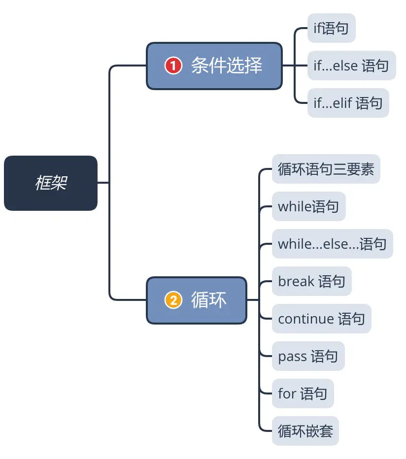
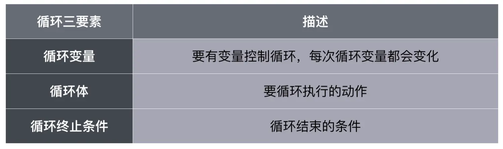
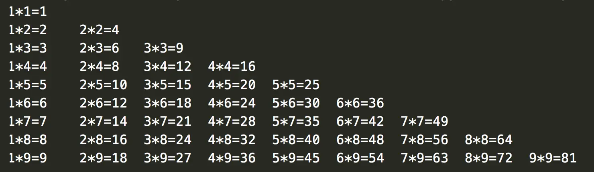

条件选择与循环是Python中非常基础也是非常重要的语句结构，本节重点介绍这两个部分：
##### 本节知识大纲：


### 一、条件选择语句
##### 1. if语句
```
if 判断条件：
    要执行的代码
```
注意语句结尾有冒号`:` 
下一行有缩进
如果满足条件，则执行代码，如果不满足，则跳过

案例：

（1）在控制台应用程序中输入小雨(语文、数学、英语成绩单科满分100分)判断：

1）如果有一门成绩是100分

2）如果有两门大于90分

3）如果有三门大于80分

满足以上任何一种情况奖励一朵小红花

```python
chinese = int(input("请输入语文成绩："))
math = int(input("请输入数学成绩："))
english = int(input("请输入英语成绩："))
get_course = ""

if (chinese==100 or math == 100 or english == 100):
    if(chinese == 100):get_course+="语文"
    if(math == 100):get_course+="数学"
    if(english == 100):get_course+="英语"
    print("你的%s得了100分，奖励一朵小红花" % get_course)

elif((chinese>=90 and math>=90)or(chinese>=90 and english>=90)or(math>=90 and english>=90)):
    if (chinese >=90): get_course += "语文"
    if (math >=90): get_course += "数学"
    if (english >=90): get_course += "英语"
    print("你的%s得了90分以上，奖励一朵小红花" % get_course)

elif(chinese>=80 and math>=80 and english>=80):
    if (chinese >= 80): get_course += "语文"
    if (math >= 80): get_course += "数学"
    if (english >= 80): get_course += "英语"
    print("你的%s得了80分以上，奖励一朵小红花" % get_course)
else:
    print("没有获得小红花，下次努力哦！")
```
##### 2. if-else语句
if-else负责两个分支
```
if 判断条件：
    要执行的代码
else:
    要执行的代码
```
案例：

（1）让用户输入用户名和密码，如果用户名为admin,密码是123.com，提示登陆成功，否则提示用户名或密码错误
```python
username = input("请输入用户名:")
password = input("请输入密码:")
if username.lower().strip() == "admin" and password == "123.com":
    print("登陆成功!")
else:
    print("用户名或密码错误!")
```

（2）输入小雨的（语文、数学、英语）成绩（单科成绩满分100分）判断考试成绩，
如果所有科目都及格了，提示：恭喜你，你所有的科目都通过考试了
否则提示：很遗憾，你没有通过（没有及格的科目名称）
```python
chinese_result = int(input("请输入语文成绩："))
math_result = int(input("请输入数学成绩："))
english_result = int(input("请输入英语成绩："))
get_course = ""
if (chinese_result>=60 and math_result>=60 and english_result>=60):
    print("恭喜你，所有的科目都通过考试了！")
else:
    if(chinese_result<60):get_course+="语文"
    if(math_result<60):get_course+="数学"
    if(english_result<60):get_course+="英语"
    print("很遗憾，你没有通过考试，需要补考的科目是%s"%get_course)
```
##### 3. if-elif语句
当条件判断的分支超过两个，使用if-elif语句
```
if 判断条件：
    要执行的代码
elif 判断条件：
    要执行的代码
elif 判断条件：
    要执行的代码
……
else:
    要执行的代码
```
问题:既然有了`if……if……if……else`，为什么还要有`if……elif……elif……else`?

答：`if……if……if……else`是三个分支；而`if……elif……elif……else`是一个整体；
如果是用 if 的话，他会一直遍历完所有的if，不管你想判断的条件有没有遍历到，他都会继续执行完所有的if；而elif 是当程序找到符合查询条件的语句后，后面所有的elif和else就不会再被执行；

案例：

输入一个月份，判断输入的月份是哪个季节：冬季（12月，1月，2月）；春季（3月，4月，5月）；夏季（6月，7月，8月）秋季（9月，10月，11月）
```python
month = int(input("请输入月份："))
if(month == 12 or month == 1 or month == 2):
    print("现在是冬季")
elif(month == 3 or month == 4 or month == 5):
    print("现在是春季")
elif(month == 6 or month == 7 or month == 8):
    print("现在是夏季")
elif(month == 9 or month ==10 or month == 11):
    print("现在是冬季")
```
### 二、循环
##### 1. 循环语句三要素

案例：

（1)输入一个大于1的值，然后算出从1加到这个数之和，
比如：输入6，求出1+2+3+4+5+6
```python
# 循环变量：i=1
# 循环体：循环变量累加，存储在sum
# 循环条件:i<num
num = int(input("请输入数值："))
i = int(1)
sum = int(0)
while i<=num:
    sum += i
    i += 1
print("从1加到%d的和为：%d"%(num,sum))
```
##### 2. while语句
```
while 循环条件：
    循环体
```
案例：

（1）输入一个正数，求出从1开始到这个数中所有包含3的数自和3的倍数的和；
```python
num = int(input("请输入一个正数："))
i = 1   #循环变量
sum = 0    #存储累加之后

while i<=num:
    #如果是3的倍数，累加
    if i % 3 == 0:
        sum += i
    #如果包含3的数字，累加
    elif "3" in str(i):
        sum += i
    else:pass
    #循环终止的渐变条件
    i += 1
print("从1到%d中所有包含3的数字的数和所有3的倍数的数的和为：%d"%(num,sum))
```
（2）输入班级人数，然后依次输入所有学员的成绩，计算该班级成员的平均成绩和总成绩；
```python
"""
循环变量：i=1
循环体：反复输入
循环满足条件：i<=input student number
"""
student_number = int(input("请输入班级学生人数:"))
i = 1   #循环变量
total_result = 0    #所有的成绩之和
while i <= student_number:
    total_result += int(input("请输入第{:d}位,共{:d}为学员成绩:".format(i,student_number)))
    i+=1

print("班级总共有%d名成员，总成绩为%d,平均成绩为%.2f"%(student_number,total_result,total_result/student_number))

```
（3）键盘输入正数n，求出n与其反序数之和并输出，例如：输入1024，输出应为1024+4201=5225。
```python
# 方法1
num01 = input("请输入一个正数:")
num02 = num01[::-1]
print("该数%d与其反序数%d之和为:%d"%(int(num01),int(num02),int(num01)+int(num02)))
# 方法2
num01 = input("请输入一个正数:")
i = 0   #循环变量
new_num = ""
while i < len(num01):
    new_num = num01[i]+new_num
    i+=1
print("该数%s与其反序数%s之和为%d"%(num01,new_num,int(num01)+int(new_num)))
```
##### 3. while……else……语句
循环结束后，执行一次else语句，python里面独有的一种结构；
```python
num01 = input("请输入一个正数:")
i = 0   #循环变量
new_num = ""
while i < len(num01):
    new_num = num01[i]+new_num
    i+=1
else:print("循环结束")  #当循环的条件为false时执行的语句
print("该数%s与其反序数%s之和为%d"%(num01,new_num,int(num01)+int(new_num)))
```

##### 4. break语句
break跳出整个循环，包括else都不执行
```python
#break语句
print("====== break测试 =======")
num = 10
i = 0
while i<= num:
    i+=1
    if i==5:break
    else:
        print(i,end=" ")
else:print("\n=====break测试结束=====")
```
运行结果：
```
====== break测试 =======
1 2 3 4 
```
##### 5. continue语句
continue跳出当次循环，后面的继续执行
```python
# continue语句
print("\n======continue测试=======")
num = 10
i = 0
while i<= num:
    i+=1
    if i==5:continue
    else:
        print(i,end=" ")
else:print("\n=====continue测试结束=====")
```
运行结果：
```
======continue测试=======
1 2 3 4 6 7 8 9 10 11 
=====continue测试结束=====
```
案例

（1）2006年学校8万人，每年增长20%，请问按此增长速度，到哪年学生人数达到20万人
```python
student_number = 8
years = 2006
while True:
    student_number *= 1.25
    years +=1
    if student_number>=20:
        break
print("到%d年学生人数达到20万人"%years)
```
（2）求1-100间和7（含7的数字，7的倍数）相关的数之和

```python
i = 1
sum = 0
while True:
    if "7" in str(i):
        sum+=i
    elif i%7 == 0:
        sum+=i
    i+=1
    if i>=100:break
print("1-100间和7相关的数之和为%d"%sum)
```
##### 6. pass语句

pass语句与continue语句的区别：Python中pass语句是空语句，为了保持程序的完整性；continue语句执行后，当前循环后面的语句都不执行了,直接进行下一次循环。

##### 8. for语句
基本结构
```
for <variable> in <sequence>:
    <statements>
else:
    <statements>
```
表示范围的四种方法：
（1）方法1:

```python
#使用中括号表示一个List，
#中括号的所有成员都可以从头到尾取到
for i in [1,2,3,4,6,7,8]:
    print(i,end=" ")
```
（2）方法2:
```python
#range(单个数字)
#表示一个范围取到第一个取不到最后一个
#循环从0开始到这个数字-1结束
for i in range(10):
    print(i,end=" ")
```
（3）方法3:
```python
#range(两个数字)
#循环从第一个数字开始到第二个数字-1结束,每次递增1
for i in range(2,10):
    print(i,end=" ")
```
（4）方法4:
```python
#range(三个数字）
#循环从第一个数字开始到第二个数字-1结束，每次递增第三个数字的值
for i in range(2,10,2):
    print(i,end=" ")
```
案例：

（1）求从1到100之和
```python
sum_of_number = 0   #存储和的值
for i in range(0,101):
    sum_of_number+=i
else:print("==循环结束==")
print(sum_of_number)
```
（2）求1-100间5和7的倍数之和
```python
for i in range(1,101):
    if i%5==0 or i%7==0:
        sum+=i
print(sum)
```
（3）水仙花数是个三位数，它的个位数字的三次方加上十位数字的三次方加上百位数字的三次方等于它本身，求一个水仙花数：
```python
# 水仙花数
num_flower = ""
for i in range(100,1000):
    num_ge = i % 10
    num_shi = (i // 10) % 10
    num_bai = i // 100
    if num_ge**3 + num_shi**3 + num_bai**3 == i:
        num_flower+=str(i)+" "
print("水仙花数有:%s"%num_flower)
```

##### 9. 循环嵌套

案例：

（1）打印乘法口诀表
```python
# 打印乘法口诀表
for i in range(1,10):
    for j in range(1,i+1):
        print("%d*%d=%d\t"%(j,i,i*j),end=" ")
    print()
```


（2）100元买2元的铅笔✏️、5元的文具盒、10元的📂文件夹、15元的彩笔，刚好花完，每样物品至少有一种，一共有多少种组合？打印每一种组合。
```python
count = 0   # 有多少种情况
for i in range(1,51):   # 铅笔最多买50个
    for j in range(1,21):   # 文具盒最多买20个
        for k in range(1,11):   # 文件夹最多买10个
            for l in range(1,7):    # 彩笔最多买6个
                if i * 2 + j * 5 + k * 10 + l * 15 == 100:
                    count += 1
                    print("第%d种情况：可以买%d个铅笔，%d个文具盒，%d个文件夹，%d个彩笔"%(count,i,j,k,l))
```
（3）打印一个由*组成的等腰三角形，三角形的大小由输入的数字决定；
```python
# 打印等腰三角形n
n = int(input("请输入要打印的行数:"))
# 行数
for i in range(1,n+1):
    # 打印空格数
    for l in range(1,n+1-i):
        print(" ",end="")
    # 打印*
    for j in range(1,2*i):
        print("*",end="")
    print()
```