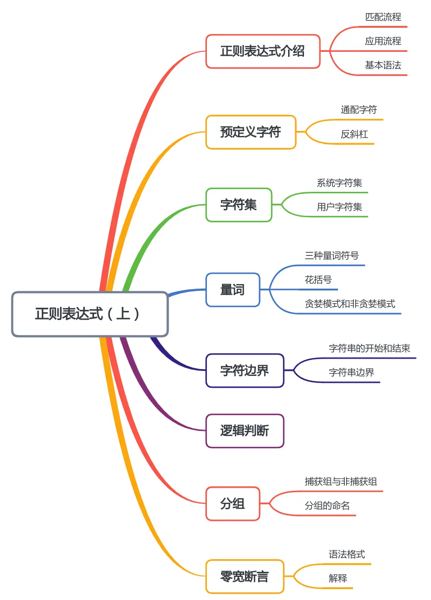
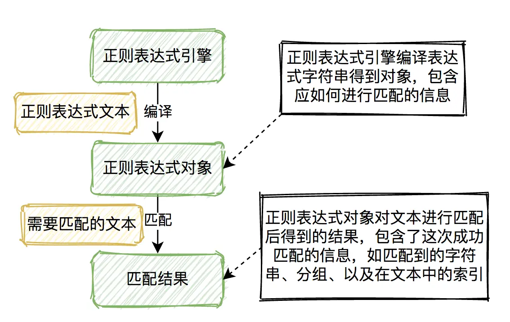
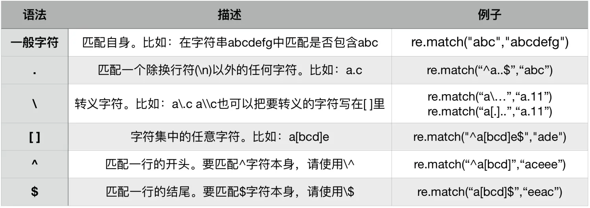
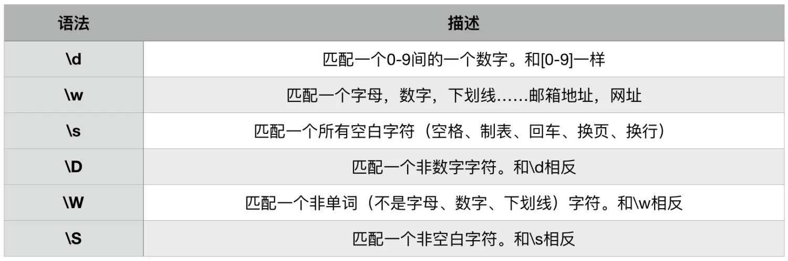
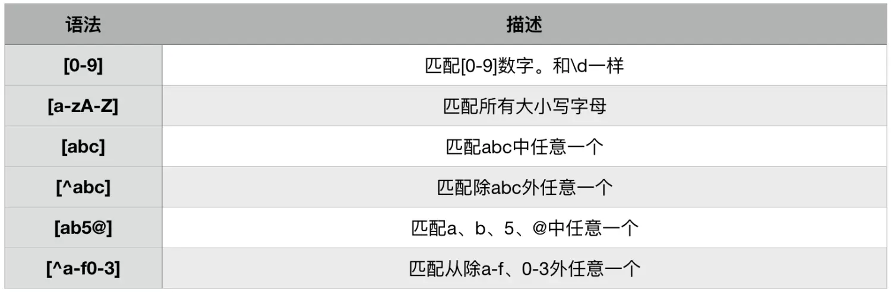
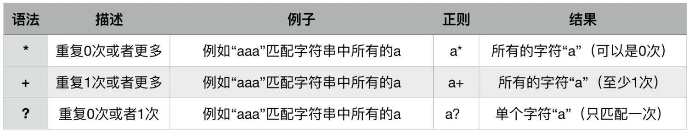
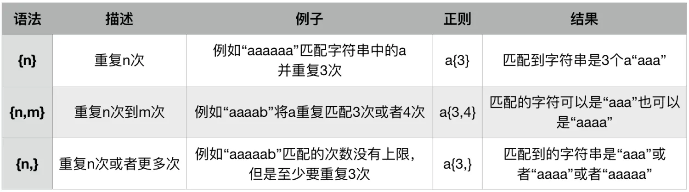
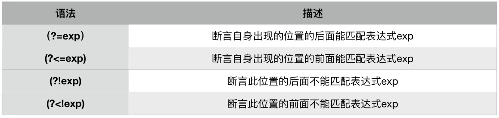

本节知识大纲：


### 一、正则表达式介绍
正则表达式是什么？正则表达式是一种特殊的字符串模式，用于匹配一组字符串，就好比模具做产品，而正则就是这个模具，定义一种规则去匹配符合规则的字符。
如果我们对字符串有要求，我们就可以通过正则表达式把它表示出来，我们可以用正则表达式去匹配符合规则的字符串；
正则表达式的处理对象是**字符串**，主要应用正则表达式的操作有：
* 验证
* 查找
* 替换

##### 1. 正则表达式的匹配流程：


##### 2. 正则表达式的应用流程
match()是用于校验的函数
**案例01**：
输入一个三位数，通过正则表达式输入的是否满足要求?
```python
import re
input_number = input("请输入一个三位数:")
match = re.match("^\d{3}$",input_number)
if match is None:
    print("不符合要求")
else:
    print("符合要求")
```

**案例02**：
判断输入的手机号码是否有效，要求：号码位数是11位；第一位是数字1；第二位是数字345789；后面是0-9均可
```python
# 步骤一：通过引擎编译出对象
import re
pattern = re.compile(R"[1][345789]\d{9}")   # 编译出pattern对象
input_mobile = input("请输入手机号码:")
# 步骤二：对输入的内容进行匹配
# print(pattern.match(input_mobile))
if pattern.match(input_mobile):
    print("输入的手机号有效！")
else:
    print("输入的手机号无效！")
```
##### 3.正则表达式的基本语法



### 二、预定义字符
如果每次都通过代码来验证正则表达式是否正确效率有点低，我们可以通过在线工具来校验我们的正则表达式是否正确，比如oschina的在线正则表达式测试工具；当然在Windows系统下可以使用RegexBuddy工具进行检测。
**普通字符**：字母、数字、下划线以及没有特殊意义的符号，都是普通字符。
**元字符**：这里主要有11个构成正则表达式元字符
```
.   \   |   ^   $   *   +   ?   []   {}   ()
```
##### 1. 通配字符
`.`是一个能匹配除`\n`以外任何字符的通用匹配符，例如，我们想匹配以a开头的，后面跟3个任意字符的正则表达式可以这样写：
```python
re.match("^a...","avfs")
```
另外三个连续的通配符可以写成`{3}`像这样：
```python
re.match("^a.{3}","avfs")
```
这里也可以使用findall()方法，能返回待匹配字符串中所有与正则表达式相匹配的字符串
```python
print(re.findall("a.{3}","avfssssadddadddaef"))  # 把匹配开头的^去掉了
```
输出结果：
```python
['avfs', 'addd', 'addd']
```
##### 2. 反斜杠
反斜杠加字母有时候在转义字符和正则表达式中功能冲突，通常的解决办法是使用`r`或者`R`取消转义。
### 三、字符集
##### 1. 系统正则表达式字符集

案例：非数字开头 + 两个空格 + 数字/字母/下划线

```python
import re
print(re.match(R"^\D\s{2}\w$","a  _"))
```
##### 2. 用户自定义正则表达式字符集
除了使用系统字符集以外，用户可以自定义字符集
> 注意：这里一个中括号只能匹配一个字符;
> `^`在中括号外表示一行开始，在中括号里面表示取反、排除的意思


案例：使用自定义字符集，匹配不区分大小写以a-f开头，接接着是三个小写字母，再后面是以偶数结尾

```python
import re
print(re.findall(R"[a-fA-F][a-z]{3}[02468]","bddf42fbas8"))
```
> 注意：除了`^`、`-`以外，如果把其它任何特殊符号放到`[]`里，那么就自动去掉特殊意义，只表示符号本身的含义，如`.`在`[]`里只表示`.`点号的意思，没有了通配符的功能。

### 四、正则表达式中量词
##### 1. 三种量词符号

案例：
通过正则表达式匹配英文单词，要求以na开头，以e来结尾
方法一：使用`*`号
```python
print(re.findall(R"na[a-z]*e","my name is Alice,nae,nattore"))
```
输出结果：
```python
['name', 'nae', 'nattore']
```
使用`*`号匹配name（重复1次），匹配nae（重复0次），匹配nattore（重复多次）
方法二：使用`+`号
```python
print(re.findall(R"na[a-z]+e","my name is Alice,nae,nattore"))
```
输出结果:
```python
['name', 'nattore']
```
使用`+`号，只能匹配name(重复1次)，匹配nattore（重复多次）
方法三：使用`?`号
```python
print(re.findall(R"na[a-z]?e","my name is Alice,nae,nattore"))
```
输出结果：
```python
['name', 'nae']
```
使用`?`号，只能name(重复1次)和nae(重复0次)

案例：
判断身份证号是否有效，
特征一：长度18或者15位
特征二：前17位是数字
特征三：最后一位是数字或者x
```python
print(re.match(r"(\d{14}[0-9x]|\d{17}[0-9x])","34262320001218646x"))
```
##### 2. 花括号表示重复次数
（1){n}表示重复n次
```python
# 正则表达式匹配以na开头加上4个小写字母并以e结尾：
print(re.findall(R"na[a-z]{4}e","my name is Alice,nae,nattore"))
```
输出结果：
```python
['nattore']
```
（2）{n,m}表示重复n到m次
```python
# 正则表达式匹配以na开头加上3-10个小写字母并以e结尾：
print(re.findall(R"na[a-z]{3,10}e","my name is Alice,naicajoe,nattorirce"))
```
输出结果：
```python
['naicajoe', 'nattorirce']
```
（3）{n，}表示重复n次到无限次
```python
# 正则表达式匹配以na开头加上3个以上的小写字母并以e为结尾：
print(re.findall(R"na[a-z]{3,}e","my name is Alice,naicajoe,nattorighjrce"))
```
输出结果：
```python
['naicajoe', 'nattorighjrce']
```
##### 3. 贪婪模式和非贪婪模式
（1）贪婪模式
贪婪模式是指在Python在默认情况下量词会尽可能多的匹配
```python
print(re.findall("\d+","12345678888888abc"))    # 尽量多的匹配
print(re.findall("\d*","12345678888888abc"))
print(re.findall("\d{3,}","12345678888888abc"))
print(re.findall("\d{3,8}","1234567888888888abc"))
```
输出结果：
```python
['12345678888888']
['12345678888888', '', '', '', '']
['12345678888888']
['12345678', '88888888']
```

（2）非贪婪模式
在表达式的结尾加上问号`?`，会切换成非贪婪模式
```python
print(re.findall("\d+?","12345678888888abc"))
print(re.findall("\d{3,}?","12345678888888abc"))
```
输出结果：
```python
['1', '2', '3', '4', '5', '6', '7', '8', '8', '8', '8', '8', '8', '8']
['123', '456', '788', '888']
```
### 五、字符边界
Python正则表达式字符边界主要有四种：
```python
^      开始位置
$      结束
\b     单词边界
\B     非单词边界
```
##### 1. 字符串的开始和结束
案例:
输入一个6位数字，必须要以95开头，以8结尾的数字
```python
print(re.findall(r"^95\d{3}8$","958348"))
```
输出结果：
```python
['958348']
```
##### 2. 字符串的边界
`\b`表示单词的边界，指某一个位置前后不都是字母、数字、下划线（`\w`）
案例：
输入一句英文，找出里面以a、b、c开头的单词
```python
str01 = "Use this toggle to the left to manage how your " \
        "browser uses BBC’s performance cookies. If you’re " \
        "outside the UK you can also use the toggle to set " \
        "your preferences for personalised advertising cookies."
pattern = re.compile(r"\b[abcABC][a-z]*\b")
print(pattern.findall(str01))
```
输出结果：
```python
['browser', 'cookies', 'can', 'also', 'advertising', 'cookies']
```
### 六、逻辑判断
正则表达式中表示逻辑或的是用符号`|`，分为整体或和部分或
(1)整体或
案例：
简单匹配身份证号，现在的身份证号是18位以前是15位，我们希望两者都兼容；前面全是数字，最后一位可以是数字或者x
```python
import re
print(re.findall("\d{14}[0-9x]|\d{17}[0-9x]]","34262219971012x"))
```
输出结果：
```python
['34262219971012x']
```
（2）部分或
案例：在一段英文句子中，找出es、er或者ing结尾的单词
```python
str01 = "Use this toggle to the left to manage how your " \
        "browser uses BBC’s performance cookies. If you’re " \
        "outside the UK you can also use the toggle to set " \
        "your preferences for personalised advertising cookies."
pattern = re.compile(r"\b[a-z]*(es|ing|er)\b")
print(pattern.findall(str01))
```
输出结果：
```python
['er', 'es', 'es', 'es', 'ing', 'es']
```
为什么没有显示出完整的单词呢，这就涉及到正则表达式中分组的知识了；
### 七、 分组
##### 1. 捕获组与非捕获组
分组是我们正则表达式中一个难点，把正则表达式的一部分用括号括起来作为一个组；主要包括捕获组`()`非捕获组`(?:)`
如何进行捕获呢？待捕获的表达式用小括号括起来，编号从1开始，后面通过反斜杠加数字标号进行调用。
我们以一个案例来进行解释
**案例**:
在前一段英文中，匹配这样的单词，有5个字符；第一个字母和第五个一样，第二个和第四个一样，比如`abcba`
**分析**：
因为匹配的是单词第一个和最后一个都是单词的边界,故正则表达式的前后都用`\b`，第一个字母和第二个字母后面都要用到所以分别给它们设置捕获组。用小括号括起来`([a-z])`、`([a-z])`第三字母后面用不到所以不设置捕获组，第四个字母和第五个字母调用前面的捕获组，所以通过反斜杠加数字编号来进行调用，所以主要的正则表达式为：`\b([a-z])([a-z])[a-z]\2\1\b`
```python
import re
print(re.findall(r"\b([a-z])([a-z])[a-z]\2\1\b","fdadd abcba"))
```
输出结果：
```
[('a', 'b')]
```
貌似是匹配到了，但是输出的结果并不满意，并不是完整的显示内容这是怎么回事呢？
**原因**：
如果对正则表达式做了分组，使用findall函数则显示捕获组所匹配的内容，不能完整显示，如果想完整显示的话有两个解决办法：
**方法一**：使用非捕获组
如果不需要对捕获组的内容调用，可以使用非捕获组，在表达式前加上?:就可以了，表示只捕获数据了，只用来表达条件。回到我们前面的案例，英文句子中匹配单词，怎样才能完整显示呢？对于后面不需要调用的正则表达式分组，我们使用非捕获组的方式，就是表达式前加上问号和冒号即可，则前面的正则表达式`\b[a-z]*(es|ing|er)\b`可以写成`\b[a-z]*(?:es|ing|er)\b`，这样我们的输出结果就是完整的单词了。

**方法二**：使用迭代函数finditer
将findall函数改为迭代函数finditer
```python
import re
match_result = re.finditer(r"\b([a-z])([a-z])[a-z]\2\1\b","fdadd abcba")
match_list = []
for i in match_result:
    match_list.append(i.group(0))
print(match_list)
```
输出结果：
```
['abcba']
```
这样就能完成显示匹配结果了
##### 2. 分组的命名
捕获组默认是从数字1开始编号的，但是如果捕获组数量多的话，最好还是能给捕获组命名方便调用，那么怎么给捕获组命名呢？
命名的方法：加问号加P跟着尖括号里写上名称`(?P<名称>) `；调用的方法：加问号加P等于号号码跟上名称`(?P=name)`
前面的正则表达式``\b([a-z])([a-z])[a-z]\2\1\b``命名可以写成`\b(?P<number01>[a-z])(?P<number02>[a-z])[a-z](?P=number02)(?P=number01)\b`
实际代码可以写成：
```python
print(re.findall(r"\b(?P<number01>[a-z])(?P<number02>[a-z])[a-z](?P=number02)(?P=number01)\b","fdadd abcba"))
```
### 八、零宽断言
Python正则表达式的零宽断言有着不同的称呼：零宽度断言、预搜索、环视等等，它是干嘛的呢？它是用来匹配一个位置
零宽的意思是不占用字符宽度、位置，比如`\b`表示单词起始或者结束的位置，`^`表示正则表达式的开始；`$`表示正则表达式的结束；
零宽断言的特征：
（1）做位置的匹配，不占宽度
（2）匹配的内容不计入最终的结果
（3）主要用作判断某个位置的前后字符
##### 1. 语法格式



##### 2. 解释
有一段字符串我们根据它前面的表达式来找到匹配的字符串，比如要在`www.baidu.com`中查找名称`baidu`，我们可以根据条件声明根域名是以`www.`开头的，`.com`结尾的。那么零宽断言的表达式就可以写成`(?<=www[.])[a-z]+(?=[.]com)`
**代码示例**：
```python
import re
print(re.findall(r"(?<=www[.])[a-z]+(?=[.]com)","www.baidu.com"))
```
**输出结果**：
```python
['baidu']
```
注意：匹配输出的内容是零宽断言括号外面的部分